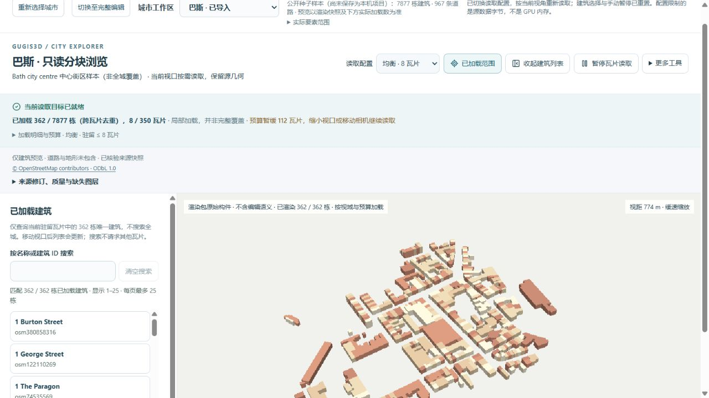
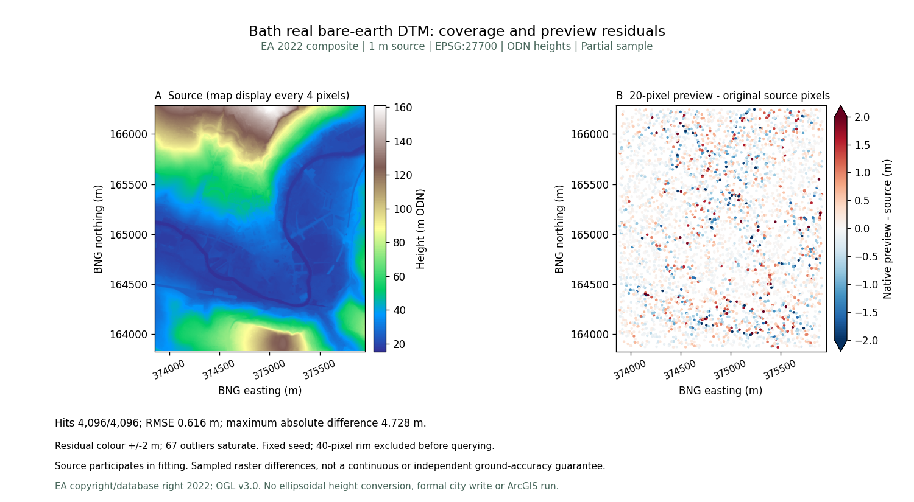
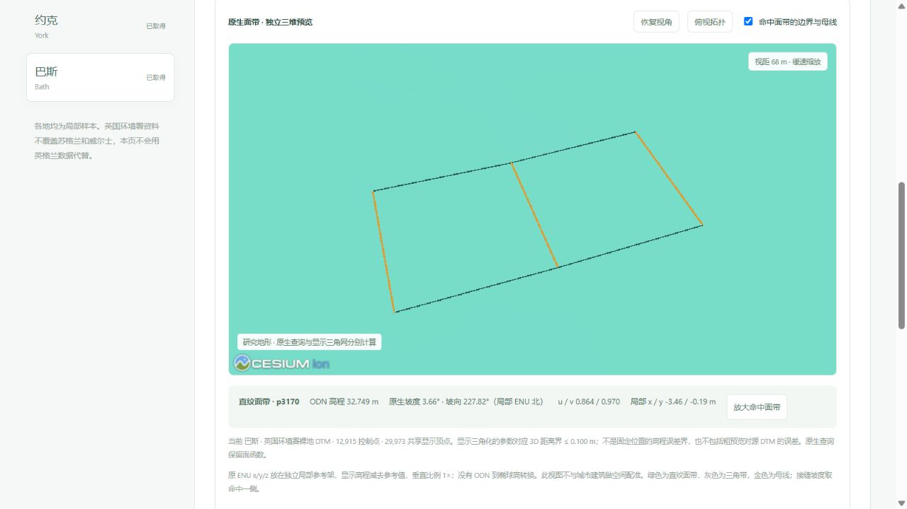

# 巴斯中心街区与真实裸地地形

2026-10-05 加入第八个独立城市样本。巴斯公开种子含 **7,877 栋建筑、967 条道路**；八城公开种子合计 **48,819 栋建筑**。范围为中心及北侧坡地，所有数据均明确标注局部覆盖，不代表完整城市或行政边界。

建筑入口：`http://127.0.0.1:5173/?city=bath&cities=bath&view_mode=tiles&tile_profile=economy`。

地形入口：`http://127.0.0.1:5173/datasets?dataset=bath`。地形独立浏览，不与建筑进行高程配准，不初始化或修改正式项目。

## 建筑数据与可复现导入

真实 OSM 查询框为 `[-2.377, 51.373, -2.347, 51.395]`。完整 way 的实际范围为 `[-2.3829226, 51.370903, -2.3416261, 51.3998275]`，边界交叉对象保留完整轮廓。共取得 7,880 条建筑 way，三个未闭合轮廓被拒绝，ID 与原因见 `bath-import.json`；道路只保留支持的非面积命名 highway。

使用公开 Overpass gall 实例的有界 GET。原始响应 SHA-256 为 `2d834d31b9fd3498e5837a13b1cbb56baf63c3df1e9eecad37c683abd258937b`。公开响应删除 970 个无关联系或自由文本标签，保留几何、对象 ID 与建模标签；公开 SHA-256 为 `ef8f013600451a6b6797187c84567422ff4dce710978420ab796d26079aa7528`。来源时间、请求和两种哈希保存在 `bath-source.json`。

楼高依据为 **2 栋采用 height 标签、1,409 栋按楼层 × 3.2 m 推算、6,466 栋假设 9.6 m**。源标签未经独立测量核验，模型为 LoD1 体量，没有精细立面或内部。OSM 数据及其派生城市数据库按 [ODbL 1.0](https://opendatacommons.org/licenses/odbl/1-0/) 分发，署名 © OpenStreetMap contributors；参见[当前许可说明](../backend/data/cities/CURRENT_DATA_LICENSE.md)。

```powershell
.venv/Scripts/python.exe data-pipeline/acquire_city_samples.py --cities bath --output-dir .local/sources/bath-new --method GET --endpoint https://gall.openstreetmap.de/api/interpreter
.venv/Scripts/python.exe data-pipeline/prepare_city_source.py --city bath --source-dir .local/sources/bath-new --output-dir .local/staging/bath-new
.venv/Scripts/python.exe data-pipeline/import_city_samples.py --city bath --source-dir .local/staging/bath-new --output-dir .local/staging/bath-new
.venv/Scripts/python.exe data-pipeline/build_render_tiles.py .local/staging/bath-new/bath.gugis.json --city bath --output .local/render-cache-new
```

新请求可能返回更新的 OSM 快照，不能要求与已发布哈希相同。命令使用新目录，拒绝覆盖已有采集或种子。已发布种子 SHA-256 为 `6db3eebf5a651261fb1b53a71b3ca05847c92f824fe76d7196c7016e81b86196`。

125 m 格网生成 350 瓦片，9,823 个跨格建筑引用去重后仍为 7,877 栋，源道路 967 条不包含在只读建筑预览中。总瓦片 8,682,254 B，最大瓦片 87,110 B，清单 192,707 B。低资源仍最多驻留 2 瓦片 / 2 MiB；均衡 8 瓦片 / 8 MiB。这些是源文件预算，不是 GPU 内存测量。



## 地形原始像元与误差披露

采集 [EA 2022 LIDAR Composite DTM · 1 m](https://www.data.gov.uk/dataset/01b3ee39-da3f-47b6-83da-dc98e73a461f/lidar-composite-dtm-2022-1m) 官方 WCS。EPSG:27700 栅格范围 `[373854, 163828, 375955, 166286]`，2,101 × 2,458，5,164,258 个有效像元，0 缺测；ODN 高程 **15.479–161.149 m**。这是复合测量数据，不是实时现场测量。

公开 GeoTIFF 仅采用无损 DEFLATE，所有像元、坐标系、变换、NoData 和缩放均逐项核对。原始下载 SHA-256 `7fd8a1b0bc047a44e8106db88a31f808c27bd6cf57fc1a947ae95fd5eddf665f`；无损发布文件 `8d9cea5c33e7b6e9412017dcc3512f6bdb3e6feeb570efaf93073fe8eb6a9707`。

原生预览每 20 像元采样，12,915 个控制点，仅采用直纹面带与三角带。4,096 个固定、不重复的有效源像元中心抽查全部命中；**RMSE 0.615523 m，最大绝对差 4.728169 m**。源参与建模，因此这些是相对源栅格差异，不是独立地面精度或连续误差保证。图中 67 个超过 ±2 m 的残差仍保留在记录中，色带饱和不表示被删去。



只读三维显示使用 29,973 个共享顶点；参数对应位置的三维距离界不超过 0.100 m，不能将其当作固定 x/y 的高程误差界，更不包含上述粗预览对源误差。点击命中的原生面带可查看高程、坡度、坡向、u/v，并显示边界与金色母线；放大由用户明确点击触发。



新增制作脚本单独保存为 `prepare_ea_additional_city_terrain.py`、`audit-ea-additional-city-terrain.mjs` 与 `plot_ea_additional_terrain.py`，此前五城发布结果及其脚本指纹保留。EA 地形按 [OGL v3.0](https://www.nationalarchives.gov.uk/doc/open-government-licence/version/3/) 分发：© Environment Agency copyright and/or database right 2022. All rights reserved.

## 验收

真实浏览器验证了地形读取、原生查询、母线放大、关闭释放画布，以及原像元 CSV 下载与发布文件哈希一致。城市分块验证了驻留建筑搜索及读取配置切换；只读验收未初始化巴斯正式项目。原有七城种子、五城 DTM、论文与 ArcGIS 文件对照、三个正式城市及 43 个历史档案均未改写。ArcGIS 软件耗时仍待有许可的 ArcGIS Pro 实际运行。

最终回归：前端 619 项全部通过，后端 299 项检查中 282 项通过、17 项环境相关跳过；生产构建通过。相机数学回归包含八城、四种尺寸及两种预算，与桌面浏览器 GPU 验收分别记录。
