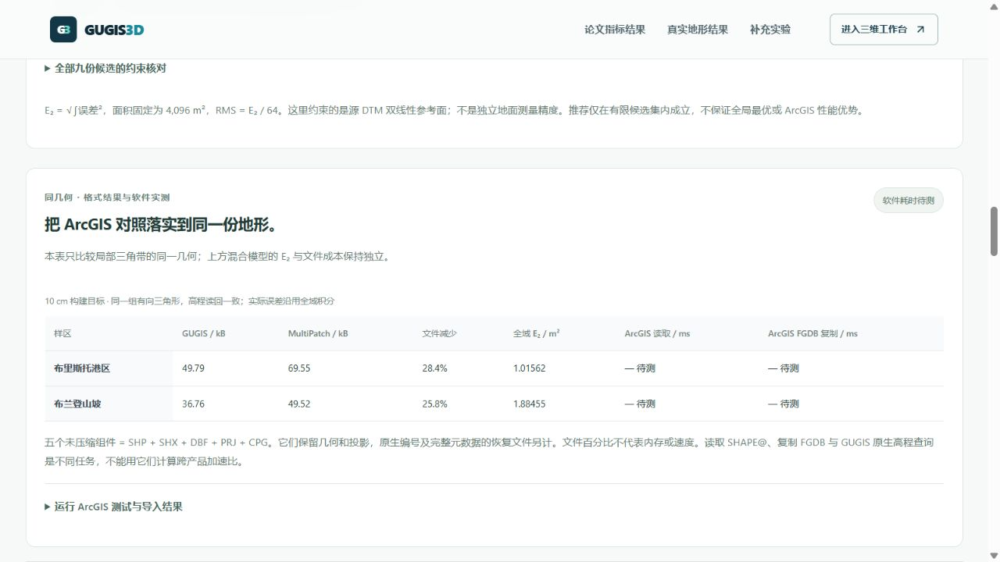

# 真实布里斯托地形的 ArcGIS 对标流程

2026-10-05，对比页新增同几何结果表和 ArcGIS Pro 运行结果导入。它连接既有真实 DTM 实验，不改变论文解析曲面或已发布模型。

## 已测量：同几何文件结果

固定港区与布兰登山坡两个 64 × 64 m 样区，使用环境署 1 m DTM 的局部三角带模型。三档构建目标为 10 / 25 / 50 cm。GUGIS 原生 JSON 与 MultiPatch Shapefile 的有向三角形多重集一致；已有 4,096 个高程查询读回一致。全域 E₂ 来自源双线性参考面的积分，不是抽样 RMSE。

| 样区 / 10 cm 目标 | GUGIS JSON | MultiPatch 五个文件 | 原生文件减少 | 同几何全域 E₂ |
|---|---:|---:|---:|---:|
| 港区 | 49,793 B | 69,549 B | 28.4% | 1.01562 m² |
| 布兰登山坡 | 36,764 B | 49,517 B | 25.8% | 1.88455 m² |

五个未压缩文件指 SHP / SHX / DBF / PRJ / CPG。它们不保留全部原生控制点编号与元数据；恢复信息的费用单独披露，位于原实验包。以上百分比不是内存、GPU 或 ArcGIS 运行速度。混合直纹面模型的不同几何与误差结果仍另表展示，不能混为纯文件格式优势。

## 待测量：ArcGIS 软件读取与复制

本机尚未取得已授权 ArcGIS Pro 的实际运行结果。`frontend/public/research/bristol-arcgis/bristol-arcgis-protocol.zip` 含六组固定 Shapefile、相应原生模型、哈希清单、许可及独立运行脚本，约 95 kB；测试包不重建或重采样几何。

在新的目录解压，用 ArcGIS Pro Python 环境执行：

```powershell
python run_bristol_arcgis.py --directory . --output arcgis-result.json
```

脚本先核对全部输入 SHA-256，再检查 MultiPatch / Z / EPSG:27700、样区身份和顶点数量；完整 XYZ 坐标多重集须一致。每项操作预热一次，再记录五次 `SearchCursor` 的完整 `SHAPE@` 读取和向全新 FGDB 的 `CopyFeatures`；返回全部记录及中位数。哈希、坐标检查和 FGDB 创建不计入耗时。继承的裁剪与坐标输出设置被清除，Z 输出明确保留。

复制结果也必须通过坐标多重集检查，否则不产生有效报告。此检查不能证明 FGDB 面片拓扑不变。一个进程中的预热重复不保证冷缓存；FGDB 字节数不包括锁文件，含数据库管理开销。小样区的耗时不能外推到整城加载。

只写新临时 FGDB 与全新的结果文件，不读写城市正式项目。已有结果拒绝覆盖。缺少 `arcpy` 或有效运行环境时明确退出，不写假结果。

## 在网站展示结果

打开 `/compare#bristol-arcgis-run`，展开「运行 ArcGIS 测试与导入结果」，选择运行生成的 JSON。页面核对测试包及脚本哈希、完整六组样区、重复身份、模型/几何/坐标指纹、五次原始记录与中位数。错误结果会被拒绝，旧数值清除。

通过后称为「已导入运行者结果」，并显示运行环境、UTC 时间、全部原始记录和导入文件 SHA-256。文件一致性检查不能认证运行者确实执行了 ArcGIS，因此不称为独立复现。结果仅存于本页面，刷新或清除后消失，不自动写入城市或公开仓库。

ArcGIS 几何读取、FGDB 复制与 GUGIS 高程查询不是相同任务，页面不计算跨产品速度倍数。FPS、内存、显存及 ArcGIS 地形查询仍未测量。

## 核验记录

五项离线协议检查通过：真实包完整性、输入篡改/路径拒绝、预热与重复调用、复制坐标损坏时停止、重复坐标与高程指纹。测试使用明确标为测试用途的假适配器，**不作为 ArcGIS 性能数据**。五项前端检查包含错误报告、乱序完整报告、中位数、读取限额、清除与异步请求竞争。完整前端 595 项通过；生产构建通过。

真实浏览器下载包与仓库 SHA-256 一致，实际文件选择器导入错误清单被拒绝，表格继续标为待测；控制台未见警告或错误。



[Esri 几何读取说明](https://pro.arcgis.com/en/pro-app/3.4/arcpy/get-started/reading-geometries.htm) · [Copy Features 官方说明](https://pro.arcgis.com/en/pro-app/3.6/tool-reference/data-management/copy-features.htm) · [原真实地形实验](bristol_terrain_benchmark.md) · [论文指标与全域积分](paper_metrics_results.md)
