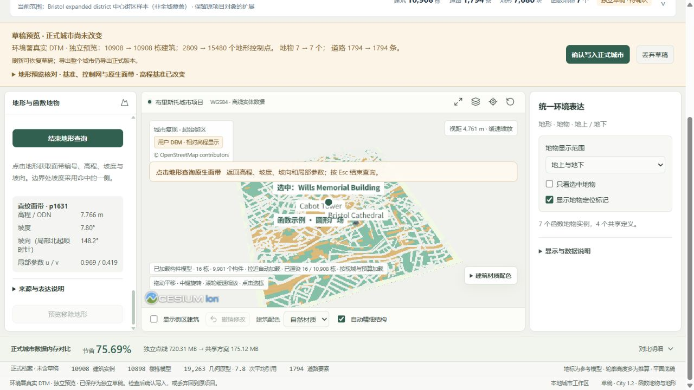

# 布里斯托真实裸地 DTM

“地形 / 地物 → 地形”新增英国环境署公开 DTM 资料卡，可直接预览，也可下载原分辨率 GeoTIFF 后自行选择采样步长。现在有实际英国地形来源，正式项目仍沿用原地形；资料卡不会自动替换城市档案。

| 内容 | 已核验结果 |
| --- | --- |
| 来源 | [Environment Agency 2022 LIDAR Composite DTM](https://www.data.gov.uk/dataset/01b3ee39-da3f-47b6-83da-dc98e73a461f/lidar-composite-dtm-2022-1m)，公开 WCS |
| 范围 | 布里斯托中心采集街区的 BNG 外接矩形 `[356936,171720,359320,174298]`，非全城 |
| 栅格 | 2,384 × 2,578；1 m；Float32；6,145,952 有效像元，0 缺测像元 |
| 水平 / 高程 | EPSG:27700 / ODN，单位米；保留源高程，没有转换为 WGS84 椭球高 |
| 原下载 | 31,457,939 B，SHA-256 `6de1eca2b9865948bad1796fc6e68fa5b92e49a1e036706a06fec76162744d8d` |
| 公开下载 | 13,112,384 B；仅 DEFLATE 压缩，所有像元、CRS、变换、NoData、scale/offset 保持一致 |
| 轻量预览 | 20 像元采样；15,480 共享控制点，5,110 直纹面带、2,570 三角带，无三角扇 |

公开 GeoTIFF SHA-256 为 `eba5ddd68fd58472d236d681f8af8da98df5a29762673414cb916658a264bfbf`，原生预览 SHA-256 为 `eb21c95181b4dad96eb3e87b3a20ae556aec77eb89b8f5a3a5af1f4e3e8f0e65`。来源目录、预览、下载均核对实际字节；篡改或丢失返回 503，其他城市没有数据时明确待导入，不借用布里斯托地形。

预览采用现有城市导入的相邻坡度分类规则，尚不是有限尺度研究构建器。原生查询逐一命中所有 15,480 控制点，最大高程差为 `3.55e-14 m`。另外从原 1 m 像元中心固定抽取 4,096 个不同位置，全部查询有值；相对原像元的 RMSE **0.608 m**、MAE **0.345 m**、P95 **1.323 m**、最大绝对差 **6.822 m**。抽查避开 40 像元边缘，不能代表全范围最坏误差；源数据参与构建，不是独立留出真值。

1 m 是源分辨率，不能理解成预览达到 1 m 或 15 cm 高程精度。官方单项测量精度说明不等于此粗采样模型的精度保证。WCS DescribeCoverage 的 Elevation 单位字段错误写作 `W.m-2.Sr-1`，GeoTIFF 未标高程单位；米制与 ODN 的依据是官方数据集正文，原 XML 已保留。这项冲突在资料卡详情中公开。

使用步骤：

1. 打开布里斯托完整编辑工作区，选择“地形 / 地物 → 地形”。
2. 点击“预览环境署真实 DTM”，等待独立草稿载入。核对高程基准由局部基准改为 ODN，以及控制点、来源和采样信息。
3. 点击“点击场景查询地形”，在表面读取面带、高程、坡度、坡向、u/v。真实浏览器一次查询得到 `p1631`，ODN 高程 `7.766 m`、坡度 `7.80°`、坡向 `148.2°`、`u/v = 0.969/0.419`。
4. 检查后可确认写入；不采用时点击“丢弃草稿”。验收中丢弃后回到原 1,369 面片的正式项目，原修订和历史字节未改变。
5. 要提高采样密度，先下载 1 m GeoTIFF，再在“导入 Digimap / DEM”选择文件、ODN 和较小采样步长。仍受 300,000 控制点等资源上限约束，不自动补 NoData。




[源高程与误差分布 PNG](../frontend/public/research/bristol-terrain/bristol-source-preview.png) / [可编辑 SVG](../frontend/public/research/bristol-terrain/bristol-source-preview.svg) / [4,096 点 CSV](../frontend/public/research/bristol-terrain/pixel-queries.csv) / [抽查 JSON](../shared/bristol-terrain-preview-audit.json)。科学图仅显示 4 像元间隔地图，误差图保留全部 4,096 查询；色标 ±3 m，21 个超范围点颜色截断，最大差仍完整报告。没有 ArcGIS 软件跑分。

重现命令：

```powershell
# 原始 WCS 下载及 .source.json 位于独立 .local/sources；源码拒绝未经审核的不同原始字节。
.venv/Scripts/python.exe data-pipeline/build_bristol_public_terrain.py --source .local/sources/ea-bristol-dtm-1m-2026-10-05.tif
.venv/Scripts/python.exe data-pipeline/audit_bristol_public_terrain.py
.venv/Scripts/python.exe data-pipeline/plot_bristol_terrain_source.py
```

第一步仅允许在未生成公开栅格时执行，防止覆盖发布原件；抽查脚本读回冻结网站内核，不更改原生模型。绘图需 NumPy、Rasterio、Matplotlib。297 项后端检查通过（17 项环境跳过），前端 571 项通过，生产构建通过。浏览器已验证独立预览、原生查询、草稿丢弃恢复及真实 GeoTIFF/CSV 下载，无控制台错误。

许可：[Open Government Licence v3.0](https://www.nationalarchives.gov.uk/doc/open-government-licence/version/3/)。署名：© Environment Agency copyright and/or database right 2022. All rights reserved. 本地私有城市、历史档案和建议文档不包含在公开包中。
