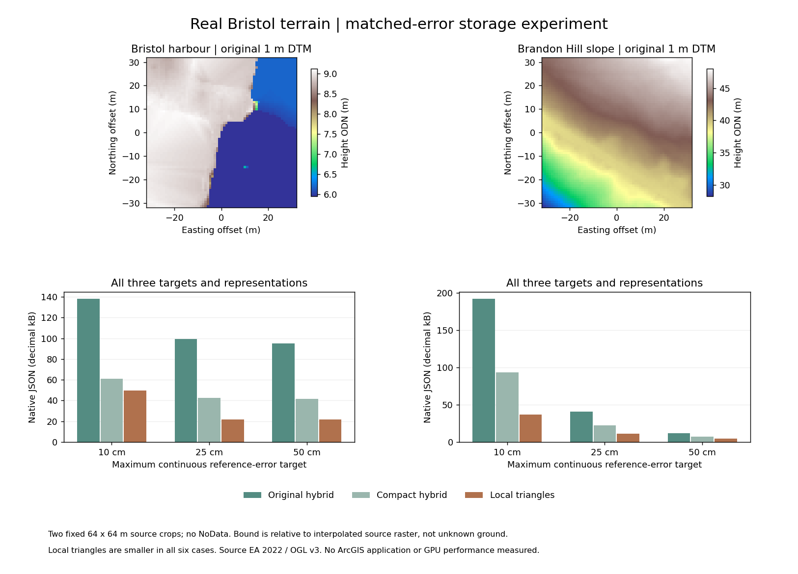
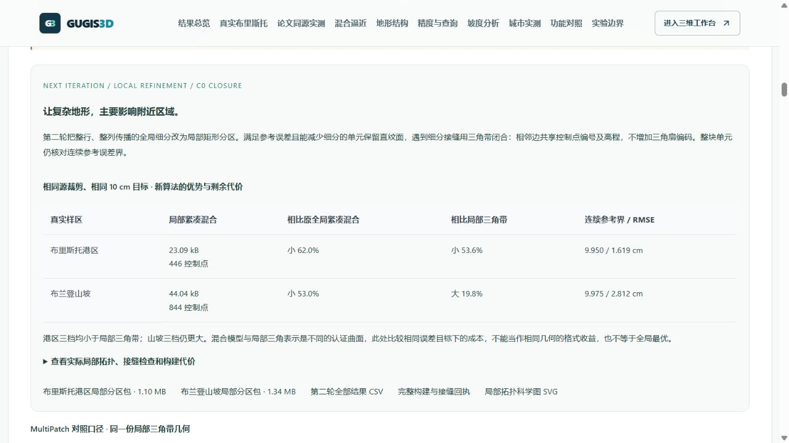
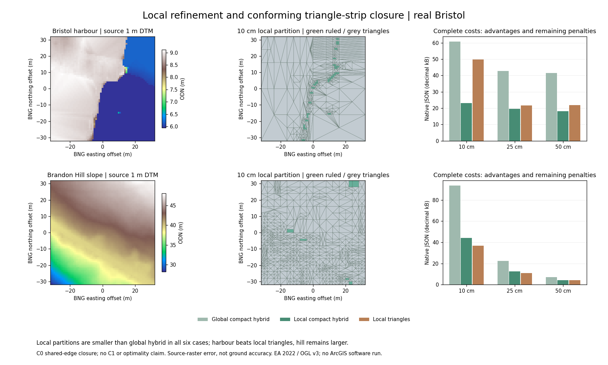
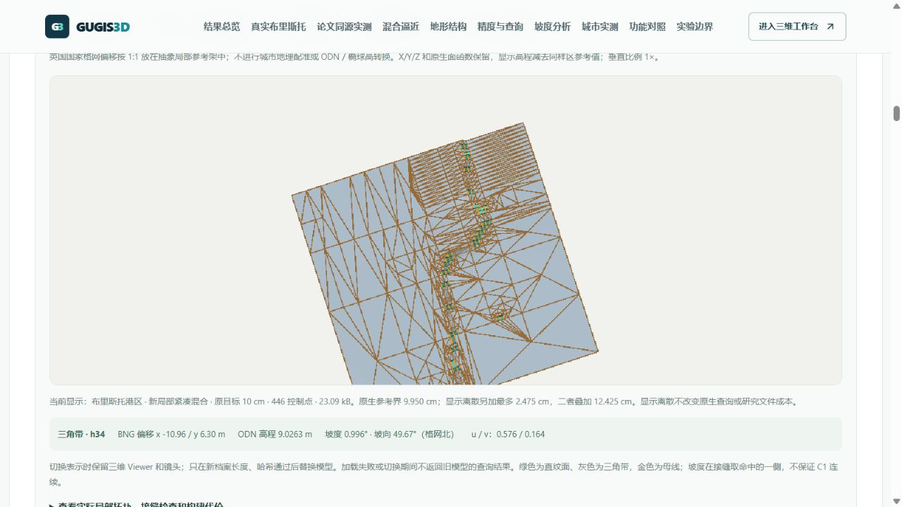
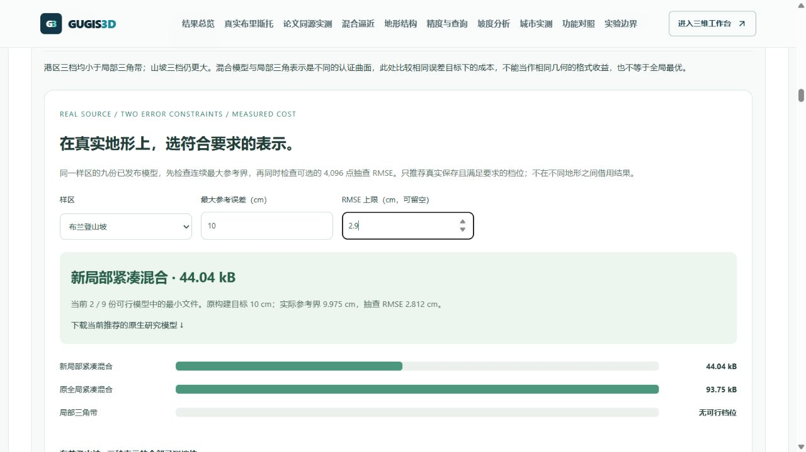

# 真实 Bristol 地形：同误差表示与 MultiPatch 格式对照

入口：`http://127.0.0.1:5173/compare#bristol-terrain-benchmark`。选择 10、25、50 cm 最大参考误差目标；两地全部表示、控制点成本、连续参考界与抽查 RMSE 同时展示，不用某个有利样本替代全部结果。

## 10 cm 目标的具体结果

| 固定样区 | GUGIS 局部三角带 | 同几何 MultiPatch 五文件 | 文件减少 | 加原生恢复信息后的 MultiPatch | 紧凑混合面带 |
|---|---:|---:|---:|---:|---:|
| 港区 | 49,793 B | 69,549 B | 28.406% | 108,368 B | 60,805 B |
| 布兰登山坡 | 36,764 B | 49,517 B | 25.755% | 77,539 B | 93,746 B |

两个样区的三档实验中，GUGIS 局部三角带相对同几何 MultiPatch 五文件减少 **24.09%～29.92%**。这是保存格式的文件实验，**没有执行 ArcGIS Pro，不代表其运行内存、渲染速度或计算耗时**。

同一目标下，紧凑混合面带在这六组真实样区都比局部三角带大。10 cm 下分别大 22.1% 和 155.0%；混合方案的抽查 RMSE 也更小，两者实际误差分布不同。当前全局张量细分会把局部地形细节传递成整行、整列的额外控制成本，后续需要评估局部相容分区，而不能宣称直纹面天然更省。港区 50 cm 的独立局部三角带文件略大于 25 cm，说明独立细分与打包结果不一定按阈值单调。


## 来源与公平口径

- [英国环境署 EA 2022 LIDAR Composite DTM](https://www.data.gov.uk/dataset/01b3ee39-da3f-47b6-83da-dc98e73a461f/lidar-composite-dtm-2022-1m)，原像元 1 m，EPSG:27700，ODN 高程；[OGL v3](https://www.nationalarchives.gov.uk/doc/open-government-licence/version/3/)。公开无损 GeoTIFF SHA256：`eba5ddd68fd58472d236d681f8af8da98df5a29762673414cb916658a264bfbf`。
- 拟合前固定港区中心 `(-2.5985, 51.4501)` 和山坡中心 `(-2.6078, 51.4524)`。实际中心取国家格网像元中心；每地 65×65 个原像元中心，跨度 64×64 m，零缺测。具体窗口和中心国网坐标保存在报告。
- 参考面为原始源栅格的连续分片双线性插值。使用同一参考、相同阈值，分别构造全局相容混合网、局部最长边三角细分及几何不变的面带压紧。连续参考界覆盖源单元顶点、三角边网格交点及二次极值，并计入 Z 保存舍入和浮点保护；不是未知地面的精度保证、区间算术证明或论文最优性定理。
- 每份模型通过网站原生 `terrainMath.ts` 核验 4,096 个固定随机非网格点、4,225 个源像元中心和 256 个外边界点。两种混合编码的方向几何哈希相同，原生抽查及边界高程差小于 1e−9 m。
- MultiPatch 仅从已认证的局部三角带导出，遵循 [Esri Shape 31 / Triangle Strip 规范](https://www.esri.com/library/whitepapers/pdfs/shapefile.pdf)。单要素、兼容面带合并、无人工三角面、无不存在的可选 M。SHP、SHX、DBF、PRJ、CPG 的未压缩总字节数为核心对照。读回全部有向三角面一致，4,096 点高程差为 0；附加恢复文件保留原生点号、面带和完整元数据，能够逐字节还原原档案。两种成本分列。
- 实验模型 X/Y 为**英国国家格网局部偏移，未转换城市 ENU**，用于原生数值实验；不得直接植入三维城市。两处小样区不代表整城已达到该误差界。正式城市、历史、20 像元粗预览和旧瑞士实验均未被替换。



## 复现与交付

每个可下载 ZIP 包含全部九份模型、原始裁剪 JSON、4,096 点共同查询夹具、完整逐点 CSV、三档 MultiPatch 五文件、原生恢复信息、构建与查询回执、许可和说明。公开结果为 `shared/bristol-certified-terrain.json`，CSV 和科学图位于 `frontend/public/research/bristol-certified/`。结果绑定源文件、代码、模型、夹具和下载包 SHA256；CPU 索引构建与五次预热查询批次耗时分列，GPU/FPS/浏览器堆内存未测量。

```powershell
.venv/Scripts/python.exe data-pipeline/build_bristol_terrain_benchmark.py --output .local/benchmark/bristol-certified-new
node frontend/scripts/audit-bristol-certified.mjs .local/benchmark/bristol-certified-new
.venv/Scripts/python.exe data-pipeline/publish_bristol_terrain_benchmark.py --input .local/benchmark/bristol-certified-new
.venv/Scripts/python.exe data-pipeline/plot_bristol_terrain_benchmark.py --input .local/benchmark/bristol-certified-new
.venv/Scripts/python.exe -m unittest discover -s data-pipeline/tests -p test_bristol_benchmark.py
```

构建器要求新目录。运行测量和发布会更新这组实验的公开结果和代码指纹，应先检查变更，保留历史提交；不会修改正式城市。本次前端组件检查、两项发布包数值检查、生产构建和真实浏览器档位切换、源图加载、ZIP/CSV 下载均通过。实际下载的港区包及 CSV 与仓库文件逐字节一致；控制台无警告和错误。

© Environment Agency copyright and/or database right 2022. All rights reserved.

## 第二轮：局部矩形分区与三角带接缝闭合

首轮的全局张量切线会传播局部细节。新增 `data-pipeline/terrain_partition_hybrid.py` 离线研究原型：仅细分当前高误差矩形，整块参考误差合适时保留直纹面；邻接边有悬挂顶点时，围绕单元中心构造闭合三角面并编码为三角带。相邻边使用同一批点号和保存高程。没有新增 `triangle-fan` 原语，保证 C0，不保证 C1，也不声称论文最优性。

| 样区 / 最大参考目标 | 新局部紧凑混合 | 相对原全局紧凑混合减少 | 与局部三角带比较 |
|---|---:|---:|---:|
| 港区 / 10 cm | 23,093 B | 62.02% | 小 53.62% |
| 港区 / 25 cm | 19,578 B | 54.12% | 小 9.87% |
| 港区 / 50 cm | 18,102 B | 56.36% | 小 17.35% |
| 山坡 / 10 cm | 44,037 B | 53.03% | 大 19.78% |
| 山坡 / 25 cm | 12,679 B | 43.20% | 大 16.51% |
| 山坡 / 50 cm | 4,348 B | 38.90% | 大 2.04% |

源裁剪、共同查询坐标、元数据、保存精度和三档目标沿用首轮并绑定原回执 SHA256。新方案与局部三角带是不同的参考达标曲面；此表不是相同几何的纯格式收益。港区 10 cm 为 446 控制点，山坡为 844，参考界分别 9.950 cm / 9.975 cm，4,096 点抽查 RMSE 为 1.619 / 2.812 cm。山坡仍不及局部三角方案，结果完整保留。

12 份原始/压紧模型逐一检查：方向几何哈希相同，连续参考界达标，每条内部边恰有配对，外边单边，投影覆盖面积均为 4,096 m²；全部控制点共用保存高程。每份 4,225 个源像元中心、4,096 非网格点和 256 外边界点通过网站原生核验，压紧前后抽查和外边界高程差小于 1e−9 m。构建约 0.29～5.99 秒（单次本机 CPU），另付压紧和索引成本，均在页面公开。这是离线研究实验，不自动替换正式城市或 20 像元预览。





完整报告 `shared/bristol-local-partition.json` 保留细分历史和单元范围；网页加载 37.5 kB 摘要 `bristol-local-partition-summary.json`，用完整报告哈希绑定，以免把 427 kB 研究历史塞进页面代码。两份 ZIP 带 12 份模型、来源、夹具、逐点 CSV 和回执，原首轮报告与包不变。浏览器核验三档切换、拓扑图加载与真实下载；港区 ZIP 和 CSV 均与发布文件逐字节一致，控制台无警告或错误。前端 577 项检查、六项研究数值检查及生产构建通过。

```powershell
.venv/Scripts/python.exe -m pip install -r data-pipeline/research-requirements.txt
.venv/Scripts/python.exe data-pipeline/build_bristol_local_partition.py --parent .local/benchmark/bristol-certified-new --output .local/benchmark/bristol-local-new
node frontend/scripts/audit-bristol-local-partition.mjs .local/benchmark/bristol-local-new
.venv/Scripts/python.exe data-pipeline/publish_bristol_local_partition.py --input .local/benchmark/bristol-local-new
.venv/Scripts/python.exe data-pipeline/plot_bristol_local_partition.py --input .local/benchmark/bristol-local-new
.venv/Scripts/python.exe -m unittest discover -s data-pipeline/tests
```

本阶段依旧没有执行 ArcGIS 软件；首轮的同几何 MultiPatch 对照与第二轮的不同曲面算法比较分开呈现。参考界不是未知地面的精度保证，研究 BNG 偏移仍不得直接植入城市 ENU。

## 可交互的真实样区三维对照

对比页「真实布里斯托」的第二轮结果下，点击「打开 Bristol 三维对照」。可切换港区／布兰登山坡、原全局紧凑混合／新局部紧凑混合／局部三角带，使用页面上方的 10／25／50 cm 目标选择器。18 份模型从已公开实验 ZIP 原样提取，长度和 SHA-256 与原实验回执逐一绑定；只在打开视图时加载当前一份模型。

绿色为直纹面、灰色为三角带，金色为原生边界与母线；可旋转、缩放、俯视或隐藏母线。点击表面得到原生面片编号、BNG 偏移坐标、ODN 高程、坡度、相对格网北的坡向和 u/v。显示三角网仅供观察，单独列出离散误差及其与原生参考界的叠加值；不把 GPU 三角数计作原生文件点数。



三维展示把 BNG 偏移 1:1 放在抽象局部参考架，不进行城市地理配准或 ODN／椭球高转换，保留模型原生 X/Y/Z，仅按原样区参考值显示相对高程。垂直比例为 1×。普通切换不卸载 Viewer 或移动镜头；加载期间保留明确标注的旧模型并关闭查询，失败可重试，渲染中断的恢复操作会重建 Viewer。实验视图不写入正式城市或草稿。

发布入口：`data-pipeline/publish_bristol_viewer_models.py`；模型清单：`shared/bristol-viewer-models.json`；公开模型：`frontend/public/research/bristol-viewer/`。公开数据来自原实验包，不包含本地城市、个人草稿或私有 DEM。

## 按双重误差约束选方案

第二轮结果下的方案选择器同时限制「连续最大参考误差」和可选的「4,096 点抽查 RMSE」，使用同一样区全部九份模型的真实保存数据。按原生完整文件字节排序；不按原构建目标标签推测成本，不插值产生未构建的候选。要求无解时显示无可行模型，并保留全部测点。

例如山坡最大参考误差 10 cm、RMSE 留空时，局部三角带 36,764 B 是已测候选中的最小文件。再限制 RMSE ≤2.9 cm，三角带的实测 2.954 cm 不满足要求，新局部紧凑混合的 2.812 cm 满足，此时推荐 44,037 B。港区最大参考误差 10 cm、RMSE ≤1 cm 时，原全局紧凑混合的 0.693 cm 满足，而两个局部方案不满足。优势取决于需求，而不只取决于模型名称。



联合已测前沿采用三项共同判定：文件字节、最大参考界、抽查 RMSE。只有另一份已发布模型在三项均不差，且至少一项严格更优，才排除被支配候选。前沿不表示理论全局最优。抽查 RMSE 不能替代最大误差保证，源栅格参考误差不能当作独立地面实测精度。下载按钮指向推荐模型的原字节 JSON，并沿用 SHA-256 清单；实际浏览器下载核对逐字节一致。前端 583 项检查及生产构建通过。
