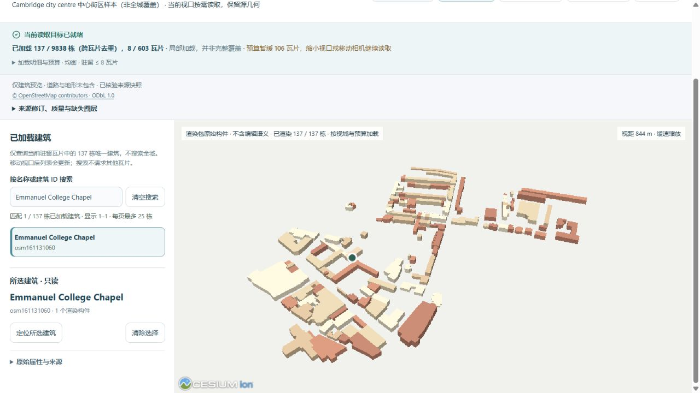
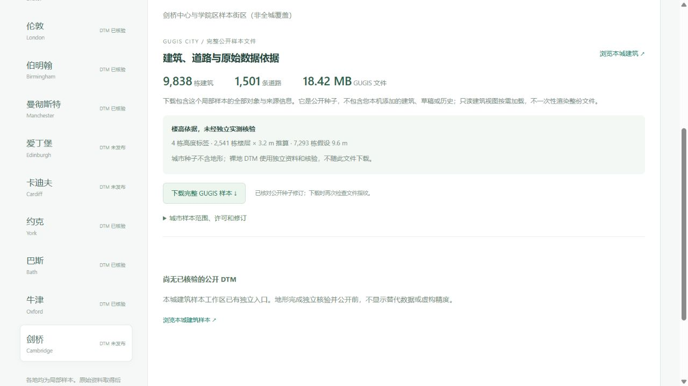

# 剑桥中心与学院区真实样本

新增第十个独立城市样本：**9,838 栋 OSM 建筑、1,501 条道路**。十城公开种子合计 **65,251 栋建筑**，全部明确标注局部覆盖，不代表完整城市行政范围。

[只读分块入口](http://127.0.0.1:5173/?city=cambridge&cities=cambridge&view_mode=tiles&tile_profile=economy) · [公开资料与下载](http://127.0.0.1:5173/datasets?dataset=cambridge)。资料浏览和分块查询不创建或修改剑桥正式项目。



## 实际来源与精度

2026-10-05 从公开 Overpass 实例取得有界 OSM 快照。查询框 `[0.106, 52.189, 0.147, 52.218]`，源时间 `2026-10-05T12:40:49Z`，保留完整跨界 ways；实际导入建筑与道路的合并范围 `[0.0956414, 52.1839678, 0.1543402, 52.2209898]`，页面区分查询框与真实要素范围。

原始下载 **8,328,373 B**，SHA-256 `0985aeccf602f924ac6d2feb30eb8b51ab7ffbf0c9cb370d798f936103e030d4`，保留在本地来源目录。公开响应 **6,347,801 B**，SHA-256 `5c09fd83f2d6b13a8dbcaa58cc134d0473b1af7cc3e9dd5cf6db8927fcce0f23`。删除 530 个无关联系或自由文本标签，原 ID、几何、建模属性及署名保留。完整采集与筛选指纹在 `cambridge-source.json`。

9,846 个建筑 way 中，8 个因无法支持的高度或架空语义被拒绝，不回退为假设地面建筑。具体 ID 与理由见 `cambridge-import.json`。1,516 个源道路 way 中，1,501 条非面积道路保留，没有转换失败；15 个面积道路不属于此线状道路模型。

楼高依据为 **4 个高度标签、2,541 个楼层 × 3.2 m 推算、7,293 个假设 9.6 m**。高度标签没有独立测量核验。模型是 LoD1 轮廓体量，不是建筑立面、穹顶或内部复原；未取得 multipolygon relations，relation 中的庭院孔洞不在本轮覆盖承诺内。源列表包含 The Senate House、Trinity College Chapel 及学院图书馆名称，不能将这些体量称为精细历史建筑复原。道路宽度采用明确的显示假设，当前只读建筑瓦片不加载道路与地形。

源与派生数据库保留 © OpenStreetMap contributors 署名，按 [ODbL 1.0](https://opendatacommons.org/licenses/odbl/1-0/) 分发；[当前数据许可](../backend/data/cities/CURRENT_DATA_LICENSE.md)与软件许可分开。

## 分块与可恢复文件

完整公开 GUGIS 种子 **18,417,340 B**，SHA-256 `f6fba9b06291d5c4b309272d723d9628ee3ee40c16e5f7c7ee6761220e8cd5a8`。125 m 格网共 **603** 个瓦片，跨格引用 12,655 条，去重为 9,838 栋。瓦片总字节 **14,209,782 B**，最大 **88,852 B**，清单 **333,864 B**。每栋保留完整源构件，分块不替换或截断建筑轮廓。

低资源最多驻留 2 瓦片 / 2 MiB；均衡最多驻留 8 瓦片 / 8 MiB，切换保持镜头。这些限制源数据字节与请求数，不是实际 GPU 内存或帧率保证。建筑与道路完整保存在公开种子中，页面下载按长度和 SHA-256 再次核对，不导出本机正式项目、草稿或历史。

```powershell
.venv/Scripts/python.exe data-pipeline/acquire_city_samples.py --cities cambridge --output-dir .local/sources/cambridge-new --method GET --endpoint https://gall.openstreetmap.de/api/interpreter
.venv/Scripts/python.exe data-pipeline/prepare_city_source.py --city cambridge --source-dir .local/sources/cambridge-new --output-dir .local/staging/cambridge-new
.venv/Scripts/python.exe data-pipeline/import_city_samples.py --city cambridge --source-dir .local/staging/cambridge-new --output-dir .local/staging/cambridge-new
.venv/Scripts/python.exe data-pipeline/build_render_tiles.py .local/staging/cambridge-new/cambridge.gugis.json --city cambridge --output .local/render-cache-new
```

来源、筛选与导入命令拒绝覆盖原件，新的采集使用新目录，可能取得更晚版本。完整重建检查从公开 OSM 重算所有建筑、道路、几何与元数据，要求生成的城市与发布种子逐字节相同。

## 独立发布的地形资料

另已发布 EA 2022 官方 1 m 裸地 DTM 无损裁片及原生面带预览。BNG `[543967, 256618, 546864, 259927]`，EPSG:27700，一带 Float32、scale 1 / offset 0；2,897 × 3,309、**9,586,173** 有效像元，0 缺测，ODN 2.955–32.496 m。原始下载 **44,040,947 B**，SHA-256 `0e04d1d7912db378b251a00d393c3bf5f7da7338aeb15e5c5f2af4824aa6771d`。

地形使用第三版来源清单，保留既有七城来源和已发布对标指纹。24,070 个控制点全部核验，4,096 个固定原像元查询全部命中，相对源 RMSE 0.226 m、最大差 2.568 m。当前 GUGIS 城市种子**不含地形**，地形独立查询和下载，不与城市建筑配准；详情见[剑桥地形来源与验收](cambridge_terrain_sample.md)。EA 数据独立按 OGL v3.0 署名分发。

## 验收与保留

649 项前端全套检查、310 项后端检查（293 通过、17 Windows 环境不适用跳过）、32 项研究管线检查及生产构建通过。新增回归要求从公开来源完整重建所有建筑、道路、几何与元数据，生成字节与实际种子完全相同；明确核对八个拒绝 ID、所有拒绝原因、实际楼高依据和筛选后的联系标签。实际 Cesium 相机数学检查覆盖十城、四种尺寸、两种预算，不等于手机 GPU 实测。

实际桌面内置浏览器初始低资源加载 28 栋 / 2 瓦片，均衡加载 137 栋 / 8 瓦片；Emmanuel College Chapel 可搜索及只读选择。切换预算后六项相机参数相同，视距标签按已加载几何中心计算，不能将不同驻留集合的标签变化当作相机移动。上述数量是当前视口结果，不是完整城市数量或覆盖承诺。

通过数据页下载的 `cambridge-public-seed.gugis.json` 为 18,417,340 B，实际 SHA-256 与发布种子相同；数据页零画布，控制台无警告或错误。九份旧城市种子、七城 DTM 对、两版来源清单及六样区 / 牛津对标原件核验未变，43 份原始本地档案与三个正式城市保留检查通过；没有初始化剑桥正式目录。

以下保留首次城市发布时的截图，当时地形尚未发布；当前状态见地形验收文档。


