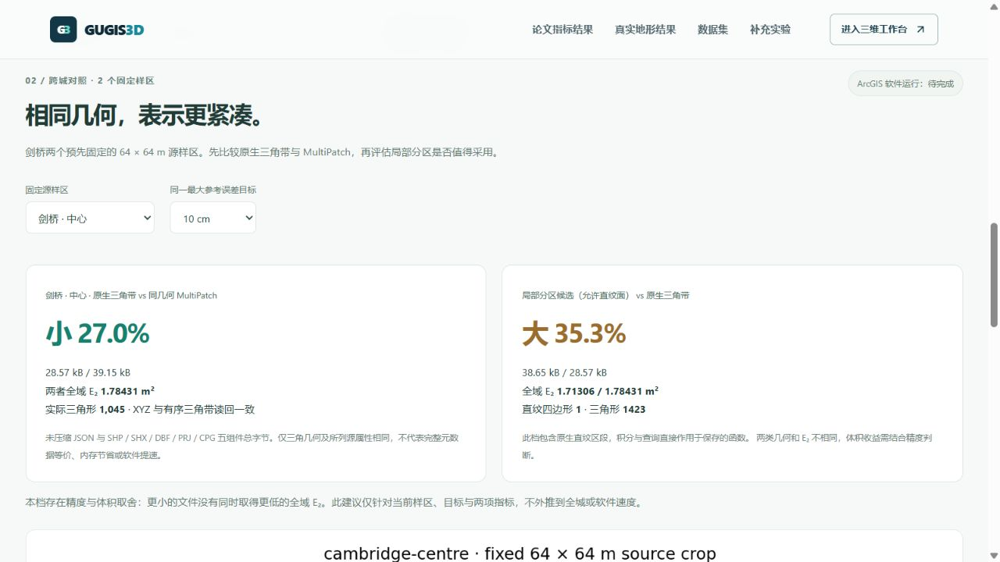
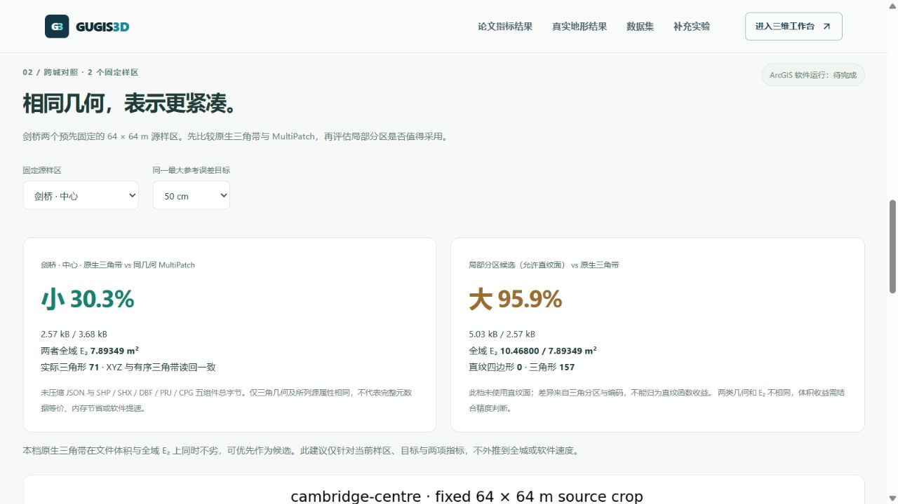

# 剑桥固定源样区：论文指标与格式对标

入口：[剑桥对标结果](http://127.0.0.1:5173/compare#cambridge-terrain-results)。新增两个预先固定的 64 × 64 m 源样区、三档最大参考误差目标、两类保存模型，共 12 组；结果与布里斯托、六样区及牛津档案分别切换，旧证据不改写。



## 主要结果

六对原生三角带 / 同几何 MultiPatch 五组件文件，原生 JSON 小 **27.03%–30.76%**。读回检查全部 XYZ、分带及有向三角形，DBF 包含样区、源指纹、目标与 ODN。比较未压缩字节，不是 GPU 内存、完整元数据等价或 ArcGIS 软件耗时。

局部分区候选六档文件均更大：三个档位 E₂ 较低、三个较高。页面同时报告误差与体积，并给出当前样区的取舍说明。仅当某种表示在两项指标上同时不劣且达标时才建议优先考虑；不外推到所有地形。

| 样区 / 目标 | 三角 JSON / B | MultiPatch 五件 / B | 局部分区 / B | E₂ 三角 / 分区 · m² | N 三角 / 分区 | 分区直纹四边形 |
| --- | ---: | ---: | ---: | ---: | ---: | ---: |
| 中心 / 10 cm | 28,569 | 39,154 | 38,650 | 1.784313 / 1.713058 | 1,045 / 1,423 | 1 |
| 中心 / 25 cm | 7,829 | 10,826 | 13,180 | 4.775390 / 4.857936 | 259 / 473 | 0 |
| 中心 / 50 cm | 2,567 | 3,682 | 5,030 | 7.893492 / 10.468000 | 71 / 157 | 0 |
| 北侧 / 10 cm | 21,843 | 30,370 | 27,700 | 1.815674 / 1.700327 | 798 / 1,019 | 1 |
| 北侧 / 25 cm | 7,537 | 10,802 | 10,111 | 4.526656 / 4.245478 | 272 / 360 | 1 |
| 北侧 / 50 cm | 3,480 | 5,026 | 5,697 | 7.671111 / 7.869911 | 106 / 193 | 0 |

中心 10 cm 档局部分区 E₂ 低 3.99%，文件大 35.29%，属于取舍。中心 50 cm 档文件大 95.95%，E₂ 高 32.62%，应优先保留三角候选；该档没有直纹面，不能称为直纹函数的效果。北侧 25 cm 档文件大 34.15%，E₂ 低 6.21%，实际仅一个直纹四边形，不能据此推断大规模直纹区段收益。



## 指标与公平边界

源是[剑桥已核验的真实 1 m DTM](cambridge_terrain_sample.md)。绑定第三版来源清单，源 TIFF SHA-256 `a7ce2692fdaf46fbf9f6666bfe4d583a73cfa75e9f38b9df65a97ba0c5c505fb`。选取源栅格中心列、中心行及北侧四分位行，在拟合前固定，不按结果重选样区。每个参考裁片保留 65 × 65 个原像元中心，连续参考为源双线性面。

全域 E₂ 是模型相对该参考面的 L₂ 范数，单位 m²；每组完整积分面积 4,096 m²，RMS = E₂ / 64。对保存的直纹函数与三角带分片积分，不先三角化直纹函数。最大参考界包含保存高程舍入，采用 Float64 数值保护，非区间算术证明。十二档均达本档目标；不是独立地面真值精度。

对照三角法采用最大误差优先、欧氏最长边相容细分，不是 [Mirebeau & Cohen](https://arxiv.org/abs/1101.1452) 的 L₂ 选区 / L₁ 选边实现。这里对齐全域 E₂ 和实际三角形 N；直纹四边形单列，不能算成论文三角形 N。真实双线性 DTM 不满足严格凸 C² 前提，未声称理论近最优，也未给该栅格套用 Hessian 形状指标。解析论文方法实验仍独立保留在页面第一部分。

XY 在原生模型中是样区中心的 BNG 偏移，MultiPatch 为绝对 EPSG:27700，Z 均为 ODN 米。原生研究模型不能直接作为城市 ENU 地形导入。EA 2022 数据按 OGL v3.0 分发，保留 © Environment Agency copyright and/or database right 2022. All rights reserved.

## 完整下载与复现

每个样区包有 31 个文件，包括六份原生模型、三档 MultiPatch 五组件、原像元参考、固定查询夹具、六份逐点 CSV 及来源说明。中心包 1,286,934 B、SHA-256 `510fc86f436c6e195cc3f4e115559fd4ac7b23aff83fde571e78c1c2f5ad8d03`；北侧包 1,278,911 B、SHA-256 `5e9b91e48abceac72a1d98a34328b01fd89a5f15f5726f407685aebccf4d7efa`。ZIP 压缩体积不用于上述表示成本比较。

```powershell
.venv/Scripts/python.exe data-pipeline/build_cambridge_terrain_benchmark.py --output .local/research/cambridge-new
node frontend/scripts/audit-cambridge-terrain-benchmark.mjs .local/research/cambridge-new
```

新目录构建，不覆盖现有资料；发布脚本也拒绝覆盖已发布文件。12 组模型各核验 4,096 个固定查询，共 49,152 次，全部命中且在各自最大参考界内；全部保存控制点命中且误差小于 1e−9 m。逐点抽查 RMSE 和全域 E₂ 分别记录。研究管线独立重算全部十二个保存模型的积分，并核对原像元裁片、几何、源属性、包内容和所有指纹。

ArcGIS Pro 软件计时及 FGDB 实测仍待运行环境；当前结论仅来自真实源、原生函数、几何读回和文件证据。

## 本轮验收

658 项前端全套检查、36 项研究管线检查及生产构建通过。后端服务本轮未变，前一轮 313 项检查（296 通过、17 Windows 不适用跳过）单独记录，不冒充本轮重跑。

实际桌面浏览器从剑桥深链接打开结果，核验中心 10 / 50 cm、北侧 25 cm；跨牛津再返回时样区复位、误差目标保留，所有模型、CSV 和图片链接对应当前范围。北侧恢复包实际下载 1,278,911 B，SHA-256 与发布指纹一致。页面没有创建三维画布，控制台无警告或错误；没有宣称 Edge 或手机 GPU 实测。

九份旧城市种子、七城 DTM 对、两份历史来源清单、六样区与牛津对标档案保留；本轮另核对全部十份公开种子及剑桥源 DTM，43 份原始本地档案和三个正式城市保持原指纹，未初始化剑桥正式目录。
