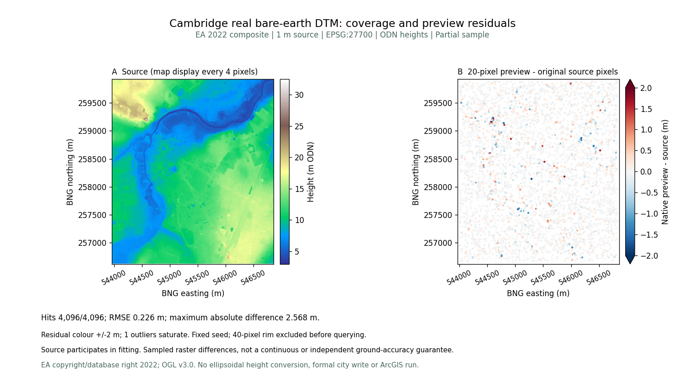
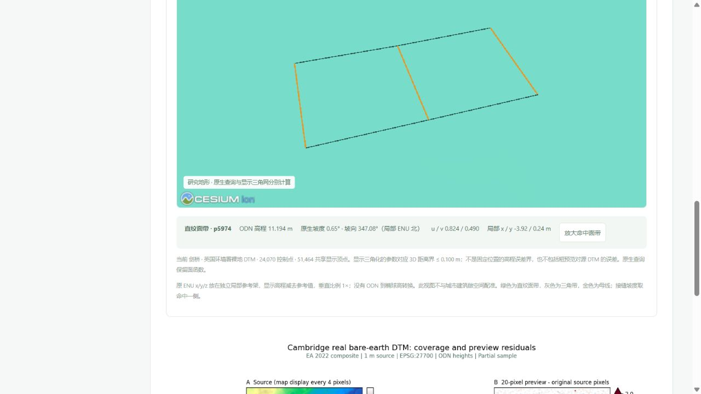

# 剑桥真实裸地：来源、函数查询与可复核误差

[打开剑桥数据页与只读三维预览](http://127.0.0.1:5173/datasets?dataset=cambridge)。八城已核验 DTM 共 **54,790,216** 个有效 1 m 像元；十城建筑种子共 **65,251** 栋。地形与建筑分别保存、分别说明精度，全部是局部样本。

## 无损保存源像元

来源为 [EA 2022 官方 1 m 裸地 DTM](https://www.data.gov.uk/dataset/01b3ee39-da3f-47b6-83da-dc98e73a461f/lidar-composite-dtm-2022-1m)，不是 Digimap 下载。BNG 裁片 `[543967, 256618, 546864, 259927]`，EPSG:27700；2,897 × 3,309、一带 Float32、scale 1 / offset 0，**9,586,173** 有效像元、0 缺测。ODN 高程 2.955–32.496 m。

原始下载 **44,040,947 B**，SHA-256 `0e04d1d7912db378b251a00d393c3bf5f7da7338aeb15e5c5f2af4824aa6771d`，本地保留不覆盖。公开 DEFLATE GeoTIFF **21,700,349 B**，SHA-256 `a7ce2692fdaf46fbf9f6666bfe4d583a73cfa75e9f38b9df65a97ba0c5c505fb`；逐块逐像元比较相同，CRS、格网变换、缺测、scale、offset 与源一致。

源服务的高程单位元数据与官方米制正文有冲突，原生来源保留警告；按官方米 / Newlyn 高程说明解释，没有椭球高转换。许可为 OGL v3.0，署名：© Environment Agency copyright and/or database right 2022. All rights reserved.

## 保留原生曲面函数

按原有导入器的 20 像元采样生成独立 ENU 预览，含 **24,070 控制点**，11,628 条直纹面带记录与 252 条三角带记录；记录数不是组成面的数量，只采用这两类拓扑。

原生文件 **1,767,703 B**，SHA-256 `7467c00dd16f0a971ca21720dae3fcc60bf6b7018e698e1d35b75bc37dd6be42`。高程、坡度与 u/v 查询直接作用于保存的原生函数，不用显示三角网替代。仅针对命中面带绘制边界和金色母线，显式点击「放大命中面带」才移动镜头。

原 ENU 放在独立局部研究参考架，显示高程减去参考值、垂直比例 1×。该视图没有 ODN 到椭球高转换，也没有与城市建筑空间配准。显示的参数对应三维距离界与粗预览对源栅格的误差分别报告，不把显示细分精度当成建模精度。

## 所有误差原样公开

预先排除源栅格 40 像元边框，固定种子 20261005，选择 4,096 个唯一有效原像元中心。原生查询全部命中；全部 24,070 控制点查询命中且误差小于 1e−9 m。

| 固定原像元抽查指标 | 相对源 DTM |
| --- | ---: |
| RMSE | 0.2262784 m |
| MAE | 0.1254926 m |
| P95 绝对差 | 0.4428791 m |
| 最大绝对差 | 2.5679236 m |

源 DTM 参与预览建模，这些是相对源的有限抽查差异，不是独立地面精度、连续最大误差保证或论文近最优证明。图中一个超出 ±2 m 色带的点仍在原记录中。页面提供原像元 CSV、查询回执、科学图 PNG / SVG 及无损 GeoTIFF。

## 历史来源链与数据保护

新增 `shared/public-terrain-sources-v3.json`，第一至第七项与第二版来源逐项一致。第二版父指纹 `8bd4a9a13e42632f3b6e76065c77710b9c75a58d8663a38be3292d3796c25626`；第一版六城指纹 `7658acdf236f9b434a16f230f69f68fd35f2a9e4eb7855d8db590e378bb64866`。后端检查第三版和两份历史祖先的实际文件，任何父文件损坏都拒绝返回来源，不回退到其他城市。

本轮独立脚本为 `prepare_ea_v3_city_terrain.py`、`audit-ea-v3-city-terrain.mjs`、`plot_ea_v3_terrain.py`，回执绑定实际脚本及原生内核指纹。第一版、第二版、旧对标模型、统计与恢复包不改写。

浏览、查询与下载不创建正式工作区、草稿或历史，不替换城市地形。剑桥建筑种子仍不含独立地形。源栅格、粗预览与既有论文 / ArcGIS 文件实验是不同档案，不借用其他样区结果；软件耗时仍待 ArcGIS 环境实测。

## 实际浏览器与回归验收

651 项前端检查全部通过；313 项后端检查中 296 通过、17 项 Windows 环境不适用跳过；32 项研究管线检查通过，生产构建通过。回归独立核对所有原像元源值、固定抽查结果、全部控制点、八城来源及两层祖先文件损坏时的拒绝行为。

桌面内置浏览器实际打开剑桥预览，显示 **51,464 个共享顶点**，参数对应 3D 距离界 ≤ 0.100 m。点击命中直纹面带 p5974，读取 ODN 11.194 m、原生坡度 0.65°、坡向 347.08°及 u/v 0.824 / 0.490；显式放大后金色母线和边界可见。查询与显示三角网分别计算，接缝坡度来自命中一侧。关闭预览后画布数为 0，控制台无警告或错误；没有宣称 Edge 或手机 GPU 实测。

经页面真实下载 `cambridge-ea-dtm-1m.tif`，实际 21,700,349 B 与 SHA-256 均与发布文件一致。九份旧城市种子、七城 DTM 对、两份历史来源清单及六样区 / 牛津对标文件保持原字节；43 份原始本地档案和三个正式城市保护检查通过，没有初始化剑桥正式目录。

