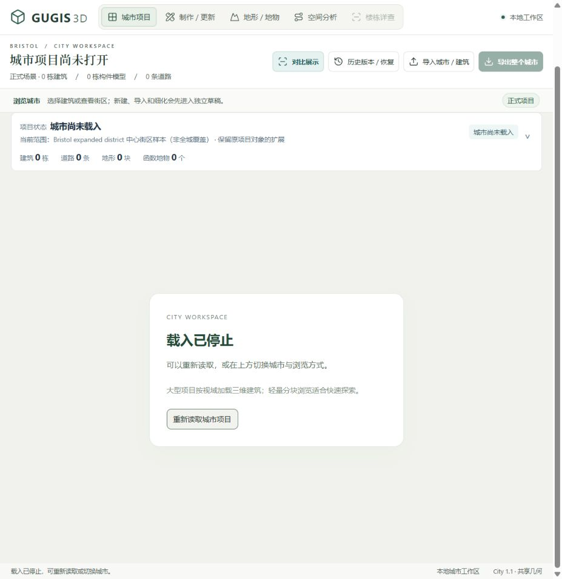
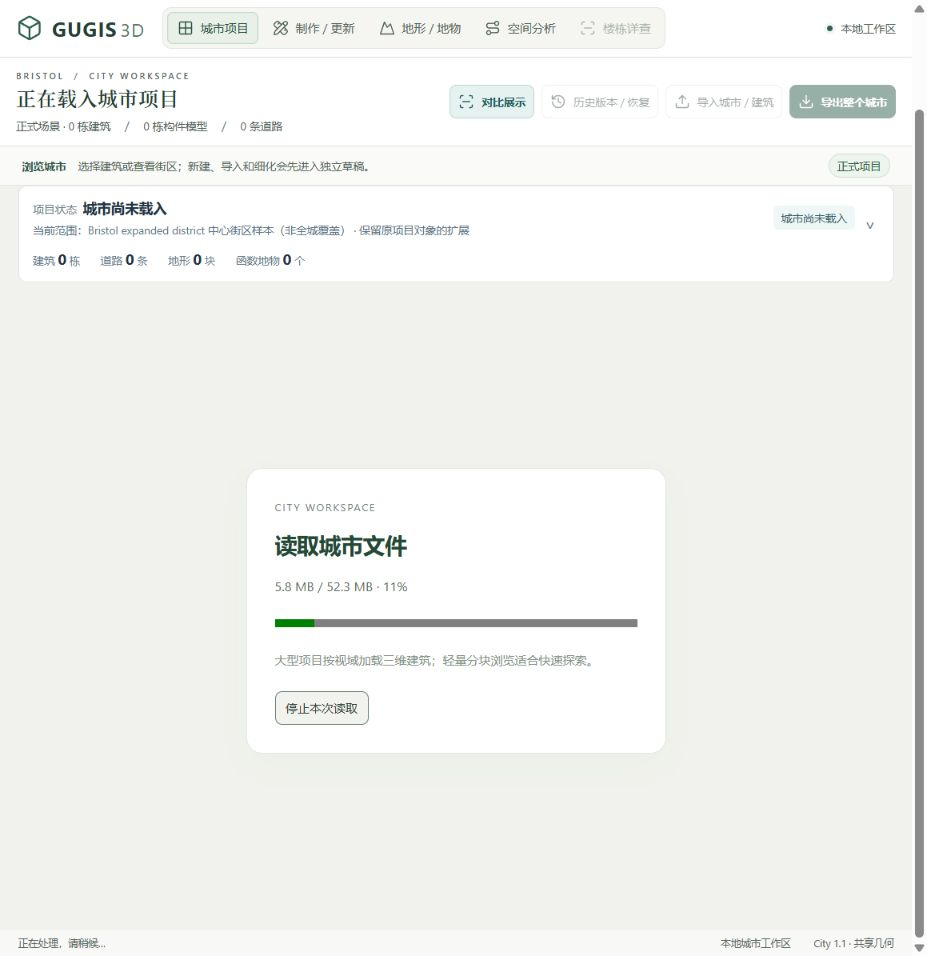
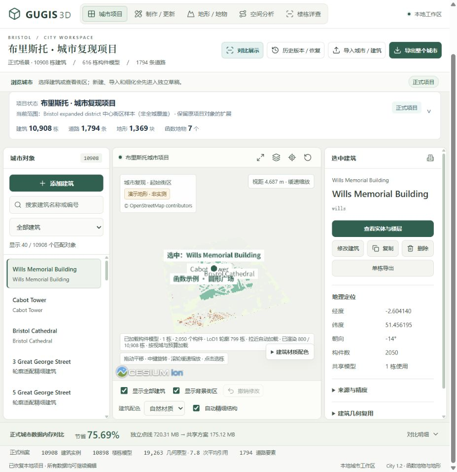

# 城市载入与重试升级（2026-10-06）

大型项目进入工作区后，现在能区分连接服务、接收文件、解析数据和整理共享几何。接收阶段显示实际读取字节；只有服务提供有效、未压缩的 Content-Length 时显示百分比，否则使用不确定进度，不估造时间或完成比例。

同一个城市 API 绑定的正式项目和草稿分别合并尚未完成的重复请求，避免 React 开发模式重复拉取大文件。一个读者退出不会取消仍有读者使用的请求；所有读者退出才中止网络读取。成功或失败后均清除任务，下一次重新载入会重新请求服务，城市切换使用不同绑定。写操作没有合并、自动重试或重放。

点击“停止本次读取”后可以选择“重新读取城市项目”，或切换城市与浏览方式。浏览器的 JSON 解析和共享几何解码仍有同步阶段，正在执行的同步工作不能立刻抢占；取消信号会在后续边界阻止结果进入工作区。没有声称浏览器内存或整个载入时间降低了多少。

## 实际浏览器核验

布里斯托正式文件接收总量显示 52.3 MB。停止后显示“载入已停止”，页面标题“城市项目尚未打开”，继续制作和导出需先载入并核验正式修订。

点击重新读取，实际显示已接收字节和百分比，而非模拟进度。

重试最终恢复 10,908 栋建筑、1,794 条道路；正式修订保持 bae9c53417005627baca1cf50890d2d5473b0303c2b220830d05d18307c68a1b，浏览器没有捕获渲染报错。

## 验证

读取 API、共享任务、分块 UTF-8、缺少长度/压缩响应、畸形内容、取消隔离、失败重试、跨城隔离和不重放写入共 19 项测试通过；TypeScript 和生产构建通过。四个正式城市、43 个历史快照、十三份原始 DTM 与预览的保全检查通过。当前截图来自实际本地内置浏览器，不作为 Edge 或其他设备上的性能结果。
