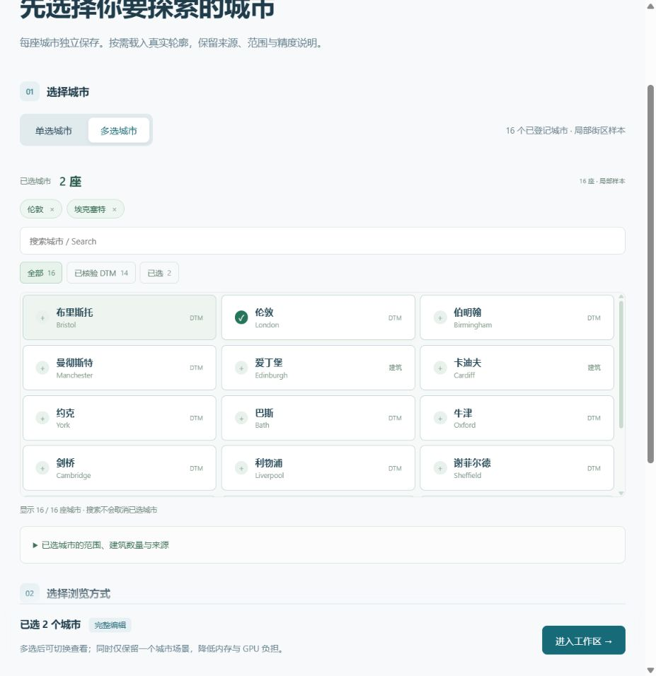
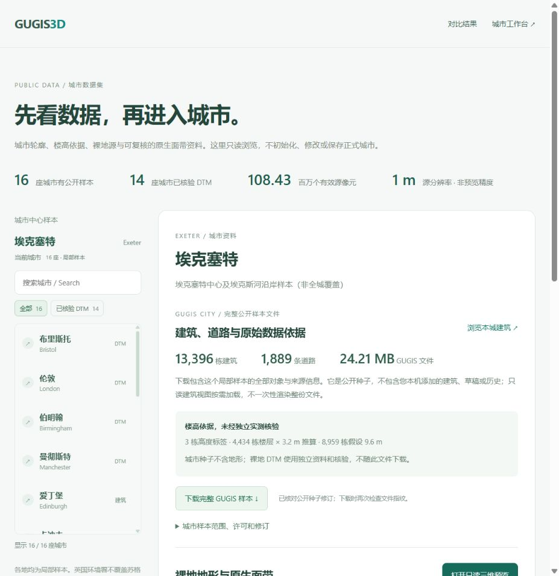

# 紧凑城市选择

2026-10-06：首页和 `/datasets` 共用可搜索的紧凑选择器。16 座城市不再逐城展开完整大卡片；桌面列表限定高度并内部滚动，手机采用两列、约 220 px 高度。

- 中文、英文、大小写及全角英文搜索；无结果提供重置。
- “全部”和“已核验 DTM”筛选；标签按当前十四城公开 DTM 目录计算，不将苏格兰和威尔士标为有环境署数据。
- 当前城市保持在列表外；多选城市以可取消的小标签保留，增加“已选”筛选，搜索不会改变工作区选择。
- 建筑数量、覆盖范围、来源与已知高度问题仍可展开查看，不删除质量说明。
- 首页增加对比结果与公开资料的直接入口；进入城市仍需明确点击，不因搜索加载城市模型。

实际浏览器验证英文搜索、切换伦敦、返回 Exeter、筛选空结果时保留两座已选城市。390 px 页面没有横向溢出，列表限高；原三维预览在城市切换后关闭。城市目录与源资料读取规则不变，未自动写入正式城市。
