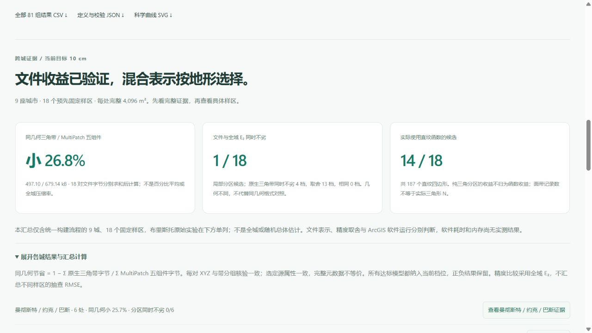

# 跨城证据汇总：先看结果，再核对样区

## 最新九城结果

2026-10-05 增加诺丁汉两个固定样区；统一流程现在覆盖九城、18 个样区。各档完整积分面积、字节求和及精度判断口径保持相同，布里斯托原始实验单列。旧八城记录保留下方，不覆盖旧数值。

| 目标 | 18 个三角文件 / B | 18 套 MultiPatch 五组件 / B | 总字节节省 | 分区同时不劣 | 三角同时不劣 | 取舍 | 含直纹候选 / 四边形 |
|---|---:|---:|---:|---:|---:|---:|---:|
| 10 cm | 497,101 | 679,140 | 26.804% | 1 | 4 | 13 | 14 / 187 |
| 25 cm | 185,540 | 258,260 | 28.158% | 1 | 11 | 6 | 4 / 9 |
| 50 cm | 86,817 | 122,276 | 28.999% | 1 | 9 | 8 | 4 / 5 |

页面计数来自当前发布数据，不再写死八城、16 样区。诺丁汉中心 25 cm 提供一个文件与 E₂ 同时改善的候选，但没有直纹四边形，不能归为函数收益；北侧不利结果同样纳入。[完整诺丁汉证据](nottingham_terrain_benchmark.md)。不是全城估计或 ArcGIS 软件性能结论。

实际浏览器在诺丁汉工作区核验 10 cm 汇总 26.8%、1/18、14/18；从各城汇总按钮可进入诺丁汉固定样区，目标与工作区保留，旧样区清除。730 项前端检查、52 项研究流程检查和生产构建通过；对比页零画布、无警告/错误。

## 首次八城发布记录

[打开真实地形汇总](http://127.0.0.1:5173/compare#real-terrain-results)。2026-10-05，网站将统一流程的八城、16 个预先固定样区汇总，覆盖曼彻斯特、约克、巴斯、牛津、剑桥、利物浦、谢菲尔德、利兹。布里斯托原始两处实验在下方单列，不混入本汇总。全部为局部实验，不估计全城或随机总体性能。

## 结果分成三项

1. **同几何文件收益**：Σ 原生三角带 JSON 字节 / Σ 对应 MultiPatch 五组件字节。逐对 XYZ、带分组及选定来源属性一致；完整元数据不等价。不是百分比平均、ZIP 压缩率、内存或软件速度结果。
2. **混合方法的适用范围**：以文件字节与全域 E₂ 两项指标判别各档同时不劣、相同或取舍。两类模型几何不同，不以该判别替代同几何格式对照，也不汇总抽查 RMSE。
3. **实际直纹函数使用**：单列使用直纹面的样区档数与实际四边形数，纯三角分区变化不归因于函数。

| 共同最大参考界目标 | 16 个三角文件 / B | 16 套 MultiPatch 五组件 / B | 总字节节省 | 分区同时不劣 | 三角同时不劣 | 取舍 | 含直纹候选 / 实际四边形 |
|---|---:|---:|---:|---:|---:|---:|---:|
| 10 cm | 460,565 | 627,768 | 26.635% | 1 | 4 | 11 | 12 / 180 |
| 25 cm | 173,713 | 241,352 | 28.025% | 0 | 10 | 6 | 4 / 9 |
| 50 cm | 80,551 | 113,032 | 28.736% | 1 | 7 | 8 | 3 / 4 |

各档均包含全部 16 对达标模型，每处完整积分域为 4,096 m²；没有相同档。八城之内既有正向也有不利结果；25 cm 档分区没有同时改善体积与 E₂ 的实例，页面明确显示 0/16，不仅挑选收益。数值来自固定来源与绑定实验，不是 ArcGIS Pro 软件实测。

## 操作与核验

共同误差目标与下方样区控件同步。展开「各城结果与汇总计算」查看计算公式及各城总量，点击城市证据按钮选择该组固定样区；保留工作区城市和共同目标，清除另一组旧样区。样区是独立研究结果，不自动切换或初始化正式城市。

实际浏览器核验：利兹工作区从 25 cm 切至 10 cm，汇总从 28.0%、0/16、4/16 更新为 26.6%、1/16、12/16；点击谢菲尔德证据后研究样区为 sheffield-centre、目标为 10 cm，工作区仍为利兹。全程 0 画布，不创建正式城市。截图为实际 10 cm 档，不是示意图。

汇总计算拒绝重复样区、不完整候选、未达标模型、非完整域、未验证同几何或缺失／成本不一致的五组件，避免无效数据进入标题。单元核验独立计算每档全部组件总字节，并覆盖不等权文件的比率，防止把节省率平均冒充总量节省。714 项前端检查及生产构建通过；原始来源、模型、核验回执和绑定算法没有变化。ArcGIS 软件耗时、FGDB 与内存仍待取得。
