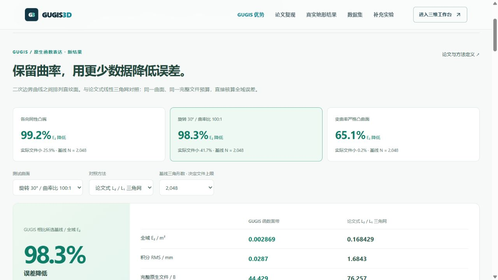

# GUGIS 函数型直纹面带：与论文式三角网的直接对照

2026-10-06。本轮把 GUGIS 自身的函数表达收益放到对比页首位。入口：`http://127.0.0.1:5173/compare#gugis-function-results`。原有论文方法复现和真实 DTM 结果继续单列，避免混淆。

## 可以直接展示的结果

固定 100 × 100 m 曲面，将论文式 L₂ 选区 / L₁ 选边线性三角网的完整原生文件作为预算上限。GUGIS 从固定搜索规则产生的二次边界直纹候选中，选择预算内最低全域 E₂ 的文件。

| 测试曲面 | 论文式 P₁ 文件 / B | GUGIS 文件 / B | 论文式 E₂ / m² | GUGIS E₂ / m² | E₂ 降低 | 实际文件减少 |
|---|---:|---:|---:|---:|---:|---:|
| 各向同性凸碗 | 57,619 | 42,711 | 0.682818 | 0.005572 | 99.2% | 25.9% |
| 旋转 30°、曲率比 100:1 | 76,257 | 44,429 | 0.168429 | 0.002869 | 98.3% | 41.7% |
| 变曲率严格凸曲面 | 71,965 | 71,789 | 0.344460 | 0.120217 | 65.1% | 0.2% |

此表基线均为 **2,048 个实际三角形**。GUGIS 前两行各 256 段二次直纹面、771 个控制点；第三行为 512 段、1,089 个控制点。不能把这些面片数当成三角形 N。

全部三个曲面、九档论文式预算中，**24 / 27 组 E₂ 更低，3 组更高**。各向异性 N=8 时误差增加 15.3%；变曲率 N=16、32 时分别增加 11.3%、32.5%。页面、CSV、下载模型保留这些结果。另提供最长边贪心和均匀最长边基线，共 81 组完整配对。

适合对外表达的结论：**在这些固定曲面和所列文件预算下，GUGIS 保留二次边界曲率，取得比论文式线性插值更低的全域误差；在 2,048 三角形基线预算下，三个案例实际文件也更小。**

## 函数表达和公平口径

`R(u,v) = (1-v) B₀(u) + v B₁(u)`，其中两条边界 B₀、B₁ 均为二次 Bézier 曲线。这是 P₂×P₁ 函数空间，论文式基线为 P₁ 逐片线性插值。每条边界用三个高程插值点拟合三个 Bézier 控制点；中间控制点高度通常不等于源曲面高度。

两种模型使用相同解析源、局部米坐标、完整 JSON 包装。双方均共享 XYZ 点，三角基线还使用三角带压缩连接关系。文件统计实际 UTF-8 字节，不是点数估算，不是 GPU / 浏览器内存，也不是 Shapefile 对照。

GUGIS 搜索两个边界方向，按单位新增文件字节的平方误差收益选择全局网格加密方向。当前三个曲面分别评估 54、54、57 个候选，包括临时试探；分别保留 18、18、19 个路径模型。所有已保留候选参与预算选择，候选全集及负面结果可下载。**不保证有限候选之外的全局最优。**

完整搜索时间与基线单档构建时间分别记录，工作量不同，不作拟合速度胜负结论。所选模型的拟合点数不包含试探模型、误差评估和求积点，不能当成全部采样成本。

源曲面和基线来自既有冻结实验；论文式三角网保留非相容二分，不额外补齐悬挂节点。边界处首个命中三角面的高程可能与别的相邻面不同，原生核验记录显式保存这一差值。GUGIS 使用 C⁰ 连续矩形网格，导数可在边界跳变。全域积分不以边界的有限查询值替代。

研究基础：[Mirebeau & Cohen, Greedy bisection generates optimally adapted triangulations](https://arxiv.org/abs/1101.1452)。本轮改变了近似函数阶数，结果不构成对该论文渐近最优定理的反证。更高阶三角控制已在[独立补充实验](terrain_order_control.md)中发布；独立真实地形精度和 ArcGIS 软件计时仍应另测。新模型是研究协议，尚未替换正式城市生产档案。

## 数值、实现与演示

E₂ = √∫(f-f̂)² dA，覆盖完整 10,000 m²；积分 RMS = E₂ / 100。保存后的函数模型使用 5×5 Gauss 求积，平方残差次数不超过八；测试用独立 9×9 求积与系数展开复核全部 55 个二次面带模型。保存后的三角模型用 7×7 Duffy-Gauss 求积独立核对旧报告。

二次面带的最大参考界来自 Bernstein 系数包络，采用 Float64 并加入舍入余量；这不是有向区间算术的严格认证，也不是把有限采样最大值写成连续 E∞。

网站使用原生 TypeScript 查询内核，对全部 **136 份模型、557,056 个独立内点**检查覆盖和高程，另外检查源插值点。高程和解析导数由函数直接计算。展示折线仅用于 SVG 显示，不参与积分误差测量。

演示顺序：

1. 进入「GUGIS 优势」，查看默认各向异性案例的 98.3% / 41.7% 及完整字节、E₂、RMS、控制点。
2. 切换三个曲面和三类基线；选择 N=8 或变曲率 N=32，确认不占优结果明确显示。
3. 点击「打开原生模型与函数查询」，同时看三角网与二次边界／母线；拖动 X、Y 滑条，比较解析参考高程、两模型高程差及导数。键盘 Home / End / 方向键也可操作滑条。
4. 展开九档结果查看完整科学曲线与表格；下载当前原生模型、全部 CSV 或当前曲面完整 ZIP，按 SHA-256 核验。

关闭演示会取消未完成读取并释放模型。初始页面不加载模型、不创建 WebGL 画布；展示使用 SVG，避免重新增加 Edge 的 GPU 负担。模型读取限制实际字节和路径，先校验 SHA-256 再解析。

## 证据与复现

公开证据位于 `frontend/public/research/curved-ruled-v1/`，摘要为 `shared/curved-ruled-comparison-v1.json`。包含三个完整曲面 ZIP、81 个基线文件、55 个函数候选、81 对 CSV、科学 PNG / SVG、原生查询核验及脚本绑定。研究记录和发布摘要是不同对象，各自哈希明确记录。

重新计算请使用全新输出目录：

```powershell
.venv/Scripts/python.exe data-pipeline/curved_ruled_benchmark.py --output .local/research/curved-ruled-recompute
node frontend/scripts/audit-curved-ruled-benchmark.mjs .local/research/curved-ruled-recompute
.venv/Scripts/python.exe -m unittest discover -s data-pipeline/tests -p test_curved_ruled_publication.py -v
```

发布器 `publish_curved_ruled_benchmark.py` 拒绝覆盖既有版本。重新研究应采用新发布版本；既有论文指标、城市来源链、正式项目与历史档案不因本轮改变。

## 本轮验收

743 项前端测试、55 项研究流程检查及生产构建通过；最终证据重新生成后，15 项相关交互检查和三项新研究检查再次通过。后端实现没有改动。

真实浏览器验收覆盖：三类曲面、预算切换、不利结果、原生函数高程／导数刷新、演示关闭、完整九档表，以及 CSV、原生 JSON 和完整 ZIP 的真实下载。下载后逐字节／SHA-256 核验与发布档案一致，ZIP 全部成员一致。正式城市和 43 份既有历史文件保持不变。


