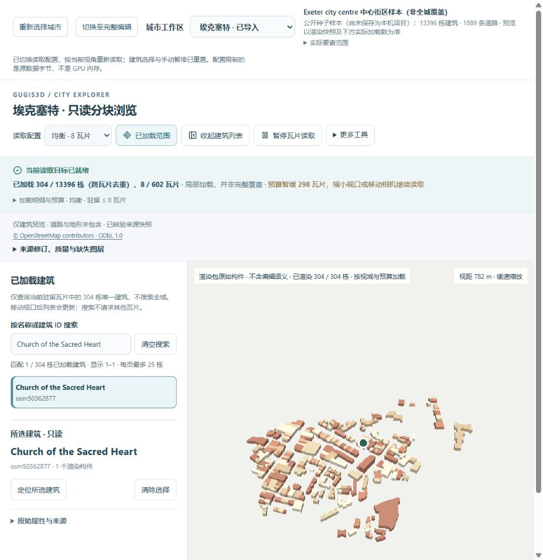
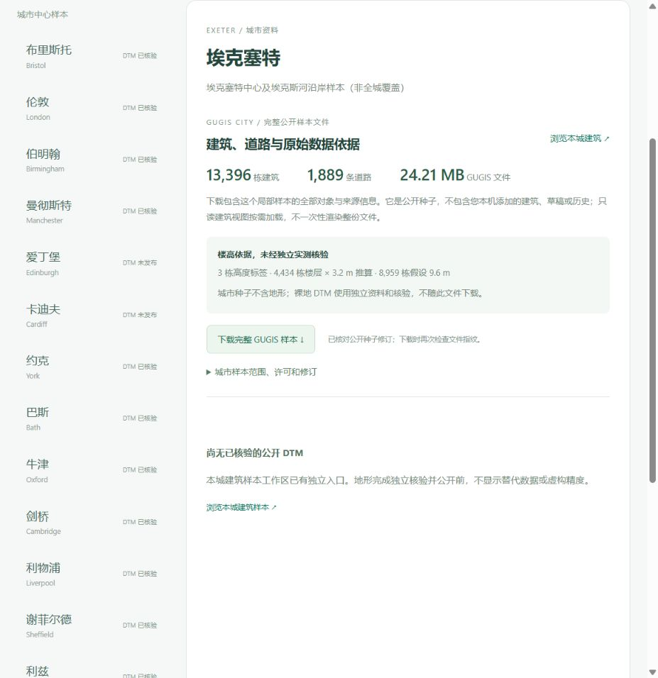

# 埃克塞特真实中心街区与有界浏览

[只读浏览建筑](http://127.0.0.1:5173/?city=exeter&cities=exeter&view_mode=tiles&tile_profile=economy) · [来源、楼高与完整下载](http://127.0.0.1:5173/datasets?dataset=exeter)

2026-10-06 增加第十六个独立工作区，含 **13,396 个建筑轮廓对象、1,889 条道路**。十六城公开种子合计 **113,115 个建筑对象**，这是转换模型数，不是独立实地普查结果。全部既有十五城记录和种子字节保持一致。

## 实际范围与建模依据

查询窗口 WGS84 `[-3.552,50.707,-3.510,50.736]`，实际完整建筑及道路的联合范围为 `[-3.5603861,50.705747,-3.5055989,50.7420561]`。跨界 way 保留完整几何，没有截断为查询框；窗口包括中心和埃克斯河沿岸，不表示全城或行政边界。市议会的[历史环境记录](https://azure.exeter.gov.uk/planning-services/heritage/historic-environment-record/)用于城市背景，本窗口不是官方保护区边界。

原源包含 13,400 个建筑 ways。4 个无法可靠转换的对象明确拒绝：`28230540`、`84837821` 退化；`224418232` 楼层标签畸形；`1286556146` 带当前无法支持的悬空竖向属性，不自动落地。拒绝原因保留在 `backend/data/cities/exeter-import.json`。道路原源 1,900 个 ways，11 个 `area=yes` 不作为道路中心线转换。

**3 个高度标签、4,434 个楼层 × 3.2 m 推算、8,959 个假设 9.6 m**；标签也未独立实测核验。源对象含 The Guildhall、The Custom House、Church of the Sacred Heart 等，当前为真实轮廓的 LoD1 体量，没有精细立面或室内复原，也未取得多边形 relations。道路宽度是显示假设。

公开源删除 209 个无关联系方式和自由文本标签，保留 IDs、几何和建模标签。公开源 **7,207,391 B**，SHA-256 `14ed299b48d6ea1d9e2ddc345fec4ddf01a2622ccc109f18d008f13314caafe0`；原始下载本机留存，SHA-256 `5705712305548bf47878617937d1260de2deaf75437b60698245a63321569698`。取得时间 `2026-10-06T10:33:12.648127+00:00`；© OpenStreetMap contributors，ODbL 1.0。

## 原生数据与分块结果

完整 GUGIS 种子 **24,210,432 B**，SHA-256 `d236ddec7ba795e6b92bef41f97b0de60d5b9ee9ea8dd1b080a95841e7aa18a8`。从公开源重新转换后的全部种子字节、遗漏对象、楼高依据均一致。

125 m 分块共 **602 个**，16,521 个跨块引用对应 13,396 个唯一建筑；瓦片合计 **16,358,617 B**，最大单片 **141,141 B**，清单 **331,521 B**。每块摘要、计数、跨块重复内容和实际相机夹具均经核验，审计见 `shared/exeter-render-audit-v1.json`。这些是源字节，不能作为 GPU 内存或帧率测量。

真实浏览器初始低资源加载 2 块、72 栋；均衡加载 8 块、304 栋，驻留源字节约 0.34 MiB。检索 Church of the Sacred Heart `osm50362877` 后，选择仅显示详情，镜头参数保持一致；未加载的 Guildhall 明确提示未搜索区域。仅此建筑渲染包没有道路和地形图层，完整城市种子保留道路，独立 DTM 另行核验发布。

真实浏览器下载的完整种子与服务器文件逐字节一致。只读预览和下载未创建 `.local/cities/exeter`，没有替换正式城市、草稿或历史。原有 4 个正式城市项目、43 份历史和 13 份已公开地形仍与原指纹一致。

## 可复核流程

新增城市流程将网络取得、离线转换、完整校验及公开目录发布分开：`acquire_additional_city_samples.py` → `stage_additional_city_sample.py` → `publish_additional_city_sample.py` → `build_seed_summaries.py` → `build_render_tiles.py`。发布前核对全部旧种子的实际字节，拒绝覆盖已有工作区和数据文件；转换不修改本机正式城市。

前端完整 880 项测试、类型检查和生产构建通过；后端整套 343 项检查完成，其中 326 项通过、17 项 Windows 不适用跳过，含城市独立源重建 4 项检查。线程诊断重跑的 GeoJSON 异步响应检查正常通过；主要耗时来自大型城市全源重建。浏览器无渲染错误，完整下载的文件指纹和字节一致。
