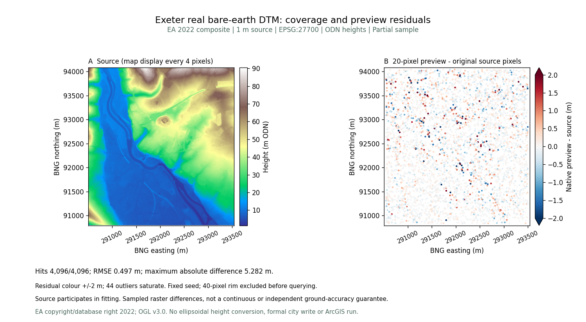
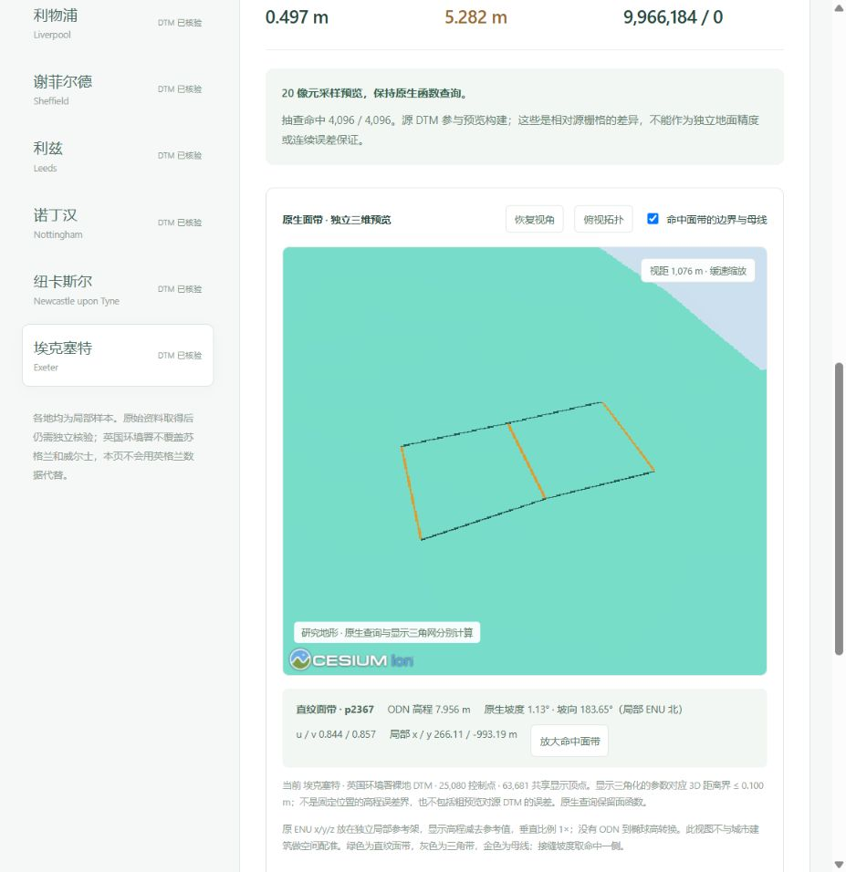

# 埃克塞特独立裸地地形与原生查询

[打开资料与三维预览](http://127.0.0.1:5173/datasets?dataset=exeter)。第十四份独立 EA DTM 加入公开数据集，十四城合计 **108,433,526 个有效原始像元**；所有旧十三城来源记录及文件字节保持完整。埃克塞特城市种子仍不包含此地形，公开候选没有替换任何正式城市项目。

## 来源、范围与无损保存

英国环境署 [2022 裸地复合 DTM 官方资料](https://www.data.gov.uk/dataset/01b3ee39-da3f-47b6-83da-dc98e73a461f/lidar-composite-dtm-2022-1m)说明源分辨率 1 m，高程按米及 ODN 保存。数据包含不同年份测量，不是实时现场测量；使用 OGL v3.0，保留 EA 署名。WCS 高程单位字段与官方正文存在冲突，资料页明确保留这一问题，没有声称 GeoTIFF 本身含可靠单位字段。

本次查询窗口 `[-3.552,50.707,-3.510,50.736]`，BNG 原始网格边界 `[290508,90794,293540,94081]`。**3,032 × 3,287 = 9,966,184 个有效像元**，无缺测；源高程 **1.412–90.427 m**。这是中心及河岸的局部裁剪，不是行政区覆盖。

原始 WCS 取得时间 `2026-10-06T10:44:08.458740+00:00`，44,040,947 B，SHA-256 `3bba332b7200fea83eeedcb2ac480773e7be4c2954e20b52c3aeafa1f4e9a345`。公开 GeoTIFF 仅做 DEFLATE 无损压缩，**22,343,399 B**，SHA-256 `8b0a2576758d79569a4bf88e1e815896e804cfc1b29c9ea550800fa145d586b0`。逐块比较全部原像元、CRS、变换、NoData、scale/offset 均一致；压缩不改变地形精度。

## 直纹面带与三角带

20 像元步长的粗预览含 **25,080 个控制点、9,020 个直纹面带记录、3,444 个三角带记录**，没有三角扇。粗预览 1,841,844 B，SHA-256 `571d4ee05a65dc1ae6cf44fef1ee015c1406bdd8da74283a0e5be7b4f3b550a2`。

原生查询直接计算面函数，而显示三角化有独立的参数对应 3D 距离界。本地浏览器显示 63,681 个共享显示顶点、≤0.100 m 的显示距离界；它不包括粗预览相对 1 m 源栅格的差异，也不是固定 XY 处的高程误差界。

固定随机种子 20261006 选取 4,096 个唯一、有效、避开 40 像元边缘的原源像元中心，全部查询命中：**RMSE 0.496643 m、MAE 0.270388 m、P95 1.003342 m、最大绝对差 5.281593 m**。全部控制点查询误差 ≤4.264×10⁻¹⁴ m。源像元参与构建，这些是相对源栅格的抽查结果，不是独立真实地面精度或连续全域保证。研究图保留 44 个超出 ±2 m 色带的离群点，原始 CSV 未截断误差。

## 实际点击演示

打开预览，点击“俯视拓扑”，再点击地形。实测三角带 `p6002` 显示 ODN 30.192 m、坡度 14.12°；直纹面带 `p2367` 显示 ODN 7.956 m、坡度 1.13°、u/v 0.844/0.857。点击“放大命中面带”显示两条边界和金色直线母线。金色线表示原生结构，显示三角网没有替代查询函数。

浏览器下载的实际 GeoTIFF 与公开栅格逐字节一致，无渲染错误，未创建埃克塞特正式项目。高程保留 ODN；独立局部参考架没有与城市建筑配准或进行 ODN 到椭球高转换。

## 复现与验收

`acquire_ea_exeter_dtm.py` → `prepare_ea_v9_city_terrain.py` → `audit-ea-v9-city-terrain.mjs` → `plot_ea_v9_terrain.py`。新版本保留 v8 的全部十三份记录及上溯指纹；前后端只读入口绑定 v9，错误、损坏文件或祖先清单变化会拒绝读取。

29 项后端地形与原有城市检查、4 项种子摘要检查、9 项前端数据集及源函数检查、类型检查与生产构建通过。先前城市整套 880 项前端和 343 项后端检查的记录见 [城市更新](exeter_city_sample.md)。此次新增来源未改变已有 20 样区论文/真实地形实验，不把新来源算进旧实验胜率。
