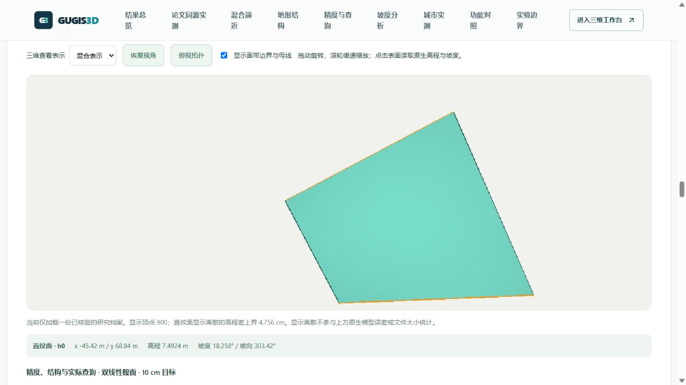
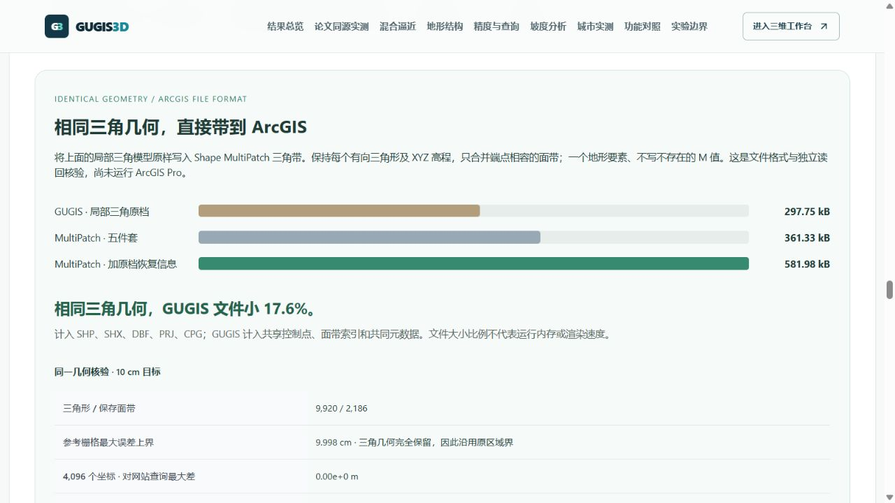
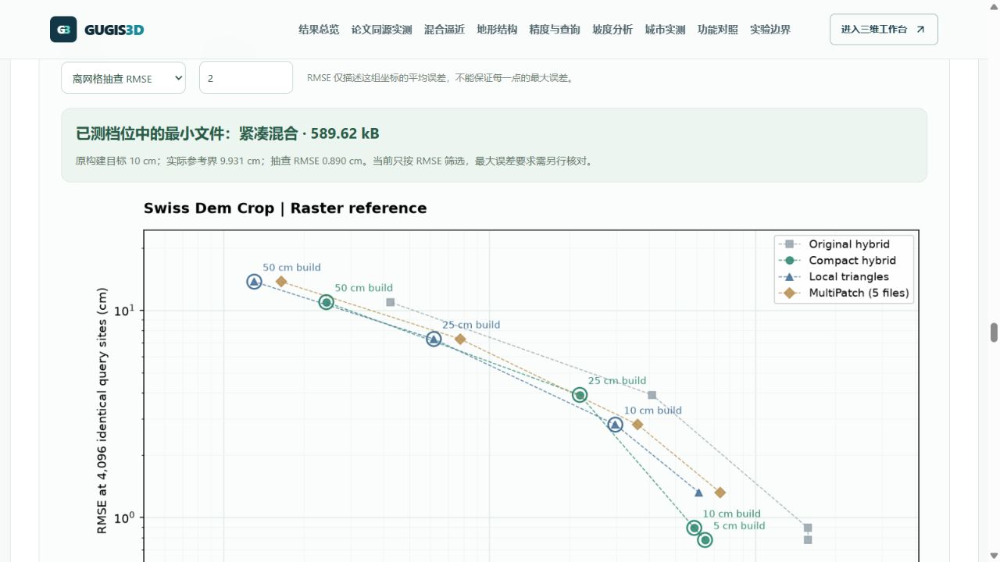
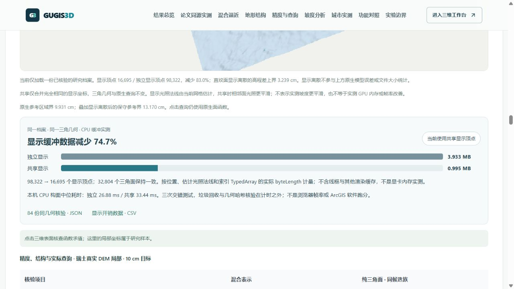

# 有限尺度直纹面与三角面混合逼近：原型与可复现实验

2026-10-04。在线入口：本地 `/compare#hybrid-terrain-lab`。研究数据独立于六座城市的正式数据与编辑历史。

本轮实现区域误差驱动的混合地形构建器、56 份原生 GUGIS 档案、离网格核验、实际拓扑图片与可旋转的三维视图。它提供研究证据，不宣称已经完成混合逼近的近最优理论，也不把同候选族实验写成 ArcGIS 软件优劣结论。

## 从研究问题到实现

研究目标是解释何时一段有限长度的直母线值得保留，何时应缩短、改变方向或切换三角面。单点 Hessian 的低曲率方向不够：方向可能沿区域旋转，边界曲线也有逼近成本。本原型在整个候选矩形内检查母线线性残差与两条边界曲线的插值残差，并比较两种母线方向以及两条三角形对角线。

表示仅使用直纹面带与三角带。母线连接两条边界曲线，在矩形投影内不交叉且覆盖该区域。所有矩形使用同一全局张量分区；邻接面共享控制点和完全相同的线性边界迹。因此可保证高程 C⁰ 连续，但不保证坡度 C¹ 连续。共享点、面片索引、边界数组及元数据都计入成本，不能将接缝成本视为免费。

三角面已经满足目标时优先使用编码较短的三角带；直纹面应通过减少所需细分与控制点赢得成本优势。未达标区域按最大误差选择，并尝试全局 x / y 切分，以误差改善相对于新增点数选择方向。该策略是相容张量网格启发式，尚不是局部各向异性三角形贪心二分。

## 有限长度与误差界

对投影为平行四边形的矩形单元，原生直纹面是四角高程的双线性插值。若区域内 `|f_xx| ≤ κx`、`|f_yy| ≤ κy`，两次一维线性插值给出充分误差界：

`||f - I_ruled f||∞ ≤ κx Lx² / 8 + κy Ly² / 8`。

第一项控制整段母线长度，第二项控制边界曲线沿宽度的插值。这个界是经典插值界，不作为本项目原创定理；它是充分条件，不能由“界没通过”推断“实际误差必然超标”。对于旋转方向的一般区域，当前轴向矩形族可能过于保守。

二次函数的三角形误差使用常 Hessian 精确计算：误差在三条边中点与位于三角形内部的驻点处取候选极值，逐个求最大绝对值。一般 C² 样本使用明确的区域 Hessian 上界。折脊使用其分段线性断点的精确误差，不套用 C² 条件。档案高程保留五位小数，构建目标另留舍入余量。

真实 DEM 没有获得连续导数界，只检查源网格误差和额外坐标的参考一致性。源采样残差不能替代连续误差证明，源网格已经用尽时会返回分辨率限制。

## 与论文的关系

[Cohen 与 Mirebeau，Greedy bisection generates optimally adapted triangulations](https://arxiv.org/abs/1101.1452)研究误差驱动的三角形贪心二分，并在明确的严格凸 / 凹 C² 条件下证明渐近适应性与收敛结论。其剖分不必为相容连续网格，不能直接借用其成本或定理来证明本项目的混合方法。鞍面、折脊和真实 DEM 不自动满足这些理论条件。

本轮借鉴“由逼近误差推动细分”的思路，增加有限母线与边界的共同检查，以及混合表示的实际文件成本。下一步理论与算法任务包括：局部相容各向异性二分对照、旋转母线与多边形区域、接缝成本模型、可识别函数类及混合成本近最优证明。

后续本日已补充下文的局部相容二分工程对照。它仍不等同于论文算法的完整复现或定理证明；旋转混合面片、成本理论和真实 DEM 连续界仍待完成。

## 同误差结果

每类地形包含 5 / 10 / 25 / 50 cm 四档目标、混合 / 纯三角两种表示，共 56 个实际模型。两种方式使用相同源数据、字段与全局相容候选族。表中为 10 cm 目标的完整、未压缩原生 JSON 成本，不是内存或 GPU 节省。

| 地形 | 混合 / 三角控制点 | 混合文件相对变化 | 结论 |
|---|---:|---:|---|
| 陡坡平面 | 4 / 4 | 0% | 坡度大不等于需要细分 |
| 双线性鞍面 | 4 / 585 | 减少 98.0% | 一整片直纹面可表达鞍面 |
| 长母线与弯曲边界 | 66 / 585 | 减少 90.8% | 边界细分成本已计入 |
| 严格凸碗形 | 1,089 / 1,089 | 0% | 本候选族没有优势 |
| 方向变化的四次曲面 | 1,485 / 2,401 | 减少 39.1% | 同时使用 396 个直纹面片和 1,012 个三角面片 |
| 非光滑折脊 | 6 / 6 | 0% | 显式分区后两侧均为平面 |
| 瑞士真实 DEM 局部 | 16,641 / 16,641 | 不比较 | 源网格达标，但离网格最大误差 10.131 cm 超过本档目标 |

28 组配对中有 25 组通过构建目标与离网格抽查。四次曲面的 5 cm 三角对照受源分辨率 / 保守误差界限制，真实 DEM 的 5 / 10 cm 档未通过离网格核验；三组均不输出节省结论。真实 DEM 的 25 / 50 cm 档可比较，但本候选族没有成本优势。

这个对照不是最佳任意三角网，不能宣称已击败论文算法、ArcGIS 或所有三角表示。特别是对允许旋转与局部细分的三角网，必须另做等误差实验。


## 数据与核验口径

解析样本范围为 `[-100,100]² m`、65 × 65 点，明确标为数学示例。真实源来自 [ImplicitTerrain 作者公开示例](https://fengyee.github.io/implicit-terrain/)，版本 `ef5f180f0ec3582ddba4e71a1f0faa3dced2a40c` 的 `implicitterrain_demo/2494_1141.tif`。原文件 SHA-256：`a7d90ba9b42712624d82cdfb3b7beae2ef7a2493f88d16846dea82fd8d1bc30d`。采用从列 / 行 936 开始的 129 × 129 源窗口，像元间距 0.5 m，覆盖 64 × 64 m 控制点范围；局部坐标仅为研究偏移，不是假称英国城市的真实位置。数据署名 swissALTI3D / Federal Office of Topography swisstopo。

每类样本在相同 4,096 个随机连续坐标上查询两种模型，随机种子 20261007。解析样本参考为已知函数；DEM 参考为原裁剪栅格的双线性插值，因此是栅格一致性核验，并非独立实测或留出数据。网站原生 TypeScript 查询与独立 Python 档案读回互核，最大差约 `2.14e-14 m`。

结果同时记录 RMSE、MAE、P95、最大误差、构建与结构校验、索引构建、五次查询耗时和留存 V8 索引堆增量。CPU 时间会因机器与运行库改变；留存堆是强制 GC 后高于已解析模型的增量，不包括完整浏览器或 GPU。

每个地形 ZIP 包含八份完整原生模型、完整诊断与细分记录、源数组、坐标夹具和核验说明。网页图片由这些模型实际生成，顶点 / 档案 SHA-256 与已发布结果对应。三维视图按需读取一份档案，先检查长度与 SHA-256，再进入现有 Cesium 场景；关闭时释放视图，不保存到正式城市。

研究三维显示为 GPU 额外离散。对于四角高程交叉项 `d = z11-z10-z01+z00` 的平行四边形，均匀细分 `n×n` 后的显示高程差上界为 `|d|/(4n²)`。显示预算受限时明确提示；这不改变原生查询、控制点数量或上述文件成本。网站点击表面读取原生高程与坡度，而非显示三角网的近似值。



## 复现

在仓库根目录，先准备已核对版本的作者源数据目录，安装后端依赖和 Node 依赖。以下构建仅读取研究参考，输出至独立目录：

```powershell
.venv/Scripts/python.exe data-pipeline/build_hybrid_research.py --output .local/benchmark/hybrid-research-2026-10-04 --reference .local/references/implicit-terrain
node --expose-gc frontend/scripts/audit-hybrid-terrain.mjs .local/benchmark/hybrid-research-2026-10-04
.venv/Scripts/python.exe data-pipeline/publish_hybrid_research.py --input .local/benchmark/hybrid-research-2026-10-04
python data-pipeline/plot_hybrid_research.py --input .local/benchmark/hybrid-research-2026-10-04
```

最后一个绘图步骤另外需要 matplotlib、numpy。不执行作者 notebook，不随数据包分发作者模型权重或代码。ZIP 中结果保留来源、构建器与网站查询内核 SHA-256；压缩包大小不是模型成本基准。

## 更强格式基线的纠正

旧研究对照按面片分组的 MultiPatch 有较多记录开销。本轮增加单要素 XYZ 和相邻三角带合并，逐点、逐三角核对几何等价，使用 [Esri Shapefile 规范](https://www.esri.com/library/whitepapers/pdfs/shapefile.pdf)允许省略的空 M 区域。8 m 档合并后五组件为 0.758 MB，GUGIS JSON 为 1.059 MB，后者大 39.7%。网站直接展示这一代价，不能再把旧分组的节省率概括为方法优势。详细结果与恢复属性成本见 [格式实验](implicit_terrain_benchmark.md#更紧凑的-multipatch-基线)。

## 更强局部三角剖分：结果会反转

本日后续新增六类解析样本的局部相容三角剖分，四档目标与原混合模型配对，形成另 48 份真实保存档案；24 组全部通过构建误差界和 4,096 个离网格抽查。原有 56 份数据与其校验值保留。

每次取连续最大误差界最差的三角形，按 L¹ 插值误差决策切边。凸碗使用论文 Lemma 2.7 的精确减少量 `|T|/3 × ((f(a)+f(b))/2-f((a+b)/2))`；其他解析函数使用七点正权三角求积，近似绝对 L¹ 误差。若其子三角形最大误差界改善不足 1%，改切最长边，防止在短边处停滞。最长边保护属于本项目工程选择，不能写成论文已证明的部分。界最大值用于是否达标，L¹ 求积值只用于选边，不能代替误差证书。

切开某条共享边时，相邻三角形同步二分，共用同一个中点，不产生悬挂点。代价含这些额外细分。保存前将可连接的有向三角形组装成长度不超过 256 个索引的三角带，保留逐三角形方向与覆盖。局部 XY 不作五位小数舍入，精确保留二分的二进制浮点坐标；高程保留五位小数并计入舍入余量。

为避免不同算法描述的字节数影响比较，另保存元数据完全相同的配对模型，包含所有 XYZ、共享索引、面带与来源基础字段。混合模型的几何逐项未变，算法出处、原档案哈希、完整细分历史放在共同实验回执中。已去除原算法专属的“构建方法”和“误差口径”字段，避免把全局细分的说明错误附在局部三角模型上；重新计量双方的实际字节。此处比较这些实际、未压缩配对 JSON，数值与上面的原档案成本略有不同；ZIP 与绘图不是模型成本。

| 10 cm 目标 | 混合 / 局部控制点 | 配对 JSON：混合 / 局部 | 混合相对局部的文件变化 |
|---|---:|---:|---:|
| 陡坡平面 | 4 / 4 | 0.75 / 0.75 kB | 一样大 |
| 双线性鞍面 | 4 / 545 | 0.77 / 30.07 kB | 减少 97.5% |
| 长母线与弯曲边界 | 66 / 817 | 4.22 / 43.25 kB | 减少 90.2% |
| 严格凸碗形 | 1,089 / 817 | 92.68 / 43.23 kB | 增加 114.4% |
| 方向变化的四次曲面 | 1,485 / 1,913 | 131.25 / 113.06 kB | 增加 16.1% |
| 非光滑折脊 | 6 / 7 | 0.85 / 0.87 kB | 减少 2.2% |

控制点更少不保证整个文件更小：面片分组和索引组织也影响成本。四次曲面在原同候选族对照中小 39.1%，面对局部三角网却大 16.1%；这直接说明对照方法会影响优势判断。当前凸碗和四次曲面的成本代价均在网页顶部提示，不能继续引用旧百分比概括方法优越性。

局部三角访问已知解析函数的二分中点，包括原 65 × 65 控制网之外的位置；原混合模型仍使用原网格候选点。这是刻意更强的函数访问和候选族，不是仅切换一个算法参数的消融实验，也不是最佳任意三角网。本段只包含解析样本；真实 DEM 的独立连续参考对照见下方。构建时间来自不同轮次，不是配对速度结论；查询仍使用相同 Node 原生内核，并与 Python 档案读回互核，最大差约 `2.14e-14 m`。

网站入口 `/compare#local-triangle-audit`。研究三维菜单增加“局部三角剖分 · 更强对照”，按长度 / SHA-256 核验后加载实际保存模型；关闭时释放。原主选择器驱动全部结果、图片与下载，避免另一个档位的结果被混入。

```powershell
.venv/Scripts/python.exe data-pipeline/build_local_triangle_research.py --output .local/benchmark/local-triangles-2026-10-04 --parent .local/benchmark/hybrid-research-2026-10-04
node --expose-gc frontend/scripts/audit-hybrid-terrain.mjs .local/benchmark/local-triangles-2026-10-04
.venv/Scripts/python.exe data-pipeline/publish_local_triangle_research.py --input .local/benchmark/local-triangles-2026-10-04
python data-pipeline/plot_local_triangle_research.py --input .local/benchmark/local-triangles-2026-10-04
```

输出单独的 `local-triangle-results.json` / CSV、六个 ZIP、24 张实际拓扑图与 48 份配对模型。构建器、解析函数来源、网站内核及原混合报告均由 SHA-256 串联核验。


## 同一曲面的编码组织优化

新增独立研究编码器：仅在边界端点完全相同时连接直纹面，把原有向三角形重编为三角带。共享坐标、每个双线性函数和有向三角形均保留；合并前后原单元 SHA-256 一致。每条直纹边界最多 128 点、三角带最多 256 索引。没有增加控制点、重采样或再次细分，因此这是编码组织优化，不是新的误差逼近结果。正式城市与原研究档案保持不变。

三份档案保持相同元数据，计入完整坐标及拓扑 JSON。局部三角对照本身已打包三角带；当前比较使用共同研究元数据，不等同于其他文件格式或 ArcGIS 软件跑分。以下为 10 cm 档，正值表示紧凑档案比局部三角档案小：

| 样本 | 原混合 kB | 紧凑混合 kB | 局部三角 kB | 紧凑文件减少 |
|---|---:|---:|---:|---:|
| 陡坡平面 | 0.75 | 0.75 | 0.75 | 0.0% |
| 双线性鞍面 | 0.77 | 0.77 | 30.07 | 97.5% |
| 长母线与弯曲边界 | 4.22 | 2.81 | 43.25 | 93.5% |
| 严格凸碗形 | 92.68 | 35.21 | 43.23 | 18.5% |
| 方向变化的四次曲面 | 131.25 | 56.93 | 113.06 | 49.6% |
| 非光滑折脊 | 0.85 | 0.85 | 0.87 | 2.2% |

凸碗的原混合模型实际上采用三角形，减少来自三角带组织而非直纹面理论；方向变化模型同时保留直纹面与三角形，其 10 cm 档从 1,408 条面片记录降至 169 条，1,485 个控制点保持不变，文件从 131,251 B 降至 56,929 B。原局部对照中混合文件增加 16.1% 的结果继续保留，不用本轮编码收益替代先前结论。

每份档案核验 4,096 个相同连续坐标及 4,225 个源网格位置；另在控制点和原边中点组成的有序集合中，以确定步长最多抽取 2,048 个边界位置。内部高程最大变化 1.43×10⁻¹⁴ m，随机内部坡度差低于 10⁻⁸°，边界高程保持到数值精度。

**面片编号与边界坡度首命中顺序不保留。** 本模型仅 C⁰ 相容，在非 C¹ 共享边处两侧坡度不同。重组改变了方向变化样本 10 cm 档中的 762 个边界抽查位置的单侧坡度，最大差 3.139°。网站公开这个代价；下载 ZIP 包含原版本，恢复时使用原档案。没有把边界坡度首命中称为完全一致，也不以文件比例冒充内存节省。

入口 `/compare#strip-compaction-audit`，三维表示菜单选择“紧凑混合 · 同一曲面”。六个 ZIP 包含原混合、紧凑混合、局部三角的四档档案和核验回执；CSV 共 72 条计量记录。这组仅包含解析样本，不代入英国当地地形；瑞士 DEM 的连续参考对照见下方。


```powershell
.venv/Scripts/python.exe data-pipeline/build_strip_compaction_research.py --output .local/benchmark/strip-compaction-2026-10-04 --parent .local/benchmark/local-triangles-2026-10-04
node --expose-gc frontend/scripts/audit-hybrid-terrain.mjs .local/benchmark/strip-compaction-2026-10-04
.venv/Scripts/python.exe data-pipeline/publish_strip_compaction_research.py --input .local/benchmark/strip-compaction-2026-10-04
```

## 真实 DEM 的连续参考栅格对照

此前仅检查源点及离网格抽查，不能约束区域内所有位置。本轮对同一个 64 × 64 m 瑞士 DEM 窗口、129 × 129 个源高程（0.5 m 间距），明确使用连续分片双线性插值作为参考。区域界针对该参考栅格，不能作为未测量实际地面的误差界；没有引入英国城市 DEM 或额外观测。

在每个源矩形与三角形的交集中，参考高度减三角平面可写为 A + Bx + Cy + Dxy；其非仿射 Hessian 不定，最大绝对值在交集多边形边界取得。检查三角形内部源顶点、与源格线的交点，以及边段二次残差的驻点。网格对齐的直纹面残差仍为双线性函数，在源像元角点取得最大绝对值。矩形回调使用相同推导的向量化实现，额外与通用三角形算法交叉核验。加入浮点保护和五位小数高程舍入量，不声称区间算术的机器证明。

将这个回调接入既有混合网格构建器，重新构建四档模型。局部对照采用独立的最长边策略：先准备邻面的更长边，再同步二分，避免直接切邻面任意边产生针状三角形。该参考栅格不是 C² 函数，本策略不使用论文的 L¹ 决策，也不借用其渐近最优证明。达到点数、步数、坐标或几何分辨率限制时返回相容的未完成网格，不报告成功。解析样本默认 L¹ 路径的几何保持原值，源码指纹及回执重新核验。

四档均通过连续参考区域界、16,641 个源网格位置和相同 4,096 个连续坐标的原生 / 独立读回核验。三份档案采用相同元数据，保存全部坐标和面带，紧凑版保留新混合曲面。**本块 DEM 上局部三角文件均更小**，下表公开所有不利结果：

| 目标 | 混合 / 局部控制点 | 紧凑 / 局部 kB | 混合 / 局部区域界 cm | 紧凑文件变化 |
|---|---:|---:|---:|---:|
| 5 cm | 16,641 / 10,281 | 647.24 / 614.70 | 4.999 / 4.999 | 增加 5.3% |
| 10 cm | 16,641 / 5,063 | 589.62 / 297.75 | 9.931 / 9.998 | 增加 98.0% |
| 25 cm | 4,488 / 1,097 | 218.76 / 61.81 | 24.427 / 24.993 | 增加 253.9% |
| 50 cm | 504 / 231 | 24.37 / 13.06 | 49.643 / 49.667 | 增加 86.6% |

10 cm 档混合留存 16,641 个控制点，而局部三角为 5,063 个。虽然后者源点和离网格 RMSE 更大，双方都满足同一个区域最大误差目标；全局细分的控制点代价不能隐藏。混合的低 RMSE 也不能被说成同 RMSE 条件下的成本优势，需另行建立精度—成本曲线。

重新核查旧采样混合档案，5 / 10 cm 的连续参考界约 12.958 cm，25 cm 档约 25.977 cm，均超过其目标；50 cm 档约 49.643 cm，仍满足目标。旧 56 份研究档案与原 SHA-256 保留，新模型使用 `raster-*` 文件名，不能将历史采样达标替换为连续达标。历史原始对照与新的参考区域对照在网页分开。

新紧凑版的内部与边界高度保持到数值精度；面片编号及边界处单侧坡度首命中顺序不保留，原编号版本在新下载包中。5 / 10 / 25 / 50 cm 的边界坡度首命中变化分别记录于完整 JSON；这不改变 C⁰ 高度连续。

入口 `/compare#raster-terrain-audit`，自动选定真实 DEM 样本。研究三维菜单可选择新参考混合、局部三角、紧凑混合及历史采样表示。显示三角网的离散误差与原生参数求值分开；10 cm 紧凑模型的原生区域界 9.931 cm，当前显示离散约 3.239 cm，合成保守显示参考界约 13.170 cm，明确显示。点击查询仍直接求原生函数；不能用显示网格代替原生误差统计。


下载包含四档 × 三种原生档案、参考 NPZ、4,096 点查询文件、最多 2,048 点的边界抽查坐标及完整回执，共 12 份模型。源窗口、原数据 SHA-256 和 swisstopo 来源继续随包保留；不包含作者代码或权重。真实输入及解析函数对照均没有运行 ArcGIS Pro，也不是整个英国城市地形数据集。

```powershell
.venv/Scripts/python.exe data-pipeline/build_raster_triangle_research.py --output .local/benchmark/raster-triangles-2026-10-04 --parent .local/benchmark/hybrid-research-2026-10-04
node --expose-gc frontend/scripts/audit-hybrid-terrain.mjs .local/benchmark/raster-triangles-2026-10-04
.venv/Scripts/python.exe data-pipeline/publish_strip_compaction_research.py --input .local/benchmark/raster-triangles-2026-10-04
python data-pipeline/plot_raster_triangle_research.py --input .local/benchmark/raster-triangles-2026-10-04
```

本轮完整前端 534 项通过；后端 278 项检查中 261 项通过、17 项平台条件跳过；生产构建通过。实际浏览器核查三维加载、局部 / 紧凑原生点击查询、原生与显示误差提示、关闭释放，以及 5 cm 失败旧档案与 50 cm 达标旧档案的区分，未出现 Cesium 错误。

## 相同三角几何导出 MultiPatch

入口 `/compare#raster-multipatch-audit` 自动选定瑞士真实 DEM，按误差档位切换。四档局部三角模型的每个有向三角形原样导出为 Shape MultiPatch TriangleStrip。只合并首尾顶点对完全相同、长度为偶数且不歧义的面带，不添加桥接或退化三角形。所有部件放入一个地形要素；DBF 只保留地形编号，依据 Esri Table 16 去除不存在的可选 M。此基线不是低效的逐面要素写法，也不使用较旧格式作优势参照。

| 区域参考目标 | GUGIS 局部三角 JSON | MultiPatch 五件套 | 原档文件减少 | 加原档恢复信息总成本 | 紧凑混合相对五件套 |
| --- | ---: | ---: | ---: | ---: | ---: |
| 5 cm | 614,702 B | 739,106 B | 16.8% | 1,199,040 B | 小 12.4% |
| 10 cm | 297,752 B | 361,330 B | 17.6% | 581,978 B | 大 63.2% |
| 25 cm | 61,814 B | 77,722 B | 20.5% | 122,107 B | 大 181.5% |
| 50 cm | 13,057 B | 16,474 B | 20.7% | 25,830 B | 大 47.9% |

**原档与五件套列隔离的是相同三角几何的文件格式成本。** GUGIS 使用共享控制点及面带索引；MultiPatch 的部件各自保存顶点。五件套计入 `.shp/.shx/.dbf/.prj/.cpg`，GUGIS 完整 JSON 计入共有元数据。额外 `native-recovery.json` 保存原共享点编号、面带与元数据，能够逐字节恢复原档，其成本单独展示。ZIP 压缩大小、参考 NPZ 与测试回执不混入五件套成本。不能把此文件比例解释为运行内存或加载速度。

紧凑混合列仍是不同曲面在同一区域误差目标下的比较，不能把它与相同几何格式收益混称。尤其 10 cm 紧凑混合仍比 MultiPatch 三角基线大 63.2%，公开保留该不利结果。

从经 SHA-256 核验的真实 Swiss TIFF 读取地理变换，确认源窗口与参考 NPZ 逐值一致。局部坐标原点对应像元中心 `[2494500.25, 1141499.75]`，源坐标系为 EPSG:2056，加入平移再减去原点的所有顶点差为零。不能直接使用旧 2 km 窗口的整米原点；会错位 0.25 m。未转换为英国坐标，也没有推断新的高程基准。

四档保存文件的有向三角形多重集合哈希与源模型完全一致，因此沿用局部三角模型原连续参考区域界。独立 Python 从保存的 SHP 读取 XYZ，在 4,096 个相同坐标与真实网站 Node 查询值比较，在 16,641 个源网格位置与原几何解码比较；最大高程差均低于 `1e-8 m`。恢复侧车读回后原 GUGIS 字节完全一致。

下载每档包，将同名五件套一同放置，在 ArcGIS 三维场景添加 `terrain.shp`，缩放到瑞士源窗口。包含 `native.json`、`native-recovery.json`、`reference.npz`、`query-fixture.json`、成本及核验回执和数据来源说明。文件结构依据 [Esri Shapefile 技术规范](https://www.esri.com/library/whitepapers/pdfs/shapefile.pdf)，**尚未在 ArcGIS Pro 内实际运行加载、内存、帧率或分析计时**。

```powershell
.venv/Scripts/python.exe data-pipeline/export_raster_multipatch.py --input .local/benchmark/raster-triangles-2026-10-04 --source .local/references/implicit-terrain/implicitterrain_demo/2494_1141.tif --output .local/benchmark/raster-multipatch-2026-10-04
```

新增 2 项前端与 2 项后端检查；连同相关已有检查共 6 项前端、3 项后端通过，生产构建通过。真实浏览器验收了直接入口、展开四档及恢复成本、当前档包下载与哈希、切换目标，没有错误或警告。正式城市与原 43 份历史文件校验保持不变。



## 精度成本曲线：按要求选择表示

入口 `/compare#terrain-error-cost`，默认瑞士真实 DEM。七类地形沿用前述已保存模型和真实读回回执：六类解析地形各 4 档 × 3 种原生表示，瑞士 DEM 4 档 × 3 种原生表示及 4 个同几何 MultiPatch 五件套，共 **88 个表示成本测点**。每个样本使用自身同一组 4,096 个查询位置，不混合不同区域的误差。

切换“连续参考最大误差界”与“离网格抽查 RMSE”，输入允许误差（厘米），页面对每种表示搜索四档已测文件，显示满足阈值的最小完整成本。没有可行档位时明确显示未取得结果，不外推或虚构新模型。研究目标未达标的原记录仍以真实计算的参考界和 RMSE 参与曲线，不能仅依据原目标标签认定满足当前约束。

| 瑞士样本约束 | 当前最小已测表示 | 完整成本 | 实际最大参考界 | 4,096 点 RMSE |
| --- | --- | ---: | ---: | ---: |
| 最大参考误差界 ≤10 cm | 10 cm 局部三角 | 297,752 B | 9.998 cm | 2.806 cm |
| 抽查 RMSE ≤2 cm | 10 cm 紧凑混合 | 589,617 B | 9.931 cm | 0.890 cm |

这正说明评价指标会改变结论。按 RMSE 的 2 cm 要求，紧凑混合相对达标的 5 cm 局部三角（614,702 B、RMSE 1.320 cm）更小、抽查 RMSE 也更低；但最大参考界比该局部模型的 4.999 cm 更宽，**不是同最大误差条件的全面优势**。按 10 cm 最大参考界，局部三角更小，原 98.0% 的混合文件不利结果仍成立。

科学图以完整未压缩成本与所选误差作为两个对数轴，圈出已测点中不被其他点同时降低成本、误差的点。它只是有限档位的观测前沿，不是任意三角剖分或直纹面候选族的近最优证明。误差差不超过 `1e-10 m` 按数值平局处理，避免浮点噪声制造“更优”；阈值筛选仍严格要求记录值不大于预算。平面 / 折脊等近零 RMSE 只在绘图中使用明确下限，原数据与筛选值不改变；少量由目标元数据字符串造成的字节差不能当作逼近理论优势。

解析样本的混合界为原单元界加 `5e-6 m` 高程舍入量，局部界为原三角界加其舍入量。瑞士采用保存模型的连续参考核验界。解析局部候选族允许直接读取函数中点，而混合仍限制源控制网；瑞士双方均读取同一双线性参考栅格，无新增实际观测。MultiPatch 曲线采用五件套核心成本，附恢复侧车的额外成本继续在前一节公开。未执行 ArcGIS 软件计时。

所有图均由 Matplotlib 从冻结回执生成，提供 PNG（1500 × 825）和可编辑 SVG；共 7 类 × 2 指标 × 2 格式 = 28 份。前端按需载入曲线模块，避免把测点回执加入原混合研究主模块；不通过提高体积警告阈值掩盖新增负担。CSV 与 JSON 包含全部 88 个测点、源文件哈希、共同查询坐标哈希及前沿结果。

```powershell
.venv/Scripts/python.exe data-pipeline/build_terrain_tradeoff.py
# 绘图使用带 matplotlib 的研究环境，不需要运行作者软件。
.local/research-venv/Scripts/python.exe data-pipeline/plot_terrain_tradeoff.py
```

本轮新增 2 项前端交互 / 选择检查、3 项后端回执 / 数值平局 / 科学图检查。完整前端 538 项通过；后端 283 项检查中 266 项通过，17 项平台条件跳过；生产构建通过。浏览器核验了直接入口、两种约束不同推荐、无可行结果、恢复指标和 PNG 下载哈希，控制台无错误或警告；正式城市及原 43 份历史文件保持不变。



## 研究三维显示的精确顶点复用

2026-10-05 优化显示层，保留所有原生档案、控制点、查询内核与显示细分。仅在同一表面类型内合并数值完全一致的显示 XYZ，不舍入、不重采样、不删除三角面。相近坐标即使只差 `1e-12 m` 也不会被合并；几何仍由完整原始三角坐标核验。原 180,000 个展开显示顶点预算继续使用，没有靠复用放宽上限。

72 份解析研究 / 面带合并档案，加 12 份连续参考栅格档案，共 84 份模型；每份实际构建独立与共享的 Cesium Geometry，比较全部**有序、定向三角坐标 SHA-256**。全部几何、三角数、显示高程差界与预算状态一致。原生数据在构面前后不变，共享只发生在显示网格。

| 瑞士 10 cm 目标 | 独立显示顶点 | 共享显示顶点 | 独立缓冲字节 | 共享缓冲字节 | 缓冲减少 | CPU 构面中位耗时（独立 / 共享） |
| --- | ---: | ---: | ---: | ---: | ---: | ---: |
| 参考栅格证书混合 | 98,322 | 16,695 | 3,933,240 B | 994,668 B | 74.7% | 26.88 / 33.44 ms |
| 紧凑混合 | 98,322 | 16,695 | 3,933,240 B | 994,668 B | 74.7% | 26.83 / 35.88 ms |
| 局部三角 | 29,760 | 5,063 | 1,190,400 B | 301,308 B | 74.7% | 13.42 / 12.21 ms |

缓冲按真实 Cesium CPU 位置 Float64、估计光照法线 Float32 和索引 Uint32 的 `byteLength` 合计。它**不等于 GPU 内存、完整保留堆、峰值内存或帧率**，不计线框与其他 Cesium 缓存。CPU 计时为预热后交错顺序的三次中位数，垃圾回收及几何哈希核验在计时之外；混合模型有额外 CPU 组织代价，表格保留不利结果。没有 ArcGIS 软件计时。

共享顶点会让相邻面的估计光照法线更平滑，故光照不能理解为原生坡度分析；原生查询仍使用冻结面函数。在浏览器中切换“共享显示顶点”，同一点均得到 `h8776`、显示坐标 `(4.36, 2.03) m`、高程 `1291.1644 m`、坡度 `20.726°`、坡向 `289.06°`。这是界面显示精度的核验，不代替所有点的证明。实际显示误差界保持 3.239 cm，原生参考界加显示界仍为 13.170 cm。

三维研究视图下方增加独立 / 共享缓冲对照、CPU 代价、JSON / CSV 下载，以及瑞士 10 cm PNG / 可编辑 SVG 科学图。显示测量只在档案 SHA-256、地形与目标均匹配时展示，未知档案明确不使用其他模型的结果。

```powershell
# CPU 构面和 84 份同几何核验，不需要浏览器或 ArcGIS。
node --expose-gc frontend/scripts/measure-research-display.mjs
.local/research-venv/Scripts/python.exe data-pipeline/plot_research_display_reuse.py
```

测量脚本输出到独立 `.local/benchmark/display-reuse-2026-10-05`；共享报告及公开下载是经核验后的固定副本。原始档案、查询内核、构面脚本、父报告和科学图均绑定哈希。前端完整 560 项通过，生产构建通过；后端未改动，沿用本轮已通过的 290 项检查（17 项环境跳过）。浏览器已验证真实三维表面、共享切换、同点查询与 CSV 下载字节，控制台没有错误或警告。


