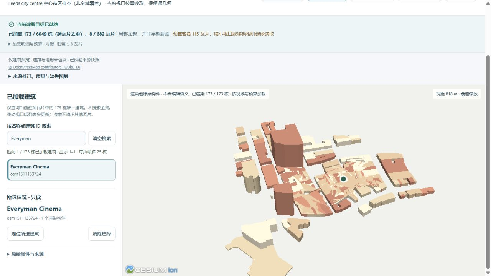
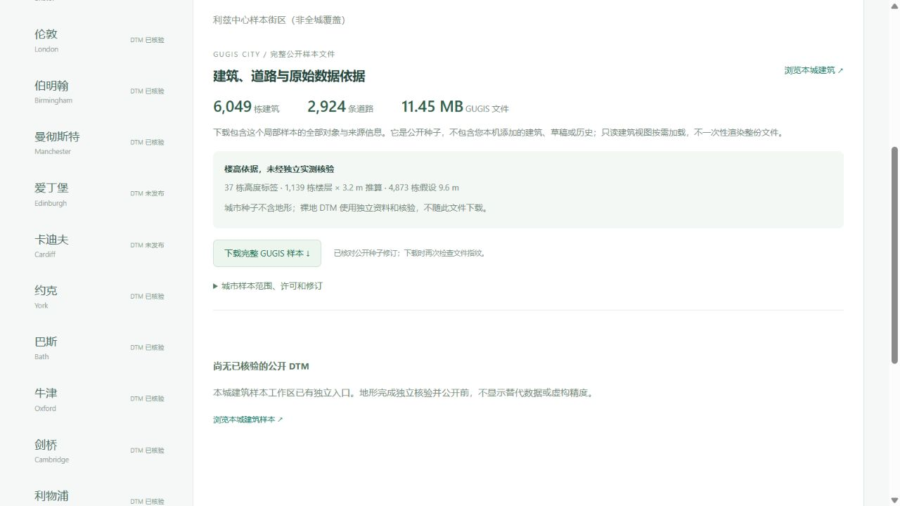

# 利兹中心街区：真实轮廓、公开文件与按需浏览

[浏览利兹建筑](http://127.0.0.1:5173/?city=leeds&cities=leeds&view_mode=tiles&tile_profile=economy) · [来源与完整 GUGIS 下载](http://127.0.0.1:5173/datasets?dataset=leeds)。新增 **6,049 个已转建筑轮廓对象、2,924 条道路**；十三城公开种子共 **79,025 个建筑对象**。这里的数量是转换后的 OSM ways，不是独立普查的实体建筑数。所有城市明确局部覆盖，不能称为全城复原。

## 来源、范围与高度依据

2026-10-05 独立采集 OSM 快照，窗口 `[-1.570,53.783,-1.521,53.811]`，关联原登记 `uk-eng-leeds`。完整跨界 ways 保留，实际建筑与道路合并范围 `[-1.5894071,53.7805565,-1.5089375,53.8164085]`。窗口由本项目独立划定；[市政中心街区资料](https://www.leeds.gov.uk/parking-roads-and-travel/road-improvement-schemes/city-centre)只提供背景，不是边界、建筑几何或测量精度的依据。

原始响应 **6,060,401 B**，SHA-256 `42150080e5f0aec30d6ec3b99acd062b8538345223c4495b57a0f0b7c43c8dd4`，本地保留。公开响应 **4,598,984 B**，SHA-256 `b342c80f227deacc3dddb9848d696fd24e8047d19d01d4a8f15c865c3a5eee69`；删除 591 个无关联系或自由文本标签，每个 ID、几何、保留标签与原件逐项一致。

6,077 个含 building 标签的源 ways 中，14 个明确 `building=no` 不进入建筑转换；其余 6,063 个中拒绝 14 个不支持对象，得到 6,049 个保存对象。异常轮廓、超范围楼高、建筑部件和架空起始层没有被默认简模掩盖，全部 ID 与实际理由在 `leeds-import.json`。2,950 个源道路中 26 个面积道路不进入线状模型；保留道路转换失败为零。

楼高来自 **37 个高度标签、1,139 个楼层 × 3.2 m 推算、4,873 个假设 9.6 m**，均未经独立实测核验。源仍含屋顶、在建与拆除等类型或状态标签；LoD1 体量不能证明现状、分层关系或建筑实体数量。未取得 multipolygon relations，不承诺庭院孔洞、叠置体量合并、屋顶形状、立面、内部或桥梁竖向高程。道路宽度是显示假设。

已保存 Leeds Town Hall `osm27779500`、Corn Exchange `osm28930190`、Leeds Civic Hall `osm61979197`、Leeds Cathedral `osm177863486` 和 Leeds Kirkgate Market (Indoor) `osm23150505` 的名称与轮廓，不能称为这些地标的精细建筑复原。城市种子不含地形，只读分块视图不包括道路与地形。

© OpenStreetMap contributors；源与派生数据库按 [ODbL 1.0](https://opendatacommons.org/licenses/odbl/1-0/) 分发，见[当前数据许可](../backend/data/cities/CURRENT_DATA_LICENSE.md)，与软件及独立 DTM 的许可分开。

## 完整文件、预算与实际操作

公开 GUGIS **11,446,925 B**，SHA-256 `ed6d14d0af02be6d35b18d16a97674d56a27563cf80b9cb49bcf111bb4710dc1`。完整重建所有几何、属性与元数据，字节与保存原件相同。下载包含整个局部样本，不是当前本机项目、草稿或历史。

125 m 分块共 **682 瓦片**，8,306 条跨格引用去重为 6,049 个建筑对象；瓦片合计 **9,128,908 B**，最大 **99,956 B**，清单 **374,340 B**。每个建筑的几何完整保留。低资源最多驻留 2 瓦片 / 2 MiB，均衡最多 8 瓦片 / 8 MiB；这是源数据预算，不是 GPU 内存或帧率测量。

桌面内置浏览器初次低资源加载 **91 个对象 / 2 瓦片**，均衡加载 **173 个对象 / 8 瓦片**。搜索 Everyman Cinema `osm1511133724`，选择详情前后六项镜头参数完全相同；再切至低资源仍保留这六项参数。上述数量属于实际视口，搜索仅查当前驻留数据，不假称全城检索。源中的叠置轮廓保留，当前显示不声称解决原始对象之间的遮挡或语义关系。

实际浏览器下载 `leeds-public-seed.gugis.json`，与发布原件逐字节一致；页面画布数 0，控制台无警告或错误。

## 已取得的独立裸地源

已独立取得 [EA 2022 LIDAR Composite DTM 1 m](https://www.data.gov.uk/dataset/01b3ee39-da3f-47b6-83da-dc98e73a461f/lidar-composite-dtm-2022-1m) WCS 裁片：BNG `[428412,431938,431660,435075]`，EPSG:27700、Float32 单带、1 m、scale 1 / offset 0。**3,248 × 3,137 = 10,188,976 个有效像元，0 缺测**；高程 **20.669–93.790 m ODN**。

原始 TIFF **51,381,035 B**，SHA-256 `e6cb731568b9eac05f8f999d9767658ff5117f7050b466bf3696cce976973d76`。这不是 Digimap 下载或新的现场测量。此城市发布阶段只保留原始来源，尚未发布原生地形；网站明确 DTM 未发布，不显示其他城市替代源或虚构精度。后续需要无损压缩、原生查询、完整源像元核验及误差记录。EA 数据的 OGL v3.0 / 2022 署名与 OSM 的 ODbL 分开。

## 验收与保护

704 项前端检查通过，325 项后端检查中 308 项通过、17 项 Windows 环境不适用跳过；生产构建通过。新增回归从公开 OSM 完整重建全部建筑、道路及元数据，检查实际拒绝的全部 14 个 ID、高度依据与建筑非对象标签。十三城、四种尺寸与两档预算的真实 Cesium 相机数学回归不冒称手机 GPU 实测；资料页地形不可用时不会请求别城模型。

旧十二城的源、种子、目录记录、十城 DTM、五版地形清单、所有认证研究包、绑定算法及 43 份原本地档案保持不变；三个正式城市指纹相同，没有初始化利兹正式目录。论文指标与 ArcGIS 格式对照仍按既有固定研究样区显示，不用本城 LoD1 轮廓数量宣称软件性能。
