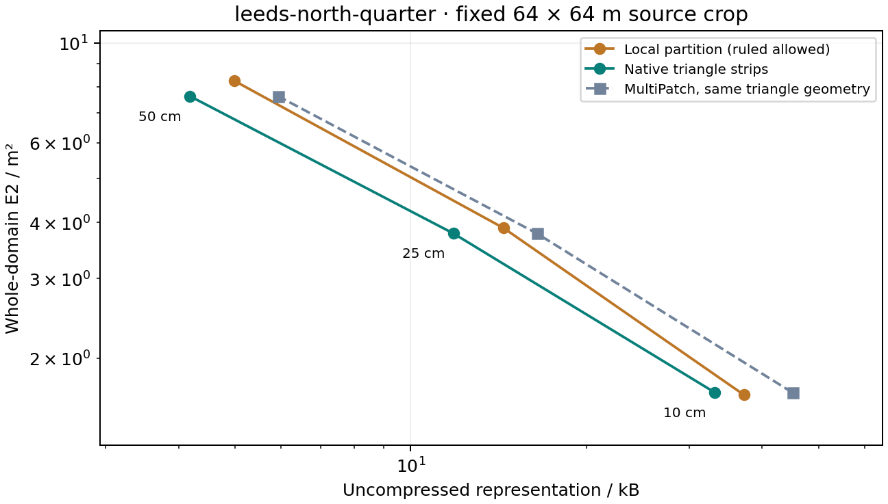

# 利兹固定样区：全域 E₂、N 与同几何文件代价

[中心 10 cm 精度取舍](http://127.0.0.1:5173/compare?city=leeds&terrain_scope=leeds&terrain_site=leeds-centre&terrain_target=0.1#leeds-terrain-results) · [北侧 10 cm 原生直纹候选](http://127.0.0.1:5173/compare?city=leeds&terrain_scope=leeds&terrain_site=leeds-north-quarter&terrain_target=0.1#leeds-terrain-results)。拟合前固定源栅格中心与北侧四分位位置，公开全部 12 个保存模型、49,152 次固定查询、全部控制点与六对同几何 MultiPatch。

原生三角带 JSON 比同几何 MultiPatch 五组件小 **26.4%–35.5%**。局部分区不是普遍优势：中心 10 cm 小 **24.5%**，E₂ 高 **4.1%**，没有直纹面；北侧 10 cm 大 **12.1%**，E₂ 低 **1.1%**，含一个直纹四边形。文件与精度分开判断，不把纯三角分区差异归为函数收益。


## 六对完整结果

T 为原生三角带，H 为允许直纹面的局部分区；两类几何不同。字节是未压缩表示成本，E₂ 为完整 4,096 m² 域上的积分范数（m²）；实际 N 是三角形数，直纹四边形单列。

| 固定样区 / 目标 | T / B | MultiPatch 五件套 / B | 同几何文件节省 | H / B | E₂ T / H · m² | N T / H | H 直纹四边形 |
|---|---:|---:|---:|---:|---:|---:|---:|
| 中心 / 10 cm | 5,542 | 7,994 | 30.67% | 4,186 | 1.553832 / 1.618226 | 190 / 121 | 0 |
| 中心 / 25 cm | 1,574 | 2,314 | 31.98% | 1,750 | 4.262436 / 4.306425 | 35 / 39 | 0 |
| 中心 / 50 cm | 812 | 1,258 | 35.45% | 980 | 9.420902 / 8.608537 | 5 / 9 | 0 |
| 北侧 / 10 cm | 33,221 | 45,114 | 26.36% | 37,232 | 1.676188 / 1.657395 | 1200 / 1401 | 1 |
| 北侧 / 25 cm | 11,840 | 16,458 | 28.06% | 14,429 | 3.777482 / 3.883968 | 426 / 506 | 0 |
| 北侧 / 50 cm | 4,187 | 5,930 | 29.39% | 4,981 | 7.614414 / 8.244515 | 132 / 160 | 0 |

12 个模型全部满足相应 10 / 25 / 50 cm 的最大参考界目标。六档 H 中五档文件更大，一档更小；两档 E₂ 更低，四档更高；总计一个直纹四边形。中心 50 cm 更大但 E₂ 更低，北侧 25 cm 则文件与 E₂ 均更高。页面同时展示原始数值和两项指标下的表示建议，全部不利结果保留。




## 对齐论文与 ArcGIS 比较范围

对齐 [Mirebeau & Cohen](https://arxiv.org/abs/1101.1452) 的全域 L₂ 范数 E₂ 和实际三角形 N。真实逐单元双线性 DTM 不满足严格凸 C² 假设；三角构建采用最大误差优先、欧氏最长边与 C0 相容闭合，并非论文 L₂ 选区 / L₁ 选边的解析实验，不套用 Hessian 形状理论。源参与拟合，不是独立地面真值。

每处固定原始 65 × 65 个 1 m 像元中心，完整 64 × 64 m 域积分。模型与源单元求交后，用 Float64 多项式 Gauss / Duffy 积分计算 E₂，包含保存高程的五位小数舍入。RMS = E₂ / 64，不用固定查询的抽查 RMSE 替代。最大参考界含 Float64 数值保护，不是区间算术证明。

每对三角模型 / MultiPatch 的 XYZ、带分组及有向三角形一致，所列来源属性读回一致；JSON 元数据未完全映射 DBF。MultiPatch 成本包括 SHP/SHX/DBF/PRJ/CPG 全部五组件。没有 ArcGIS Pro 软件运行、FGDB、GPU 内存或帧率优势结果；ZIP 压缩体积也不是上述表示成本。

## 源与复核文件

源为 [EA 2022 裸地 DTM 1 m](https://www.data.gov.uk/dataset/01b3ee39-da3f-47b6-83da-dc98e73a461f/lidar-composite-dtm-2022-1m)，© Environment Agency 2022，OGL v3.0；源 TIFF SHA-256 `f9b4a5a158970325607da3faed3de2d29764dca48b26566fb154866c89c194de`，绑定第六版地形来源清单。建筑、粗预览与认证样区相互独立，见[利兹地形资料](leeds_terrain_sample.md)。模型 XY 为样区中心 BNG 偏移，MultiPatch 为绝对 EPSG:27700，Z 保留 ODN 米，不是城市 ENU 或椭球高。

```powershell
.venv/Scripts/python.exe data-pipeline/build_leeds_terrain_benchmark.py --output .local/research/leeds-reproduction-new
node frontend/scripts/audit-leeds-terrain-benchmark.mjs .local/research/leeds-reproduction-new
```

新目录保留原件。发布器先核验来源、脚本指纹、全部模型及固定原生查询、完整域积分、同几何读回；已有公开目录则拒绝覆盖。运行时间可能变化，不承诺时间字段逐位复现。

两个 ZIP 各有 31 个成员：六个模型、三档 MultiPatch 五组件、源参考、固定查询夹具、六份逐点 CSV、许可证和样区定义。中心包 **1,255,036 B**，SHA-256 `fc3e26541ae76eb67f68997a02706905f558bddbd5380ddf923e4dab0fedb81e`；北侧包 **1,289,756 B**，SHA-256 `827a1ed80860553add6b1d38e5d3a55c9da461b3acc5853f4f314d6ecfee25e2`。

## 验收

711 项前端检查、48 项研究流程检查及生产构建通过。独立重新计算全部模型的完整域积分、固定查询和控制点，核对原像元、五组件几何与全部 ZIP 成员。真实浏览器验证两处样区、目标切换、刷新恢复、0 画布与无警告/错误。实际下载北侧包的长度、SHA-256 及 31 个成员与公开原件一致。

旧来源与已发布实验、绑定算法保留；43 份本机历史和三个正式城市指纹一致，利兹正式目录未初始化。本轮未改变后端业务，独立地形发布阶段的 328 项后端检查作为前一阶段结果，不冒称本轮重新执行。
