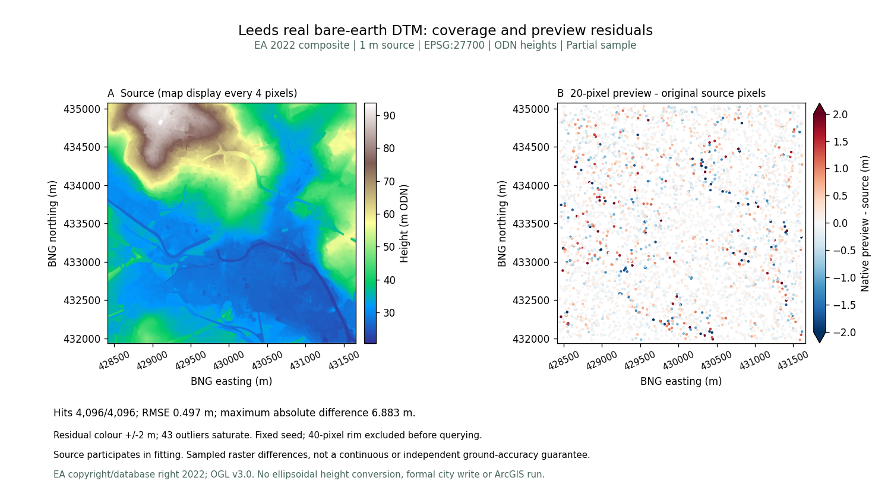
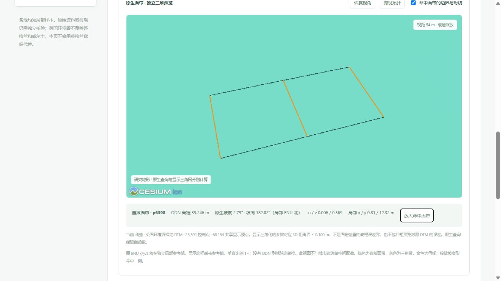

# 利兹真实裸地与原生面带

2026-10-05 独立发布利兹中心街区 EA 2022 LIDAR Composite DTM 候选。它与[建筑种子](leeds_city_sample.md)分别下载，不替换正式城市，也没有与建筑做高程配准。

## 来源、范围与保存

源来自 [Environment Agency 官方数据集](https://www.data.gov.uk/dataset/01b3ee39-da3f-47b6-83da-dc98e73a461f/lidar-composite-dtm-2022-1m) WCS；不是 Digimap 下载。查询窗口 `[-1.570,53.783,-1.521,53.811]` 是独立选择的中心样本，不是全城或行政边界。BNG 裁片 `[428412,431938,431660,435075]`，EPSG:27700、Float32 单带、1 m、scale 1 / offset 0；3,248 × 3,137 = **10,188,976 个有效像元，0 缺测**。ODN 高程 20.669–93.790 m；没有做椭球高转换。WCS 单位字段与官方米制说明的冲突警示保留。

原下载 51,381,035 B，SHA-256 `e6cb731568b9eac05f8f999d9767658ff5117f7050b466bf3696cce976973d76`。公开 TIFF **21,137,809 B**，SHA-256 `f9b4a5a158970325607da3faed3de2d29764dca48b26566fb154866c89c194de`。仅作无损 DEFLATE：全部像元、CRS、仿射变换、NoData、scale/offset 逐项一致。这是同一栅格的保存压缩，不能归因于直纹面带或用作 ArcGIS 软件速度结论。

© Environment Agency copyright and/or database right 2022；[OGL v3.0](https://www.nationalarchives.gov.uk/doc/open-government-licence/version/3/)。OSM 建筑派生库的 ODbL 许可单独保留。

## 原生函数与抽查

20 像元采样预览 **25,591 个控制点、9,974 条直纹面带记录、2,662 条三角带记录**；记录数不等于每个面元数量。保存 GUGIS 地形 **1,888,362 B**，SHA-256 `d94864ce01ed623d05ba515c1cfab341f6557d29bbc54fc2b4731608d18bbf81`。原生直纹面通过两条边界之间的参数函数查询，三角带按原生面查询，不用显示三角网替代查询结果。

固定 seed 20261005，在有效原像元中心抽取 4,096 个互异位置，预先排除 40 像元外缘。全部命中，RMSE **0.497177 m**、MAE **0.262487 m**、P95 绝对差 **1.041224 m**、最大绝对差 **6.883349 m**。源参与拟合，不是留出真值；没有连续最大误差或独立地面精度保证。全部控制点命中，最大查询差 4.974×10⁻¹⁴ m。

图中误差色带为 ±2 m，43 个超过色带范围的抽查点只饱和着色，原记录保留全部数值。源图显示抽稀不改变保存的 1 m 像元。

第六版来源清单保留第五版全部十城记录与五版祖先指纹，十一城合计 **79,132,792 个有效源像元**。源清单、核验 JSON、全部 4,096 点 CSV/JSON 与脚本指纹可复核。完整参考域 E₂ 对标属于单独实验，不以此处抽查替代。

## 实际浏览器验证

`/datasets?dataset=leeds` 显示本城源、控制点及最大差，默认 0 画布。明确打开预览后实际点击得到直纹面带 **p6398**：ODN **39.246 m**、坡度 **2.79°**、坡向 **182.02°**（局部 ENU 北）、u/v **0.006/0.569**。放大命中面带后视距约 54 m，黑色边界和金色母线可见。以下是单点实测，不代表全城地形性质。

显示使用 **68,154 个共享顶点**，参数对应三维距离界 ≤0.100 m。它只约束原生预览到显示网，不包括预览相对源栅格的差异，也不是固定 XY 高程界。垂直比例 1×；绿色为直纹面带、灰色为三角带。关闭后 0 画布、控制台没有警告或错误；实际下载 `leeds-ea-dtm-1m.tif` 的全部字节及 SHA-256 与发布文件一致。

## 回归与边界

706 项前端检查通过，328 项后端检查中 311 项通过、17 项环境相关跳过，生产构建通过。新验证独立核对全部源像元指纹、原像元查询、全部控制点、祖先链、文件损坏拒绝及只读端点。既有实验、绑定算法及本机 43 份历史与三个正式城市保持不变；没有初始化利兹正式城市。

ArcGIS 软件及 FGDB 读写尚未实测；本页不提供软件速度、运行内存或 GPU 优势结论。

随后已独立完成[两个固定样区的全域 E₂ 与同几何文件对标](leeds_terrain_benchmark.md)，不以本页粗预览抽查替代。
