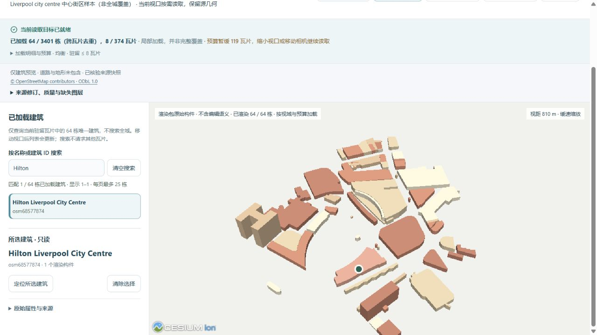
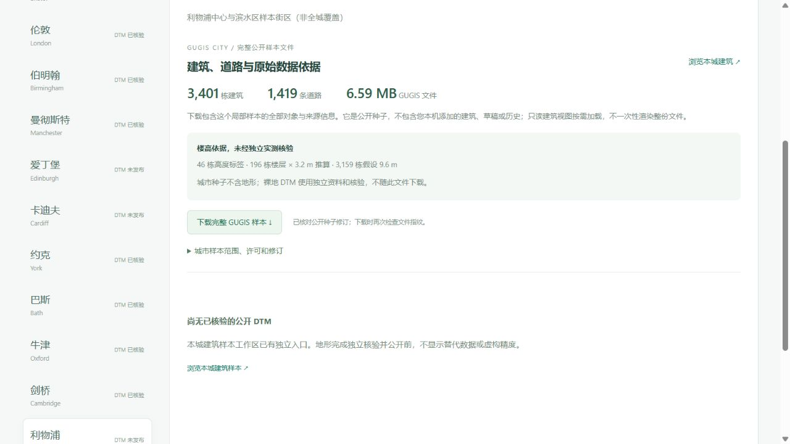

# 利物浦中心与滨水区：真实城市样本

[浏览利物浦建筑](http://127.0.0.1:5173/?city=liverpool&cities=liverpool&view_mode=tiles&tile_profile=economy)或[查看来源与下载完整 GUGIS](http://127.0.0.1:5173/datasets?dataset=liverpool)。新增 **3,401 栋建筑、1,419 条道路**，十一城公开种子合计 **68,652 栋建筑**，各地都是局部街区，不能称为全城复原。

## 来源、完整范围与限制

2026-10-05 独立取得有界 OSM 快照，查询框 `[-3.006, 53.391, -2.969, 53.416]`，保留完整跨界 ways。实际建筑与道路合并范围 `[-3.0251771, 53.3869328, -2.961707, 53.4216978]`；窗口与实际几何边界分别记录。相关城市登记为 `uk-eng-liverpool`，既有英国城市登记原件未修改。

原始下载 **3,163,286 B**，SHA-256 `6b10839e213a0fd470578fb28ec7a2ff40d0c30a3d93532c4d3693ad143d658a`；公开响应 **2,392,360 B**，SHA-256 `30c82a16df72ab7bf39083aa0c5449db147f3790a6c8dea3db7b4d515640e9c8`。原件本地保留不覆盖，公开资料仅删除 287 个无关联系或自由文本标签，每个对象 ID、几何、建模属性与署名保持一致。来源与筛选指纹在 `liverpool-source.json`。

3,427 个源建筑中 26 个因建筑部件、架空属性或异常高度被拒绝，没有用默认地面体量替代。包括负高度 `osm651521415` 和负底高 `osm661482820`；全部 ID 与实际理由公开在 `liverpool-import.json`。1,426 个道路 way 中保留 1,419 条非面积道路，7 个面积道路不属于此线状模型，转换失败为 0。

楼高依据 **46 个高度标签、196 个楼层 × 3.2 m 推算、3,159 个假设 9.6 m**，均未独立实测核验。源与保存模型含 Royal Liver Building、Saint George's Hall、Museum of Liverpool 及教堂名称；这些是 LoD1 轮廓体量，不能称为立面、钟塔或穹顶的精细复原。未取得 multipolygon relations，不承诺其庭院孔洞；道路宽度为显示假设，不代表桥梁或隧道竖向高程恢复。当前只读建筑视图不包含道路或地形。

数据与派生数据库按 [ODbL 1.0](https://opendatacommons.org/licenses/odbl/1-0/) 分发，保留 © OpenStreetMap contributors 署名；[当前数据许可](../backend/data/cities/CURRENT_DATA_LICENSE.md)与软件许可分开。

## 按需加载与完整文件

完整公开种子 **6,588,341 B**，SHA-256 `1c627bae18128bd9eff98094f4910d832a04377f8d499321fb535ee1559c79c0`。125 m 分块共 **374** 瓦片，4,842 条跨格引用去重为 3,401 栋；瓦片合计 **5,542,984 B**，最大 **52,045 B**，清单 **207,154 B**。分块保留每栋完整几何，公开文件保留全部道路与来源。

低资源最多驻留 2 瓦片 / 2 MiB，均衡最多驻留 8 瓦片 / 8 MiB。这是源数据字节与驻留限制，不是 GPU 内存或帧率保证。搜索只查当前驻留建筑，选择为只读操作；进入编辑与初始化正式项目属于另一个入口。下载提供公开种子，不带入本机项目、草稿或历史。

## 独立取得的地形，尚未发布

已取得 EA 2022 官方 1 m 裸地源裁片，BNG `[333194, 388678, 335694, 391494]`，EPSG:27700，一带 Float32、scale 1 / offset 0。2,500 × 2,816、**7,040,000** 有效像元、0 缺测，ODN −4.070–54.423 m；不把负高程改为零。

原始下载 **31,457,939 B**，SHA-256 `9efea9645dcea950e39255bbcb3d91020cd675e3e0b5a1cf49b4fcee31f50762`。本轮仅保留来源并核对格网，原生模型、误差审查与无损发布尚未完成；数据页正确显示“DTM 未发布”，不借用其他城市资料。城市种子不含地形，源数据后续独立按 OGL v3.0 / EA 2022 署名分发。

## 验收与数据保护

672 项前端全套检查、315 项后端检查（298 通过、17 Windows 环境不适用跳过）及生产构建通过。新增来源回归从公开 OSM 完整重建所有建筑、道路、几何与元数据，要求字节与种子完全一致，并核对全部 26 个拒绝对象和实际楼高依据。实际 Cesium 相机数学检查包含十一城、四种尺寸与两档预算，不冒充手机 GPU 实测。

桌面内置浏览器初始低资源 17 栋 / 2 瓦片、均衡 64 栋 / 8 瓦片，Hilton Liverpool City Centre 可搜索并只读选择；选择及预算切换的六项镜头参数相同。上述数量是这次视口结果。下载文件实际 6,588,341 B，SHA-256 与公开种子一致；数据页 0 画布，控制台无警告或错误。

十份旧公开种子、来源记录、八城 DTM、三版地形来源链、既有对标包、科学图及算法原件核验未变；43 份原始本地档案与三个正式城市指纹保留。没有初始化利物浦正式目录。

