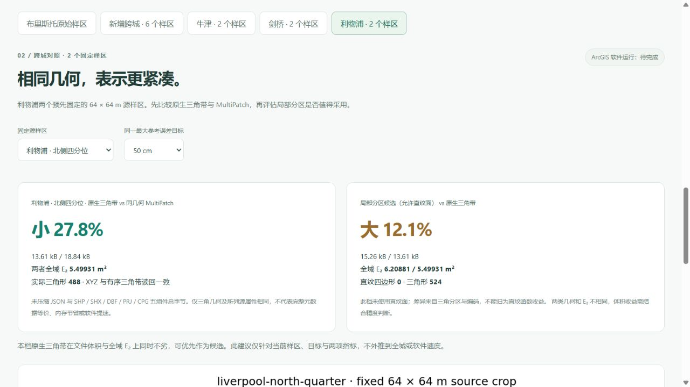

# 利物浦：两个预先固定样区的全域误差与表示代价

[打开中心 10 cm 结果](http://127.0.0.1:5173/compare?city=liverpool&terrain_scope=liverpool&terrain_site=liverpool-centre&terrain_target=0.1#liverpool-terrain-results)。核心结果是：**原生三角带文件比同几何 MultiPatch 小 26.3%–29.3%**；本轮六档局部分区表示全部更大，E₂ 全部更高。两项结果一起展示，不删不利样区。

## 对齐的指标与固定范围

使用[已公开的利物浦 EA 2022 原始 1 m DTM](liverpool_terrain_sample.md)，第四版来源清单独立绑定。拟合前固定两个位置：源栅格中心列，中心行或北侧四分位行；没有按计算结果选择更有利的地形。每处取 65 × 65 个原像元中心，完整参考域为 64 × 64 m，即 4,096 m²。

对齐 [Mirebeau & Cohen / arXiv:1101.1452](https://arxiv.org/abs/1101.1452) 的**全域 L₂ 范数 E₂ 与实际三角形 N**。源参考面为分单元双线性面，不满足论文的严格凸 C² 假设，未在真实 DTM 上宣称 Hessian 形状指标或渐近最优定理。原有三类解析曲面的 L₂ 选区 / L₁ 选边对照继续保留。

真实地形三角候选采用最大误差优先、欧氏最长边及相容细分，不称为论文方法的完整实现。局部分区允许直纹四边形，N 只计三角形，直纹数量单列。两类模型都在 10 / 25 / 50 cm 最大参考误差目标下生成，12 组模型全部达标。

每个保存函数与所有相交源栅格单元求交，采用多项式 Gauss / Duffy 积分计算完整域残差平方。包含保存的高程舍入，没有先把直纹面三角化再评价。RMS = E₂ / 64。最大参考界采用 Float64 数值保护，不是区间算术证明或独立地面精度保证。

## 全部六档结果

字节为未压缩文件实际长度；MultiPatch 包括 SHP、SHX、DBF、PRJ、CPG 五组件。每对三角 JSON 与 MultiPatch 的 XYZ、部件分组、有向三角形读回完全一致。所列源属性保留，原生 JSON 完整元数据不在此等价范围内。

| 样区 / 目标 | 三角 JSON / B | MultiPatch / B | 同几何文件减少 | 分区 JSON / B | E₂ 三角 / 分区 · m² | 分区直纹四边形 |
|---|---:|---:|---:|---:|---:|---:|
| 中心 / 10 cm | 49,632 | 68,946 | 28.0% | 54,335 | 1.126834 / 1.248286 | 53 |
| 中心 / 25 cm | 25,810 | 36,202 | 28.7% | 29,511 | 2.226177 / 2.299137 | 1 |
| 中心 / 50 cm | 15,545 | 22,002 | 29.3% | 17,388 | 4.721166 / 5.093061 | 2 |
| 北侧 / 10 cm | 51,281 | 69,562 | 26.3% | 56,392 | 1.308571 / 1.368300 | 70 |
| 北侧 / 25 cm | 26,085 | 35,730 | 27.0% | 30,396 | 2.916301 / 3.136733 | 5 |
| 北侧 / 50 cm | 13,613 | 18,842 | 27.8% | 15,263 | 5.499314 / 6.208812 | 0 |

实际三角 N（中心三档）为 1,878 / 971 / 580，局部分区为 1,788 / 1,125 / 622；北侧为 1,878 / 963 / 488，分区为 1,749 / 1,083 / 524。六档共 131 个直纹四边形；北侧 50 cm 档没有直纹面，不能把分区差异归为函数收益。

六档混合文件大 9.5%–16.5%，对应 E₂ 也更高。本轮在当前两项指标下三角带同时不劣，网站推荐其作为当前样区候选。该建议不外推到整座城市或软件速度。没有 ArcGIS Pro 运行结果，不把上述文件差异称为内存、帧率、分析速度或 ArcGIS 软件性能优势。

## 下载、坐标与验收

12 份保存模型，各执行 4,096 个固定查询，共 49,152 次全部命中；全部保存控制点查询误差 < 10⁻⁹ m。逐点 CSV 与全域积分是不同证据，抽样 RMSE 不替代 E₂。恢复 ZIP 每包 31 个成员，含原参考裁片、夹具、六份原生模型、三档同几何 MultiPatch 与逐点 CSV。

中心包 1,326,398 B，SHA-256 `210ada7c3b2f0311200e26432959e6aab6868575390f5dd477a179b92b41a566`；北侧包 1,350,294 B，SHA-256 `fcd8bdf18a59c0a95b3129586b98e8cd5ce0562e930703ef004efab2305cbedc`。压缩 ZIP 字节不参与表示代价比较。原生 XY 是局部 BNG 偏移，MultiPatch 是绝对 EPSG:27700，Z 均为 ODN 米；这些研究夹具不能直接当作城市 ENU 或椭球高导入。

非布里斯托城市入口也可显示独立地形对照。城市建筑的存储与剖面指标尚无本城报告，入口明确区分这两类证据。实际浏览器选择北侧 50 cm 并刷新，地址恢复相同样区和目标，0 三维画布、控制台无警告或错误；实际下载北侧 ZIP 的长度和 SHA-256 与发布记录相同。

679 项前端检查、40 项研究流程检查及生产构建通过。独立回归重新计算全部 12 组全域积分，核对原始源裁片、每个有向三角带、查询函数、包成员、脚本和科学图指纹；补充非布里斯托入口回归，要求不得请求正式城市或布里斯托快照。后端与源数据未改，本轮地形发布的 318 项后端记录保留在上文来源说明。

原有十一城种子、九城 DTM、四版来源清单、已有解析和真实地形结果、绑定算法保持原字节。43 份本地保留资料与三个正式城市指纹不变，利物浦正式工作区没有初始化。© Environment Agency copyright and/or database right 2022，OGL v3.0。
