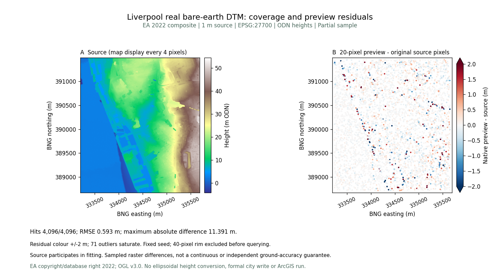
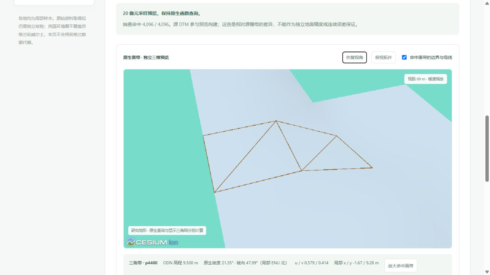
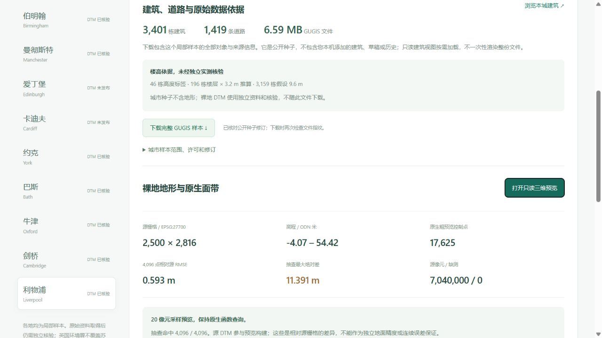

# 利物浦真实裸地：原生面带与可核验源像元

[打开数据集](http://127.0.0.1:5173/datasets?dataset=liverpool)。新增 2,500 × 2,816、7,040,000 个有效 1 m 像元，无缺测；九城公开 DTM 共 61,830,216 个有效像元。各城仍是局部街区，非全城覆盖。

## 来源与原件保留

2026-10-05 从英国环境署 WCS 独立取得 [EA 2022 LIDAR Composite DTM](https://www.data.gov.uk/dataset/01b3ee39-da3f-47b6-83da-dc98e73a461f/lidar-composite-dtm-2022-1m)。来源是环境署裸地资料，不称为 Digimap 下载或新近现场测量。查询窗口 `[-3.006, 53.391, -2.969, 53.416]`，实际 BNG 栅格范围 `[333194, 388678, 335694, 391494]`，EPSG:27700、ODN 米、Float32 单带、scale 1 / offset 0。

高程 **−4.070–54.423 m ODN**。负高程原样保留，不改为零。WCS 单位字段与官方米制正文冲突，警示和解释保留在清单；未做 ODN 到椭球高转换，也未将独立研究视图与城市建筑配准。

原始下载 31,457,939 B，SHA-256 `9efea9645dcea950e39255bbcb3d91020cd675e3e0b5a1cf49b4fcee31f50762`，原件本地保留。发布 TIFF **14,867,904 B**，SHA-256 `9234960ce30764e7f6e1c94f235c31b1a4084f27e82ec51eb625aaab91cf605f`。仅 DEFLATE 压缩，逐块比较所有像元、CRS、仿射变换、NoData、scale/offset，均保持一致；压缩文件与研究模型的体积不能当作 GPU 内存计量。

第四版清单 `shared/public-terrain-sources-v4.json` 的 SHA-256 为 `ba3da5fe8865c3a52a93cce15064e2de63a181831deb6d19537e806057ea430e`。前三版文件保持原字节，原八城来源记录完整保留；只读服务逐一校验三份祖先，旧论文对标包的指纹不变。

© Environment Agency copyright and/or database right 2022. All rights reserved. 按 [Open Government Licence v3.0](https://www.nationalarchives.gov.uk/doc/open-government-licence/version/3/) 分发；城市 OSM 数据的 ODbL 许可与此分开。

## 原生函数与误差边界

20 像元采样生成 **17,625 个控制点、7,248 条直纹面带记录、1,432 条三角带记录**，这些记录数不是面片数。原生文件 **1,273,748 B**，SHA-256 `35de65055734dbd8c0151c4ab4e93d4cf471aebbcacc3e6b9aee26dd05b05093`。查询使用保存的面函数，不以显示三角网替代。

固定种子 20261005，从有效源像元中心选择 4,096 个不重复查询点，先排除四周 40 像元边缘。4,096 点全部命中，所有 17,625 个控制点全部命中，最大控制点查询误差低于 10⁻⁹ m。

| 相对源栅格的固定抽查指标 | 结果 |
|---|---:|
| RMSE | 0.593201 m |
| MAE | 0.223033 m |
| P95 绝对差 | 0.903775 m |
| 最大绝对差 | **11.391056 m** |

源数据参与预览构建，这不是独立地面精度、保留集验证或连续最大误差保证。11.391 m 大误差保持公开。科学图色带 ±2 m，71 个超范围点饱和显示，但全部差异仍在 CSV 与 JSON 内，没有删除离群值。

只读显示生成 38,407 个共享顶点，参数对应三维距离界 ≤ 0.100 m；它只约束原生预览到显示三角网，不包括上述预览相对源数据的误差，不是固定 XY 高程误差界。详情见[显示定义](terrain_dataset_explorer.md#坐标与显示误差的边界)。

## 实际浏览器验收

打开只读预览，点击命中三角带 `p4400`：高程 9.500 m ODN，坡度 21.35°，坡向 47.99°（局部 ENU 北），u/v 为 0.579/0.414。明确点击放大后视距约 69 m，可见三角带边界与相邻绿色直纹区段。以下为本次实际查询，不表示整个街区的统一坡度或精度。

关闭后画布数量为 0，控制台无警告或错误。实际下载 `liverpool-ea-dtm-1m.tif`，长度与 SHA-256 与发布原件一致。数据页展示完整负高程范围、0.593 m RMSE 和 11.391 m 最大差，默认不自动启动 WebGL。

674 项前端检查、318 项后端检查（301 通过、17 项 Windows 环境不适用跳过）、36 项研究流程检查与生产构建通过。新增回归独立核对原像元、负高程、全部控制点、所有固定查询、源字节、版本链、脚本和科学图指纹、只读接口与损坏拒绝。

十一份公开城市种子、旧八城 DTM、前三版清单、已有认证对标包及绑定算法均未修改。43 份原本地档案与三个正式城市指纹保留，利物浦正式目录未初始化。这轮是源数据与原生预览发布，未运行 ArcGIS 软件，也未把它列为已经认证的定容/定精度对标样区。
