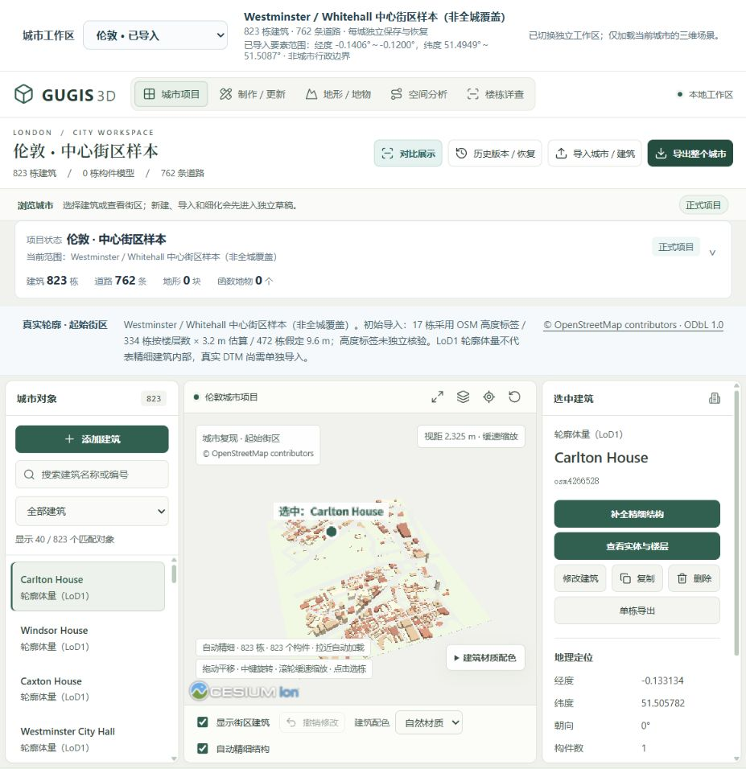
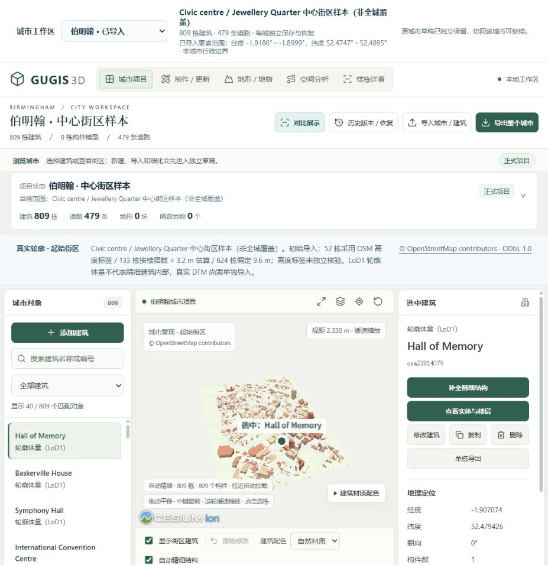

# 三城独立工作区 · 2026-10-03

顶部“城市工作区”可切换布里斯托、伦敦、伯明翰。每城各有正式项目、一个待确认草稿槽、历史版本和地形；页面只挂载所选城市的三维场景，切换后释放上一场景。城市目录只读取摘要，不初始化其他城市。接口绑定在请求发出时确定，旧请求不能写入后来选择的城市；正在写入时暂停切换。

| 城市 | 页面入口 | 仓库种子建筑 / 道路 | 样本范围 |
| --- | --- | ---: | --- |
| Bristol | `/` | 615 / 544 | Brandon Hill、Park Street、College Green 周边 |
| London | `/?city=london` | 823 / 762 | Westminster / Whitehall |
| Birmingham | `/?city=birmingham` | 809 / 479 | Civic centre / Jewellery Quarter |

这些是局部街区样本，不代表全城或行政边界。布里斯托种子由 600 个 OSM 轮廓、3 处形态参考地标和 12 栋设计住宅组成；原电脑现有 616 栋是后续编辑状态，只保存在本机。伦敦来源有 825 个建筑 way，成功转换 823 栋，另 2 栋复杂轮廓不满足清理后 3–120 顶点约束，OSM 编号与原因记录在 [转换清单](../backend/data/cities/london-import.json)；伯明翰 809 栋全部转换。两城均未采集 multipolygon relations，道路只包含查询取得的有名称、非面状 highway way。

## 真实数据与高度边界

伦敦、伯明翰采用真实 OSM 水平轮廓，生成 LoD1 闭合体量。高度依次采用 1–150 米范围内的 `height` 标签、`building:levels × 3.2 m`，最后假定 9.6 米；标签并未独立测量核验。道路宽度是显示假设，没有恢复真实立面或建筑内部。三城仓库种子均未附实测 DEM；网页生成的演示地形仍为解析函数生成的非实测数据。

| 城市 | OSM 高度标签 | 按楼层估算 | 假定 9.6 米 |
| --- | ---: | ---: | ---: |
| London | 17 | 334 | 472 |
| Birmingham | 52 | 133 | 624 |

伦敦、伯明翰的城市内存基准及 GUGIS × ArcGIS 同源报告尚待建立，页面显示“待测”。布里斯托已有报告仍只对应其记录的样本修订号，不构成新增城市的性能证据，也不构成 ArcGIS 软件性能跑分。

## 查询窗口与实际几何范围

下面边界均按 WGS84 `[西, 南, 东, 北]`、单位度排列。伦敦、伯明翰的 `query_bbox_wgs84` 是采集窗口，工作区也用它确定默认中心及 DEM 裁剪范围；`actual_data_bbox_wgs84` 是初始成功导入建筑轮廓和道路线所有坐标的实际包络。OSM 返回与窗口相交的完整 way，因此跨界几何不会被裁成窗口大小，两者可以不同。

| 城市 | 查询窗口 | 初始已导入要素范围 |
| --- | --- | --- |
| London | `[-0.138, 51.496, -0.123, 51.508]` | `[-0.1406102, 51.4948591, -0.1199859, 51.5087403]` |
| Birmingham | `[-1.914, 52.476, -1.901, 52.488]` | `[-1.9186071, 52.474702, -1.8998589, 52.4895005]` |

目录中的 `building_extent_wgs84` 仅统计建筑实例基点，不是建筑轮廓边界。上述实际包络来自转换清单与种子元数据，后续手动添加或移动对象不会自动重测这份来源包络。布里斯托旧项目没有实际要素边界元数据时，页面展示“建筑位置范围”。其默认 DEM 窗口 `[-2.614, 51.446, -2.592, 51.462]` 也不同于保留 OSM 来源的采集窗口；不要将任一范围当作全城覆盖。

## 来源、哈希与许可

两城来源由公开 Overpass API 于 **2026-10-03** 采集，OSM 数据快照时间均为 `2026-10-03T04:31:51Z`。采集清单保存具体查询、端点、时间、字节数、SHA-256 与署名；转换清单保存计数、遗漏、范围、高度政策及输出哈希。原始来源副本与派生数据库均保留 **© OpenStreetMap contributors · ODbL 1.0**；应用代码与数据许可分开。详见 [数据许可与采集说明](../backend/data/cities/DATA_LICENSE.md)、[OSM 署名说明](https://www.openstreetmap.org/copyright)及 [ODbL 1.0](https://opendatacommons.org/licenses/odbl/1-0/)。

| 来源文件 | 保留文件 SHA-256 |
| --- | --- |
| [london-osm.json](../backend/data/cities/london-osm.json) | `5db34df2aa145ee5a5f5f4afc47e3b565d704c7d8f924d89d8a9341499ad942a` |
| [birmingham-osm.json](../backend/data/cities/birmingham-osm.json) | `6aa13a5ed45e46a1b78e26aecff41b3d0d265ce3ac8eaf6d9dd676321ea50731` |

[伦敦采集清单](../backend/data/cities/london-source.json)与[伯明翰采集清单](../backend/data/cities/birmingham-source.json)记录实际采集内容。重新访问 Overpass 可能取得更新后的数据；上表哈希标识仓库保留副本，不保证未来请求字节相同。

## 存储与接口

首次读取所选城市时，从其种子建立本地正式项目，不覆盖已有文件。布里斯托种子在 `backend/data/bristol.gugis.json`；新增两城种子在 `backend/data/cities/{city_id}.gugis.json`。缺少新增城市种子时显示空的待导入工作区，不借用布里斯托模型。

| 内容 | Bristol | London / Birmingham |
| --- | --- | --- |
| 正式项目 | `.local/city/current.gugis.json` | `.local/cities/{city_id}/current.gugis.json` |
| 待确认草稿 | `.local/city/pending-draft.json` | `.local/cities/{city_id}/pending-draft.json` |
| 历史快照 | `.local/city/versions/` | `.local/cities/{city_id}/versions/` |
| 地形实验包 | `.local/benchmark/` | `.local/cities/{city_id}/benchmark/` |

这些 `.local` 文件不进入 GitHub。切走城市时已保存草稿继续保留，切回可继续确认或丢弃；“恢复内置建筑”和“预览内置初始数据”均取当前城市的种子。恢复仍先预览、再确认，切换本身不提交草稿。

`GET /cities` 返回三城摘要；`/cities/{city_id}/city` 下的 `current`、`revision`、`export`、`draft`、`draft/commit`、`draft/discard`、`versions`、`terrain/demo`、`terrain/import` 等接口只作用于该城。`city_id` 为 `bristol`、`london` 或 `birmingham`，未知标识返回 404。旧 `/city/...` 接口继续指向布里斯托。前端经 Vite `/api` 代理访问，例如 `GET /api/cities/london/city/current`。

## 离线重建与验证

安装本地锁定依赖后，在仓库根目录执行。转换器先核验保留 OSM 来源的 SHA-256；以下命令把重建种子和转换报告写入隔离输出目录，不替换正在编辑的项目：

```powershell
.\.venv\Scripts\python.exe data-pipeline/import_city_samples.py --city all --output-dir .local/rebuilt-city-samples
```

也可使用 `--city london` 或 `--city birmingham`。省略 `--output-dir` 时写入 `backend/data/cities`；只在有意重建仓库种子时使用。从网页将输出城市文件导入对应工作区，先检查草稿再确认保存。

本轮 Windows 自动化验证：后端 **102/102**、前端 **186/186**、生产 Worker **5/5**，TypeScript 与 Vite 生产构建通过。复现命令：

```powershell
$env:PYTHONPATH='backend'
.\.venv\Scripts\python.exe -m unittest discover -s backend/tests
npm --prefix frontend test
npm --prefix frontend run build
npm --prefix frontend run test:worker
git diff --check
```

本轮已在本机真实浏览器中切换三城并检查画面：伦敦 823 栋、伯明翰 809 栋正确加载，回切布里斯托仍为原有 616 栋；城市切换后只保留一个三维画布，验收期间控制台无渲染错误。伦敦创建建筑副本草稿后切到伯明翰，伯明翰不显示该草稿，切回伦敦恢复到 824 栋预览；丢弃后正式城市仍为 823 栋。

伦敦、伯明翰均通过网页下载正式城市文件，SHA-256 与各自磁盘正式数据完全一致。伦敦建筑选中及相机定位正常；对比页明确显示待建立报告。布里斯托历史面板可读取原版本，正式文件哈希保持不变，磁盘 40 个历史版本保留。验收临时草稿已清理，三城均无待提交草稿。

上述记录覆盖本轮多城市交互，不是大规模负载测量或所有浏览器兼容性报告。DEM 城市裁剪与保存隔离由回归测试覆盖；本轮没有取得两城实测 DEM，也未进行 ArcGIS Pro 内的速度测试。

## 本机页面截图

伦敦：覆盖说明、823 栋建筑 / 762 条道路、估算高度政策与真实轮廓三维体量。



伯明翰：独立的 809 栋建筑 / 479 条道路，范围与高度依据对应本城。


