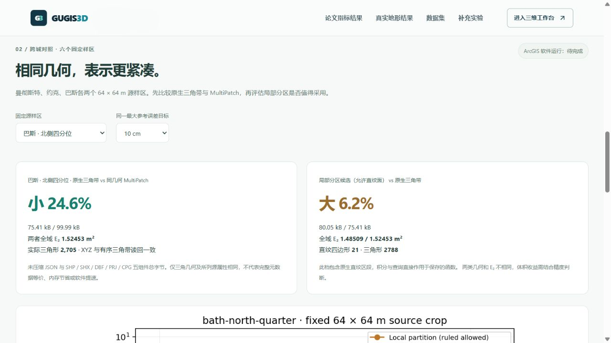

# 六样区真实地形对标

入口：[跨城结果](http://127.0.0.1:5173/compare#multicity-terrain-results)。同页切换“布里斯托原始样区 / 新增跨城”，共用 10、25、50 cm 目标。原论文解析曲面实验仍为第一部分，本次真实 DTM 为第二部分，不混用方法或理论前提。



## 固定数据与指标

曼彻斯特、约克、巴斯各两个 65 × 65 源像元裁片，连续域为 64 × 64 m。源栅格中心列、中心行或北侧四分位行在拟合前固定，没有按结果重选样区。来源为 [EA 2022 1 m 裸地 DTM](https://www.data.gov.uk/dataset/01b3ee39-da3f-47b6-83da-dc98e73a461f/lidar-composite-dtm-2022-1m)，OGL v3.0；© Environment Agency copyright and/or database right 2022. All rights reserved.

6 样区 × 3 目标 × 2 方法 = 36 组保存的原生模型。全域 E₂ 是模型相对于源栅格双线性参考面的 L₂ 范数，单位 m²；每组积分面积 4,096 m²，RMS = E₂ / 64。最大参考界包含保存高程舍入，采用 Float64 数值保护，非区间算术证明。不是独立地面精度。

局部分区允许原生直纹四边形，采用 C0 共用控制点、三角带闭合边界；某些档位会退化为全三角模型，页面逐项显示实际直纹区段数。对照三角法采用最大误差优先、欧氏最长边相容细分。它不等于 [Mirebeau & Cohen 论文](https://arxiv.org/abs/1101.1452) 的 L₂ 选区 / L₁ 选边实现；本轮仅对齐全域 E₂ 和实际三角形 N。真实双线性栅格不满足论文严格凸 C² 条件，未声称理论最优或给它套用 Hessian 形状指标。

## 同几何格式结果

每份纯三角模型导出为 MultiPatch，SHP 中只有 TRIANGLE_STRIP，保持 XYZ、带顺序、索引对应的顶点顺序。读回检查全部坐标与分带；有向三角形多重集摘要同时留存。仅将 IEEE 正负零视为等价，不舍入任何非零坐标。DBF 留存样区、源 SHA、目标及 ODN；PRJ 为 EPSG:27700 的 XY 投影，垂直基准另外声明。参照 [Esri Shapefile 规范](https://www.esri.com/library/whitepapers/pdfs/shapefile.pdf)；无测量值的可选 M 段不写入。

| 样区 · 10 cm | 原生三角 JSON / B | MultiPatch 五组件 / B | 同几何文件减少 |
|---|---:|---:|---:|
| 曼彻斯特中心 | 7,734 | 11,034 | 29.9% |
| 曼彻斯特北侧四分位 | 32,961 | 43,730 | 24.6% |
| 约克中心 | 16,421 | 22,738 | 27.8% |
| 约克北侧四分位 | 14,018 | 19,346 | 27.5% |
| 巴斯中心 | 15,909 | 21,866 | 27.2% |
| 巴斯北侧四分位 | 75,407 | 99,994 | 24.6% |

全部 18 对节省范围为 **24.59%–36.11%**。分母是未压缩 SHP、SHX、DBF、PRJ、CPG 总大小，分子是保存的原生 JSON；几何与所列源属性等价，但完整 GUGIS 元数据未全部映射到 Shape。不是 ZIP 压缩收益、进程或 GPU 内存收益，也不是 ArcGIS 软件耗时。ArcGIS Pro 尚未运行，软件实测保持“待完成”。

## 建模方法结果与负面案例

本轮 **全部六个 10 cm 档位的局部分区文件比三角法更大**，部分同时具有较低 E₂，应按体积与精度共同选择，不能统一宣传直纹面优于三角法。

约克北侧 50 cm 局部分区小 **42.9%**，但 E₂ 为 **11.03214 / 9.06784 m²**，更高约 21.7%；该档实际直纹区段为零，差异来自三角分区与编码。巴斯中心 50 cm 局部分区小 **6.0%** 且 E₂ 更低约 10.4%，该档也没有直纹区段。巴斯北侧 10 cm 有 **21** 个原生直纹四边形，E₂ 为 **1.48509 / 1.52453 m²**，文件大 **6.2%**。全部样区和目标在 CSV / JSON 与曲线中保留。

## 下载、恢复与坐标

`frontend/public/research/multicity-terrain` 保存生成报告、36 模型、6 原源裁片、6 固定查询夹具、36 逐点 CSV、18 份五组件 MultiPatch、6 恢复包及 12 PNG/SVG 科学图。`shared/multicity-terrain-benchmark.json` 绑定报告、查询审核、脚本、源目录和每份下载的 SHA-256。

每模型查询 4,096 个固定 XY 及所有保存控制点，总计 **147,456** 次样点命中；控制点差异小于 1e-9 m。样点 RMSE 不替代全域 E₂ 或连续最大界。完整 ZIP 还包括来源说明与 case.json，压缩包大小独立列出，不参与五组件成本比较。

原生模型 XY 为中心像元的 BNG 偏移，MultiPatch 为绝对 BNG 坐标，Z 为 ODN 米。它们是研究夹具，**不能不经坐标与垂直基准转换直接塞入城市 ENU 地形**。生成、发布和查看不更改正式城市或历史。

```powershell
.venv/Scripts/python.exe data-pipeline/build_multicity_terrain_benchmark.py --output .local/research/新的实验目录
node frontend/scripts/audit-multicity-terrain.mjs .local/research/新的实验目录
.venv/Scripts/python.exe data-pipeline/publish_multicity_terrain_benchmark.py .local/research/新的实验目录
```

发布器拒绝覆盖已发布路径；新实验应使用独立发布目标和报告版本，不能通过删除旧证据来重跑。构建时间为单次生成诊断值，不展示成重复软件性能对比。

本轮验收：626 项前端测试、4 项新增数据测试、生产构建通过；数据测试重读固定源像元、核验 18 对 MultiPatch 几何与属性、恢复包逐文件一致，并从保存模型重算六样区的精细三角 / 粗分区全域积分。真实浏览器完成跨城与原布里斯托切换、误差目标切换、曲线加载、巴斯恢复包下载及指纹一致检查；默认未挂载三维画布，补充实验保持折叠。43 份原始本地文件及 3 个正式城市的 SHA 检查通过。
