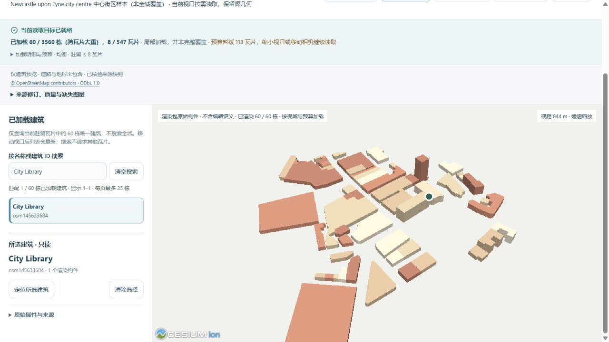
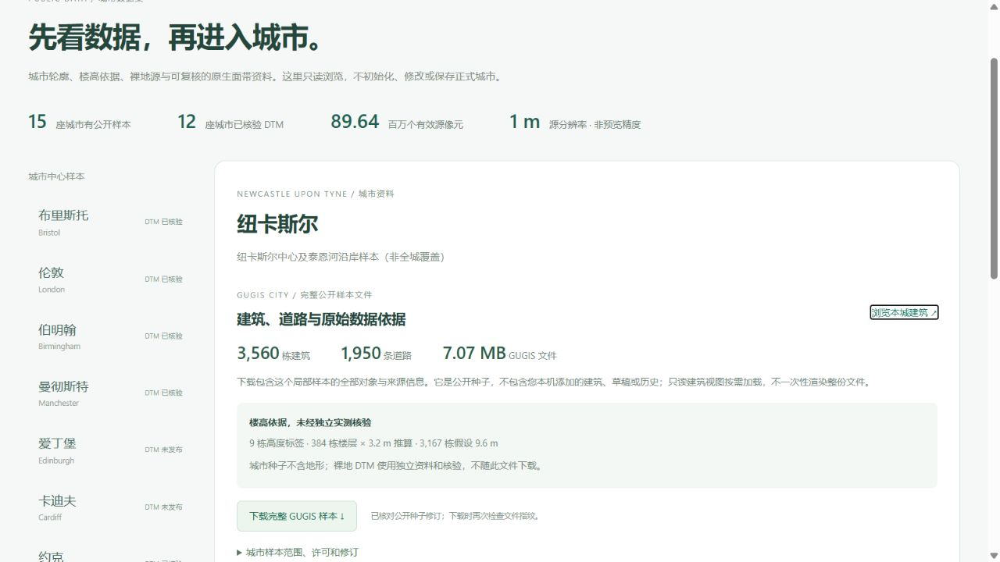

# 纽卡斯尔真实城市样本与有界加载

[打开中心街区低资源浏览](http://127.0.0.1:5173/?city=newcastle&cities=newcastle&view_mode=tiles&tile_profile=economy) · [来源、楼高与完整下载](http://127.0.0.1:5173/datasets?dataset=newcastle)。2026-10-05 新增 3,560 个转换建筑轮廓对象与 1,950 条道路；十五城公开种子累计 99,719 个建筑对象。对象数是转换 OSM ways 的模型数，不是独立实地普查的建筑总数。

## 数据范围与可信程度

查询窗口 WGS84 `[−1.637, 54.962, −1.588, 54.987]`，中心 `[−1.6125, 54.9745]`。保留完整跨界 ways 后，实际建筑和道路联合范围为 `[−1.6478735, 54.9564571, −1.5721692, 54.9913634]`，包含部分泰恩河南岸 / Gateshead 要素；城市名仅标识工作区，不是行政区全覆盖。市议会的[中央保护区资料](https://www.newcastle.gov.uk/services/planning-building-and-development/historic-environment-and-urban-design/conservation-areas)提供城市历史背景，本窗口不是官方保护区边界。

真实源含 3,561 个建筑 ways，3,560 个转换成功；退化轮廓 `211661633` 因不足三个非共线顶点明确拒绝。1,966 个有名道路 ways 中 16 个 `area=yes` 不按道路中心线转换，剩余 1,950 条全部转换。没有取得多边形 relations 或建筑庭院拓扑，不保证轮廓无重叠。

9 个建筑采用 OSM 高度标签，384 个按楼层 × 3.2 m 估算，3,167 个缺失两者而假设 9.6 m；标签高度也未独立核验。道路宽度是显示假设。St Nicholas Cathedral、Newcastle Castle - Keep、Grainger Market 等源对象存在，但仅为 LoD1 挤出体，不称为精细立面、塔尖或室内复原。

原始下载 3,858,310 B，SHA-256 `c11adb25e98b797d91f5b9be12c3ba45f0ddbacf34d7d9b25bd616785946521c`，本机留存。公开源去除 439 个无关联系方式及自由文本标签，全部 IDs、几何和保留建模标签保持一致；公开源 2,933,023 B，SHA-256 `603f60647d60a9c8413994c2aff4ee7d5f754b0a62bc4fc3161f6a0524eb6353`。获取时间 `2026-10-05T15:15:01.134244+00:00`，OSM 数据时间 `2026-10-05T15:13:01Z`，© OpenStreetMap contributors，ODbL 1.0。

## 只读渲染与恢复

完整 GUGIS 种子 7,073,977 B，SHA-256 `f05d9401a907296333bb1e7c1852d0f0148aaae9d3105f1f950e5aa8830117cf`。全部保留对象已从公开原源重新转换并逐字节核验；拒绝对象及楼高计数随清单发布。

125 m 分块共 547 个瓦片、5,275 个跨瓦片引用、3,560 个唯一建筑；瓦片合计 6,278,210 B，最大单片 66,592 B，清单 302,745 B。包 SHA-256 `de15c69402475551f1e7689e9eb95f4354cf66df174c354458bbd68194434180`。重复跨界引用不重复计入建筑数量，有限 GPU 驻留与请求预算保持原规则，数字是源文件字节，不是 GPU 内存占用。

真实浏览器初始低资源加载 16 / 3,560 个唯一对象、2 / 547 个瓦片；均衡加载 60 个对象、8 个瓦片，113 个目标瓦片因预算暂缓。检索并选择 City Library `osm145633684` 后，镜头六项参数保持一致；均衡切回低资源也保留镜头并明确重置建筑选择。当前只读场景仅渲染建筑，完整种子另存道路；地形尚无该城市独立核验源，页面标为待取得，不借用其他城市 DTM。

镜头核验值：`−1.6152634,54.9696072,572.782,17.9977354,−45.005128,0.0000024`。选中建筑显示一个渲染构件，并不代表该建筑已完成精细构件建模。

## 验收与保护

739 项前端检查及生产构建（24.82 s）通过，含所有十五城在四组视口与两种预算下的真实 Cesium 相机数学和有界读片检查。336 项后端检查通过，其中 319 项通过、17 项 Windows 不适用跳过。真实浏览器下载的完整公开 GUGIS 文件长度、SHA-256 与全部字节一致；数据集页零画布且无警告/错误，明确显示本城 DTM 尚未取得。对比研究 52 项检查为上一发布阶段结果，本次未重写地形研究或绑定算法。

原有十四城工作区记录、源数据与公开种子指纹不变；三个正式项目及 43 份历史指纹一致。新增城市只读预览没有初始化 `.local/cities/newcastle/current.gugis.json`，不自动保存为正式数据或改写已有项目。
