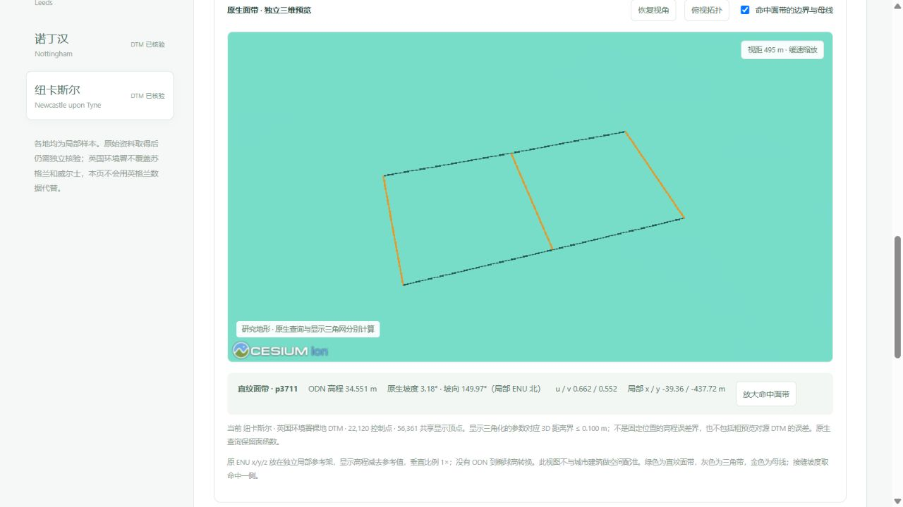

# 纽卡斯尔真实裸地数据与固定样区对照

2026-10-06。数据集入口 `/datasets?dataset=newcastle`；对照入口 `/compare?terrain_scope=newcastle&terrain_site=newcastle-north-quarter&terrain_target=0.25#newcastle-terrain-results`。

本次新增独立的英国环境署 2022 年复合裸地 DTM，覆盖纽卡斯尔中心及泰恩河沿岸局部区域。公开城市建筑种子、裸地数据、研究样区分开存档；未创建或替换本机纽卡斯尔正式城市。

## 真实数据

来源为[环境署官方数据集](https://www.data.gov.uk/dataset/01b3ee39-da3f-47b6-83da-dc98e73a461f/lidar-composite-dtm-2022-1m)，通过官方 WCS 按固定窗口取得。WGS84 查询框 `[-1.637,54.962,-1.588,54.987]`，BNG 外接框 `[423326,563101,426479,565901]`。源文件为 3,153 × 2,800 个 1 米 Float32 像元，8,828,400 个有效像元，无缺测；高程 −1.370681 至 103.050003 米 ODN。

无损 GeoTIFF 为 16,423,603 字节。逐块读回核验全部像元、坐标、NoData 和比例偏移一致。原始下载 SHA-256 `94b070c3ccb2fde4b87fec228ebce9c1406ee9fc188d5d22f8309cf2c5cffc6a`；公开 TIFF SHA-256 `10bc07588b0b7d491b6894a2e17004b5c52c88de9c77c1ac66566d8498dafee7`。

粗预览使用 20 像元步长，22,120 控制点、8,221 条直纹面带和 2,760 条三角带记录。4,096 个预先固定的唯一有效源像元全部命中，原生函数相对源 RMSE 0.495785 米、最大绝对差 5.543664 米；全部控制点查询误差小于 10⁻⁹ 米。粗预览不具有 1 米源分辨率对应的精度保证，不作独立地面精度声明。

来源目录新增为 `public-terrain-sources-v8.json`，保留 v1–v7 原件与 v7 的全部十二城记录。十三城已发布 DTM 合计 98,467,342 个有效像元；十五城公开建筑样本合计 99,719 个对象，各城均为局部覆盖。苏格兰和威尔士的 DTM 不用英格兰数据替代。

## 固定样区与比较结果

样区在拟合前固定为源栅格中心列的中心行及北侧四分位行，各取 65 × 65 原始像元中心、完整 64 × 64 米范围。连续参考为源像元之间的双线性函数。两种构建器均保存原生函数、计算完整域 E₂ 与最大参考界；抽查误差单列。真实 DTM 不满足论文严格凸 C² 假设，此处对齐 E₂ 和实际三角形 N，未冒充论文 L₂/L₁ 算法运行。

| 样区 | 目标 | 三角带 JSON / B | 同几何 MultiPatch 五组件 / B | 同几何节省 | 局部分区 JSON / B | E₂ 三角 / 分区 · m² | 分区实际直纹四边形 |
|---|---:|---:|---:|---:|---:|---:|---:|
| 中心 | 10 cm | 4,096 | 5,890 | 30.5% | 4,435 | 1.677537 / 2.084095 | 0 |
| 中心 | 25 cm | 725 | 1,130 | 35.8% | 725 | 4.775202 / 4.775202 | 0 |
| 中心 | 50 cm | 725 | 1,130 | 35.8% | 725 | 4.775202 / 4.775202 | 0 |
| 北侧 | 10 cm | 51,337 | 69,906 | 26.6% | 62,552 | 1.628329 / 1.645792 | 39 |
| 北侧 | 25 cm | 27,014 | 37,234 | 27.4% | 36,208 | 3.856880 / 4.174717 | 4 |
| 北侧 | 50 cm | 14,857 | 20,778 | 28.5% | 22,892 | 7.072061 / 7.503271 | 0 |

六对三角模型 / MultiPatch 的 XYZ、带分组、有向三角形及所列来源属性逐项读回一致；SHP、SHX、DBF、PRJ、CPG 全部计费。文件体积节省不等于内存节省、GPU 提速或 ArcGIS 软件实测。ZIP 为恢复包，不作为文件表示代价。

局部分区在四档的文件与全域 E₂ 上均不占优，中心两档相同。网站保留这些结果并推荐三角带候选；这不改变函数型直纹面在独立解析结构示例中的优势。完整记录包含十二个模型、六个同几何 MultiPatch 对照、49,152 次原生查询和两套恢复包。

统一十城二十个样区的同几何总文件节省，按字节求和计算而非平均百分比：10 cm 为 `1−552534/754936 = 26.8105%`；25 cm 为 `1−213279/296624 = 28.0979%`；50 cm 为 `1−102399/144184 = 28.9803%`。布里斯托早期实验继续单列。

## 核验与复现

新增研究流程采用独立脚本与版本，不改历史源、算法及核验回执。`build_newcastle_terrain_benchmark.py` → `audit-newcastle-terrain-benchmark.mjs` → `publish_newcastle_terrain_benchmark.py`；发布器核验父报告、脚本、源、模型、查询和完整 MultiPatch。`build_terrain_result_view.py` 为 UI 生成 10,069 字节的展示子集，绑定完整 30,944 字节发布报告，全部展示指标与下载指纹有专门校验；完整报告继续下载。

实际浏览器已核验三维显示、点击函数查询、放大面带、样区/精度切换、刷新恢复、图片和下载。下载的 16.42 MB TIFF、当前三角 JSON、北侧 ZIP 指纹与发布资料一致，ZIP 31 个成员逐字节相同。结果页默认无 canvas，无新增浏览器错误。正式四城和原有 43 份历史数据指纹保持一致。

验证记录：完整前端 755 项通过，后续新增展示子集核验后四项相关测试通过；后端 339 项中 322 项通过、17 项条件跳过；研究 62 项通过。最终生产构建通过，对比主模块 496.08 kB，完整科学证据未缩减。

许可：© Environment Agency copyright and/or database right 2022. All rights reserved. [Open Government Licence v3.0](https://www.nationalarchives.gov.uk/doc/open-government-licence/version/3/)。原 ODN 米高程保留，不作椭球高转换。官方单项测量精度说明不等于本预览的误差保证；WCS 单位字段与正文冲突已在资料页保留说明。
