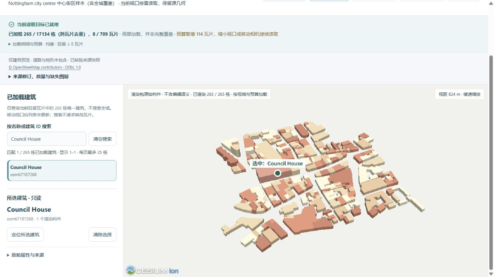
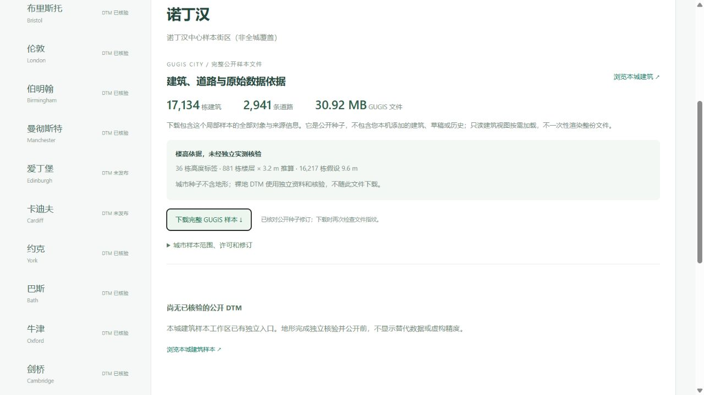

# 诺丁汉中心街区：保留较大样本，按需浏览

2026-10-05 新增第十四座城市。公开样本含 **17,134 个转换建筑轮廓对象、2,941 条道路**，十四城合计 **96,159 个建筑对象**。轮廓 ways 数不等于独立普查实体数，所有覆盖均为局部样本。

## 来源、范围与完整性

[市政资料](https://www.nottinghamcity.gov.uk/information-for-business/planning-and-building-control/planning-policy/conservation-areas/)将旧市场广场地区描述为历史和市政核心；本项目独立选择的查询框 `[-1.172,52.939,-1.123,52.967]` 不是官方边界。完整跨界 ways 保留，实际建筑与道路合并范围 `[-1.1770676,52.9345439,-1.1173373,52.9698999]`。既有英国城市登记中关联 `uk-eng-nottingham`，登记原件不变。

OSM 原始响应 **14,701,509 B**，SHA-256 `c92fae509d7e5cb54c4797ffee0d80df6ce948561032caff6563926e85980993`，下载时间 2026-10-05T14:46:49.158744+00:00，原件本地保留。公开响应 **11,256,877 B**，SHA-256 `59654da4e1f2c57ed9b96c4575578fd2ef46f0fe902af8fbb52adae5ad076ad7`；仅删除 1,514 个无关联系／自由文本标签，每个 ID、几何和保留标签均逐项一致。

17,142 个带 building 标签的源 ways 中一个标为 building=no，不计入建筑。17,141 个候选中拒绝七个：`85406503`、`165120766`、`653579100` 有非零 min_height；`273376471`、`292975280` 有非零 building:min_level；`363152364`、`409365982` 是不支持的 building:part。实际原因全部在 nottingham-import.json，不把悬空或部件默认落到地面。2,958 个道路 ways 中 17 个面积道路不进入线状模型，保留 2,941 条道路没有转换失败。

楼高来自 **36 个 height 标签、881 个楼层 × 3.2 m 推算、16,217 个假设 9.6 m**，没有独立测量核验。保存 Council House、Nottingham Castle、St Mary's Church 等名称和轮廓；仅 LoD1，不声称圆顶、立面或室内复原。未取得 multipolygon relations，不保证庭院孔洞或复合关系；道路宽度属于显示假设，桥梁与隧道竖向高程未恢复。源生命周期和类型标签留存，不以体量证明现实状态。

© OpenStreetMap contributors，[ODbL 1.0](https://opendatacommons.org/licenses/odbl/1-0/)；数据许可与软件许可分开，见[来源许可](../backend/data/cities/CURRENT_DATA_LICENSE.md)。城市种子不包含独立裸地或本机草稿、正式项目、历史。

## 扩展有限容量

首次完整转换触发旧 15,000 对象上限，明确失败，没有产生部分城市档案。城市资产和实例上限扩展为 **20,000**；道路 10,000、实例化语义节点 300,000 及原有文件／请求字节上限保持。20,000 实例边界实际验证可通过，20,001 实例及 20,001 资产分别拒绝。既有节点总量超限拒绝仍纳入完整回归。

公开 GUGIS **30,922,073 B**，SHA-256 `858b1578db64b0845a004b15be0c8cc24119f960b5b5c158a897bd76efb1ef01`。从公开源重建全部对象和元数据，字节完全一致；没有按前 15,000 个截断。该容量是档案边界，不代表所有对象同时驻留渲染，也不是 GPU 内存结果。

## 分块与真实浏览器

125 m 瓦片 **709 个**，21,005 条跨格引用去重为 17,134 个对象；瓦片总字节 **21,294,688 B**、最大 **126,245 B**、清单 **393,329 B**。完整几何在相交瓦片中保留，显示按源 ID 去重。只读预览不包含道路或地形。

实际低资源加载 **105 栋 / 2 瓦片**，均衡 **265 栋 / 8 瓦片**，当前视域另有 114 个瓦片按预算暂缓。搜索 Council House 命中 `osm67187268`，选择前后六项镜头参数不变；返回低资源仍保留镜头。搜索仅查当前驻留对象，不是假称全城查询。示例只是轮廓体量，不把单个渲染构件当作建筑精细结构。

数据页默认 0 画布，显示本城数量、文件大小和全部楼高依据，独立 DTM 尚未公开时明确标记。完整下载经浏览器取得，字节与上述种子一致，不包含私有修改。

## 独立裸地取得，尚待下一轮核验

EA 2022 WCS 原下载 **51,381,035 B**，SHA-256 `804f738f155361163628a8b56308d6cf1d19adf86c192599eb1c1885e354f731`，BNG `[455708,338276,459038,341431]`、EPSG:27700、1 m、Float32、ODN，3,330 × 3,155 = **10,506,150 个有效像元，0 缺测**，高程 17.810–103.540 m。原下载本地保留；尚未加入公开来源清单或网站预览，也不计入已发布十一城 DTM / 79,132,792 像元。取得不等于精度核验或发布；OGL v3.0 与 OSM 的 ODbL 独立。

## 回归与保留

723 项前端检查、331 项后端检查（314 项通过、17 项环境相关跳过）和生产构建通过。新增完整来源重建、七个实际拒绝对象、楼高与原件指纹、20,000 容量边界及超限拒绝测试。四种视口、两档实际相机预算覆盖十四城；数学／协议检查不冒称手机 GPU 或 FPS 实测。

既有十三城工作区记录、全部公开种子、十一城 DTM、六版来源清单、实验包与绑定地形算法保留。43 份本机历史和三个正式城市指纹一致，没有初始化诺丁汉正式目录。没有 ArcGIS 软件实测、运行内存或全城精度优势结论。
