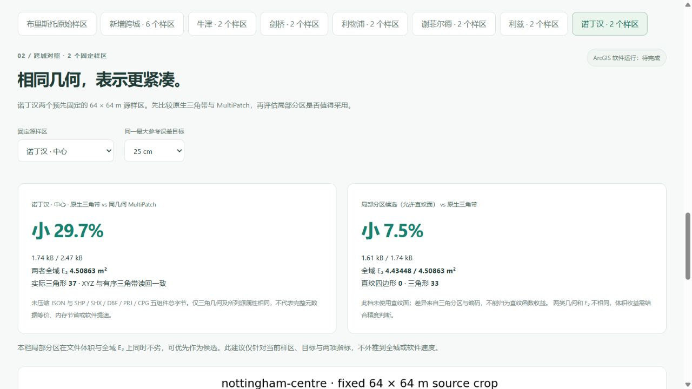
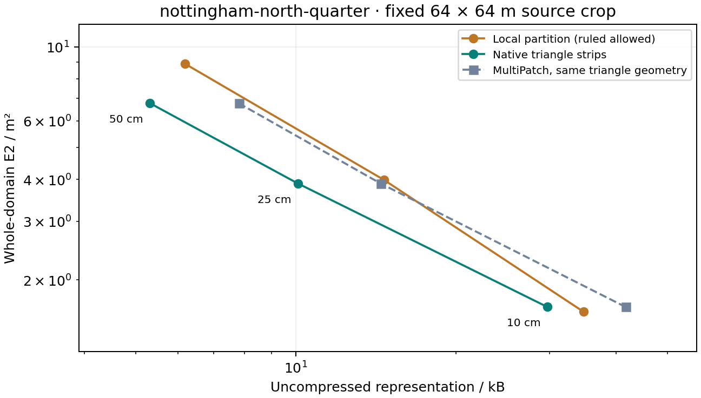

# 诺丁汉固定样区：全域误差与同几何文件对照

[中心 25 cm 结果](http://127.0.0.1:5173/compare?city=nottingham&terrain_scope=nottingham&terrain_site=nottingham-centre&terrain_target=0.25#nottingham-terrain-results) · [北侧 10 cm 直纹候选](http://127.0.0.1:5173/compare?city=nottingham&terrain_scope=nottingham&terrain_site=nottingham-north-quarter&terrain_target=0.1#nottingham-terrain-results)。2026-10-05，公开两个拟合前固定的源样区、12 个保存模型、49,152 次固定查询、全部控制点和六对同几何 MultiPatch。

原生三角带 JSON 比同几何 MultiPatch 五组件小 **28.8%–33.8%**。混合表达需要按地形选择：中心 25 cm 文件小 **7.5%**、全域 E₂ 低 **1.6%**，但没有直纹四边形，收益来自三角分区。北侧 10 cm 使用六个直纹四边形，E₂ 低 **3.3%**，文件大 **17.0%**。不将纯三角分区收益归为函数收益，也不隐去不利结果。



## 全部六对结果

T 为原生三角带，H 为允许直纹面的局部分区。T 与 H 几何不同；仅每个 T / MultiPatch 对的几何完全一致。字节为未压缩文件表示成本；E₂ 为完整 4,096 m² 域的积分范数，单位 m²。

| 样区 / 目标 | T / B | MultiPatch 五组件 / B | 同几何节省 | H / B | E₂ T / H · m² | 三角形 N T / H | H 直纹四边形 |
|---|---:|---:|---:|---:|---:|---:|---:|
| 中心 / 10 cm | 6,813 | 9,650 | 29.40% | 8,363 | 1.774427 / 1.599735 | 231 / 271 | 1 |
| 中心 / 25 cm | 1,740 | 2,474 | 29.67% | 1,609 | 4.508627 / 4.434481 | 37 / 33 | 0 |
| 中心 / 50 cm | 949 | 1,434 | 33.82% | 1,116 | 9.550515 / 10.833572 | 10 / 14 | 0 |
| 北侧 / 10 cm | 29,723 | 41,722 | 28.76% | 34,764 | 1.658836 / 1.604757 | 1124 / 1321 | 6 |
| 北侧 / 25 cm | 10,087 | 14,434 | 30.12% | 14,646 | 3.891235 / 3.988591 | 365 / 532 | 0 |
| 北侧 / 50 cm | 5,317 | 7,810 | 31.92% | 6,183 | 6.769473 / 8.895572 | 187 / 208 | 1 |

全部 12 个模型达到相应 10 / 25 / 50 cm 的最大参考界目标。六档 H 中五档文件更大、一档更小，三档 E₂ 更低、三档更高，共八个实际直纹四边形。北侧 25 cm 文件大 45.2%、E₂ 高 2.5%；北侧 50 cm 文件大 16.3%、E₂ 高 31.4%，虽含一个直纹四边形，仍不构成优势。




## 论文指标及比较边界

对齐 [Mirebeau 与 Cohen 论文](https://arxiv.org/abs/1101.1452) 的全域 L₂ 范数 E₂ 与实际三角形 N。这里三角构建采用最大误差优先、欧氏最长边和相容闭合，未实现论文的 L₂ 选区 / L₁ 选边；真实逐单元双线性 DTM 不满足严格凸 C² 条件，不套用 Hessian 形状理论或渐近最优结论。

每处固定 65 × 65 个原始 1 米像元中心，积分域为 64 × 64 米。模型与源单元求交后按 Float64 多项式 Gauss / Duffy 积分，包含保存高程的五位小数舍入。RMS = E₂ / 64。固定抽查 RMSE 另记，不替代全域积分。最大参考界含数值保护，不是区间算术证明；源参与拟合，不是独立地面真值。

每个三角带 / MultiPatch 对的 XYZ、带分组、有向三角形及选定来源属性读回一致。MultiPatch 成本包含 SHP / SHX / DBF / PRJ / CPG 五组件；完整 JSON 元数据未全部映射至 DBF。ArcGIS Pro 软件耗时、FGDB、GPU 内存和帧率仍无实测结果，ZIP 压缩体积不参与表示成本对照。

## 来源、复现与下载

源为 [EA 2022 1 m 裸地 DTM](https://www.data.gov.uk/dataset/01b3ee39-da3f-47b6-83da-dc98e73a461f/lidar-composite-dtm-2022-1m)，© Environment Agency 2022，OGL v3.0。源 TIFF SHA-256 `aa220d584298f36644185269a95c7156ed1a1edee3fd31d89ccb04b9613df70e`，绑定第七版来源清单。建筑、粗预览与认证样区独立，见[诺丁汉地形资料](nottingham_terrain_sample.md)。原生模型 XY 是样区中心 BNG 偏移；MultiPatch 为绝对 EPSG:27700；Z 均保留 ODN 米，不能直接作为城市 ENU 或椭球高。

```powershell
.venv/Scripts/python.exe data-pipeline/build_nottingham_terrain_benchmark.py --output .local/research/nottingham-reproduction-new
node frontend/scripts/audit-nottingham-terrain-benchmark.mjs .local/research/nottingham-reproduction-new
```

必须使用新目录。发布器核验源清单、脚本指纹、模型、查询、全域积分及同几何读回，拒绝覆盖已有公开证据。运行时间可能变化，不承诺计时字段逐位复现。

两个 ZIP 各含 31 个成员：六个模型、三套 MultiPatch 五组件、源参考、固定查询夹具、六份逐点 CSV、许可证与样区定义。

- nottingham-centre：1,249,719 B；SHA-256 `d07c5e5c4ad287ea63d5278a959690e8b92efe188f7e0ccbe7e110ec0b7a3a5b`。
- nottingham-north-quarter：1,282,169 B；SHA-256 `a7c212d635ba6a910ff65d6851c6617acf1b4d67339f899c462561b0758aa711`。

## 验收记录

730 项前端检查、52 项研究流程检查与生产构建（27.81 s）通过。独立重新计算 12 个模型的全域积分、固定查询及控制点，核对原像元、五组件几何与全部 ZIP 成员。真实浏览器验证中心 25 cm、北侧 10 cm、切换与刷新恢复、0 画布及无警告/错误。实际下载北侧恢复包，长度、SHA-256 与 31 个成员逐字节一致。汇总入口保留诺丁汉工作区，清除旧样区选择。正式城市与历史指纹核验一致；诺丁汉正式目录未初始化。本阶段不修改后端业务；334 项后端检查为前一阶段已通过的结果。
