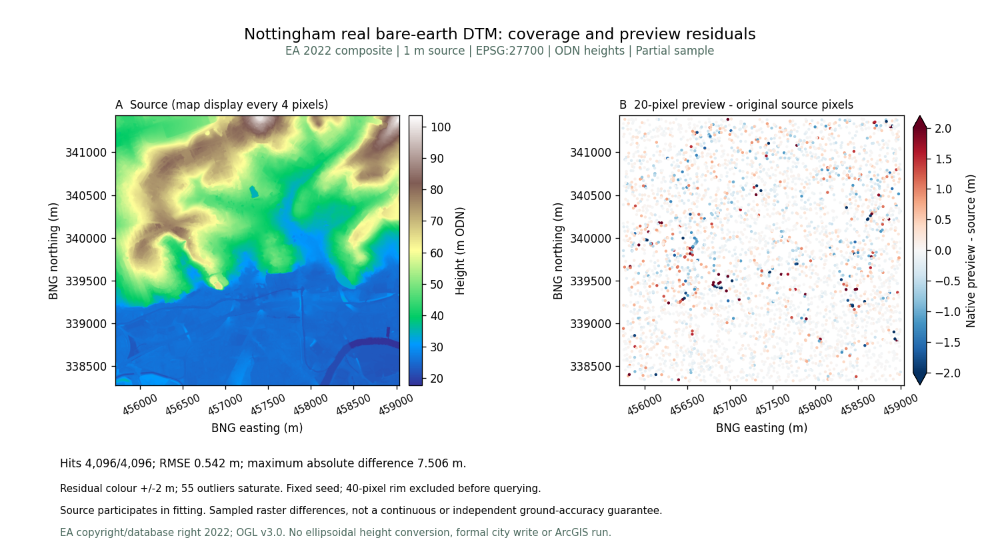
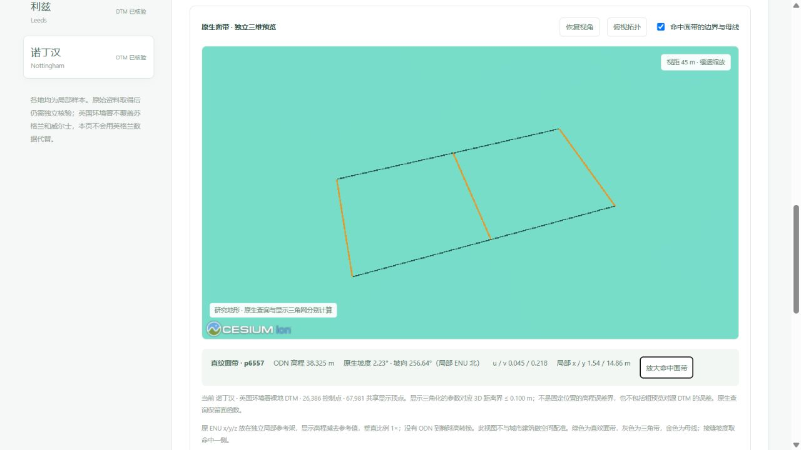

# 诺丁汉真实裸地：原生面带与查询核验

2026-10-05 发布独立 EA 2022 LIDAR Composite DTM 候选，中心局部样本与[建筑种子](nottingham_city_sample.md)分开保存、下载和浏览，不替换正式城市或默认高程配准。

## 来源、像元与保存

来自 [英国环境署官方裸地数据集](https://www.data.gov.uk/dataset/01b3ee39-da3f-47b6-83da-dc98e73a461f/lidar-composite-dtm-2022-1m) WCS，不是 Digimap 下载。查询框 `[-1.172,52.939,-1.123,52.967]`，BNG `[455708,338276,459038,341431]`；EPSG:27700、Float32 单带、1 m、scale 1 / offset 0。**3,330 × 3,155 = 10,506,150 个有效像元，0 缺测**，ODN 高程 17.810–103.540 m。WCS 单位字段与官方米制说明冲突的警示保留，没有椭球高转换。

原下载 **51,381,035 B**，SHA-256 `804f738f155361163628a8b56308d6cf1d19adf86c192599eb1c1885e354f731`。公开 TIFF **16,340,148 B**，SHA-256 `aa220d584298f36644185269a95c7156ed1a1edee3fd31d89ccb04b9613df70e`。只作无损 DEFLATE，全部像元、CRS、变换、NoData、scale/offset 与原件一致。保存压缩不归因为原生面带，也不作为 ArcGIS 软件速度结论。

© Environment Agency copyright and/or database right 2022，[OGL v3.0](https://www.nationalarchives.gov.uk/doc/open-government-licence/version/3/)。建筑 ODbL 来源独立。第七版来源清单保留第六版全部十一城记录与六版祖先 SHA；十二城合计 **89,638,942 个有效源像元**。

## 函数模型与全部抽查

20 像元采样预览保存 **26,386 个控制点、9,963 条直纹面带记录、3,068 条三角带记录**；不是实际面元 N。GUGIS 地形 **1,920,769 B**，SHA-256 `2d43755aa7e5a8753eab41d624720ca2b7bb07217ab6a0b2de0d8f9b466fa3dc`。直纹面保留两条边界之间的参数函数，查询直接作用于原生面，三角显示网单独生成。

固定 seed 20261005，预先排除 40 像元边缘后取 4,096 个互异有效原像元中心。全部命中，RMSE **0.541516 m**、MAE **0.260297 m**、P95 绝对差 **0.972395 m**、最大绝对差 **7.506092 m**。源参与拟合，不是留出真值；没有连续误差或独立地面精度保证。全部控制点命中，最大查询差 **3.553×10⁻¹⁴ m**。

误差色带为 ±2 m，55 个超过色带范围的点饱和显示，全部原数值仍在 4,096 点 CSV/JSON。源图的显示抽稀没有改变存档像元。核验 JSON、夹具、来源及版本化脚本指纹可复核；完整域 E₂ 认证是另一项实验，不用本页抽查替代。

## 实际浏览器

`/datasets?dataset=nottingham` 默认 0 画布，显示当前城市来源、控制点、RMSE 和最大差。明确打开预览并点击得到原生直纹面带 **p6557**：ODN **38.325 m**、坡度 **2.23°**、坡向 **256.64°**（局部 ENU 北）、u/v **0.045/0.218**。点击放大后视距约 45 m，黑色边界与金色母线可见。这是一处实际点查询，不代表整个城市坡度。

原生预览显示使用 **67,981 个共享顶点**，参数对应 3D 距离界 ≤0.100 m。此界不含粗预览对源 DTM 的差异，也不是固定 XY 高程界；垂直比例 1×。绿色为直纹面带、灰色为三角带、金色为母线。独立局部参考架没有同建筑配准。关闭后 0 画布，控制台无警告或错误；实际 GeoTIFF 下载与公开原件字节及 SHA 一致。

## 验收与研究边界

725 项前端检查、334 项后端检查（317 项通过、17 项环境相关跳过）和生产构建通过。新增全部源像元指纹、原像元查询、控制点、祖先链、只读下载及损坏候选拒绝测试；没有初始化诺丁汉正式目录。原来源、实验与绑定算法保留，43 份本机历史和三个正式城市指纹一致。

ArcGIS 软件、FGDB 与 GPU 内存未实测。本页不宣称独立地面精度、全城覆盖或软件速度胜出。
