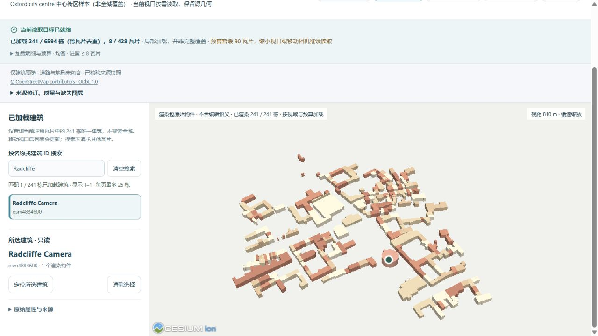
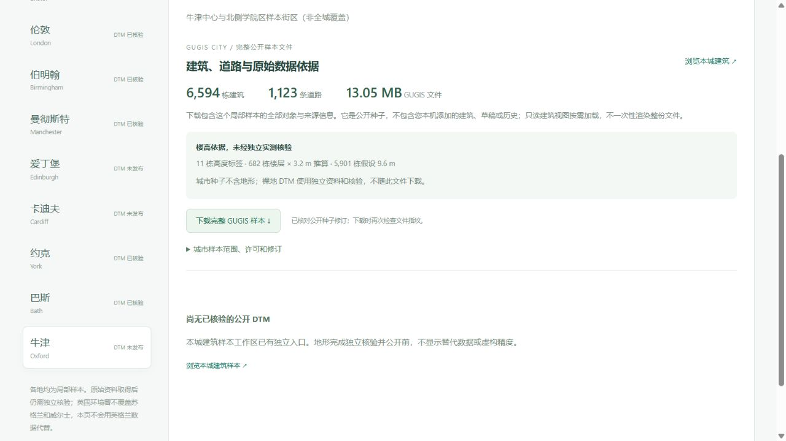

# 牛津真实中心街区

第九座独立城市样本加入牛津中心及北侧学院区：**6,594 栋真实 OSM 建筑、1,123 条道路**。九城公开种子总计 **55,413 栋建筑**，覆盖均为局部街区，不代表完整行政范围。

[只读分块入口](http://127.0.0.1:5173/?city=oxford&cities=oxford&view_mode=tiles&tile_profile=economy)；[公开城市数据下载](http://127.0.0.1:5173/datasets?dataset=oxford)。浏览不初始化或改写牛津正式项目。



## 来源、遗漏与精度

2026-10-05 使用公开 gall Overpass 实例取得有界 OSM 快照，查询框为 `[-1.273, 51.741, -1.235, 51.768]`，完整跨界 ways 保留。实际导入范围 `[-1.2779238, 51.7362408, -1.2284337, 51.7721437]`，比查询框更宽；不能把查询窗口当作精确的要素外包范围。

原始响应 6,191,917 B，SHA-256 `90f08997cbab1bf8f944e873074548c2f33ebc0728e2ef33d76fc774ca496398`；公开响应 4,746,341 B，SHA-256 `13bcfe1823fbe87436c3bdbd73e6c27b035016d8318cdf8996ef4a8e9941f18e`。删除 482 个无关联系或自由文本标签，保留对象 ID、几何、建模标签和署名。`oxford-source.json` 留存两种响应指纹及采集时间。

6,604 个建筑 way 中，10 个具有不支持的架空、地下、建筑部件或越界高度语义，被拒绝且不回退为假设地面建筑。ID 和原因见 `oxford-import.json`。导入高度来自 **11 个 height 标签、682 个楼层 × 3.2 m 推算、5,901 个假定 9.6 m**，均未经独立测量核验。

模型是 LoD1 体量，不是建筑立面、内部或穹顶复原。工作流未获取 multipolygon relations，因此 relation 中的庭院孔洞等复杂轮廓不在此次覆盖承诺内。列表包含 The Covered Market、Radcliffe Camera、Radcliffe Observatory 等源名称；它们是源轮廓和估算体量，不能称为精细地标模型。道路在城市种子中保留，当前只读建筑瓦片不加载道路或地形。

源提取与派生 GUGIS 数据库按 [ODbL 1.0](https://opendatacommons.org/licenses/odbl/1-0/) 分发，© OpenStreetMap contributors。[当前许可说明](../backend/data/cities/CURRENT_DATA_LICENSE.md)独立维护，历史候选包许可原件不变。

## 分块与下载

公开城市种子 **13,046,989 B**，SHA-256 `69b079c6c0dd7cb147b2da34e61eddc7ba5761bad2d1d702f7f6624126619594`。125 m 格网形成 **428** 个瓦片，跨格引用 8,452 条，去重为 6,594 栋。瓦片共 10,490,161 B，最大单瓦片 90,667 B，清单 236,634 B。每栋采用完整源构件回退，未替换源建筑轮廓。

低资源仍最多驻留 2 瓦片 / 2 MiB，均衡最多 8 瓦片 / 8 MiB。它们限制源数据字节，不是实际 GPU 内存。初始桌面视口分别实际加载 50 / 241 栋；这是当前视口和预算结果，不是城市固定总量或完整覆盖。

```powershell
.venv/Scripts/python.exe data-pipeline/acquire_city_samples.py --cities oxford --output-dir .local/sources/oxford-new --method GET --endpoint https://gall.openstreetmap.de/api/interpreter
.venv/Scripts/python.exe data-pipeline/prepare_city_source.py --city oxford --source-dir .local/sources/oxford-new --output-dir .local/staging/oxford-new
.venv/Scripts/python.exe data-pipeline/import_city_samples.py --city oxford --source-dir .local/staging/oxford-new --output-dir .local/staging/oxford-new
.venv/Scripts/python.exe data-pipeline/build_render_tiles.py .local/staging/oxford-new/oxford.gugis.json --city oxford --output .local/render-cache-new
```

新采集可能获得更新快照。命令拒绝覆盖已保留来源或种子，应始终使用新目录。公开下载按实际长度与 SHA-256 核验，不读取本机正式项目或历史。



## 已下载但未发布的真实地形

本轮已取得 [EA 2022 官方 1 m 裸地 DTM](https://www.data.gov.uk/dataset/01b3ee39-da3f-47b6-83da-dc98e73a461f/lidar-composite-dtm-2022-1m) 原始裁片，保存在忽略的本地来源目录。BNG 范围 `[450264, 204949, 452919, 207980]`，EPSG:27700，一带 Float32、scale 1 / offset 0；2,655 × 3,031，**8,047,305** 有效像元，0 缺测，源 ODN 高程 53.168–76.355 m。

原始下载 37,749,443 B，SHA-256 `3224070af7138c6b8e35b24a8775cf5da64cbbdd0dd345f801d0177c03ac2d2d`。这只是采集与栅格审查；无损发布、原生预览查询、残差图和网站接入仍待独立核验。因此当前城市种子**不含地形**，网站不会把这份待核验源文件冒充可用预览，也未把它写进正式城市。

下一阶段采用独立版本的公开地形清单，保留目前六城清单及已发布跨城对标指纹。添加牛津不能改写旧研究结果，或令已发布 ZIP 的核验失效。EA 数据发布还需 OGL v3.0 与 © Environment Agency copyright and/or database right 2022. All rights reserved. 署名。

## 验收

635 项前端全套测试、305 项后端检查（288 通过，17 环境相关跳过）及生产构建通过。牛津新增回归从公开 OSM 重建，逐项比较实例 ID、十个拒绝理由、楼高依据、实际种子 SHA 与分块尺寸；相机数学回归包含九城、四种尺寸及两种预算，和实际浏览器 GPU 验收分开记录。数据页最终文案及未发布地形守卫另通过 9 项针对性测试。

实际桌面浏览器验证低资源 / 均衡驻留数量、Radcliffe Camera 搜索与只读属性、选择保留视角及完整 GUGIS 下载。下载文件与公开种子 SHA / 长度一致。数据页不挂载三维画布；浏览未初始化牛津正式项目。八份既有公开城市、六城地形及旧对标文件指纹不变，43 份原始本地档案与三个正式城市保留检查通过。
