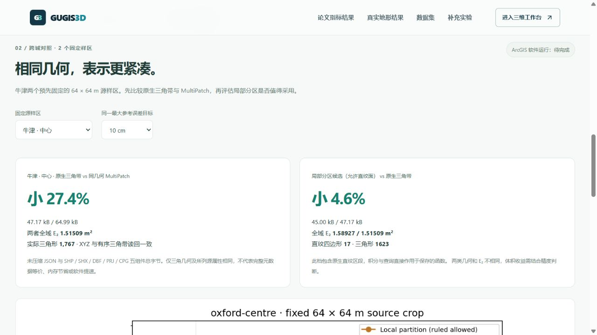
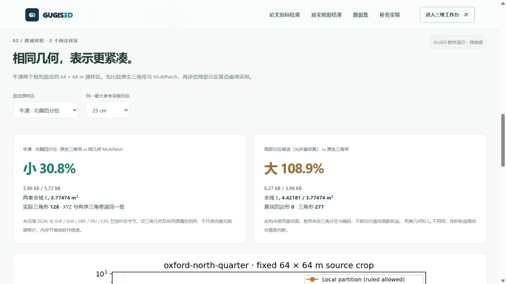

# 牛津固定样区：全域误差与表示代价

[直接打开牛津结果](http://127.0.0.1:5173/compare#oxford-terrain-results)。主结果页按布里斯托原始样区、既有六个跨城样区、牛津两个样区切换，保持误差目标，分别下载对应原件。牛津采用预先固定的源栅格中心与北侧四分位，不按结果好坏挑选位置。

## 结果先看精度，再看文件

两个样区各使用 65 × 65 个原始 1 m 像元中心，完整连续参考域为 64 × 64 m / 4,096 m²。三档最大参考界目标为 10 / 25 / 50 cm，每档保存局部分区（允许直纹面）与相容三角带，共 12 个模型。

| 样区 / 目标 | 三角文件 kB | 分区文件 kB | 分区体积变化 | E₂ 三角 / 分区，m² | 分区直纹四边形 |
| --- | ---: | ---: | ---: | ---: | ---: |
| 中心 / 10 cm | 47.169 | 45.000 | 小 4.6% | 1.51509 / 1.58927 | 17 |
| 中心 / 25 cm | 18.313 | 19.570 | 大 6.9% | 3.83539 / 3.79869 | 0 |
| 中心 / 50 cm | 8.615 | 9.627 | 大 11.7% | 7.16115 / 7.36657 | 0 |
| 北侧 / 10 cm | 13.911 | 20.805 | 大 49.6% | 1.72198 / 1.71216 | 0 |
| 北侧 / 25 cm | 3.957 | 8.265 | 大 108.9% | 3.77474 / 4.42181 | 0 |
| 北侧 / 50 cm | 1.743 | 1.323 | 小 24.1% | 6.15402 / 7.97776 | 0 |

中心 10 cm 档含真实直纹区段，混合文件小 4.6%，全域 E₂ 高 4.9%。北侧 50 cm 档没有直纹面，体积小 24.1% 但 E₂ 高 29.6%；这种差异来自三角分区与编码，不能归为直纹函数收益。北侧 25 cm 档的分区文件与 E₂ 都更大，应保留三角候选。十二档均满足各自最大参考界目标，同一最大界目标不代表 E₂ 相同。





## 与 ArcGIS 比较的具体证据

六个三角模型各导出同几何 MultiPatch：原生 JSON 与 SHP / SHX / DBF / PRJ / CPG **五组件总字节**比较。原生文件分别小 **27.4%–32.6%**。读回核验 XYZ、条带顺序、三角形朝向、重复构件以及记录中的源指纹、容差和 ODN 属性。未对非零坐标取整，规范化浮点零的符号用于几何摘要。

XY 在原生模型中为样区中心 BNG 偏移，在 MultiPatch 中为绝对 EPSG:27700；Z 原样保留 ODN 米。只对齐三角几何及所列源属性，原生完整元数据不宣称等价。混合函数与三角模型几何不同，因此不放进“同几何格式节省”的分母。

这是 ArcGIS **兼容文件格式**证据，没有执行 ArcGIS Pro；文件优势不是运行耗时、GPU 内存或 FGDB 空间优势。页面保留“软件运行：待完成”。压缩恢复 ZIP 包含源、模型、误差与许可附加资料，其体积不作为上述五组件代价基线。

## 论文指标与方法边界

对齐 [Mirebeau / Cohen 论文](https://arxiv.org/abs/1101.1452)的全域 L₂ 范数 E₂ 与实际三角形 N，单独报告直纹四边形数量。E₂ 对保存的原生函数直接积分；RMS = E₂ / 64，不能用有限抽查 RMSE 代替。使用源单元裁切后的多项式 Gauss / Duffy Float64 积分，包括保存高度的舍入。最大参考界来自完整参考域检查及 Float64 数值保护，不是区间算术证书。

三角法为最大误差优先、欧氏最长边、相容闭合；它没有实现论文的 L₂ 选区 / L₁ 选边规则。真实 DTM 的分片双线性参考面不满足严格凸 C² 假设，本轮不套用论文 Hessian 形状指标或近最优定理。论文式解析实验仍在主页面单独展示。源 DTM 参与建模，不是独立地面真值。

## 可复核与保护

每份原生模型在同一组固定 4,096 点及全部控制点查询。共 **49,152 次**样点查询全部命中；控制点误差小于 1e−9 m，全部抽查误差在各自完整参考界以内。两份研究图保留两种方法与 MultiPatch 的全部档位。

新增版本化构建、核验与发布脚本：

```powershell
.venv/Scripts/python.exe data-pipeline/build_oxford_terrain_benchmark.py --output .local/research/oxford-new
node frontend/scripts/audit-oxford-terrain-benchmark.mjs .local/research/oxford-new
```

已发布目标拒绝覆盖。`publish_oxford_terrain_benchmark.py` 仅在未发布的目录下创建完整研究原件，先检查父指纹、脚本、查询 CSV、同几何读回与全域指标，再发布。旧六样区构建、核验、模型、清单和 ZIP 全部保留。

实际浏览器完成牛津深链接、目标与样区切换、两种范围切换及完整包下载，目标保留，旧样区选择不串入新范围；没有自动挂载 GPU 画布，控制台无警告或错误。下载的北侧恢复包 **1,258,513 B**，SHA-256 `42c3e37d24ff92123deff57928951227fabeab47b14d2c5efa599190adfffbeb`，与发布原件一致。

640 项完整前端检查、32 项数据管线检查与生产构建通过；新增检查独立重算十二份模型的全域积分、49,152 次原生查询及全部控制点，核对源裁片、几何、脚本和 ZIP 成员。三个正式城市及 43 份原始本地档案核验未变；九城公开种子、六城历史 DTM 对、旧六样区对标和父来源清单继续保持原字节。该轮未改后端服务，前一发布轮的 308 项后端检查记录独立保留。

EA 2022 LiDAR composite DTM，OGL v3.0；© Environment Agency copyright and/or database right 2022. All rights reserved. 源指纹来自[牛津裸地数据](oxford_terrain_sample.md)，不是城市建筑假设楼高。研究不读取或写入正式城市、草稿及历史。
