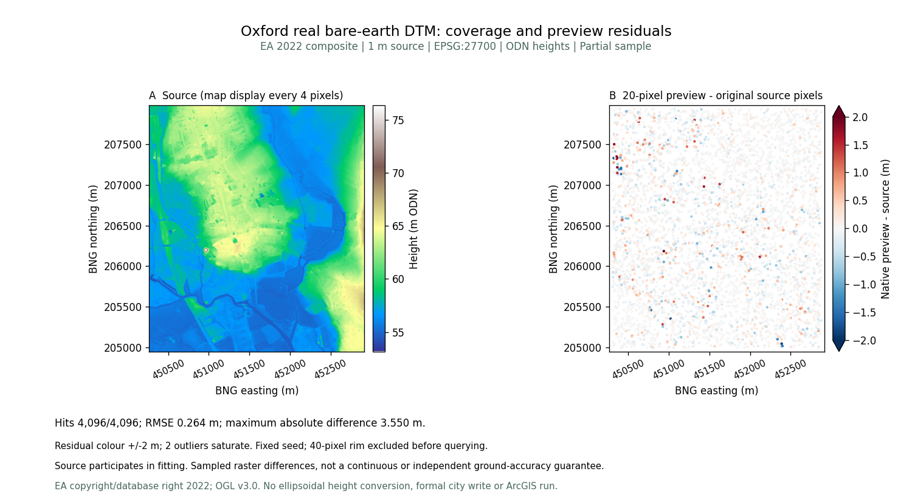
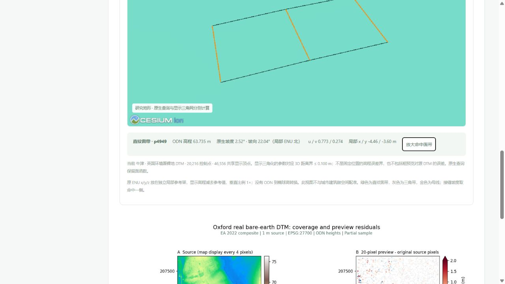

# 牛津真实裸地与原生面带

[打开牛津资料与只读三维预览](http://127.0.0.1:5173/datasets?dataset=oxford)。七城已核验 DTM 共 **45,204,043** 个有效 1 m 像元；九城建筑样本共 **55,413** 栋。建筑种子与地形来源独立，均为局部覆盖。

## 来源与无损发布

使用 [EA 2022 官方 1 m 裸地 DTM](https://www.data.gov.uk/dataset/01b3ee39-da3f-47b6-83da-dc98e73a461f/lidar-composite-dtm-2022-1m)。牛津裁片 BNG 范围 `[450264, 204949, 452919, 207980]`，EPSG:27700；2,655 × 3,031，一带 Float32，scale 1 / offset 0，**8,047,305** 有效像元，0 缺测，ODN 高程 53.168–76.355 m。

原始下载 37,749,443 B，SHA-256 `3224070af7138c6b8e35b24a8775cf5da64cbbdd0dd345f801d0177c03ac2d2d`。公开 DEFLATE GeoTIFF **16,384,213 B**，SHA-256 `1eedef8ec17cde26931abffcd37f0e90086cdef0c8b1e83345d17f8ac97593c7`；按块逐像元比较全部相同，网格、CRS、scale、offset 与缺测语义不变。源服务的单位元数据存在不一致，采集回执保留该警告；高度按官方 DTM 米 / Newlyn 说明解释。

采用 OGL v3.0，署名：© Environment Agency copyright and/or database right 2022. All rights reserved.

## 原生函数与误差

以原有 DEM 导入器按 20 像元采样生成独立 ENU 预览：**20,216 控制点**，9,708 条直纹面带记录、258 条三角带记录，仅用两类拓扑。面带记录数不等于组成面的数量。原生文件 **1,483,386 B**，SHA-256 `ee93537795473ec330dd143cb0f5f696998eaf6e630fcc0348dfe143a4f7390f`。

固定随机种子 20261005，预先排除 40 像元边框，从真实源像元中心选择 4,096 个唯一有效位置；原生函数查询全部命中。RMSE **0.2644895 m**，MAE **0.1438074 m**，P95 绝对差 **0.5421723 m**，最大绝对差 **3.5499553 m**。全部 20,216 个保存控制点查询命中，最大差小于 1e−9 m。

这些是粗预览相对参与建模的源 DTM 的抽查差异，不是独立地面精度、连续最大误差界或论文近最优证明。两处超出 ±2 m 图色带的点仍保留在原记录中。来源、CSV、原生查询回执及 PNG / SVG 科学图均在数据页可复核下载。

## 版本与正式数据保护

新增 `shared/public-terrain-sources-v2.json`，七项来源；前六项与旧清单逐项一致。父清单 SHA-256 `7658acdf236f9b434a16f230f69f68fd35f2a9e4eb7855d8db590e378bb64866`。后端同时核验新版指纹和历史父清单，历史六样区实验继续绑定原清单，未改写已发布模型、实验包或算法。

新版准备、原生审计和绘图分别使用 `prepare_ea_v2_city_terrain.py`、`audit-ea-v2-city-terrain.mjs`、`plot_ea_v2_terrain.py`。回执记录实际脚本与内核指纹；新采集需使用新的输出目录，不能覆盖已发布实验。

浏览、查询和下载不读取正式项目，不创建牛津工作区、草稿或历史。三维仅在显式打开后载入。显示采用 46,556 共享顶点，参数对应三维距离界 ≤0.100 m；这个显示界不是固定位置高程界，也不包括粗预览对源误差。ODN 未转换到椭球高，独立研究视图不与城市建筑做空间配准。

## 实际界面验收

点击牛津地形命中直纹面带 p4949：ODN 63.735 m，坡度 2.52°，坡向 22.04°，u/v 0.773 / 0.274。查询保持镜头；只有点击「放大命中面带」才放大金色母线。关闭三维释放画布，原始资料与误差图继续保留。

真实浏览器下载的 GeoTIFF 为 16,384,213 B，SHA-256 与发布文件一致。关闭预览后画布为零，控制台无警告或错误。637 项前端检查、308 项后端检查（291 通过、17 Windows 环境不适用跳过）、28 项数据管线检查及生产构建通过。一条旧文案断言修正后重新通过完整前端回归。

九份既有城市种子、六份既有 DTM 对、父清单和历史跨城对标原件逐字节 / 指纹保留；43 份原始本地档案与三个正式城市核验未变，牛津正式工作区未创建。上述浏览器核验在实际桌面内置浏览器完成，不是 Edge 或手机实测。

[城市来源与高度依据](oxford_city_sample.md) · [六样区论文指标与文件对标](multicity_terrain_benchmark.md) · [牛津固定样区对标](oxford_terrain_benchmark.md)。牛津粗预览与后续 64 × 64 m 原像元样区是不同档案，不借用彼此误差；ArcGIS 软件耗时仍需授权环境实测。
