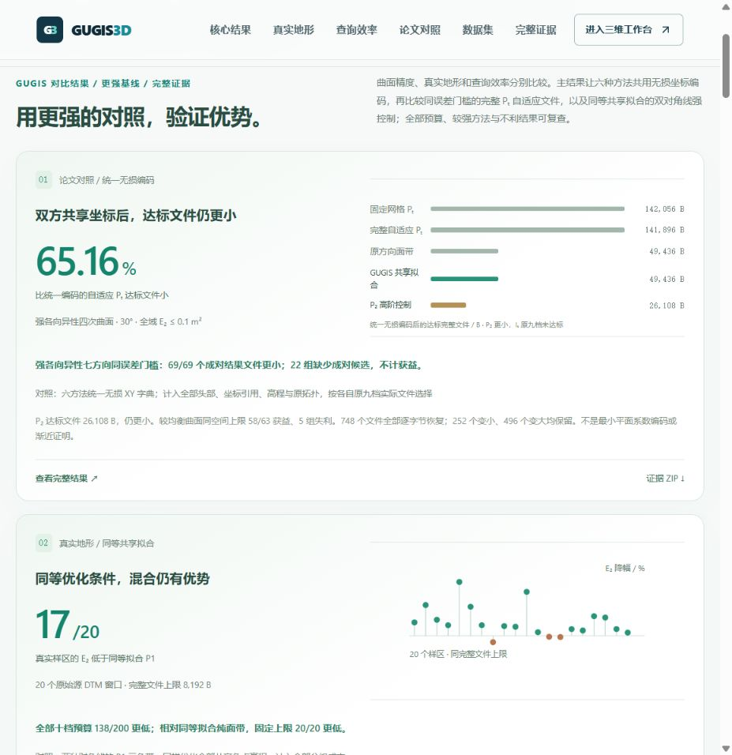
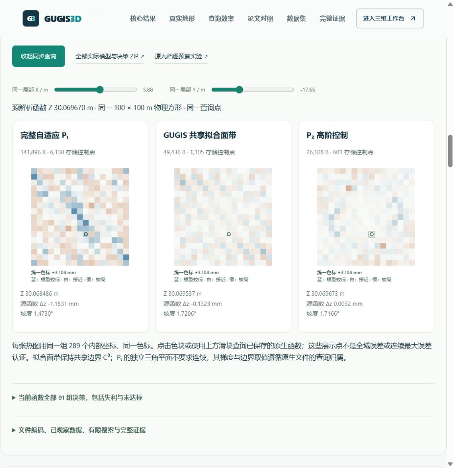

# 双方共享坐标后的完整文件对比

2026-10-06。入口：`/compare#paper-coordinate-results`；首屏：`/compare#validated-advantages`。

六种方法都采用同一个无损 XY 字典，保留每个原节点的独立高程、原顺序、原拓扑与原函数。比较的是**达到同一全域误差门槛所需的实际完整文件**，避免将 Pₜ 重复存储坐标的成本全部归因于算法。

## 当前结果

默认为本项目强各向异性四次曲面、旋转 30°、全域 E₂ ≤ 0.1 m²。每种方法只在原来九档已保存候选中选择最小达标文件；不新增细分档、不插值、不外推。

| 方法 | 新完整文件 / B | 全域 E₂ / m² |
|---|---:|---:|
| 原 Iₜ 贪心插值 | 保存候选未达标 | — |
| 固定网格 Pₜ | 142,056 | 0.073596970 |
| 完整自适应 Pₜ | 141,896 | 0.072819346 |
| 原方向面带 | 49,436 | 0.095515142 |
| GUGIS 共享拟合面带 | 49,436 | 0.039302605 |
| P₂ 高阶控制 | 26,108 | 0.037944037 |

GUGIS 相对自适应 Pₜ 的完整文件减少 **65.16%**；达标误差不必完全相等。P₂ 更小，并保留在同屏。相同 65,536 B 上限下，GUGIS 的 E₂ 为 0.039302605 m²，Pₜ 为 0.343130620 m²，降低 **88.55%**；P₂ 的 E₂ 为 0.017889493 m²，更低。

强各向异性曲面的七个方向和全部十三个误差门槛：69/69 个成对结果文件更小；22 组无成对候选不计获益。较均衡四次曲面在同空间上限下 58/63 获益、5 组失利。详情可切换曲面、方向、门槛和空间上限，全部六种方法的散点、未达标和不利结果保留。



## 编码与公平条件

GPC1 包含 64 B 头部（包括原 GPR3 的 48 B 头部）、16 B/项的 Float64 XY 字典、每个原节点的 4 B 字典引用与 8 B 独立 Z，以及原拓扑字节。坐标按原浮点位模式共享，不量化，不合并高程，不焊接 Pₜ 的不连续平面；正负零保留。各方法使用完全相同的编码规则，实际文件的全部开销均计入。

748 个原生文件中，252 个变小，496 个反而变大；全部保留。独立 Python 解码器逐字节还原全部原始 GPR3 文件，确保原高度、梯度、误差、接缝决策和拓扑完全不变。另独立穷举 1,932 项六方法选择及有限 Pareto 前沿。

这是对已经观察过的档案进行编码审计。v2 协议在新编码前固定：v1 的输入路径与 SHA 不匹配，校验在编码开始前拒绝；v2 只修正路径，规则和预算保持不变，拒绝的 v1 也在证据包中。该流程不是盲预注册的新精度实验。

原论文 Pₜ 的区域 L₂ 投影误差优先级与 L₁ 选边在原冻结实现中完成。该实验是本项目在有限候选上的算法复现；不是作者原软件、最小平面系数编码、渐近最优性证明或通用地形优势。E₂ 是全域函数误差，完整文件字节不是运行内存；ArcGIS 软件同机性能仍待测。

## 真实文件演示与复查

点击“展开文件精度原生同步查询”读取当前 Pₜ、GUGIS 和 P₂ 的真实 GPC1 文件。页面核对新文件 SHA-256 和逐字节还原后原文件 SHA-256，再运行冻结的原生查询函数。热图同色标，点击任意图中像元同步三者的坐标；切换或收起会取消旧请求。



完整证据包：`frontend/public/research/paper-coordinate-sharing-v1/coordinate-sharing-evidence.zip`，**10,680,499 B**，SHA-256 `e21f2272eeaad79228a13deb6290111487061c3dabd8f64e8d7c562f9f359ce0`。包含 748 个新 GPC1 与 748 个原 GPR3、全部选择 CSV、原研究积分及查询核验、冻结实现和修正协议。报告 SHA-256：`b637b5c8396a5f220be49693ee4abcf9900f5132122b1977af01f4e509315318`。

完整清单保持全部原回执；498 kB 页面视图仅移除原回执的重复说明字段，保留全部模型、完整候选、误差、决策、SHA 与原文件大小。详情按需加载，首屏不读取这批原生文件。

```powershell
.venv/Scripts/python.exe -X utf8 data-pipeline/build_coordinate_sharing_display.py --check
.venv/Scripts/python.exe -X utf8 data-pipeline/build_result_focus_v7.py --check
.venv/Scripts/python.exe -X utf8 -m unittest discover -s data-pipeline/tests -p test_coordinate_sharing_publication.py -v
```

发布测试核对全部 771 个索引条目、1,517 个 ZIP 成员与原文件真实字节；伪造缺失基线或非最小选择会被拒绝。前端检查流长度、两层 SHA、取消、失败重试、Pₜ 独立高程、完整前沿、失利和缺失结果，并保留旧对比入口。
