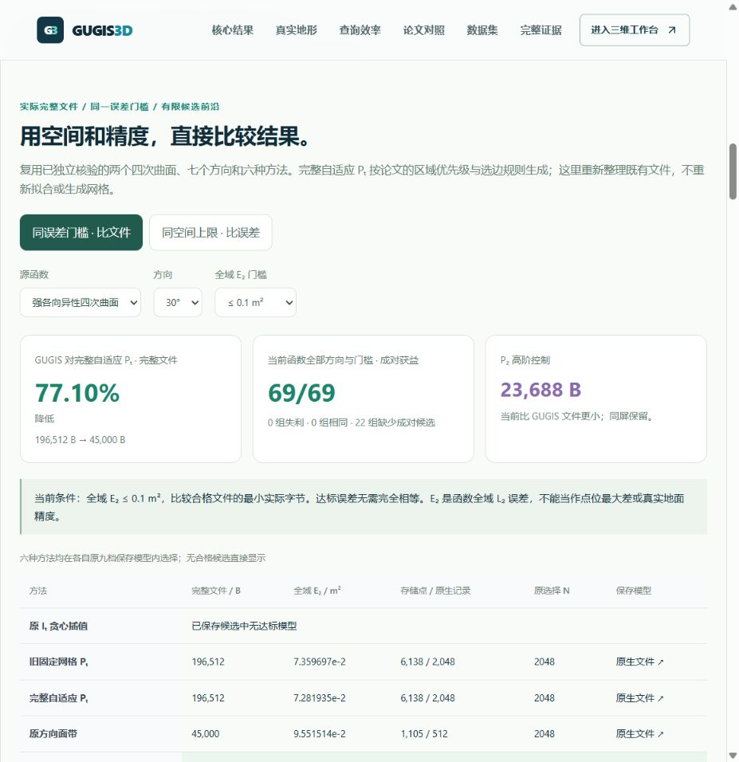
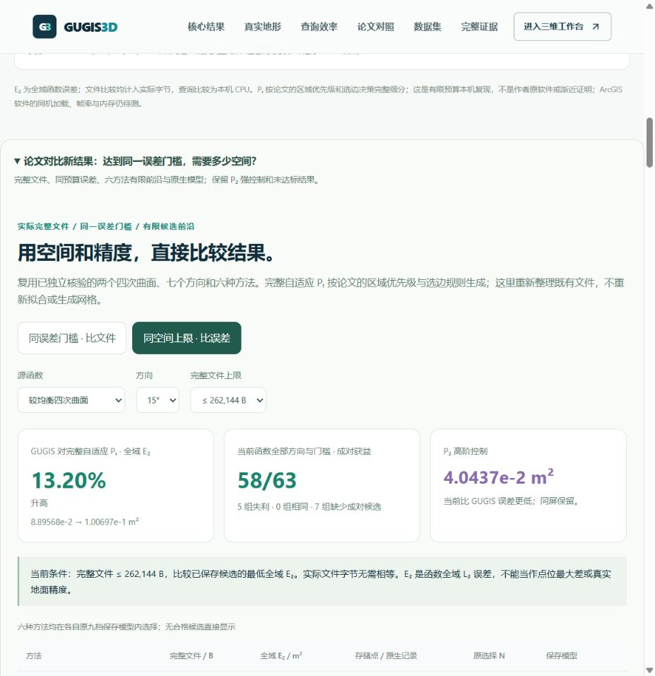
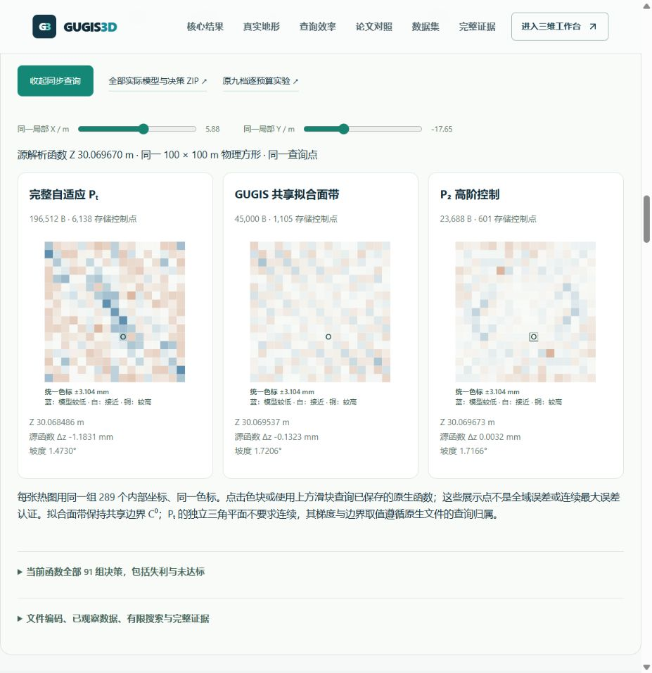

# 论文指标下的文件—精度结果（2026-10-06）

入口：`/compare#paper-frontier-results`。把已有实验转为两个可直接回答的问题：达到同一全域误差门槛需要多少实际文件空间，以及给定同一完整文件上限可取得多低误差。首屏采用新的约 21 kB `shared/result-focus-v6.json`；此前 v1–v5 完整保留。

## 当前默认结果

同一 100 × 100 m 强各向异性四次曲面、30°，目标 **E₂ ≤ 0.1 m²**。六方法各自从原九档实际保存模型中选择最小合格文件，不插值或重新调参。

|方法|最小达标完整文件|实际 E₂ / m²|
|---|---:|---:|
|原 Iₜ 贪心插值|原九档没有达标候选|—|
|旧固定网格 Pₜ|196,512 B|0.07359697|
|完整自适应 Pₜ|196,512 B|0.07281935|
|原方向面带|45,000 B|0.09551514|
|GUGIS 共享拟合面带|45,000 B|0.03930261|
|P₂ 高阶控制|23,688 B|0.03794404|

GUGIS 对当前完整自适应 Pₜ 的达标文件减少 **77.10%**；P₂ 达标文件仍更小。相同 **65,536 B 上限**下，GUGIS E₂ 为 0.03930261，完整自适应 Pₜ 为 0.34313062，降低 **88.55%**，P₂ 为 0.01788949，仍更准确。相同门槛不要求实际误差完全相等；相同空间上限不要求实际使用字节完全相等。



## 全部结果而非一个样例

十四个源函数/角度案例，六种方法，十个文件上限、十三个 E₂ 门槛。保存了全部 1,932 项方法选择以及未达标状态；前沿图显示所有现有候选，包括被支配模型，不连接为未测得的连续函数。

强各向异性七方向：同空间上限 **63/63** 个成对结果误差更低，另七个上限仅 GUGIS 有候选；同误差门槛 **69/69** 个成对结果文件更小，另十个门槛仅 GUGIS 可达标、十二个双方均未达标。单边缺失没有计为获胜。

较均衡曲面：同空间上限 **58/63** 获益、**5** 失利，另七组没有成对候选；同误差门槛 **65/65** 个成对结果文件更小，但五个门槛只有自适应 Pₜ 达标、二十一组双方未达标。页面可以查看这类没有 GUGIS 合格模型的情况。



## 原生文件的同点演示

点击“看当前达标文件的同点原生误差”，从已保存文件校验完整字节与 SHA 后直接查询 Pₜ、GUGIS 和 P₂ 函数。三张图采用相同 289 个位置与同一色标；点击任意热图同步坐标，也支持键盘滑块。

实际点击 P₂ 热图，将三个模型同步到 X=5.88、Y=-17.65 m。源解析函数 30.069670 m；Pₜ 差 -1.1831 mm、GUGIS 差 -0.1323 mm、P₂ 差 +0.0032 mm。这些点仅是演示，不替代全域积分或连续最大误差证明。



## 复现与边界

本轮是已经观察、公开的有限模型档案的后续分析，规则在生成新表前以独立提交冻结，不声称数据观察前的预注册。只用六方法原九档的保存选择，不代表所有网格、全部编码或全局最优。自适应 Pₜ 按原论文 §2.1、§2.4 和公式 (2.18) 的区域与边规则生成，不是作者原软件；两个曲面也是本项目自己的函数。

原生文件计入完整头、Float64 坐标、记录与索引。Pₜ 的独立 XYZ 平面表示会重复部分坐标，结果不代表最小平面系数编码。面带 C⁰ 连续，Pₜ 允许不连续；函数阶数不同，P₂ 控制始终保留。没有新增 RAM、GPU、ArcGIS 软件计时或独立地面真值测量。

独立审计穷举全部选择、支配关系和汇总，核对 **1,496** 个现有 JSON/二进制实际文件及其 SHA。完整 ZIP 包含它们、CSV、协议、三个前序研究的积分与原生查询核验，以及新分析/审计实现。下载包 **11,296,058 B**；实际浏览器下载到本机的文件与发布 SHA 一致：`6137cc832a37d45a5d9ab96b52a8c3d97374c755da15be73db5134dc4233c00a`。

报告 SHA：`484d573e47eaadc4f28c180763b5d9847038bf98a40a63f981a458d073c72e04`。

```powershell
python -X utf8 data-pipeline/paper_frontier_audit.py frontend/public/research/paper-finite-frontier-v1
python -X utf8 data-pipeline/build_result_focus_v6.py --check
python -X utf8 -m unittest discover -s data-pipeline/tests -p test_paper_frontier_publication.py
```

四项发布测试、十一项相关前端回归、TypeScript 和生产构建通过。实际浏览器已核验条件切换、失利/缺失、原生点击、键盘、ZIP 下载；390 px 页面宽度等于内容宽度，三张原生图按单列布局，宽表格在容器内滚动。旧原生内核、所有前序研究文件、四个正式城市、43 个历史快照与十三个原始 DTM 均保持。
