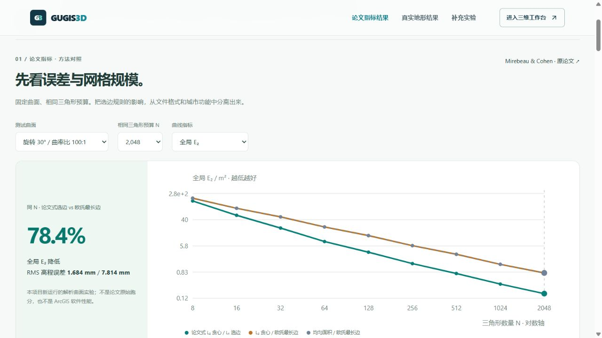
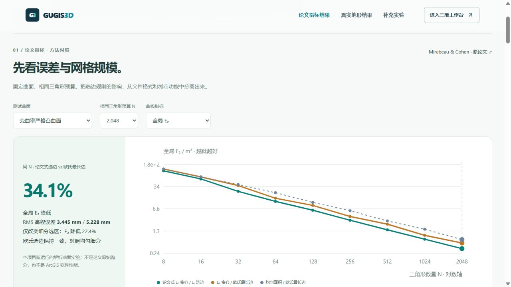
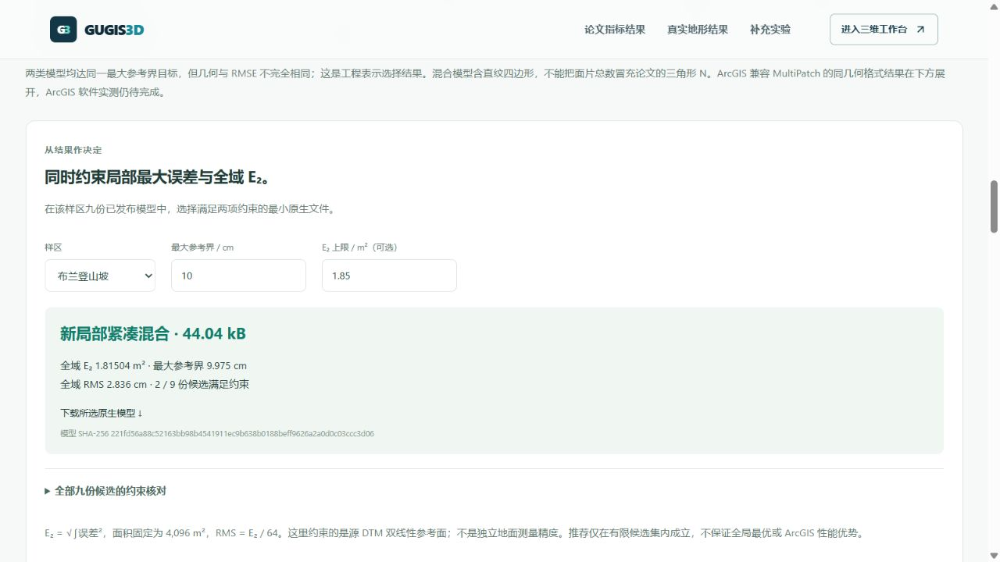

# 以论文指标组织地形对比结果

入口：`/compare#paper-results`。页面顺序是论文方法结果、真实城市结果、按需展开的完整证据；既有功能对照与研究实验收进补充区域。旧实验锚点可自动展开对应区域。收起时卸载补充实验，首屏不启动历史城市快照校对或研究三维渲染。

## 方法实验：同一三角形数量比较误差

参考 [Mirebeau 与 Cohen，arXiv:1101.1452](https://arxiv.org/abs/1101.1452)，本项目采用局部 L₂ 选三角形、子三角 L₁ 插值误差选边的二分算法，与欧氏选边及均匀面积细分作消融对照。不是论文图表的原始数据复现。

固定 100 × 100 m 域，两类严格正定二次曲面 `f(x)=30+xᵀQx` 和一类变曲率严格凸四次曲面，顶点线性插值，预算 8～2,048 三角形。二次闭式积分、四次精确次数 Gauss 积分得到 E₁、E₂，内部驻点与边极值得到 E∞；采用 float64。公开 81 组结果、九份末档网格、曲线与网格 PNG / SVG、源脚本及数据指纹。

| 旋转各向异性曲面，N = 2,048 | 论文式选边 | 欧氏最长边 |
|---|---:|---:|
| 全局 E₂ | 0.16843 m² | 0.78142 m² |
| 面积归一 RMS | 1.684 mm | 7.814 mm |
| E∞ | 7.349 mm | 18.236 mm |
| ρQ 中位数 | 4.989 | 26.199 |
| 末四档 E₂ 对数斜率 | −1.077 | −0.984 |

E₂ 降低 78.4%。各向同性曲面没有收益，完整列出；两种欧氏方法在这些常曲率曲面及所列预算下重合。斜率按 N=256、512、1,024、2,048 回归，是有限实验观测。N 是实际三角形数；ρQ / σQ 是 Hessian 度量形状指标。未强制相容闭合，不能把该实验的效率直接当作工程 C0 网格的效率，也不构成新的最优性证明。

变曲率曲面使用 `30 + 0.0001(x²+y²) + 5×10⁻⁷x⁴ + 8×10⁻⁸y⁴`。四次函数的 L₁ / L₂ 用 5×5 Gauss / Duffy 精确次数积分，E∞ 检查内部与边界全部驻点；形状指标采用三角形重心的 Hessian / 2。N=2,048 时，论文式选边的 E₂ 为 0.34446 m²，欧氏贪心为 0.52281 m²，均匀为 0.67361 m²。选边改善 34.1%，固定欧氏选边、只改变细分选区另改善 22.4%；两种作用分别检验。





## 真实城市：全域 E₂ 与存储代价

18 份已发布 Bristol 模型保持原字节，新增全域积分回执。每个三角形或轴对齐直纹四边形与触及的源栅格单元求交；在每个交域中，残差平方至多四次，采用 3×3 Gauss / Duffy 积分。积分覆盖全部 4,096 m²，模型保存舍入保留；RMS = E₂ / 64。不把混合面先离散，不用 4,096 抽查点代替全域积分。计算为 float64，多项式积分性质不等于机器区间证明。

| 10 cm 最大参考界目标 | 新局部混合 / 三角带文件 | 混合 / 三角带全域 E₂ | 结果 |
|---|---:|---:|---|
| 港区 | 23.09 / 49.79 kB | 1.06028 / 1.01562 m² | 文件小 53.6%，E₂ 略高 |
| 布兰登山坡 | 44.04 / 36.76 kB | 1.81504 / 1.88455 m² | 文件大 19.8%，E₂ 略低 |

页面可切换 10 / 25 / 50 cm 目标，与展开后的完整基准共享选择状态。三角形与直纹四边形数量分列；面片记录数不能冒充论文 N。误差参考是源 DTM 的连续双线性插值，不是独立实测地面。

全域精度决策同时限制最大参考界与可选 E₂ 上限，在每样区九份已发布档案中选择最小文件。山坡最大界 ≤10 cm、E₂ ≤1.85 m² 时，三角带超限，混合 44,037 B 满足；港区 E₂ ≤0.5 m² 时，则推荐原全局混合 60,805 B。无解明确显示，所有九份候选保留；下载地址对应准确模型与 SHA-256。该有限候选集选择不保证全局最优。



ArcGIS 对照继续使用同几何 MultiPatch 文件回读；实际 ArcGIS 软件尚未运行，本阶段不新增软件性能优势宣称。既有负面结果与恢复信息的额外成本保留。

## 复现与验证

```powershell
.venv/Scripts/python.exe data-pipeline/paper_metric_benchmark.py
.venv/Scripts/python.exe data-pipeline/plot_paper_metrics.py
.venv/Scripts/python.exe data-pipeline/raster_l2_audit.py
.venv/Scripts/python.exe data-pipeline/plot_bristol_l2.py
.venv/Scripts/python.exe -m unittest discover -s data-pipeline/tests -p test_paper_metrics.py
.venv/Scripts/python.exe -m unittest discover -s data-pipeline/tests -p test_raster_l2_audit.py
npm test --prefix frontend
npm run build --prefix frontend
```

两组新增研究数值检查共 13 项通过，涵盖独立积分、极值、形状不变性、末档网格覆盖、18 个真实模型重算与源指纹。前端完整 590 项通过，生产构建通过。真实浏览器核验曲面、预算、误差曲线、两层真实目标联动、展开旧链接、双约束与无解状态；下载模型与已发布文件 SHA-256 相同，控制台无警告或错误。正式三城与 43 个保留文件未改变。
