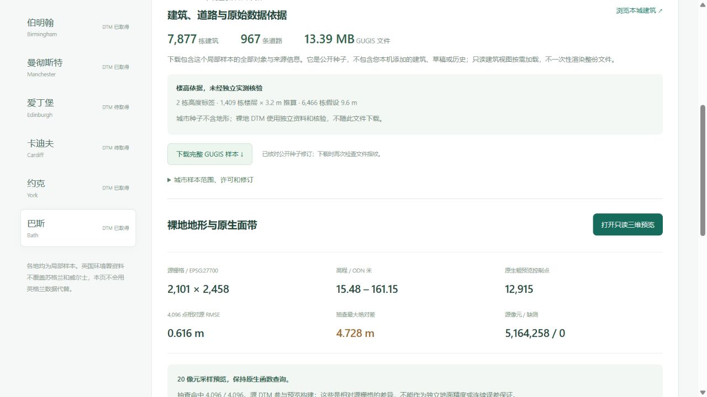

# 从数据目录下载完整 GUGIS 公开样本

当前已扩展至十三城公开种子、79,025 个建筑对象及十一城独立 DTM、79,132,792 个有效源像元。新增城市的取得与核验见[牛津](oxford_city_sample.md)、[剑桥](cambridge_city_sample.md)、[利物浦](liverpool_city_sample.md)、[谢菲尔德](sheffield_city_terrain.md)和[利兹建筑](leeds_city_sample.md)及[利兹地形](leeds_terrain_sample.md)。轮廓对象数量不等于独立普查实体数量。下文保留八城初次发布时的验收与截图，不能作为当前目录总数。

2026-10-05，`/datasets?dataset=bath` 等八城入口增加城市样本卡片。页面把 **城市文件** 与 **独立裸地 DTM** 分组：前者保留局部样本的全部建筑和道路，后者保留实测源栅格及原生粗预览。爱丁堡与卡迪夫的建筑样本可取回，但 DTM 仍显示待取得。

## 文件用途

点击「下载完整 GUGIS 样本」取得仓库中的公开种子原字节，可留存、复核或在新项目中导入。不是当前本机正式项目的导出，不包含用户后续添加的建筑、独立草稿或历史。完整文件中的全部对象也不意味着城市完整覆盖；只读建筑视图继续按视域和预算局部加载。

八城公开种子共 48,819 栋建筑。本机布里斯托当前项目比公开种子多一个原有自定义对象，两个修订与数量继续区分；下载不会悄悄替换成当前项目。

卡片显示建筑数、道路数、文件大小、楼高依据、查询范围、可用的完整几何范围、来源日期、许可和 SHA-256。布里斯托、伦敦、伯明翰保留原项目对象，不能将其楼高依据重新标签为纯 OSM 导入。伦敦和伯明翰既有模型的高度、部件起始高程问题继续显示，没有因文件可下载而声称问题已修复。



## 只读接口与核验

```text
GET /cities/{city_id}/public-dataset
GET /cities/{city_id}/public-dataset.gugis.json
```

支持的城市来自共享目录。文件路径由后端固定选择，不能通过 URL 或清单指定任意文件；不调用正式项目初始化、保存、历史或当前档案函数。metadata 路由与下载路由都核对清单和实际源文件长度、SHA-256；源缺失、超出 128 MiB、清单或种子改变时返回 503，不返回附件。下载响应直接使用已核验的字节快照，避免验证后再次从改变的路径读文件。

元数据在后台线程读取，页面仅请求当前城市的摘要，不下载完整模型或创建 Cesium 场景。城市切换和组件卸载取消旧核验，旧请求返回不能启用另一城下载。失败隐藏下载链接，提供明确重试；下载时服务器再次核验文件。没有将 HTTP 成功或点击按钮冒称为用户已经保留文件。

发布清单为 `shared/public-city-datasets.json`，由离线脚本完整验证公开种子后生成：

```powershell
.venv/Scripts/python.exe data-pipeline/build_public_city_datasets.py
```

源文件变更后必须重新核验清单、审查后端指纹及更新相关验证摘要；不能降低指纹检查来接受任意种子。保留原项目对象的许可来自其既有来源；新增 OSM 数据采用 ODbL 1.0。DTM 的 OGL v3.0 与高程依据独立显示。

## 验收

实际浏览器下载 `bath-public-seed.gugis.json`，13,385,613 B，SHA-256 `6db3eebf5a651261fb1b53a71b3ca05847c92f824fe76d7196c7016e81b86196`，与已发布种子一致。切换伦敦确认既有问题可见；切换爱丁堡确认建筑文件可用且没有替代 DTM。整个过程未初始化巴斯、约克、曼彻斯特或爱丁堡的正式项目，三个当前正式城市和 43 个历史档案保持原字节。

新增测试覆盖八城精确下载、私有当前档案隔离、缺失/损坏/过大源拒绝、楼高来源完整计数，以及页面过期请求、错误修订、重试和未知城市。完整回归：前端 623 项通过；后端 303 项检查中 286 项通过、17 项环境相关跳过。生产构建通过。
