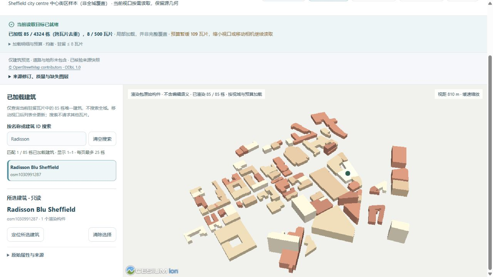
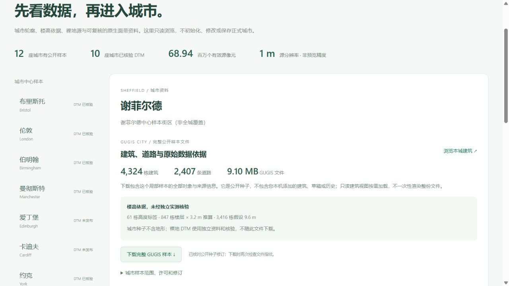
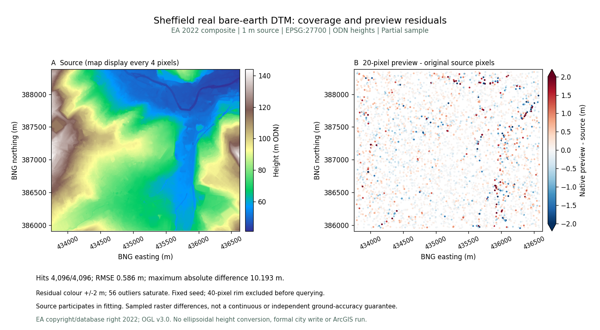
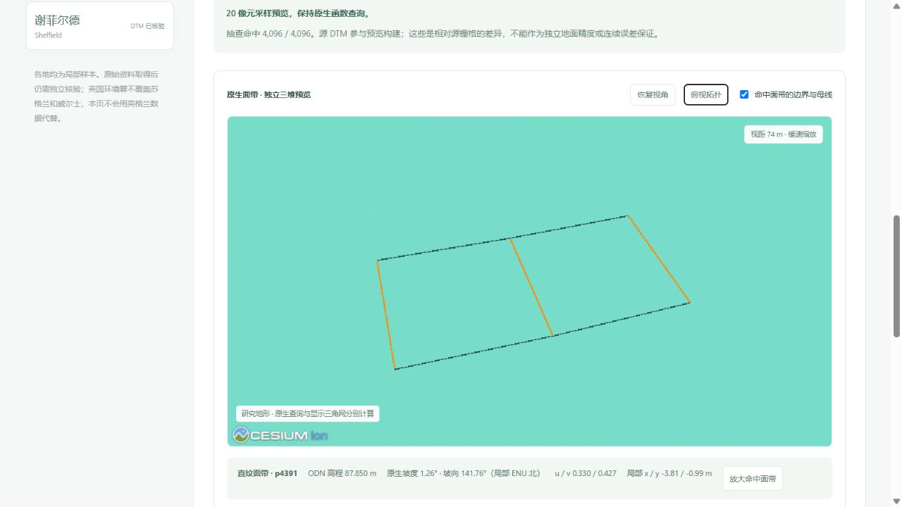

# 谢菲尔德：真实城市样本与独立裸地面带

[浏览建筑](http://127.0.0.1:5173/?city=sheffield&cities=sheffield&view_mode=tiles&tile_profile=economy) · [资料、误差与完整下载](http://127.0.0.1:5173/datasets?dataset=sheffield)。新增 **4,324 栋建筑、2,407 条道路**；十二城公开种子共 **72,976 栋**。各城都是局部样本，不能称为全城覆盖。独立发布的十城 DTM 共 **68,943,816 个有效 1 m 源像元**，城市文件与裸地资料分别下载。

## 城市来源与模型限制

2026-10-05 独立取得 OSM 有界快照。查询框 `[-1.494,53.369,-1.451,53.391]`，完整跨界 ways 保留；实际建筑与道路合并范围 `[-1.4978856,53.364912,-1.4411137,53.3929093]`。登记关联 `uk-eng-sheffield`，既有英国城市登记原件保持不变。

原始响应 **5,040,385 B**，SHA-256 `c32c158a07193170afc4b2896c21525f7529bec6c8fa85a991bb728668db756f`，原件本地保留。公开响应 **3,833,751 B**，SHA-256 `f1eb1e699f2a3232b458788f2aa282cc38d70dd71a74aecda1b9969b8af8c1f7`；仅删除 401 个无关联系或自由文本标签，每个对象 ID、几何与保留标签均与原件逐项一致。

4,328 个源建筑中拒绝四个不支持对象：`23032889`、`1206695602` 的轮廓不符合顶点约束，`103906516` 的楼层推算高度超出支持范围，`1509803189` 的 `building:min_level=0.5` 不符合支持的竖向语义。实际 ID 与原因在 `sheffield-import.json`，没有用默认地面体量掩盖失败。2,428 个道路 ways 中 21 个面积道路不进入线状道路模型；2,407 条保留道路的转换失败为零。

楼高依据 **61 个高度标签、847 个楼层 × 3.2 m 推算、3,416 个假设 9.6 m**，均未独立实测。已保存 Sheffield City Hall、Sheffield Cathedral、Millennium Gallery 等名称与轮廓；模型是 LoD1 体量，不声称立面、塔楼或内部细节复原。没有取得 multipolygon relations，不承诺庭院孔洞。道路宽度属于显示假设，没有恢复桥梁或隧道竖向高程。城市种子不含地形，只读分块视图也不包含道路与地形。

© OpenStreetMap contributors；数据及派生数据库按 [ODbL 1.0](https://opendatacommons.org/licenses/odbl/1-0/) 分发，见[当前数据许可](../backend/data/cities/CURRENT_DATA_LICENSE.md)。软件许可与数据许可分开。

## 保存、分块与实际下载

完整公开 GUGIS **9,103,469 B**，SHA-256 `855f2377ec4cc4506c4bb319cbf81ea6da25256e08b0d2a0f47eb8d3844b3845`。从公开 OSM 重新构建全部建筑、道路和元数据，保存字节完全一致。

125 m 分块共 **500 瓦片**，6,206 条跨格引用去重为 4,324 栋。瓦片合计 **8,163,038 B**，最大 **84,596 B**，清单 **273,075 B**。每栋保留完整几何，跨瓦片显示去重。低资源最多驻留 2 瓦片 / 2 MiB，均衡最多 8 瓦片 / 8 MiB；这是源数据预算，不是 GPU 内存或帧率结果。

桌面内置浏览器实际均衡加载 85 栋 / 8 瓦片。查询 Radisson Blu Sheffield `osm1030991287` 并选择详情，六项镜头参数与操作前完全相同；切换至低资源仍保留镜头。搜索仅查当前驻留对象，不假称全城搜索。实际下载 `sheffield-public-seed.gugis.json`，字节数与 SHA-256 与上述公开文件一致；下载不带入本机正式项目、草稿或历史。

## 环境署裸地与第五版来源链

从 [EA 2022 LIDAR Composite DTM](https://www.data.gov.uk/dataset/01b3ee39-da3f-47b6-83da-dc98e73a461f/lidar-composite-dtm-2022-1m) WCS 独立取得源裁片，不称为 Digimap 下载。BNG `[433748,385911,436628,388381]`，EPSG:27700、Float32 单带、1 m、scale 1 / offset 0；**2,880 × 2,470 = 7,113,600 个有效像元，0 缺测**。ODN 高程 **41.180–144.020 m**。WCS 单位字段与官方米制说明的冲突警示保留；没有做 ODN 到椭球高转换，独立研究预览没有与建筑配准。

原始 TIFF **31,457,939 B**，SHA-256 `5db8704714fcbd8178e05221d3be0e0dd1da0c57738534685ff0716405934a47`。发布 TIFF **14,589,217 B**，SHA-256 `15c607998ddb1378d7f5c4578f75e1fd665bda30441d4ab9562841addc8adfa9`。仅采用无损 DEFLATE：所有源像元、CRS、仿射变换、NoData 与缩放逐项核对一致。

`shared/public-terrain-sources-v5.json` 的 SHA-256 为 `d7d8c93d90a1bf5a7c6814ca8646fda6dae08ade048ac7da705af226c9bf21ec`。前四版原件与原九城记录保持原字节；只读服务同时验证四份祖先。原有论文对标仍绑定各自旧版，不改写既有实验来源。

© Environment Agency copyright and/or database right 2022. All rights reserved. 按 [Open Government Licence v3.0](https://www.nationalarchives.gov.uk/doc/open-government-licence/version/3/) 分发，与城市 OSM 的许可分开。

## 原生函数查询与保留的大误差

20 像元采样生成 **17,856 控制点、5,920 条直纹面带记录和 2,936 条三角带记录**，记录数不是面片数。原生文件 **1,307,953 B**，SHA-256 `df7830e99918d8ff8dffea77b56b12b98a674ca3c1e85b7620b4158a1c10f517`。

固定种子 20261005，在四周排除 40 像元边缘后选取 4,096 个不重复有效源像元中心。全部命中，全部控制点也命中，控制点最大查询误差低于 10⁻⁹ m。查询使用保存的面函数，显示三角网不替代原生求值。

| 相对源栅格的固定抽查指标 | 结果 |
|---|---:|
| RMSE | 0.585605 m |
| MAE | 0.300164 m |
| P95 绝对差 | 1.084263 m |
| 最大绝对差 | **10.192633 m** |

源栅格参与构建，指标不是独立地面精度、保留集验证或连续最大误差保证。图中 ±2 m 色带的 56 个饱和点仍完整保留在 CSV 与 JSON，没有筛除离群值。

浏览器命中直纹面带 `p4391`：ODN 87.850 m、坡度 1.26°、坡向 141.76°（局部 ENU 北），u/v 0.330/0.427。明确点击「放大命中面带」后视距约 74 m，黑色边界与金色母线可见；以下是实际点查询，不代表整城坡度。

显示使用 **47,149 个共享顶点**，参数对应三维距离界 ≤ 0.100 m。该界只约束原生预览到显示网，不包括上述预览相对源数据的误差，也不是固定 XY 高程误差界。独立局部参考架垂直比例 1×，绿色为直纹面带、灰色为三角带。

关闭预览后画布数为 0，控制台无警告或错误。实际下载 `sheffield-ea-dtm-1m.tif`，逐字节与发布文件一致。默认数据页不自动启动 WebGL。

## 验收与保留

690 项前端检查通过；323 项后端检查中 306 项通过、17 项 Windows 环境不适用跳过；40 项研究流程检查及生产构建通过。新回归覆盖完整来源重建、四个实际拒绝对象、楼高依据、原像元、全部控制点与固定查询、版本链和文件损坏拒绝。四种视口尺寸与两档预算的相机数学检查覆盖十二城，不冒称手机 GPU 实测。

旧十一城种子、九城 DTM、四版来源清单、所有已认证实验、绑定算法及 43 份原本地档案保持不变；三个正式城市指纹相同。没有初始化谢菲尔德正式目录。此轮发布城市源、无损裸地与粗预览；固定样区的全域 E₂ 对标是另一项实验，不用本页抽查替代。没有执行 ArcGIS 软件或宣称软件速度、GPU 内存优势。

后续已独立发布[中心与北侧固定样区的全域对标](sheffield_terrain_benchmark.md)，包括 12 个保存模型和六对同几何 MultiPatch；其最大参考界与全域积分同本页粗预览抽查分开。
