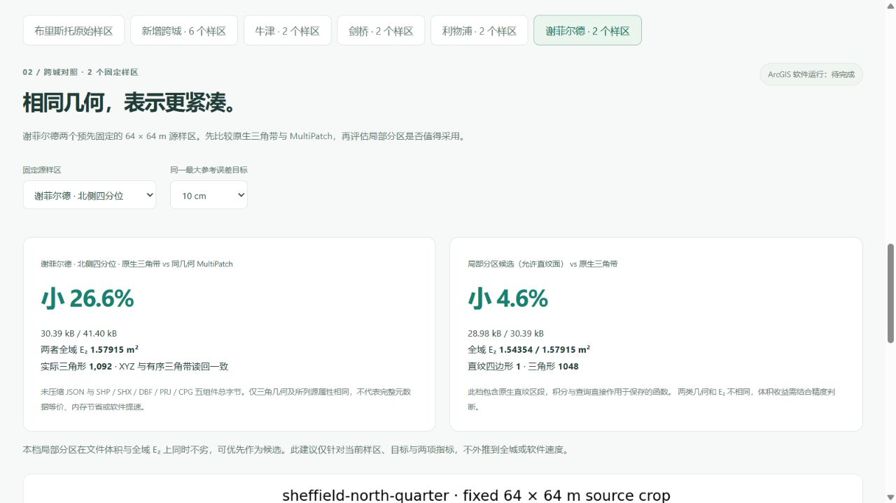
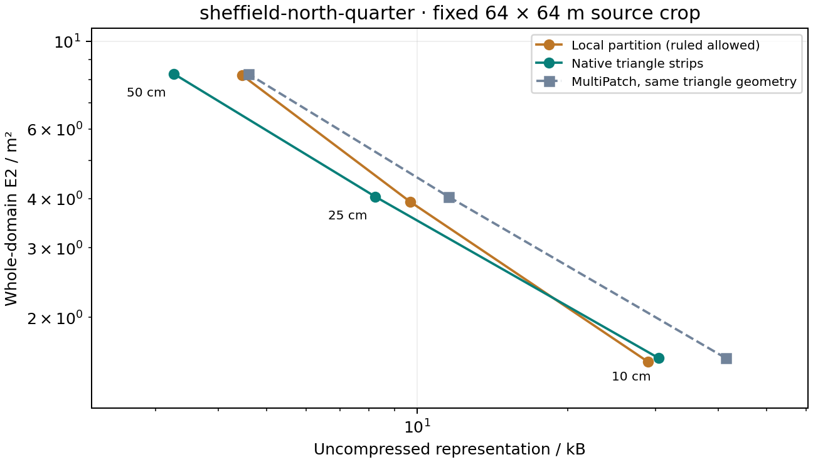

# 谢菲尔德固定样区：E₂、N 与同几何文件代价

[北侧 10 cm 正向结果](http://127.0.0.1:5173/compare?city=sheffield&terrain_scope=sheffield&terrain_site=sheffield-north-quarter&terrain_target=0.1#sheffield-terrain-results) · [中心 50 cm 精度取舍](http://127.0.0.1:5173/compare?city=sheffield&terrain_scope=sheffield&terrain_site=sheffield-centre&terrain_target=0.5#sheffield-terrain-results)。在拟合之前固定源栅格中心与北侧四分位位置，不按收益挑选样区；发布全部 **12 个保存模型、49,152 次固定原生查询、六对同几何 MultiPatch**。

原生三角带 JSON 相比同几何 MultiPatch 五组件文件小 **24.9%–29.0%**。北侧 10 cm 局部分区候选比三角带小 **4.6%**，全域 E₂ 低 **2.3%**，含一个直纹四边形；这是该样区的整体候选结果，不能把所有差异归因于这一个函数区段。中心 50 cm 文件小 **30.3%**，E₂ 却高 **48.7%**，而且没有直纹区段。全部正负结果及误差—代价曲线公开。



## 完整结果

均为未压缩字节；E₂ 是完整 4,096 m² 域上的积分范数，单位 m²。T 为保存的原生三角带，H 为允许直纹面带的局部分区候选；两类候选的几何不同。

| 固定样区 / 目标 | T / B | MultiPatch 五件套 / B | 同几何文件节省 | H / B | E₂ T / H · m² | N T / H | H 直纹四边形 |
|---|---:|---:|---:|---:|---:|---:|---:|
| 中心 / 10 cm | 16,557 | 22,042 | 24.88% | 20,172 | 1.513043 / 1.561165 | 563 / 706 | 2 |
| 中心 / 25 cm | 5,012 | 6,994 | 28.34% | 5,461 | 4.302871 / 4.234686 | 167 / 171 | 0 |
| 中心 / 50 cm | 2,696 | 3,754 | 28.18% | 1,880 | 7.710889 / 11.467844 | 74 / 42 | 0 |
| 北侧 / 10 cm | 30,390 | 41,402 | 26.60% | 28,981 | 1.579153 / 1.543542 | 1,092 / 1,048 | 1 |
| 北侧 / 25 cm | 8,244 | 11,546 | 28.60% | 9,689 | 4.043838 / 3.922175 | 289 / 324 | 0 |
| 北侧 / 50 cm | 3,262 | 4,594 | 28.99% | 4,458 | 8.266945 / 8.215359 | 95 / 134 | 0 |

12 个模型全部满足各自 10 / 25 / 50 cm 的最大参考界目标。六档 H 中四档文件更大、两档更小；四档 E₂ 更低、两档更高。全部 H 合计只有三个直纹四边形，不能把纯三角分区的文件变化说成直纹函数收益。表示建议同时看文件与 E₂，并明确给出取舍，不以较小文件自动宣布全面胜出。




## 与论文、ArcGIS 比较的边界

对齐 [Mirebeau & Cohen](https://arxiv.org/abs/1101.1452) 的全域 L₂ 范数 E₂ 和实际三角形 N，直纹四边形另外计数。真实栅格是连续逐单元双线性参考面，不满足严格凸 C² 假设；本轮三角构建是最大误差优先、欧氏最长边及 C0 相容闭合，不冒称论文的 L₂ 选区 / L₁ 选边算法，也不在此使用 Hessian 形状理论。网站独立的解析曲面实验才比较论文式方法。

每处固定原始 65 × 65 个 1 m 像元中心，完整 64 × 64 m 积分域；源像元直接用于拟合，不是独立地面真值。模型与源单元求交，用 Float64 多项式 Gauss / Duffy 积分求 E₂，包含保存控制高度的五位小数舍入。RMS = E₂ / 64，不以 4,096 点抽查 RMSE 替代全域积分。最大参考界使用 Float64 数值保护，不是区间算术证明。

每对三角模型 / MultiPatch 的 XYZ、带分组和有向三角形完全一致，选定来源属性读回相同；原生 JSON 元数据并未完整映射到 DBF。文件成本包括 `.shp/.shx/.dbf/.prj/.cpg`，不漏掉组件，也不拿 ZIP 压缩包代替表示文件比较。**没有执行 ArcGIS Pro；没有软件耗时、FGDB、GPU 内存或帧率优势结论。**

## 来源与完整复现

源为 [EA 2022 LIDAR Composite DTM 1 m](https://www.data.gov.uk/dataset/01b3ee39-da3f-47b6-83da-dc98e73a461f/lidar-composite-dtm-2022-1m)，© Environment Agency 2022，OGL v3.0。源 SHA-256 `15c607998ddb1378d7f5c4578f75e1fd665bda30441d4ab9562841addc8adfa9`；绑定第五版地形来源清单，旧版来源与既有研究包原件不变。城市、粗预览和本页认证样区各自独立，见[谢菲尔德城市及真实地形](sheffield_city_terrain.md)。

模型 XY 为中心源像元的 BNG 偏移，MultiPatch 为绝对 EPSG:27700；Z 保留 ODN 米，不是城市 ENU 或椭球高。两个固定源窗口、源裁片、查询夹具及完整模型指纹写入回执。

```powershell
.venv/Scripts/python.exe data-pipeline/build_sheffield_terrain_benchmark.py --output .local/research/sheffield-reproduction-new
node frontend/scripts/audit-sheffield-terrain-benchmark.mjs .local/research/sheffield-reproduction-new
```

采用新目录，原件不覆盖。发布器 `publish_sheffield_terrain_benchmark.py` 在原生查询、来源、算法指纹、全部模型、完整域积分及同几何读回核验后才分发；已有发布目录存在时拒绝覆盖。构建时间可能随机器变化，不宣称逐位重现时间字段。

数据在 `frontend/public/research/sheffield-terrain-benchmark/`：两个完整 ZIP 各含 31 个成员，六个原生模型、三档 MultiPatch、源参考、固定查询夹具、六份逐点 CSV、许可证和样区定义。中心包 **1,255,234 B**，SHA-256 `c175bf7c05747206c8da4104e413382fb7c2c571bc83aa75ee209b1d8656e7ba`；北侧包 **1,288,905 B**，SHA-256 `f01c611253e4d13994f131e24f01b18b6a7b8c555e21a78851fc8acc44eb8699`。科学图 PNG/SVG、CSV、生成定义、原生查询回执与发布摘要均保留指纹。

## 验收

695 项前端检查、44 项研究流程检查及生产构建通过。重新计算 12 个保存模型的全域积分、全部固定查询和控制点；逐项比对原始源像元、同几何五组件与全部 ZIP 成员。真实浏览器核验正向与不利档位、范围切换、链接恢复、最新说明及下载；北侧 ZIP 的长度、SHA-256、31 个成员与公开原件逐字节一致。页面默认 0 画布，无控制台警告或错误，不会为读报告初始化正式城市。

上一提交已有的 1,111 份来源、研究证据和绑定算法，以及 43 份原本地档案和三个正式城市指纹，核验保持不变。本轮无后端业务变更；谢菲尔德数据发布阶段的 323 项后端检查继续作为该阶段结果，不冒称重新运行。本机开发服务曾短暂保留旧热更新文本，已使服务重新读取当前文件，并在真实页面核对“三个实际直纹四边形、四档文件更大”的正确说明；生产构建与保存模型不受影响。
