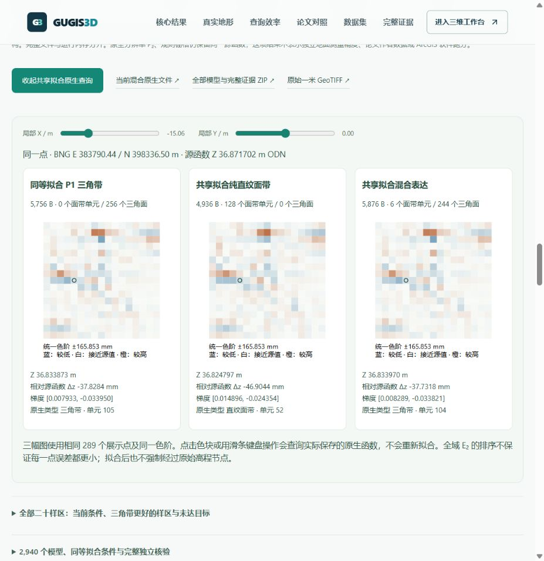
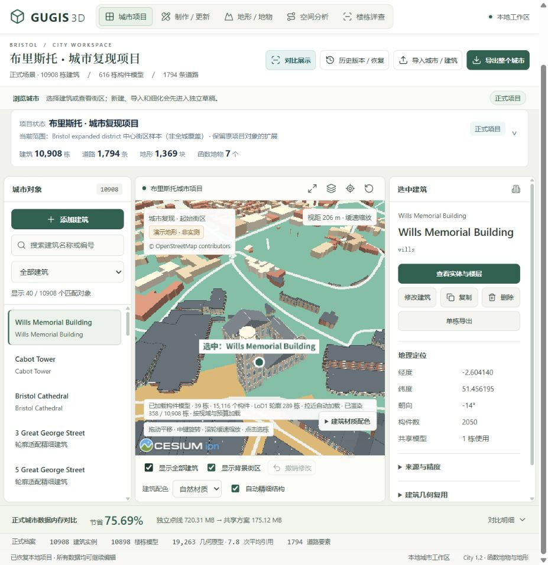

# 真实地形：共享拟合与同等三角带控制

入口 `/compare#source-fit-results`，首屏 `/compare#validated-advantages`。二十个原始 1 m DTM 窗口、49 个固定网格、三种方法，共 **2,940** 个新原生模型。已有源窗口和结果不是留出测试集，也不是独立测量地面真值。

所有方法均优化共享角点高程，保持原 XY、原生拓扑、地理参考和完整文件大小。P1 使用先前已冻结的双对角线选择，混合使用其三种类型选择；本次不重新选类型，所以不是联合优化或全局最优拓扑。所有边界保持 C⁰，梯度可以跳变，拟合后不强制经过原高程节点。

| 核验结果 | 实测结果 |
| --- | --- |
| 固定结构拟合前后全域 E₂ | 2,900 个严格下降，40 个完整源函数结构原样保留，0 回退 |
| 完整原生文件 | 每个候选拟合前后字节数完全相同 |
| 8,192 B 上限：混合 / 同等拟合 P1 | 17/20 样区更低，3/20 P1 更低；混合最好降低 3.4366%，最差高 0.4128% |
| 全部十档上限：混合 / 同等拟合 P1 | 138/200 更低，全部未获益情况保留 |
| 8,192 B 上限：混合 / 同等拟合纯面带 | 20/20 更低，降低 4.3720%–16.9535% |
| 连续最大差的代价 | 144/2,940 个拟合候选的最大差超过原值及数值余量 |

默认曼彻斯特中心混合模型：完整文件 **5,876 → 5,876 B**，同一原结构 E₂ **2.369537130 → 1.727203084 m²**，下降 **27.11%**。它有 6 个面带单元、244 个三角面。8,192 B 上限下的同等拟合 P1 为 5,756 B、1.742009802 m²；混合误差低 **0.8500%**。相同预算是相同上限，实际文件不要求相等。

六方法表格中的原控制与拟合控制分别选择各自最优候选，选中的网格可能改变。上方同结构前后卡片比较的是当前拟合模型与其原始网格，不是表格中另一个最优原混合候选。

## 网站演示

选择“真实地形”，切换样区和十档字节上限；最大差模式提供六档源函数目标，未通过的候选显示为空。六方法表保留拟合与原有控制。二十样区全表包含三个三角带更好的样区：牛津北侧、谢菲尔德中心和北侧。

打开“三种拟合模型同色标查询”，三幅热图共同查询实际保存文件，统一 289 个点和色标。点击任意色块或使用滑条键盘操作，三模型同步返回高度和解析梯度。切换样区会取消旧请求；文件长度、SHA-256 或结构不符会拒绝并提供重试。局部误差不一定服从全域 E₂ 的排序。

## 复核与复现

协议、三角带控制、源窗口、全部 2,940 个 JSON / BIN、三份完整旧报告、求解器代码、所有预算和目标 CSV、科学图与独立核验均保留。独立 GL5 对全部保存函数重新积分、检查连续最大值，并用数值质量矩阵及源函数载荷核验全局 Galerkin 方程；冻结求解器逐字节重放。积分差最大 7.11×10⁻¹⁴ m²，最大值差最大 1.42×10⁻¹⁴ m。

原生验证执行 **15,432,060** 次高度、解析梯度、源节点和坐标查询，另比较 **12,801,600** 对边界值，完整二进制读回、范围拒绝和最大差见证点均通过。Float64 余量不是区间证明。L₂ 优化不等于最大差优化，更不等于运行内存、GPU 或 ArcGIS 软件性能。

公开目录 `/research/source-global-fit-v1/`：5,950 个索引文件，另有索引本身。完整证据 ZIP 为 **35,167,420 B**，SHA-256 `2f4607f5738aa0515ad47742b7871355e8f5d17daa250dbdc424eb59ccb44e50`。完整结果 SHA-256 `893e55b29874ef7e47ef13c986270f8560b1436548b4b9e125446f6dffb25716`。

可执行 `python data-pipeline/source_fit_benchmark.py .local/research/<fresh-folder>`、`node frontend/scripts/audit-source-fit.mjs .local/research/<fresh-folder>`，再调用 `publish_source_fit.verify(Path(...))` 重新核验；发布函数禁止覆盖已有不可变版本。`python data-pipeline/build_source_fit_ui.py --check` 和 `python data-pipeline/build_result_focus_v5.py --check` 检查网站的压缩视图与主结果绑定。

实际浏览器通过入口点击、六方法数据、失利样区切换、三模型同步查询和原生文件下载；下载文件 SHA 与发布文件一致。现有布里斯托 10,908 栋建筑场景完成载入、定位、隐藏及恢复检查，控制台未见渲染错误。该验收不是 Edge 或 ArcGIS 的新跑分，正式城市、历史快照和原始 DTM 保持不变。

