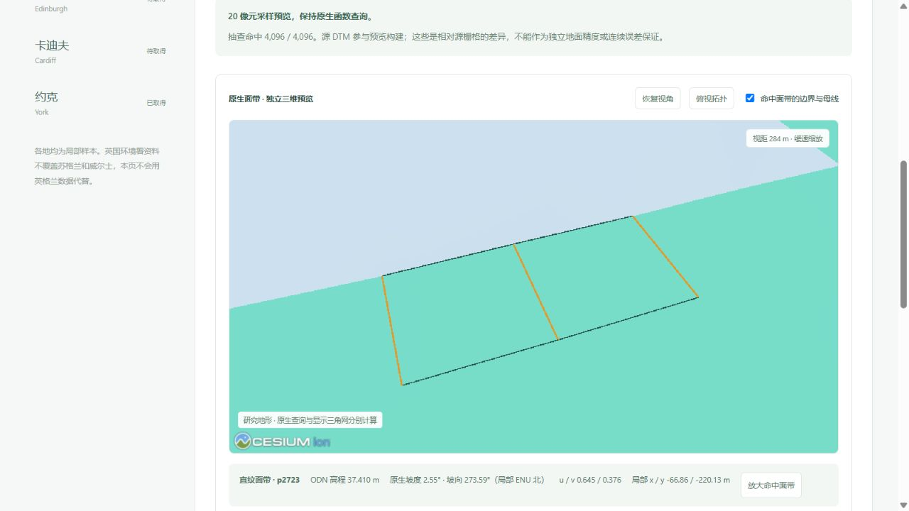
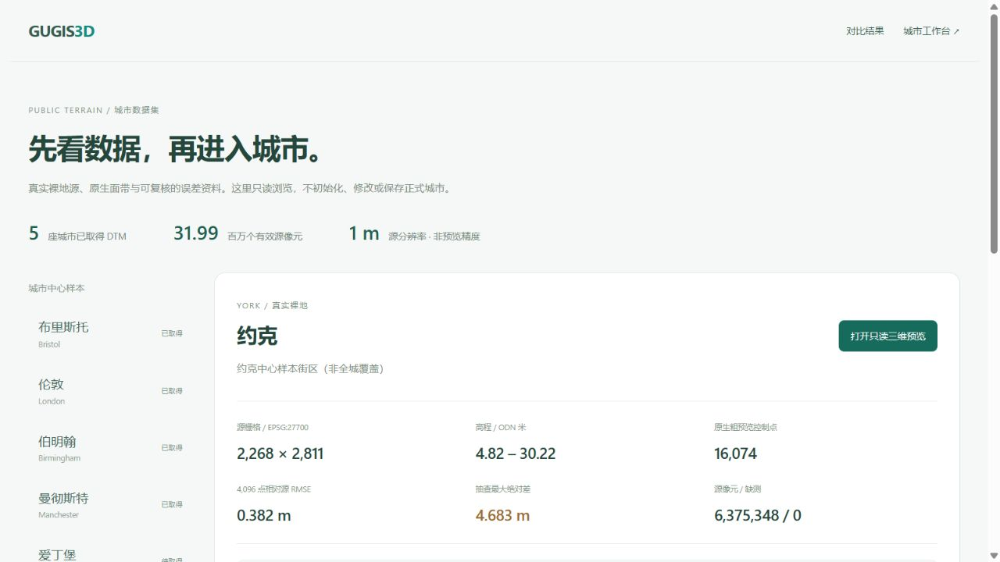

# 真实地形数据集的只读浏览

2026-10-05 新增 `/datasets`。它将资料检查与城市编辑分开：不读取城市当前档案、不初始化工作区、不创建草稿或历史。对比页导航和编辑器公开 DTM 卡片均提供入口。

后续增加[完整 GUGIS 公开样本下载](public_city_datasets.md)，页面先展示城市建筑与道路文件，随后展示独立裸地资料。两类来源、范围与精度依据各自核验，不能将建筑假设高度与地形实测高程混淆。

城市目录现有十一座城市、68,652 栋公开种子建筑，新增[利物浦中心与滨水区](liverpool_city_sample.md)。利物浦地形虽已独立采集，但原生模型尚未发布，页面保持待核验状态；它不计入下方八城已发布 DTM 数量。

八座城市已核验环境署裸地源：布里斯托、伦敦、伯明翰、曼彻斯特、约克、巴斯、牛津、剑桥，合计 54,790,216 个有效 1 m 源像元。全部是中心街区局部裁剪，不代表全城覆盖。爱丁堡与卡迪夫保留待取得状态，不用英格兰数据代替。巴斯的独立来源与核验见[新增数据说明](bath_city_sample.md)，牛津与剑桥的版本清单、误差及查询见[牛津地形](oxford_terrain_sample.md)、[剑桥地形](cambridge_terrain_sample.md)。下面的首版验收记录保留原时间范围，新版本验收记录在各城说明中。

## 从资料到原生三维结构

选择城市先显示源栅格尺寸、ODN 高程范围、缺测、粗预览控制点、固定 4,096 点抽查 RMSE 与最大差，再显示真实源地形和误差图。GeoTIFF、原像元 CSV、查询回执和科学图可下载；范围、来源、许可和两个文件 SHA-256 放在可展开信息中。

只有点击「打开只读三维预览」才载入 WebGL 模块和该城模型。浏览器按固定城市路由流式读取，长度有上限，并校对原生文件 SHA-256。错误长度、响应协议、哈希、数据身份和过期请求均拒绝。切换城市或关闭预览释放 Viewer，原高程查询结果清除；返回上一城市不会自动重新加载三维模型。

点击表面可读原生面带编号、高程、坡度、坡向和 u/v。母线显示只针对命中的面带，避免整片城市拓扑超过 20,000 条保护上限。查询范围仍保留完整模型。点击「放大命中面带」才调整镜头；选取、勾选线条不自动移动镜头。

## 坐标与显示误差的边界

原 ENU x/y/z 放入独立局部参考架，显示高程减去参考值，垂直比例 1×。ODN 高程未转换到椭球高，本视图不与城市建筑配准。坡向针对原局部 ENU 北；面带接缝取命中一侧，不保证 C1 连续。

粗采样预览相对源 DTM 的误差与三角化显示误差分开。对每个双线性直纹四边形，设三维扭曲向量 `K = P11 - P10 - P01 + P00`；等参数细分 d 档后的对应参数点三维距离界为 `||K|| / (4 d²)`。它适用于 ENU 中稍有弯曲的 x/y 投影，不把其冒充固定 x/y 的高程误差界。

显示默认请求 0.1 m 参数距离界；展开顶点预算 200,000。预算不足时减少显示细分，并公开实际界与未达到目标的状态；不截断原生模型。三角带面保持同一有向三角形，显示顶点按精确坐标复用。计算使用 float64，不是区间算术证书。浏览器原生函数查询仍使用原模型，未改为显示三角网插值。

## 核验

新增七项前端检查覆盖五城原件读取、篡改与超限拒绝、弯曲 x/y 投影的 10,201 个独立参数点残差、实际全部三角面保留、切城/返回懒加载、局部拓扑不缩小查询面、应用入口不加载城市编辑器。完整前端 **602 项通过**，生产构建通过；此次未改后端算法。

真实浏览器完成曼彻斯特与约克加载、点查询、命中面带放大、缩放、俯视、关闭和城市切换。曼彻斯特例点 p2723：37.410 m ODN、2.55°；约克例点 p2904：7.288 m ODN、7.97°。约克误差 CSV 实际下载与发布文件 SHA-256 一致。爱丁堡无三维画布或替代源图，返回约克后预览保持关闭。控制台未见警告或错误。

默认桌面窗口完成视觉核验，补充了窄屏布局规则；未将其宣称为手机浏览器实测。三份已有正式城市与 43 份保留数据核对未变，曼彻斯特及约克正式工作区未初始化。

[真实多城 DTM 来源与误差](multicity_real_dtm.md) · [论文指标对比结果](paper_metrics_results.md) · [ArcGIS 对标流程](bristol_arcgis_protocol.md)
