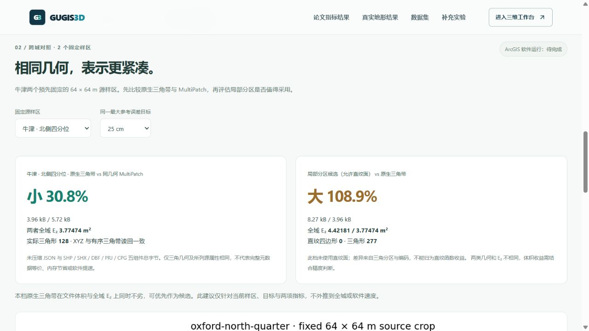

# 可恢复的对标结果链接

结果页现在把范围、固定样区和 10 / 25 / 50 cm 目标记录到地址。刷新或在运行本项目的环境中打开相同链接，可以回到同一组指标、图片及模型下载。地址更新保留城市工作区和其他选项，不创建城市、草稿或历史。

例如[牛津北侧 / 25 cm](http://127.0.0.1:5173/compare?terrain_scope=oxford&terrain_target=0.25&terrain_site=oxford-north-quarter#oxford-terrain-results)与[剑桥北侧 / 50 cm](http://127.0.0.1:5173/compare?terrain_scope=cambridge&terrain_target=0.5&terrain_site=cambridge-north-quarter#cambridge-terrain-results)。本地链接只在已启动本项目的电脑上有效；另一个运行环境需使用它自己的站点地址并保留这些参数。

切换范围清除不兼容的样区，保留误差目标；切换样区或目标更新当前地址。显式实验锚点优先，旧版只有锚点的链接仍可打开。未知范围、无效目标和属于另一实验的样区使用安全默认值，不显示错配结果。浏览器历史导航恢复选择，监听器在页面卸载时清理。补充布里斯托实验改变目标时，主结果目标和地址同步。

地址只保存所选指标视图，不保存实验数据；模型、源指纹、完整恢复包和全域积分结果仍来自各自已发布档案。ArcGIS 软件实测仍待运行环境，链接功能不改变比较结论。

后续增加[利物浦两个固定样区](liverpool_terrain_benchmark.md)，例如[北侧 / 50 cm](http://127.0.0.1:5173/compare?city=liverpool&terrain_scope=liverpool&terrain_target=0.5&terrain_site=liverpool-north-quarter#liverpool-terrain-results)。非布里斯托城市页也显示独立地形结果，城市建筑与软件指标的待测状态单独说明。下方保留链接功能首发的验收记录。

## 验收

663 项前端全套检查及生产构建通过。新增回归核验旧链接、范围冲突、非法参数、工作区参数保留、范围 / 样区 / 目标切换、重挂载复原和同范围历史导航。

桌面内置浏览器实际选择牛津北侧 25 cm、刷新，三项选择与结果均恢复；再切换剑桥北侧 50 cm，地址及对应模型和图一致。结果页零三维画布，未宣称 Edge 或手机 GPU 实测。模型、研究图、恢复包及后端服务未改动；前一批研究管线的 36 项检查与本轮 UI 验收分别记录。43 份原始本地档案及三个正式城市指纹核验未变。

