# 新版接入与本地验证 · 2026-10-04

本地已接入基于 `a1394ba` 的 23 个云端开发提交，恢复到 `f05392dc65772e1f909a819771bbe3abfcd2d3f9`。新版增加城市选择入口及按视域读取建筑的只读模式；完整城市编辑、独立草稿与历史记录继续保留。

## 从哪里进入

打开 [城市选择页](http://127.0.0.1:5173/)，单选或多选城市，然后进入工作区。多选表示可切换的城市集合，同时仅加载一个城市场景。

- 完整编辑：[伦敦工作区](http://127.0.0.1:5173/?city=london)。可编辑建筑、道路、地形与地物，并使用草稿确认和版本恢复。
- 轻量浏览：[伦敦均衡配置](http://127.0.0.1:5173/?city=london&view_mode=tiles)。仅请求已生成缓存中的建筑分块，不先读取整个城市档案。
- 低资源浏览：[伦敦 Economy 配置](http://127.0.0.1:5173/?city=london&view_mode=tiles&tile_profile=economy)。适合希望减少同时载入范围与请求数的演示。

将链接中的 `city` 换为 `bristol` 或 `birmingham` 可进入其他城市。均衡配置为默认值；入口也可直接选择两种配置。

## 本次主要变化

| 功能 | 具体行为 |
|---|---|
| 城市入口 | 进入前选择城市；切换时释放旧场景和读取任务，避免三城同时占用渲染资源 |
| 分块浏览 | 根据视域读取建筑，校验来源修订、字节数与 SHA-256；失败可重试，保留选中建筑 |
| 建筑检索 | 在当前已载入建筑中按名称或 ID 搜索，分页查看位置、几何来源及修订号；主动点击定位才移动相机 |
| 暂停与恢复 | 手动暂停或隐藏页面时停止新的瓦片读取，已验证建筑继续可见；恢复后按最新视域继续 |
| 视角链接 | 复制当前城市、来源修订和相机位置；修订不匹配时明确提示，并可选择当前默认视角 |
| 候选数据审阅 | 对照原始种子与修正候选，下载档案、清单或 ZIP；不自动导入，不自动创建草稿 |
| 英国接入进度 | 展示 76 个城市名单以及样本、边界回执状态，支持地区、名称和状态筛选 |

默认分块相机已按实际缓存范围居中，修复部分横屏尺寸看向样区以外的问题。加载优先级变化而驻留瓦片不变时，复用已有场景与请求，减少重复计算。

| 读取预算 | Balanced 均衡 | Economy 低资源 |
|---|---:|---:|
| 驻留瓦片 / 源字节 | 8 / 8 MiB | 2 / 2 MiB |
| 缓存瓦片 / 源字节 | 16 / 16 MiB | 4 / 4 MiB |
| 同时请求 | 3 | 1 |

这些是源数据载荷和请求调度上限，不能作为实测 JavaScript 内存、GPU 显存或帧率提升。完整编辑模式仍加载完整档案；分块浏览不包含道路、地形、函数地物和完整语义，也没有保存或修改接口。

## 数据范围与本地项目

三个城市仍是局部街区样本：仓库布里斯托种子 615 栋、伦敦 823 栋、伯明翰 809 栋，不能代表全城覆盖。76 城名单用于记录后续接入准备，不表示取得了 76 城模型或边界，不能据此计算覆盖率。高度标签未独立核验，多数建筑高度为推算或显示假设；没有新增实测 DEM。

伦敦修正候选为 814 栋，伯明翰为 804 栋：保留可解析的来源高度，明确遗漏当前不支持的建筑部件及底部高度语义。候选与现有项目分开保存，**不会自动激活**。候选是整城替换档案，不是只修正高度的补丁；手动提交替换可能移除候选中没有的用户对象，应先导出并审阅草稿。

本机布里斯托正式项目仍为 **616 栋，保留 40 个历史版本**。它启用了建筑贴地，当前 render-package v1 不支持该偏移，构建器会明确拒绝。本次布里斯托只读缓存单独由仓库 **615 栋种子**生成，因此与完整编辑项目并非同一修订，也不包含本机新增建筑及正式地形。伦敦和伯明翰缓存由各自原正式项目生成，保留 823 / 809 栋来源状态。页面的已载入数量是视域内子集，应与源档案总量区分。

`X-Render-Freshness: current` 仅表示正式项目或种子与构建时记录的文件签名一致。`unknown` 表示未能以该签名确认一致，不等于内容已经过时，也不证明与当前项目相同。编辑保存不会自动重建缓存；视角链接中的修订号也不能用于自动取回历史数据。

## 明确选择缓存来源

在仓库根目录使用已有 Python 环境。下面两组是不同来源选项，不需要依次运行；均只写 `.local/render-cache`，不修改输入档案。

重现仓库种子的三城缓存：

```powershell
.\.venv\Scripts\python.exe data-pipeline/build_render_tiles.py backend/data/bristol.gugis.json --city bristol
.\.venv\Scripts\python.exe data-pipeline/build_render_tiles.py backend/data/cities/london.gugis.json --city london
.\.venv\Scripts\python.exe data-pipeline/build_render_tiles.py backend/data/cities/birmingham.gugis.json --city birmingham
```

本次本机演示使用的来源：布里斯托选仓库种子；另两城选本机正式项目。

```powershell
.\.venv\Scripts\python.exe data-pipeline/build_render_tiles.py backend/data/bristol.gugis.json --city bristol
.\.venv\Scripts\python.exe data-pipeline/build_render_tiles.py .local/cities/london/current.gugis.json --city london
.\.venv\Scripts\python.exe data-pipeline/build_render_tiles.py .local/cities/birmingham/current.gugis.json --city birmingham
node frontend/scripts/verify-render-streaming.mjs
```

普通、不启用贴地的布里斯托正式项目可明确选择 `.local/city/current.gugis.json` 作为输入；本机现有 616 栋贴地项目应保留原状，不能为生成缓存而关闭贴地或用种子覆盖。当前缓存不能自动修正建筑高度或补上缺失层。缺少缓存时页面给出构建与重试提示，不悄悄改为全城下载。

`.local` 中的正式项目、草稿、历史、渲染缓存和验收日志均不上传 GitHub。源数据与种子按仓库既有许可公开；新电脑需要自行构建缓存。英国边界回执的安全文件读写当前需要 POSIX 支持，Windows 上显示未核验属于平台限制；城市编辑和分块浏览仍可使用。

## 本地验证记录

截至本说明编写时，Windows 本地已完成：

| 检查 | 结果 |
|---|---|
| 前端测试 | 395 / 395 通过，含新增原生 fetch 接收者回归 |
| TypeScript / Vite 生产构建 | 通过 |
| 生产分析 Worker | 5 / 5 通过 |
| 三城 × 两种配置的真实缓存协议检查 | 6 组通过 |
| 后端 Windows 完整回归 | 211 项：194 通过、17 平台能力跳过，0 失败 |
| 新版真实浏览器 / WebGL 交互 | 本轮主要交互通过，详见下方实际范围 |

缓存协议检查使用实际生成包的字节验证加载预算、请求并发、选择保留和零全城请求，不是浏览器或 GPU 性能跑分。旧版浏览器截图不能替代新版入口、分块与视角链接的交互验收。

本地接入修复了 Windows `lstat` / `fstat` 对同一文件的 `ctime` 语义差异，避免合法候选下载被误判为文件变化。读取前后身份、目录链、重解析点、长度与精确 SHA-256 核验仍保留；两个候选的六个下载文件及 ZIP 成员均通过 Windows 落盘核验。原有四个采集/转换回执的工作树换行恢复为 Git 已提交的 LF 字节，来源及种子不变。

真实浏览器还发现分块请求对原生 `Window.fetch` 的错误接收者绑定；已修正默认及注入传输的调用方式，并补充两项能复现错误的回归测试。此问题解释了“清单已读但所有瓦片失败”的空白画面。

17 项后端跳过包括 12 项 POSIX 安全回执读写、4 项宿主无符号链接权限及 1 项 FIFO。Windows 平台未核验提示及真实 junction 拒绝读取另行验证通过，未用较弱的读取规则替代安全边界。

本轮真实浏览器验收覆盖：新入口单选/多选、三城均衡分块切换（只保留一个三维画布）、1280×720 横屏布里斯托首屏、暂停后拖动仍保留已加载画面、恢复读取、视角复制与恢复、错误修订阻止显示并能明确恢复默认视角、只读切换到伯明翰完整编辑、伦敦低资源配置、已加载建筑检索/详情/定位。布里斯托均衡首屏实际载入 508/615 栋、8/15 瓦片；伦敦低资源入口载入 44/823 栋、2/32 瓦片。相机移动或窗口变化后实际加载数会变化，这些数字不代表完整覆盖。

候选面板成功切换两城，伦敦 ZIP 经浏览器下载后的 SHA-256 与页面展示一致；英国进度筛选正确区分北爱尔兰与威尔士的两个 Bangor。原有三城正式数据与布里斯托 40 个历史版本共 43 个本地文件逐字节校验一致。此验收使用 Codex 内置浏览器，不是 Microsoft Edge 的专项复验，也不包含 FPS、GPU 内存或 ArcGIS Pro 性能跑分。

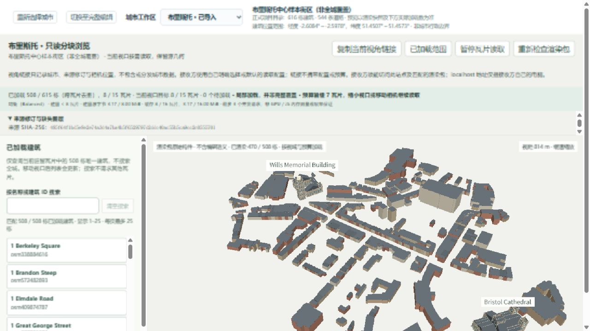

详细规则见[分块格式](render_tiles.md)、[读取配置](tile_loading_profiles.md)、[源数据候选](source_candidate_review.md)和[英国城市接入状态](uk_city_coverage.md)。

## 后续交互修复与完善

- 分块页增加低资源 / 均衡配置切换，不必退出工作区。合法相机位置及来源修订经核验后恢复；无合法相机时使用默认视角。旧请求、缓存和场景随旧会话释放，建筑选择与手动暂停重置并明确提示。
- 修复保留视角时加载配置被分享链接编码器清除的问题：会话地址重新写入明确选择的配置，刷新和前进后退保持一致。公开分享链接仍不携带配置，接收方自行选择预算。
- 离开完整编辑或返回城市选择改为页面内确认，不依赖阻塞式原生弹窗。默认焦点在取消按钮，Escape 可取消；确认时再次检查写入锁。历史导航撤销过时确认，旧城市及旧配置回调不能操作新会话。
- 窄窗口先显示三维画面再显示建筑查询，增加“查看三维画面”快捷入口。页面仅保留一个主滚动区域；桌面仍为查询与场景并排。来源和分享说明可展开，缺失图层及质量提示保持可见。

前端完整回归 **399/399** 通过；最终针对城市导航、确认竞态、配置与相机恢复的 **30/30** 项检查通过，最终 TypeScript 与生产构建通过。未修改后端、分析算法或城市数据，本次不重新宣称后端性能提升。

Windows 内置浏览器实际核验了：完整编辑 ↔ 分块模式、Escape 取消后保留原工作区、确认后仅一个画布、均衡 ↔ 低资源切换、低资源刷新恢复、来源质量说明展开、建筑检索 / 选择 / 定位；分别检查 1280×720 桌面断点与实际窄窗口。低资源最多两个驻留瓦片，视角移动后建筑数量改变属于按需读取。三城正式数据及布里斯托 40 个历史版本，共 43 个文件再次逐字节校验一致。

仍是局部样区的只读建筑预览，道路与地形未包含；配置的源字节预算不能当作 GPU 内存、帧率或 ArcGIS 性能结果。此次使用内置浏览器，不代表 Edge 专项复验。

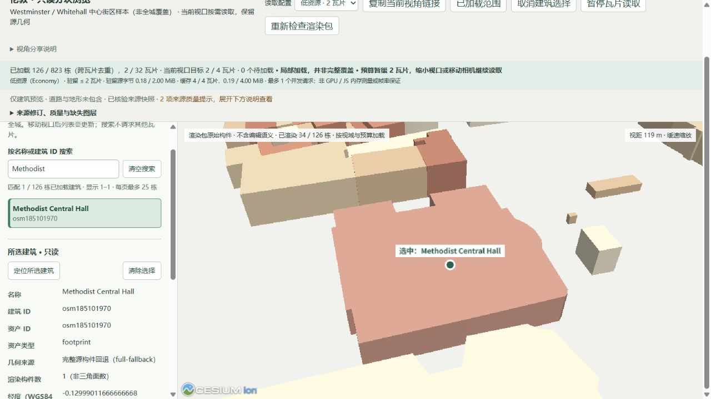

## 白色工作台与城市入口升级

- 统一白色、浅灰与蓝绿色控件，突出场景标题和主要操作。分享、重查与取消选择放入“更多工具”；Escape、点击外部或执行命令可关闭，键盘操作返回菜单入口。
- 入口按“选城市 → 选浏览方式 → 进入工作区”组织，来源和接入说明位于主流程之后。桌面三城卡片并排，底部固定入口显示所选数量和当前模式；未选择有效城市时仍不能进入。
- 建筑列表可收起，让场景使用更多空间；查询和选择仍保留。地图拾取建筑会自动打开已有详情，不另建场景。
- 建筑详情优先显示名称、ID 和定位操作，完整原始坐标、修订号及精度说明可展开。所选建筑不符合当前搜索时明确提醒，返回列表会跳到该建筑所在页，保留选择。
- 加载明细与预算可展开，局部覆盖、预算暂缓、超大瓦片和来源质量提示保持可见；来源许可链接不再藏在折叠说明中。窄屏工具菜单在文档流内展开，避免越界遮挡。

前端完整回归 **401/401** 通过，最终城市入口 / 分块 / 查询专项 **96/96** 通过，TypeScript 和生产构建通过。浏览器检查包括：收起与恢复列表、查询保留、地图拾取重新打开详情、搜索冲突恢复、原始属性、菜单键盘 / 外部关闭、固定入口和三城切换。检查实际桌面窗口与 390×844 窄屏，窄屏无水平越界，三维画面位于建筑查询之前，入口页未创建画布。

三城数据及布里斯托 40 个历史版本仍逐字节保留。界面所示正式项目数量与实际缓存加载量继续分别标注；布里斯托 615 栋种子缓存与 616 栋正式项目的一致性未验证。验收使用内置浏览器，未把 UI 更新作为 GPU 性能或 Edge 专项验收结果。

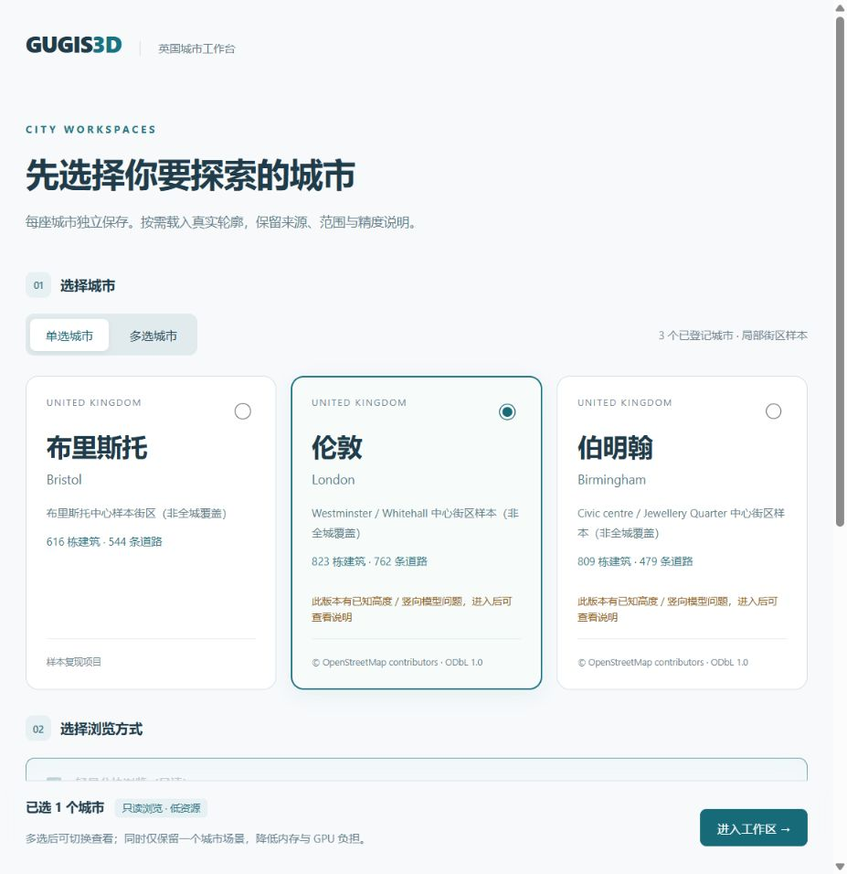

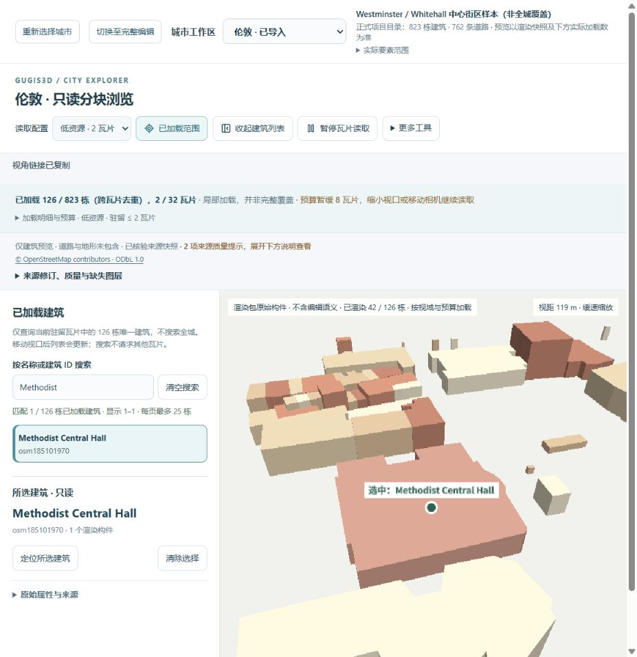

## 加载反馈与空视口恢复

- 加载状态直接显示清单读取、相机定位、目标瓦片读取、就绪、暂停、失败、空包与预算不足。就绪仅指本次预算内的读取目标；局部覆盖与预算暂缓提示仍保留，不以此表示全城完成。
- 视角移出样本建筑范围时显示解释卡片与“定位样本范围”按钮。每次点击都重新定位并等待实际视域确认，可重复使用；沿用原场景、清单和可复用缓存。没有已加载建筑时禁用“已加载范围”，避免无效操作。
- 建筑查询的空状态随当前原因变化，暂停、失败或空包时不再一律要求等待。视角分享的成功与手动复制提示可关闭，手动复制字段仍可选择原始链接。
- 加载提示支持辅助阅读，并尊重减少动画设置；没有加入模拟百分比、全城自动请求或自动扩大预算。

最终前端完整回归 **403/403** 通过，TypeScript 与生产构建通过。新增检查覆盖连续两次空视口恢复、空包区分、读取 / 重试 / 就绪状态和分享提示关闭。Windows 内置浏览器实际验证了伦敦有效区域外视角、返回样本范围、暂停与恢复、复制与关闭提示、继续查询 / 选择 / 定位建筑；检查时始终只有一个三维画布，未记录渲染错误。

原有三城正式文件与布里斯托 40 个历史版本共 **43 个文件**再次逐字节校验一致。本轮未修改后端或城市档案，未测试 ArcGIS Pro 运行性能，也未将只读缓存视图当作完整编辑项目。

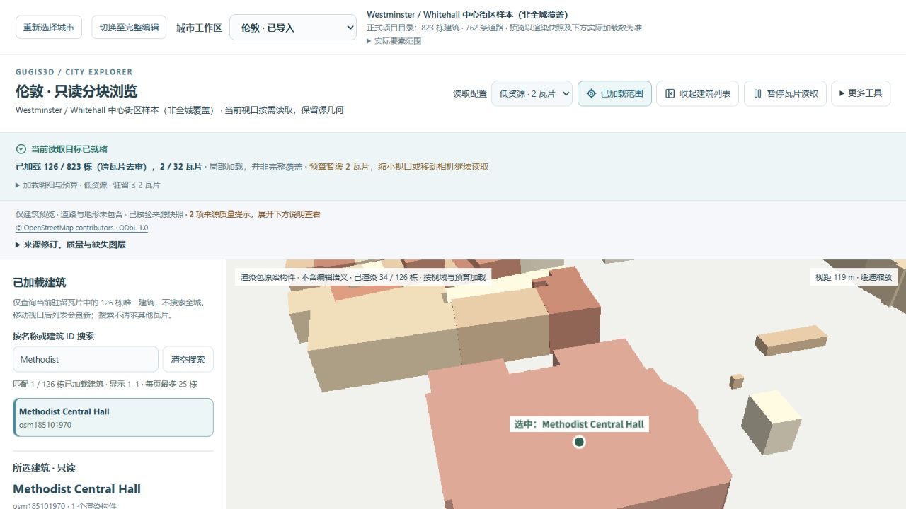

## 对比结果导出与证据入口

- 实测快照校对移到首屏，明确显示布里斯托局部覆盖、合成演示地形和 ArcGIS 软件运行值待测。完整修订号与测量环境可展开，校对逻辑保持不变。
- 四档对比结果可下载 CSV / JSON；保存原始数值、来源城市与报告 SHA256、有效匹配点数、参数域最大差目标和当前指标 / 档位。JSON 保留完整源报告，CSV 使用 UTF-8 BOM，便于表格软件读取。
- 新增可展开的四档数值表，显示文件、高程、坡度、坡向与 1 cm 达标状态；当前行跟随档位选择。窄屏使用单一主滚动区域，宽表独立支持横向和键盘滚动。

前端完整回归 **407/407** 通过，滚动调整后的城市工作区与对比专项 **43/43** 通过，最终 TypeScript / 生产构建通过。内置浏览器实际下载 CSV 与 JSON，并与源报告逐项比对原始精度和完整内容；核验 390×844 窄屏、指标 / 档位切换与单一主滚动区域。原有 **43 个本地数据 / 历史文件**逐字节一致。

此报告是 GUGIS 原生地形与本项目导出的 MultiPatch 参考读回对比，不是 ArcGIS 软件跑分，也不表示实测 DTM 的绝对精度；软件运行值仍需导入同源 ArcGIS Pro 报告。


## ArcGIS 报告导入顺序与保留状态

- 连续选择报告时仅最新一次读取可以更新展示和缓存；较早读取迟到或失败，不覆盖最新报告，也不打断它的加载提示。
- 清除展示、切换来源实验包或离开页面后，未完成的旧读取失效，不能重新写回缓存。文件选取后立即释放输入，支持再次选择同一个文件。
- 展示读取 / 校验状态，并区分校验成功、无法读取、超限、内容不符、持久保存被拒绝及删除缓存失败。失败不会替换已有报告；删除被拒绝时提示刷新后可能恢复。

新增延迟读取和失败注入检查，覆盖交错完成、旧请求拒绝、清除期间读取、卸载 / 实验包隔离及浏览器存储失败。前端完整回归 **412/412** 通过，TypeScript / 生产构建通过。真实浏览器通过文件选择器导入无效报告，确认明确拒绝且 ArcGIS 运行值继续留空；未将测试替身当作实际 ArcGIS 跑分发布。

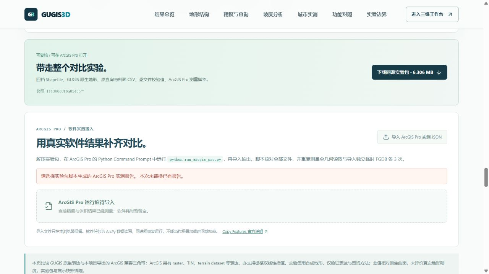

## 总览、剖面与精度目标联动

总览和实验室共享当前离散档位：在总览选择 4×4 后进入剖面，仍展示 4×4；在实验室选档也同步回总览。修改高程差目标时，两处达标状态、最小达标文件、节省值及导出的目标同时更新。5 cm 选择实际已测 2×2（1.258 MB、文件减少 86.0%）；0.1 cm 四档都不满足时，明确显示未达到并留空目标节省值，不外推结果。

前端 **414/414** 检查和生产构建通过；集成测试使用真实总览、加载器、实验室及源报告，验证双向选择、目标变化、两种 JSON 导出内容一致，切换不重新请求实验数据。真实浏览器核验了 4×4 → 剖面、5 cm → 2×2 与 0.1 cm 未达标。选择只影响本页展示，不修改城市或已发布的实验报告。


## 地形替换先检查独立草稿

DEM 导入、非实测演示地形生成和旧三角扇转换均先创建独立城市草稿，在原场景检查后“确认写入正式城市”才提交。原道路、建筑、函数地物及元数据保留；草稿可刷新恢复，也可丢弃。预览期间不提供正式地形的 MultiPatch 下载入口，避免把旧文件当作当前预览结果。地形操作防止重复发起，离开面板后不会由迟到的转换结果新建草稿。

前端 **419/419** 检查通过，TypeScript / 生产构建通过。新增完整工作台集成检查覆盖保留其他层、刷新恢复、丢弃、仅确认时提交；面板检查覆盖坏文件、128 MiB 限制、重复点击、卸载与旧地形转换。Windows 内置浏览器实际生成伦敦演示草稿（2,809 个控制点、1,352 个面带），刷新恢复后丢弃；坏 ASC 文件明确拒绝。三维画布始终一个，正式伦敦地形仍为空；本轮临时草稿已清理，原有 **43 个正式 / 历史文件**逐字节一致。

真实 Digimap / DTM 未在此次验收中取得；演示地形明确标为合成数据。正式地形提交与持久化由已有修订校验及历史保留流程处理。

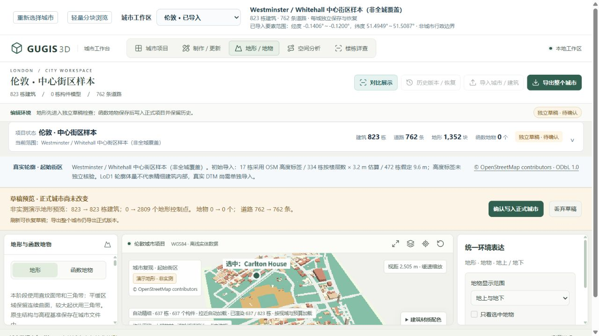

## 保存回执准确对应导出对象

整城正式保存与单栋导出分别记录路径。单栋回执显示当次导出的名称 / ID / 文件链接，切换建筑后仍指向原对象，后续整城保存也不会改写它。导出期间防止重复写入，离开工作台后不回填旧回执；页脚不会把伦敦错误标为布里斯托文件路径，地形草稿的格式状态按预览显示。

前端 **420/420** 检查与生产构建通过。工作台集成检查覆盖导出期间切换建筑、重复点击、后续整城保存与关闭回执。真实浏览器导出 Carlton House 后选择 New Scotland Yard，回执仍对应 Carlton House；本地文件内容与 SHA256 文件名核验一致。正式城市及历史 **43 个文件**保持一致。本轮仅新增独立单栋导出文件，没有提交城市修改。

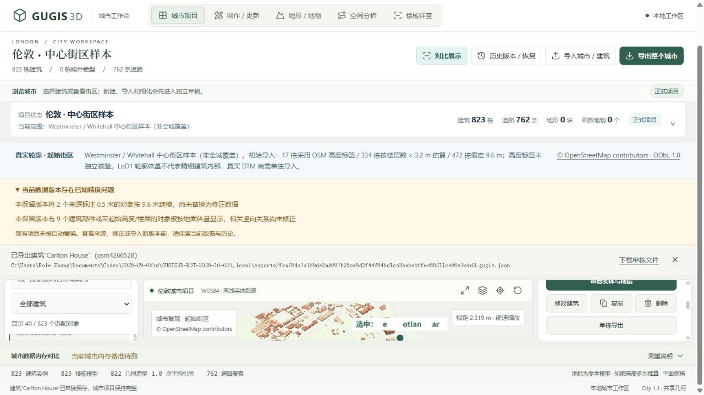

## 完整工作台保留可用场景高度

桌面完整编辑模式给工作区保留 460 px 的最小高度，避免来源说明、警告、草稿或回执挤压三维画布。完整来源 / 高度假设按需展开，许可链接保持可见；当前修订的已知精度问题保留醒目的摘要和条数，完整问题可展开，不因此宣称问题已修复。

城市工作区与草稿专项 **27/27** 通过，生产构建通过；上一轮完整回归为 **420/420**。真实浏览器的 1280×720 桌面窗口中，画布实测约 358 px 高，展开来源和警告后高度保持一致。390×844 窄屏无水平越界，画布约 390 px 高；原生说明支持键盘展开，场景扩展与 Escape 恢复正常，始终一个画布。正式 / 历史文件 **43 个**保持一致。这里的高度是界面布局核验，不是 GPU 性能跑分。

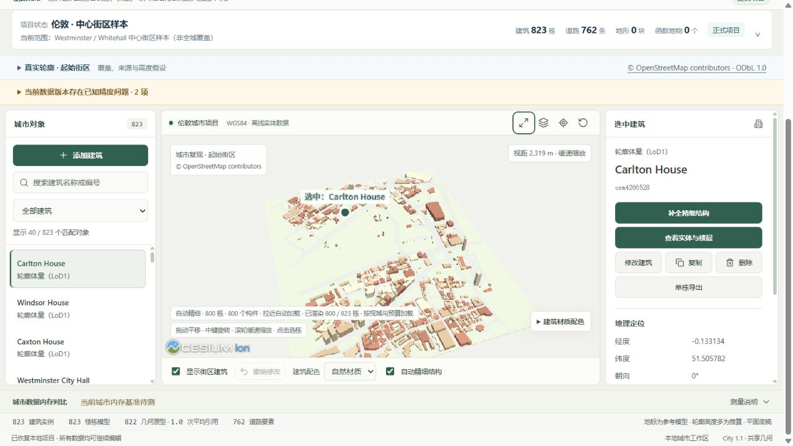

## 保存地形前核对基准与控制网

地形草稿新增正式项目 / 当前草稿对照，可检查来源标注、高程基准、控制点源高程范围、显示参考高程以及直纹面带 / 三角带数量。基准改变或未声明时自动展开提醒，不自动转换 ODN、椭球高或局部基准；未独立核验的导入不会标成实测。控制点范围与显示偏移分开，避免把参考高程扣除后的场景高度误当源数据高程。

前端完整回归 **424/424** 通过，最终调整专项 **6/6** 与生产构建通过；覆盖 30 万控制点统计，避免参数展开溢出。真实浏览器导入明确命名为 synthetic-not-surveyed-qa.asc 的合成检查文件，裁剪后 179 个控制点、73 个直纹面带和 4 个三角带；未声明高程基准提示自动展开，NoData 哨兵未作为高程保留。390 px 窄屏宽表独立滚动，场景保持可用高度。验收草稿已丢弃，原有 **43 个正式 / 历史文件**逐字节一致。

截图使用合成验收文件，不是 Digimap、真实 DTM 或 ArcGIS 跑分；控制点范围也不代表实测精度、完整地形极值或 NoData 覆盖率。


## 原生拓扑线批量显示与独立超限提示

直纹面带边界、直纹生成线及三角带边改为单个批量几何对象，不再为每条边建立独立的响应式实体。控制点之间使用直线，不引入显示三角化的对角线或地球曲线插值；共享边仍去重，并保留原生角色配色。20,000 条显示预算在收集过程中提前检查，超限不绘制不完整线框，地形面与原生查询保持可用；关闭开关即清除提示，不再要求恢复整个三维视图。

前端完整回归 **427/427** 通过，最终场景专项 **27/27** 与生产构建通过。检查覆盖唯一边预算、提前终止、线框开关释放、修改地物保留线框、超限时仍能查询高程。真实浏览器使用现有布里斯托演示地形查看控制网并点击查询三角带 p693（高程 30.297 m、坡度 9.83°），控制台未发现渲染错误。正式 / 历史文件 **43 个**保持一致。此为渲染结构与交互验收，未测量 FPS，不宣称 ArcGIS 软件性能结果。

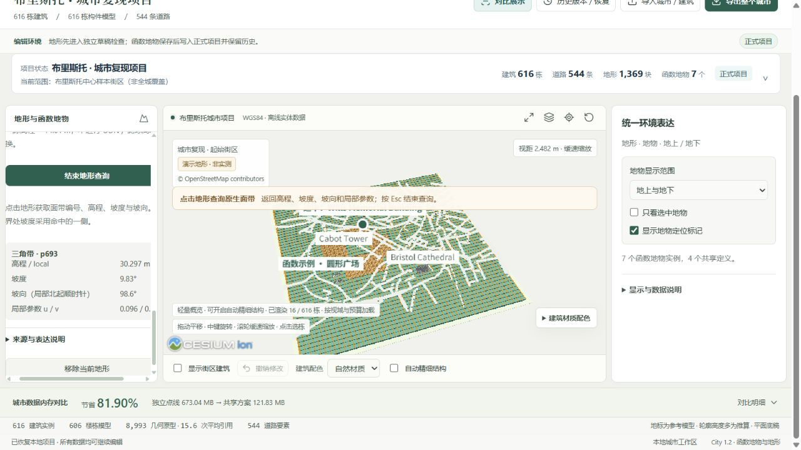

## 函数地物与环境改动先保存草稿

新增路灯、拱门、弧形阳台和圆形广场，修改函数参数 / 配色、同步共享定义、补齐示例及移除均先进入独立草稿；建筑随地形定位设置和地形移除也沿用这一流程。确认后才替换正式项目并保留历史。新增函数改动清单区分新增、修改和移除，列出受共享定义影响的实例、函数组件类型与地上 / 地下位置；大量改动保留完整计数，仅展示前 25 行。

草稿允许切换和定位已有地物，修改操作须等当前草稿确认或丢弃后继续。丢弃时恢复有效的原项目选择并清理过期地形查询；无选中地物时解除单独显示模式，避免留下已勾选但不可操作的控制项。

完整前端回归 **433/433** 通过，最终功能专项 **20/20** 与生产构建通过。工作台集成检查覆盖独立保存、刷新恢复、共享修改保留各自位置、确认才提交、重复操作、失败重试和安全丢弃。真实浏览器在伦敦创建 7 个函数示例草稿，刷新后恢复、选择并定位拱门；390 px 窄屏无页面水平越界，清单可键盘滚动。草稿已丢弃，伦敦正式项目仍为 823 栋建筑、762 条道路、0 个地物，正式 / 历史 **43 个文件**保持一致。

图中为方法示例草稿，不代表这些地物在伦敦的实际位置；此次未把示例写入正式数据。


## 请求失败反馈与未确认写入

城市、地形导入和单栋接口统一处理请求反馈：HTML 网关错误和空错误响应保留 HTTP 状态与中文原因，不再仅显示 JSON 解析异常；畸形校验条目不会遮蔽原失败原因。读取与计算失败提示检查服务 / 重试，写入超时、连接中断、无法解析成功响应或服务器 5xx 则明确“操作结果未确认”，提示重新载入核对，不自动重发。原有修订冲突与快照完整性提示保留。环境错误与普通说明采用不同颜色。

前端完整回归 **437/437** 与最终生产构建通过。故障注入检查覆盖 HTML 502、超时、断连、读取响应体中断、HTTP 200 非 JSON、空 413 和不完整校验项，并核对实际请求次数没有自动重放。真实浏览器通过文件选择器提交不支持的 DEM 内容，显示明确 422 原因，导入按钮恢复，未创建草稿或修改正式城市。正式 / 历史 **43 个文件**保持一致；网关与断连场景是自动测试中的故障注入，不是本次真实服务停机测试。

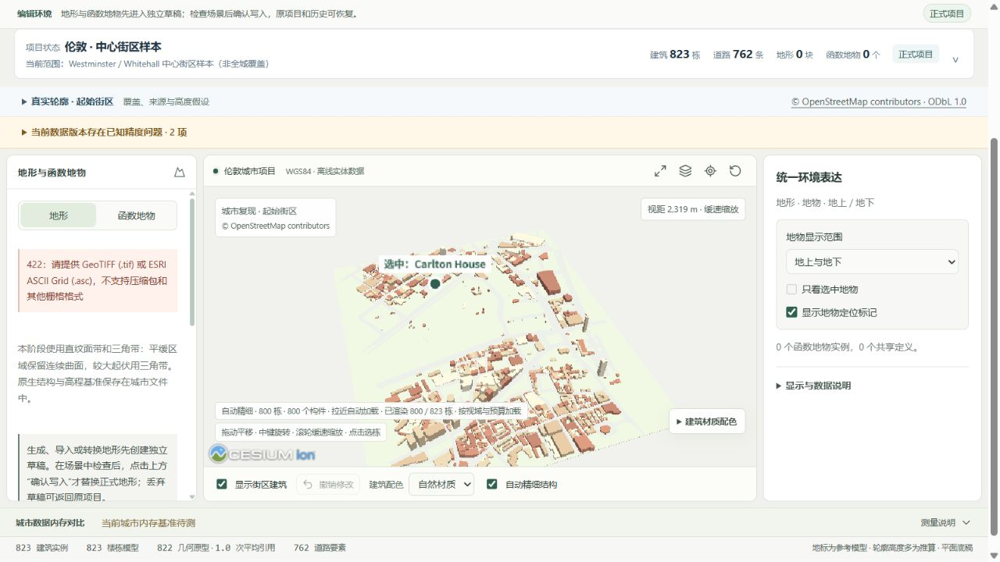

## DEM 降采样保留原始缺测约束

修复最近邻降采样可能漏掉细小 NoData 空洞的问题。按 256×256 原始像元块检查掩膜和非有限高程；输出采样像元只要覆盖缺测便剔除控制点，不跨缺测构面。非整数采样边界及原始块边界也保留这一约束。该策略会保守扩大缺测边缘，不能用输出空洞面积代替原始缺测面积。裁剪源像元限制为 5,000 万，控制点限制为 30 万；源像元超限须先裁剪或拆块，不能仅增加采样步长。

导入档案保存源像元、无效源像元、剔除采样控制点及处理方式，草稿对照显示记录；旧档案未记录时明确说明，畸形计数不作为有效数量展示。所有数量是导入记录，不代表测绘精度或全城覆盖率。

完整后端运行 **214 项，197 通过、17 项 Windows 平台不适用跳过**；新增预算边界检查后的最终地形专项 **21/21** 通过。前端 **438/438** 与生产构建通过。检查覆盖单像元 NoData 被最近邻漏采、NaN、非整数边界、分块读取范围及超限前拒绝解压。真实浏览器导入 synthetic-not-surveyed-nodata.tif：160,000 个源像元中 1 个无效，剔除 1 个采样控制点，保留 15 个控制点、3 个直纹面带和 2 个三角带；点击空洞不外推高程，控制台无渲染错误。验收草稿已丢弃，原有 **43 个正式 / 历史文件**逐字节一致。

以下截图使用合成检查文件，未作为 Digimap 数据或 ArcGIS 跑分发布。

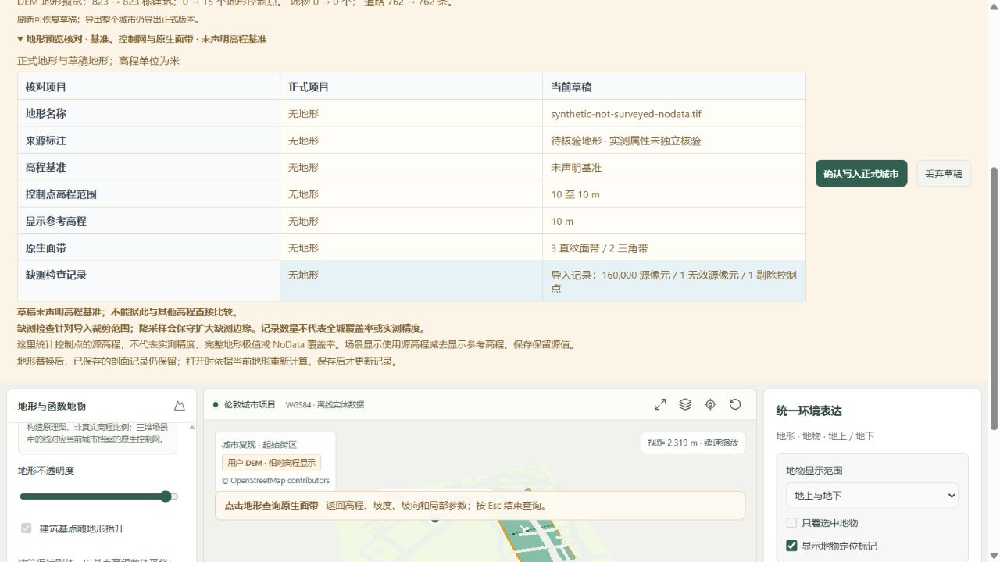

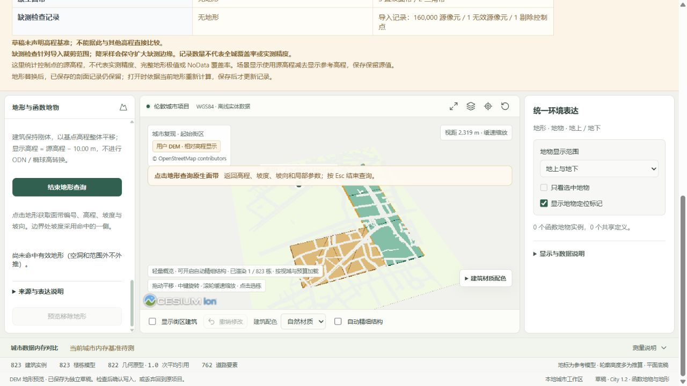

## 轮廓体量与构件模型分别展示

场景状态不再把 LoD1 轮廓计入“自动精细”构件数量。按档案中的模型类型，分别显示已加载构件模型、构件数及当前视域内的 LoD1 轮廓数量；加载进度也排除 LoD1。关闭自动加载不再暗示无简模的完整模型被替换成轮廓。渲染包模式仍只声明原始几何，不推断编辑语义。模型数量不是实测精度或内部已核验的证明。

前端完整回归 **440/440** 与生产构建通过。新增场景检查覆盖无简模 LoD1、带简模 LoD1 与完整构件混合、自动加载开关、移出视野后的计数更新，保留原几何、相机和档案。真实伦敦工作台显示 0 栋构件模型、800 / 823 栋已渲染 LoD1 轮廓；展开场景后按新视野更新为 584 栋。390 px 窄屏状态换行、页面无水平越界，始终一个画布；控制台无渲染错误。

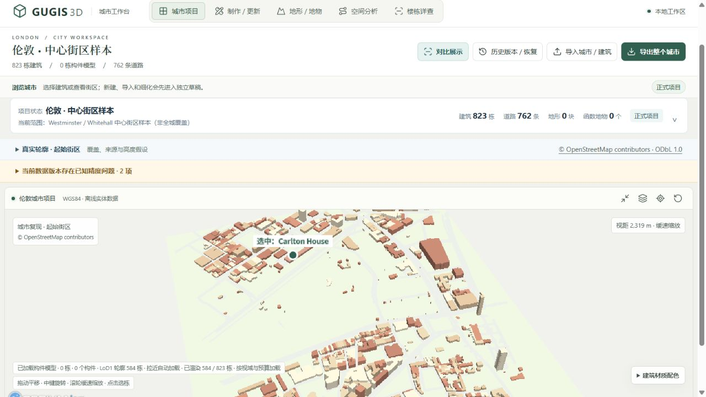

## 文件导入校验与离开页面保护

GUGIS / GeoJSON 导入支持文件开头的 UTF-8 BOM；无效 JSON、空值、数组与普通文本根节点给出明确中文原因。读取期间重复文件事件只处理一次；已有草稿或草稿状态读取失败时禁止开始导入，避免未经核对替换草稿。文件读取或服务器校验完成前离开工作台，不再开始草稿写入；已发出的写入请求不因此宣称取消，恢复时仍以服务器保存状态为准。

前端完整回归 **443/443**、工作台专项 **22/22** 与生产构建通过。真实文件选择器导入 null 根节点，显示原因且可继续操作；随后导入加了 BOM 的伦敦正式档案副本，成功进入 823 栋建筑 / 762 条道路的独立草稿，没有改写正式城市。验收草稿已丢弃，原有 **43 个正式 / 历史文件**逐字节一致，控制台无渲染错误。重复文件事件与读取 / 校验期间离开使用自动测试验证。

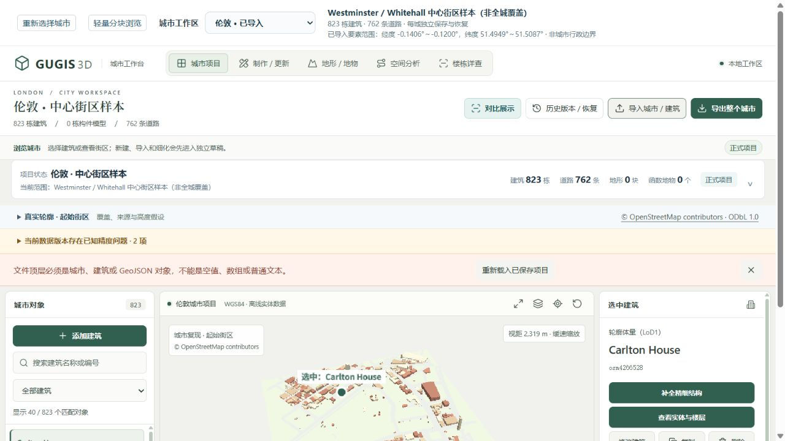

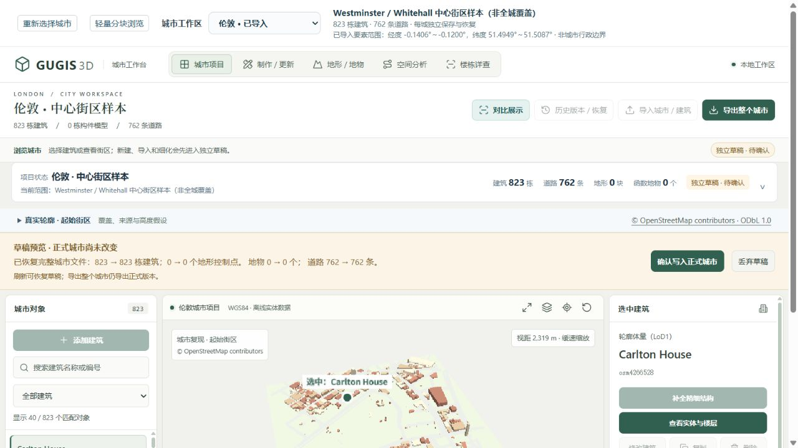

## 对比图表键盘操作与指标排版

四档柱形均可 Tab 聚焦，用 Enter 或空格选择；焦点有独立描边，当前档位与右侧数值、下方按钮和实验页共用选择状态。交互柱形提供档位 / 指标 / 单位名称和选中状态，图表不再使用会隐藏交互子项的 image 角色；空格不滚动页面，长按不重复触发选择。下方原有按钮保留。

修复通用 dl 栅格样式将指标清单挤成两列的问题：文件、高程、坡度、坡向分别占一行，标签与数值不再混排。图表及联动专项 **6/6**、最终生产构建通过；上一轮完整前端回归为 **443/443**。真实浏览器验证 Tab、Enter、空格与焦点描边，2×2 档显示 MultiPatch 1.258 MB、文件体积减少 86.0%，页面位置保持不变。桌面与 390 px 窄屏逐项核对行边界，标签与数值无交叠，控制台无错误。结果仍为已打包合成地形的格式参考对比，不是 ArcGIS 软件跑分。

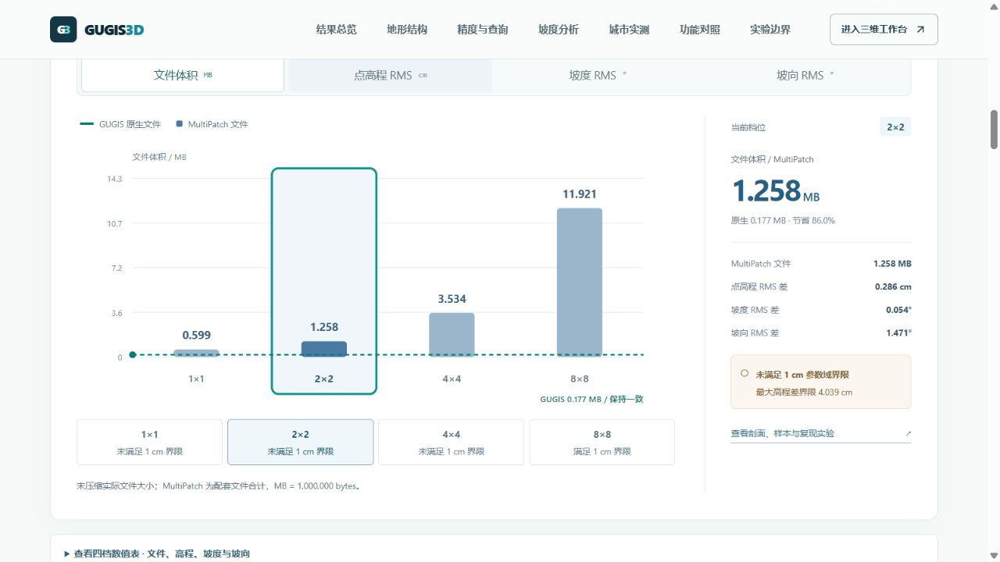

## 城市校验和地形响应避免占用 API 主循环

城市文件校验后的展开、几何去重、打包与响应编码移到工作线程。演示地形、旧三角扇转换和 DEM 导入均返回在工作线程编码的 JSON 字节，避免 FastAPI 在主循环再次序列化整个控制网。响应仍包含相同 document / storage 或 terrain 字段，保留来源、高程基准、缺测记录与原生拓扑，不改变保存流程。

完整后端 **218 项，201 通过、17 项 Windows 平台不适用跳过**。事件顺序检查把打包 / 编码暂时挂起，此时健康接口仍能先完成；覆盖城市校验及三个地形入口，畸形输入仍按原接口拒绝。这里验证 API 并发响应结构，没有据此报告 FPS、加速倍数或 ArcGIS 性能。真实浏览器在新版后台重新校验伦敦带 BOM 档案副本，并导入合成 NoData GeoTIFF，数量与来源记录保持一致。两份验收草稿均已丢弃，原有 **43 个正式 / 历史文件**保持一致。

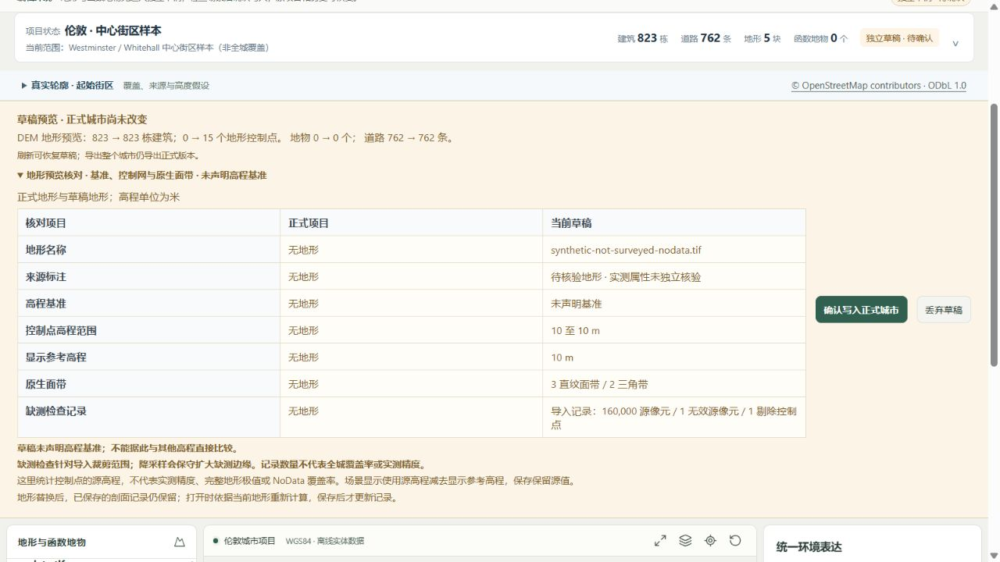

## DEM 高程基准默认保留未知

导入表单默认“未知，保留原值”，避免未声明基准的文件被直接标为 ODN。使用者仍可依据源数据说明明确选择 ODN、椭球高或局部高程；水平坐标系选择不改变高程基准，选择基准也不会执行数值转换。已有档案不重新标注。

完整前端 **445/445** 与生产构建通过。检查覆盖默认未知、指定水平 CRS 后仍未知，以及明确选择 ODN / 椭球高 / 未知时按用户选项提交。真实浏览器刷新后显示未知，切换英国国家格网后高程基准保持未知；未创建草稿或提交正式城市。原有 **43 个正式 / 历史文件**保持一致。

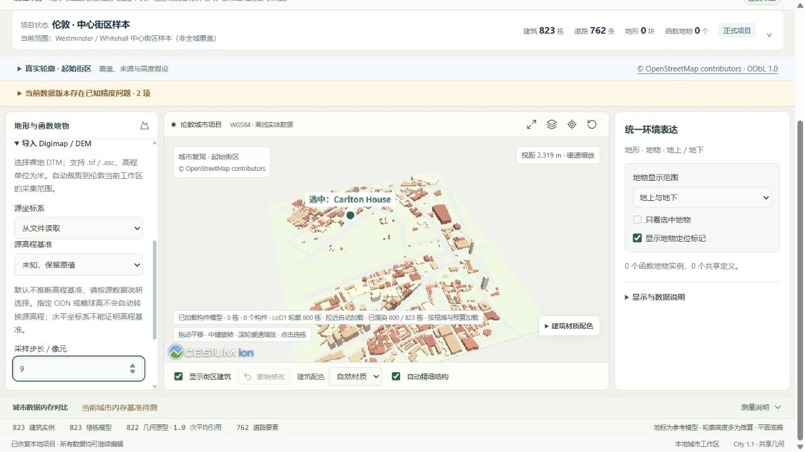

## 地下覆土指标明确使用基点口径

将“覆土深度”改为“基点参考覆土”，对象列表简称“基点覆土”。指标仍为 max(0, 基点地形源高程 − 模型包络最高点源高程)，基点缺测不估算；正值不能证明整个模型埋在地下。原计算和档案字段保持不变，坡地和跨缺测区域须进一步核对。

空间分析专项 **18/18** 与生产构建通过；上一轮完整前端为 **445/445**。新增坡地反例：基点源高程 100 m、模型最高点 97 m 时，参考覆土为 3 m，但模型边缘源地形为 96 m，仍有部分模型高于地表。真实浏览器核对联合分析面板的公式、缺测说明及完整模型限制，未修改正式数据。

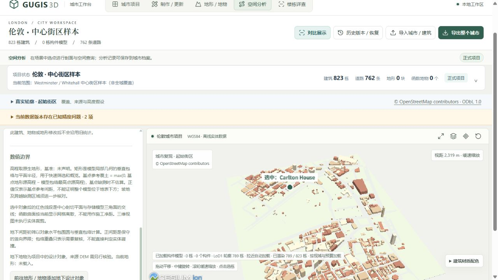

## 联合剖面对象支持键盘定位与选中反馈

剖面图改为包含交互对象的 group，每个矩形提供对象名称、图层、里程、高程包络和选中状态。Tab 可进入对象，Enter / 空格与点击共用定位和结构查询；焦点与已选对象均有描边，长按不重复触发定位，空格不会滚动页面。原有对象清单保留，几何、分析范围和保存方式不变。

面板专项 **6/6** 与最终生产构建通过。真实布里斯托场景绘制未保存的 173 m 临时路线，显示 4 栋相交包络；Tab 进入大教堂矩形，Enter / 空格切换到选中状态，三维定位显示精细结构和 531 段存储模型剖切交线。页面位置稳定、焦点描边可见。这仍是参考模型与合成演示地形，交线不作为施工净距或实测建筑核验。

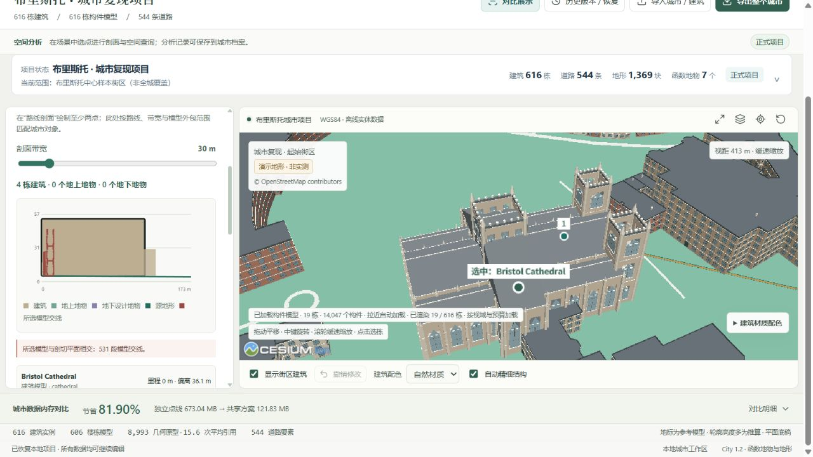

## MultiPatch 下载准备不阻塞其他接口

基准包下载入口整个准备过程在工作线程执行，包括锁内读取 / 校验城市及历史修订、构面、打包和发布临时文件。继续按请求的完整修订核验历史，保持每城独立目录及下载名称；缺失或损坏的历史不能由当前数据代替。

完整前端 **447/447**、后端 **219 项，202 通过、17 项 Windows 不适用跳过**，生产构建通过。并发测试分别挂起城市读取与包生成，证明健康接口可在挂起工作完成前响应；伦敦请求在线程中仍保留伦敦上下文，临时文件正常发布。新版后台经实际页面点击返回 200，生成布里斯托修订 111386c0f6a024c5… 的 332,543 字节 ZIP，回读含五个 Shapefile 文件、1,369 个 MultiPatch 记录，所有 part 均为三角带。未运行 ArcGIS 软件，未据此报告其性能。原有 **43 个正式 / 历史文件**保持一致。

## 地形下载绑定显示修订，窄侧栏内容完整换行

工作台的 MultiPatch 下载链接携带当前显示城市的完整 SHA-256 修订号。另一窗口更新后，下载仍请求对应历史，不悄悄替换为最新项目；正式修订未核验及草稿视图暂不提供该下载。侧栏显示修订前缀与历史缺失时拒绝下载的说明。

环境面板使用可收缩的单列栅格，长按钮和说明正常换行，修复三栏工作区中按钮撑宽并截断其他内容的问题。环境面板专项 **14/14**、最终生产构建通过；上一轮完整前端为 **447/447**。真实链接携带布里斯托完整修订并成功返回 200；桌面侧栏和 390 px 页面均无横向溢出，未修改正式项目，控制台无错误。

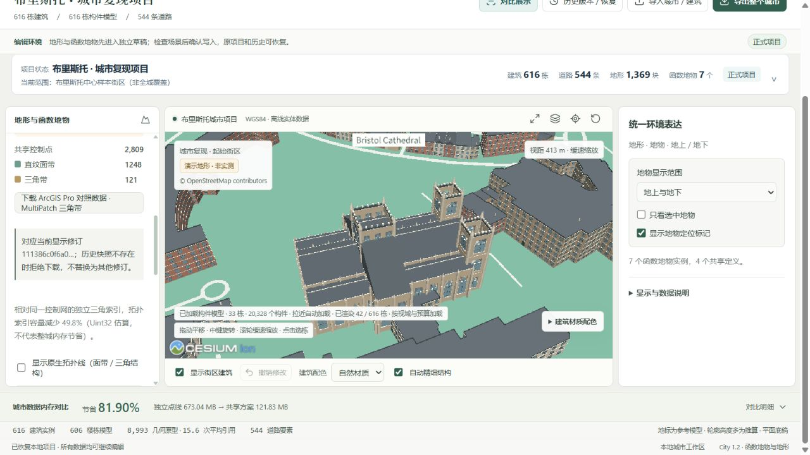

## 建筑精细结构生成和响应编码移到工作线程

补全精细结构的构件生成与 JSON 编码在同一工作线程执行，保留 document 响应、错误校验和原建筑位置 / 轮廓。接口仍只计算模型，前端结果先保存为独立草稿，不直接修改正式城市。

响应性专项 **6/6**、几何与颜色专项 **7/7** 通过。挂起细化线程时健康接口仍先响应，输出与原计算逐字段一致；输入不被修改，畸形输入和几何拒绝仍返回 422。真实伦敦 Carlton House 从 1 个轮廓构件生成 1,105 个精细构件，进入 823 栋建筑 / 762 条道路的独立草稿，定位后实际显示窗户、门和屋顶。验收草稿已丢弃，原有 **43 个正式 / 历史文件**保持一致；构件细化是基于轮廓的推演，不是实测内部结构。

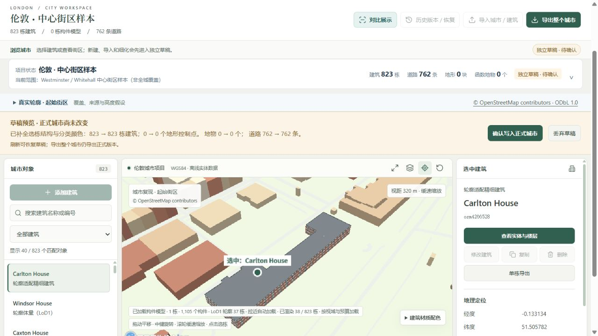

## 制作与恢复草稿的操作锁和离开页面保护

单栋生成、街区生成、细化、复制、历史预览及丢弃使用即时操作锁，React 尚未更新按钮状态时的重复事件也只执行一次。所有草稿入口在开始写入前检查工作台是否仍挂载；离开后返回的生成 / 历史结果不会再发起草稿写入。已经发出的保存请求不宣称被取消，重新进入仍读取服务器状态。草稿读取失败时，复制、细化和历史恢复按钮与逻辑共同阻止制作。

完整前端 **458/458**、生产构建通过。新增挂起与事件检查覆盖四种异步制作 / 恢复的重复事件、正常完成后可丢弃、离开后零写入，以及复制 / 丢弃防重、失败后显式重试。真实伦敦浏览器双击复制只形成 **823 → 824** 栋的独立草稿；刷新恢复数量一致，丢弃后返回 823 栋。验收草稿已清理，原有 **43 个正式 / 历史文件**保持一致。


