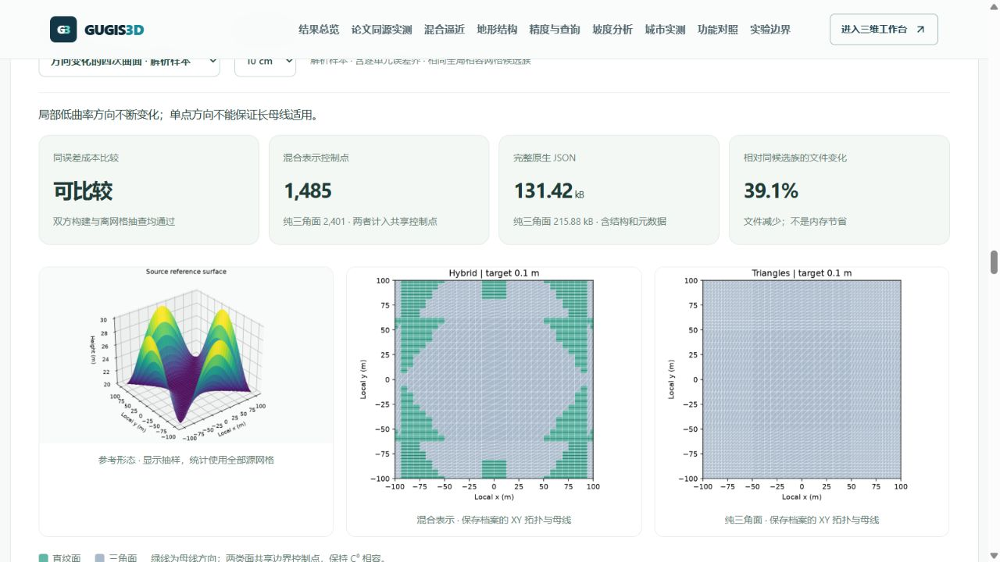
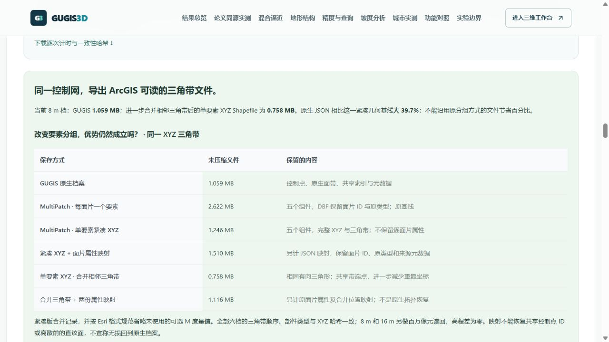
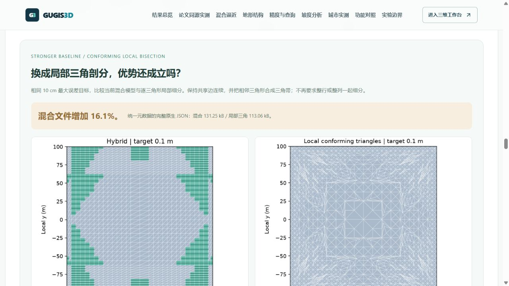
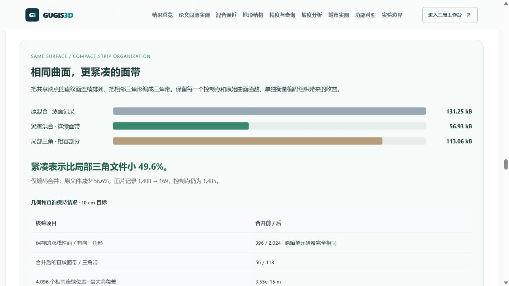
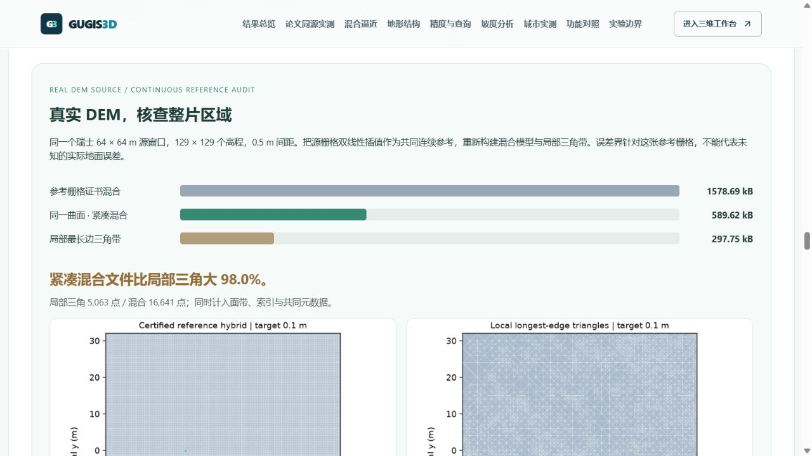

# 地形同源评测和六城扩展更新

本次把论文 benchmarking 转为可下载、可检查的本机实验，并扩大原有三城、加入曼彻斯特、爱丁堡和卡迪夫。城市工作区仍独立保存，只读取当前城市；所有数量都是局部样本，不代表城市行政范围覆盖。

## 对比页

“论文同源实测”使用 ImplicitTerrain 作者的真实瑞士 DEM，重放预训练 SPG，并用网站实际构面和查询内核生成六档 GUGIS 控制网。切换采样间距后可查看精度与体积图、同色标误差图、RMSE / MAE / P95 / 最大误差 / PSNR / SSIM、梯度和 CPU 计时；提供 JSON、CSV，以及实际 GUGIS 和五组件 MultiPatch Shapefile 示例下载。

SPG 示例 RMSE 为 5.13 cm、完整表达约 1.596 MB。GUGIS 2 m 档为 4.42 cm、17.897 MB；8 m 档为 20.36 cm、1.059 MB。8 m 档比同控制网 MultiPatch 文件小 59.6%。文件与速度结果必须结合误差判断，ArcGIS 软件运行、训练和拓扑指标仍标为待测。[方法与复现](implicit_terrain_benchmark.md)。


布里斯托报告已按本机扩展后的正式修订重新计算：共享数据约 175.12 MB，独立顶点加边的同城表示约 720.31 MB，数据堆内存节省约 75.69%。这是 Node V8 的保留数据堆测量，包含同样对象语义；不是 ArcGIS 内存、浏览器 GPU 内存或文件压缩率。对比快照与地形实验包均绑定新修订。

## 实际城市规模

| 工作区 | 公开种子建筑 | 本机目录建筑 | 道路 | 采集范围 |
| --- | ---: | ---: | ---: | --- |
| 布里斯托 | 10,907 | 10,908 | 1,794 | 扩展中心街区 |
| 伦敦 | 5,372 | 5,372 | 3,416 | Westminster 中心街区 |
| 伯明翰 | 4,126 | 4,126 | 2,131 | 扩展中心街区 |
| 曼彻斯特 | 3,430 | 3,430 | 2,756 | 中心街区 |
| 爱丁堡 | 6,543 | 6,543 | 1,888 | Old Town / New Town |
| 卡迪夫 | 4,472 | 4,472 | 1,040 | 中心街区 |

本机合计 34,851 栋；公开种子合计 34,850 栋，差异为布里斯托已有的一栋本机自定义对象。新工作区的目录数量来自种子，不表示已创建正式档案。新增建筑为真实 OSM way 轮廓的 LoD1 体量，高度标签未经独立核验，无标签时采用楼层或假设高度；没有编造精细立面、建筑内部或当地实测 DEM。

原有模型、位置、道路、地形和函数地物均保留，扩展仅按对象 ID 去重，不同 ID 仍可能空间重叠。原有 43 个正式 / 历史文件逐字节核验，旧正式修订保存在各城历史。高度修订候选另绑定 `baselines/v1` 历史来源，避免误用扩展种子；候选仍针对旧采集，不是新版档案全量修复。

## 采集与保留

六城共享 `shared/city-workspaces.json` 的名称和默认查询范围。原始响应、查询、哈希、时间和转换清单随数据保留；[数据许可](../backend/data/cities/expansions/DATA_LICENSE.md)提供 © OpenStreetMap contributors / ODbL 1.0 署名。未取得 multipolygon relations、实测地形和内部结构，完整相交 way 可能越过查询框。

采集和转换使用新暂存目录，拒绝覆盖已有输出，不改正式项目：

```powershell
.venv/Scripts/python.exe data-pipeline/acquire_city_samples.py --cities manchester --output-dir .local/new-acquisition
.venv/Scripts/python.exe data-pipeline/import_city_samples.py --city manchester --source-dir .local/new-acquisition --output-dir .local/new-import
```

已有项目扩展可用 `merge_city_expansion.py --city london --baseline <原项目> --incoming <新增伦敦数据> --output <新文件> --report <新报告>`。它只准备可审阅文件，不写正式项目或历史。检查报告后，通过现有草稿流程或基于正式修订号的保存接口提交，保留冲突保护。

## 分块浏览

只读缓存采用曼彻斯特 / 爱丁堡 250 m、卡迪夫 / 伦敦 / 伯明翰 175 m、布里斯托 125 m 分块，避免密集瓦片超过预算。`.local/render-cache` 不进入 GitHub，新电脑须按[离线渲染包说明](render_tiles.md)生成。低资源仍最多 2 瓦片 / 2 MiB，均衡仍按原预算；城市规模扩大不会同时加载全部建筑。

布里斯托正式项目启用建筑随地形贴合，现有只读缓存版本不支持该状态，故本机只读缓存来自公开种子。页面明确显示它与正式项目不同的修订，且只含建筑；完整编辑模式使用正式数据。没有关闭贴地设置来绕过约束。目录首次校验扩展项目可能较慢，超时由 15 秒调整至 45 秒，后端仍只缓存小型校验摘要。


大样本的默认视角现在按读取预算定位最近街区，避免只加载少量瓦片却把相机拉到整片样本远景。“更多工具”可切换样本全范围和中心街区，已有视角链接优先恢复，瓦片到达不重置相机。卡迪夫本机低资源模式从约 5.8 km 远景改善为约 800 m 街区视角；没有增加瓦片预算。


## 本机验证

前端完整 518 项通过，覆盖六城真实清单、两种预算、横屏与窄屏相机数学，以及视角链接、范围往返和过期响应。后端完整 238 项中 221 项通过、17 项 Windows 不适用跳过；生产构建通过。数学及模拟场景测试不代表 GPU 帧率。

真实本地浏览器已检查研究指标切换、对照 ZIP 下载和实际内容哈希，以及新增城市切换、对象选择和街区视角。首次六城冷目录校验成功；本轮浏览器控制环境为 Codex 内置浏览器，未将此前 Edge 反馈冒充本轮 Edge 实测。ArcGIS Pro 未在本机默认安装位置发现，现有软件实测脚本仍待有 ArcGIS 环境时执行。

## 后续离网格核验与修订提示

在同一个原始 0.5 m DEM 中额外抽查 16,384 个不与 1 m 评测网格重合的位置。2 m GUGIS 的 RMSE 为 7.30 cm，SPG 为 7.65 cm；最大绝对误差分别约 159.44 cm 和 130.45 cm。参考高程直接来自原栅格，结果与百万网格点分开展示，提供独立 JSON / CSV。原始数据已参与预处理，所以这不是独立留出实验。[完整口径和复现命令](implicit_terrain_benchmark.md#原始源数据的离网格核验)。


缓存源文件的新鲜度与城市目录修订分开检查。预览来自公开种子而目录包含本机正式编辑时，页面直接提示修订不同，并显示两个 SHA-256。目录修订仅代表目录读取时的状态，不保证之后的编辑仍相同；单独核验缓存不能被理解为已同步正式项目。


上述后续改动完成 92 项针对研究结果、加载器、修订与真实相机的检查，生产构建通过；本轮未重新运行全部后端，因为没有改动后端。之前完整回归的 518 项前端、221 项后端及 17 项平台跳过记录保持为上一版验收记录。

## 原生地形查询优化

新增有资源上限的自适应索引，并进行旧版/新版的同运行库配对实验。六档保存地形、同一 4,096 个坐标的完整查询结果全部一致。2 m 档从 57.27 ms 降至 9.63 ms，约快 5.95 倍；索引留存内存约增加 4%，16 m 档略慢，网站同时公开这些代价。构建时间、逐次运行数据、原代码版本与结果哈希均可下载。[方法和全部六档结果](implicit_terrain_benchmark.md#原生查询内核的配对优化实验)。

这不是 ArcGIS 或 SPG 速度测试，未改变保存结构或精度。原论文对照中的跨运行库计时保留并标注为基线记录，避免与本轮配对实验混用。修复了研究区延迟加载后，直接打开离网格/内核结果链接无法定位的问题。

前端完整 523 项通过，生产构建通过；新增验证密集控制网的解析高程/坡度、负坐标分桶、边界与空洞，以及重叠面索引的资源上限和既有首命中顺序。真实浏览器核查 2 m 收益与 16 m 代价、结果入口；该轮未修改后端。


## 有限尺度混合逼近与更强对照

新增区域误差驱动的直纹面 / 三角带构建器，检查有限母线与边界误差、比较两条三角对角线，使用共享边界的全局相容网格。七类地形与四档误差目标形成 56 份可下载原生档案，每份在 4,096 个相同连续坐标上运行网站查询，并与独立 Python 读回互核。[研究定义、结果与复现](finite_scale_hybrid_terrain.md)。

10 cm 目标下，方向变化的四次曲面使用 396 个直纹面片与 1,012 个三角面片，完整 JSON 比同候选族纯三角方式小 39.1%；鞍面与长母线样本分别小 98.0% / 90.8%。平面、凸碗与折脊没有优势。真实 DEM 的 5 / 10 cm 档离网格核验失败，四次曲面的 5 cm 三角档构建目标未满足，这三组不输出节省结论。上述不是最优任意三角剖分、内存节省或 ArcGIS 软件结果。

研究区支持选择地形、误差档位，查看实际拓扑、加载可旋转的三维模型、切换混合 / 三角表示、显示母线与边界，并点击读取原生高程、坡度和坡向。按需只加载一份档案，读取时核对长度和 SHA-256；关闭视图释放场景。研究显示的离散误差单列，不参与模型控制点或文件成本统计。窄长画布按实际相机视锥定位研究模型，导航文字保持单行。



MultiPatch 研究基线同时升级为单要素 XYZ 和相邻三角带合并，全部六档有向三角形哈希一致，8 m / 16 m 的百万像元读回完全相同。8 m 紧凑五组件只需 0.758 MB，GUGIS JSON 为 1.059 MB，大 39.7%；网页保留这一不利结果与恢复属性的独立成本，旧分组方式的节省不能概括为方法优势。



正式 Bristol、London、Birmingham 扩展项目文件 SHA-256 未变化，43 份原有城市 / 历史文件仍逐字节可恢复。真实浏览器核查了拖动、缓速缩放、点击原生查询、表示切换、关闭释放、混合拓扑图片和 DEM 未达标提示；核查时没有 Cesium 错误日志。本轮完整前端 528 项通过；后端 252 项检查中 235 项通过、17 项平台条件跳过；生产构建通过。原生档案、下载 ZIP 与查询内核修订之间的 SHA-256 互核亦通过。

## 局部三角基线与结果反转

新增按误差驱动的相容局部二分和三角带打包，六类解析地形、四档误差目标形成 24 组实验、48 份配对档案。凸函数边决策采用论文的 L¹ 插值误差下降量；其他样本使用数值积分和最长边保护，不套用论文的渐近最优定理。全部结果保留同包坐标、高度精度、完整文件成本和实际查询记录。[算法、口径和复现](finite_scale_hybrid_terrain.md#更强局部三角剖分结果会反转)。

10 cm 下，鞍面和长母线样本的混合文件仍小 96.4% / 89.6%；凸碗和方向变化样本反而大 113.5% / 16.0%。后者说明原全局候选族中的 39.1% 节省不能直接推广。新增局部基线能在三维研究视图中切换和点击查询；真实 DEM 的连续区域局部证书尚未补齐，明确标记待测。



网站原生查询与独立读回的最大差异为 2.14×10⁻¹⁴ m；24 组均通过各自连续误差界及 4,096 点核验，并检查 4,225 个原网格位置。前端完整 530 项通过，后端 260 项检查中 243 项通过、17 项平台条件跳过，生产构建通过。实际浏览器验证了三种表示切换、局部三角模型查询、正负结果切换与真实 DEM 待测提示，未出现 Cesium 错误。三城正式文件与 43 份原始城市 / 历史数据继续逐字节保留。

## 相同曲面的编码组织优化

对连续直纹面和相邻三角形重新组织面带，保留原控制点、每个双线性函数及有向三角形。六类解析地形的四档目标共 24 组通过原始单元哈希、4,096 点查询、4,225 个源网格位置和最多 2,048 个边界位置核验。10 cm 方向变化样本的面片记录 1,408 → 169，完整 JSON 131.58 → 57.26 kB，比已打包的局部三角基线小 49.5%。[三种档案成本与复现](finite_scale_hybrid_terrain.md#同一曲面的编码组织优化)。

这是编码组织收益；面片编号不保留，边界处首先命中的单侧坡度会变化。10 cm 方向变化样本的 762 个边界抽查位置出现此变化，最大 3.139°，网页直接展示。原版本留在下载包供恢复，不把文件减少当作内存或逼近理论收益。新增实际三维表示切换、三种文件柱图、72 条计量 CSV 和六个核验 ZIP。预留研究图片的实际比例，降低深链接定位时的页面位移。



完整前端 532 项通过；后端 266 项检查中 249 项通过、17 项平台条件跳过；生产构建通过。真实浏览器核查紧凑表示加载、原生点击查询、关闭释放和结果链接，没有 Cesium 错误日志。43 份原始城市 / 历史数据、三城现正式文件的字节与 SHA-256 均保持不变。

## 配对档案的算法元数据校订

核查下载档案时发现，旧模型专属的“构建方法”和“误差口径”也被复制到局部三角配对模型。现已去除这两个非共同字段，把不同算法说明归入各自实验回执，并重新计量、运行查询核验、生成 ZIP。几何和控制点不变，原 56 份研究档案保持原 SHA-256。

修订后的 10 cm 方向变化样本为原混合 131.25 kB、局部三角 113.06 kB、紧凑混合 56.93 kB；原混合增加 16.1%，紧凑混合减少 49.6%。之前条目中的 16.0% / 49.5% 对应旧共同元数据大小，当前网页与研究正文使用修订后的实际字节。凸碗的原混合代价现为增加 114.4%，长母线原混合节省 90.2%。

重新通过 8 项前端研究检查、5 项下载与源码修订检查以及生产构建，真实页面截图和研究表格同步校订；没有重复宣称完整软件速度优势。

## 真实 DEM 的连续参考区域核验

对同一瑞士 64 × 64 m 源窗口建立整片区域误差核验，参考为源栅格的连续双线性插值，不能推断未测量地面的精度。重新构建四档混合 / 局部最长边 / 紧凑模型，共 12 份档案均达标；局部二分加入最长边邻接准备和几何分辨率停止保护。[推导、全部结果与复现](finite_scale_hybrid_terrain.md#真实-dem-的连续参考栅格对照)。

10 cm 下，紧凑混合 589.62 kB，局部三角 297.75 kB，前者大 98.0%；其他三档同样公开不利成本。旧 5 / 10 / 25 cm 采样档案的连续参考界超过目标，旧档案保持原样，新模型独立命名与显示。原生误差、显示离散误差及其保守合成界分列，点击仍查询原生函数。



前端完整 534 项通过，后端 261 项通过 / 17 项平台条件跳过，生产构建通过；浏览器通过三维表示切换、原生查询、关闭释放、五厘米与五十厘米档位核查，未出现 Cesium 错误。原三城正式文件、43 份原始城市 / 历史文件继续保留。解析对照原控制点和几何不变，其新内核源码与 ZIP 回执已重新关联核验。
## 2026-10-05 追加：精度—成本曲线

七类地形、88 个真实保存的表示成本测点，支持按“最大参考误差界”或“离网格 RMSE”输入阈值并选择最小已测文件，附 28 份 PNG/SVG 科学图和全部 CSV / JSON。瑞士样本最大参考误差 ≤10 cm 时局部三角更小；RMSE ≤2 cm 时紧凑混合更划算，同时显示两者不同的最大参考界，不混称同误差全面优势。

新增 2 项前端、3 项后端检查；浏览器验收指标切换、过严要求、恢复与图下载哈希。完整回归发现缺少页面地址时的锚点读取错误，已修复并通过相关工作流回归。曲线模块按需载入。方法和原始成本见[精度—成本曲线](finite_scale_hybrid_terrain.md#精度成本曲线按要求选择表示)。

## 追加：同几何 MultiPatch 数据交付

四档真实 DEM 局部三角模型现可直接下载 ArcGIS-compatible MultiPatch 五件套。文件原点从真实源 TIFF 像元中心核验为 `[2494500.25, 1141499.75]`，使用 EPSG:2056；全部有向三角形哈希、4,096 个网站查询及 16,641 个源位置读回保持一致，附带恢复信息可逐字节还原原 GUGIS 档案。

GUGIS 局部三角原档比五件套小 16.8%–20.7%；额外恢复成本单独公开。混合模型在 10 / 25 / 50 cm 档依然更大，不能把两类结果混作“全面胜出”。入口 `/compare#raster-multipatch-audit`，未执行 ArcGIS 软件跑分。新增 2 项前端、2 项后端检查，相关 6 项前端 / 3 项后端及生产构建通过；实际浏览器验收入口、档位、结果说明、下载哈希。详见[方法及完整成本](finite_scale_hybrid_terrain.md#相同三角几何导出-multipatch)。
