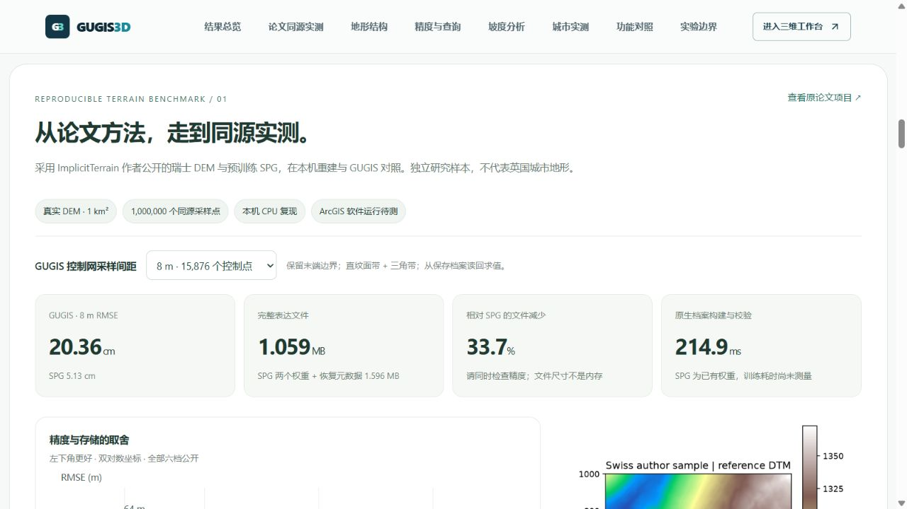
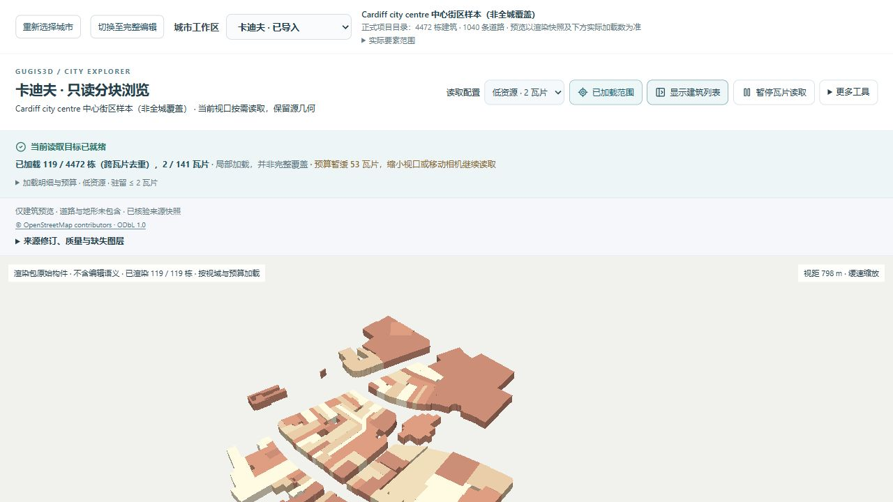
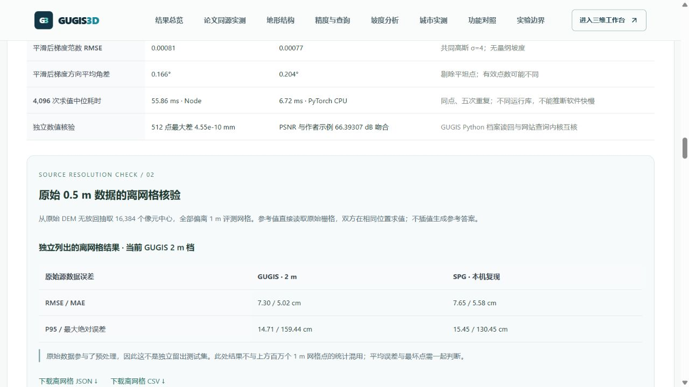
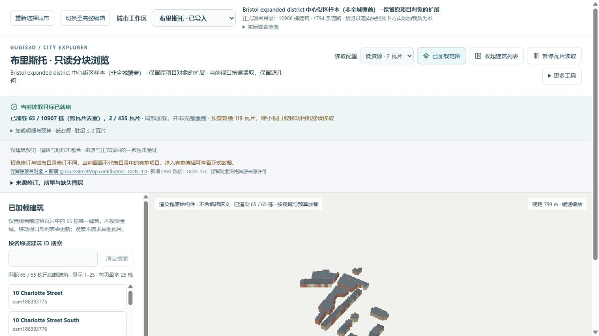

# 地形同源评测和六城扩展更新

本次把论文 benchmarking 转为可下载、可检查的本机实验，并扩大原有三城、加入曼彻斯特、爱丁堡和卡迪夫。城市工作区仍独立保存，只读取当前城市；所有数量都是局部样本，不代表城市行政范围覆盖。

## 对比页

“论文同源实测”使用 ImplicitTerrain 作者的真实瑞士 DEM，重放预训练 SPG，并用网站实际构面和查询内核生成六档 GUGIS 控制网。切换采样间距后可查看精度与体积图、同色标误差图、RMSE / MAE / P95 / 最大误差 / PSNR / SSIM、梯度和 CPU 计时；提供 JSON、CSV，以及实际 GUGIS 和五组件 MultiPatch Shapefile 示例下载。

SPG 示例 RMSE 为 5.13 cm、完整表达约 1.596 MB。GUGIS 2 m 档为 4.42 cm、17.897 MB；8 m 档为 20.36 cm、1.059 MB。8 m 档比同控制网 MultiPatch 文件小 59.6%。文件与速度结果必须结合误差判断，ArcGIS 软件运行、训练和拓扑指标仍标为待测。[方法与复现](implicit_terrain_benchmark.md)。



布里斯托报告已按本机扩展后的正式修订重新计算：共享数据约 175.12 MB，独立顶点加边的同城表示约 720.31 MB，数据堆内存节省约 75.69%。这是 Node V8 的保留数据堆测量，包含同样对象语义；不是 ArcGIS 内存、浏览器 GPU 内存或文件压缩率。对比快照与地形实验包均绑定新修订。

## 实际城市规模

| 工作区 | 公开种子建筑 | 本机目录建筑 | 道路 | 采集范围 |
| --- | ---: | ---: | ---: | --- |
| 布里斯托 | 10,907 | 10,908 | 1,794 | 扩展中心街区 |
| 伦敦 | 5,372 | 5,372 | 3,416 | Westminster 中心街区 |
| 伯明翰 | 4,126 | 4,126 | 2,131 | 扩展中心街区 |
| 曼彻斯特 | 3,430 | 3,430 | 2,756 | 中心街区 |
| 爱丁堡 | 6,543 | 6,543 | 1,888 | Old Town / New Town |
| 卡迪夫 | 4,472 | 4,472 | 1,040 | 中心街区 |

本机合计 34,851 栋；公开种子合计 34,850 栋，差异为布里斯托已有的一栋本机自定义对象。新工作区的目录数量来自种子，不表示已创建正式档案。新增建筑为真实 OSM way 轮廓的 LoD1 体量，高度标签未经独立核验，无标签时采用楼层或假设高度；没有编造精细立面、建筑内部或当地实测 DEM。

原有模型、位置、道路、地形和函数地物均保留，扩展仅按对象 ID 去重，不同 ID 仍可能空间重叠。原有 43 个正式 / 历史文件逐字节核验，旧正式修订保存在各城历史。高度修订候选另绑定 `baselines/v1` 历史来源，避免误用扩展种子；候选仍针对旧采集，不是新版档案全量修复。

## 采集与保留

六城共享 `shared/city-workspaces.json` 的名称和默认查询范围。原始响应、查询、哈希、时间和转换清单随数据保留；[数据许可](../backend/data/cities/expansions/DATA_LICENSE.md)提供 © OpenStreetMap contributors / ODbL 1.0 署名。未取得 multipolygon relations、实测地形和内部结构，完整相交 way 可能越过查询框。

采集和转换使用新暂存目录，拒绝覆盖已有输出，不改正式项目：

```powershell
.venv/Scripts/python.exe data-pipeline/acquire_city_samples.py --cities manchester --output-dir .local/new-acquisition
.venv/Scripts/python.exe data-pipeline/import_city_samples.py --city manchester --source-dir .local/new-acquisition --output-dir .local/new-import
```

已有项目扩展可用 `merge_city_expansion.py --city london --baseline <原项目> --incoming <新增伦敦数据> --output <新文件> --report <新报告>`。它只准备可审阅文件，不写正式项目或历史。检查报告后，通过现有草稿流程或基于正式修订号的保存接口提交，保留冲突保护。

## 分块浏览

只读缓存采用曼彻斯特 / 爱丁堡 250 m、卡迪夫 / 伦敦 / 伯明翰 175 m、布里斯托 125 m 分块，避免密集瓦片超过预算。`.local/render-cache` 不进入 GitHub，新电脑须按[离线渲染包说明](render_tiles.md)生成。低资源仍最多 2 瓦片 / 2 MiB，均衡仍按原预算；城市规模扩大不会同时加载全部建筑。

布里斯托正式项目启用建筑随地形贴合，现有只读缓存版本不支持该状态，故本机只读缓存来自公开种子。页面明确显示它与正式项目不同的修订，且只含建筑；完整编辑模式使用正式数据。没有关闭贴地设置来绕过约束。目录首次校验扩展项目可能较慢，超时由 15 秒调整至 45 秒，后端仍只缓存小型校验摘要。


大样本的默认视角现在按读取预算定位最近街区，避免只加载少量瓦片却把相机拉到整片样本远景。“更多工具”可切换样本全范围和中心街区，已有视角链接优先恢复，瓦片到达不重置相机。卡迪夫本机低资源模式从约 5.8 km 远景改善为约 800 m 街区视角；没有增加瓦片预算。



## 本机验证

前端完整 518 项通过，覆盖六城真实清单、两种预算、横屏与窄屏相机数学，以及视角链接、范围往返和过期响应。后端完整 238 项中 221 项通过、17 项 Windows 不适用跳过；生产构建通过。数学及模拟场景测试不代表 GPU 帧率。

真实本地浏览器已检查研究指标切换、对照 ZIP 下载和实际内容哈希，以及新增城市切换、对象选择和街区视角。首次六城冷目录校验成功；本轮浏览器控制环境为 Codex 内置浏览器，未将此前 Edge 反馈冒充本轮 Edge 实测。ArcGIS Pro 未在本机默认安装位置发现，现有软件实测脚本仍待有 ArcGIS 环境时执行。

## 后续离网格核验与修订提示

在同一个原始 0.5 m DEM 中额外抽查 16,384 个不与 1 m 评测网格重合的位置。2 m GUGIS 的 RMSE 为 7.30 cm，SPG 为 7.65 cm；最大绝对误差分别约 159.44 cm 和 130.45 cm。参考高程直接来自原栅格，结果与百万网格点分开展示，提供独立 JSON / CSV。原始数据已参与预处理，所以这不是独立留出实验。[完整口径和复现命令](implicit_terrain_benchmark.md#原始源数据的离网格核验)。



缓存源文件的新鲜度与城市目录修订分开检查。预览来自公开种子而目录包含本机正式编辑时，页面直接提示修订不同，并显示两个 SHA-256。目录修订仅代表目录读取时的状态，不保证之后的编辑仍相同；单独核验缓存不能被理解为已同步正式项目。



上述后续改动完成 92 项针对研究结果、加载器、修订与真实相机的检查，生产构建通过；本轮未重新运行全部后端，因为没有改动后端。之前完整回归的 518 项前端、221 项后端及 17 项平台跳过记录保持为上一版验收记录。
