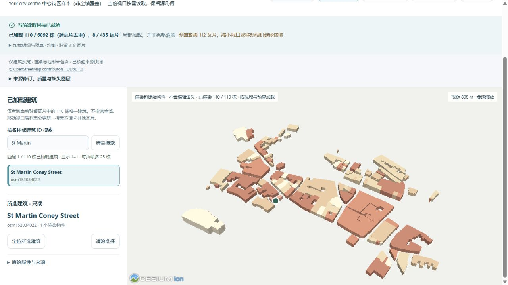

# 约克中心街区：可追溯的第七城

2026-10-05 加入约克独立城市工作区。公开种子为真实 OSM 轮廓转换的 6,092 栋建筑、1,853 条道路；七城公开种子合计 40,942 栋。本机布里斯托另有一栋原有自定义对象，目录合计 40,943 栋。目录就绪表示有可用种子，不表示已初始化每城的正式项目。

入口：`http://127.0.0.1:5173/?city=york&cities=york&view_mode=tiles&tile_profile=economy`。范围是中心街区，**不是全城覆盖**。只读预览包含建筑，不包含道路和地形；完整种子保留道路。现有六城种子、正式项目和历史未被约克导入覆盖。

## 数据依据

查询框为 `[-1.1, 53.947, -1.066, 53.972]`，实际完整 way 范围为 `[-1.1051514, 53.944665, -1.060182, 53.9763925]`。成功请求采用官方 Overpass 状态服务公布的 gall 实例及有界 GET；先前 POST 连接失败不计为采集成功。

公开源删除 348 个无关联系与自由文本标签，保留建模属性、ID 与几何。原始响应哈希、公开响应哈希、字节数、过滤统计与准备脚本指纹均保留在 `york-source.json`。`york-import.json` 记录六个不支持的悬空或部件对象及原因，避免将它们错误贴到地面。参见[数据许可](../backend/data/cities/DATA_LICENSE.md)。

楼高来源：465 栋采用 height 标签，2,357 栋按楼层 × 3.2 m 估算，3,270 栋采用 9.6 m 默认值。标签未经独立测量核验；建筑为 LoD1 体量，不宣称精细立面、内部或约克实测 DEM。

## 本地重建渲染包

```powershell
.venv/Scripts/python.exe data-pipeline/build_render_tiles.py backend/data/cities/york.gugis.json --city york --tile-size 125
```

435 瓦片包含 8,093 个跨格引用，去重后仍是 6,092 栋。最大瓦片 165,786 B，全部瓦片 9,753,844 B，清单 239,086 B。默认 250 m 曾触发密集格 314 栋超过 256 栋限制；采用 125 m 而没有放宽预算。低资源驻留最多 2 瓦片 / 2 MiB，均衡最多 8 瓦片 / 8 MiB；这些是源数据预算，不是 GPU 内存测量。

浏览器已验证缺少缓存时的明确提示和重试，缓存生成后的真实建筑、读取配置切换及驻留建筑名称搜索。相机测试使用真实 Cesium 相机数学，覆盖七城、两种配置、四种窗口尺寸；它与浏览器 GPU 验收分开记录。

本轮完整回归：前端 555 项通过；后端 288 项检查，271 项通过、17 项环境相关跳过；生产构建通过。原有 43 个档案/历史、三个当前正式项目和此前 22 个城市种子/清单文件的字节哈希均保持不变。约克只读验收未初始化正式项目。


